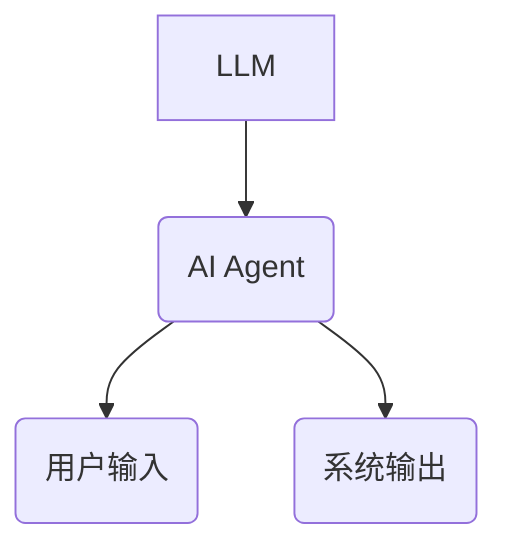
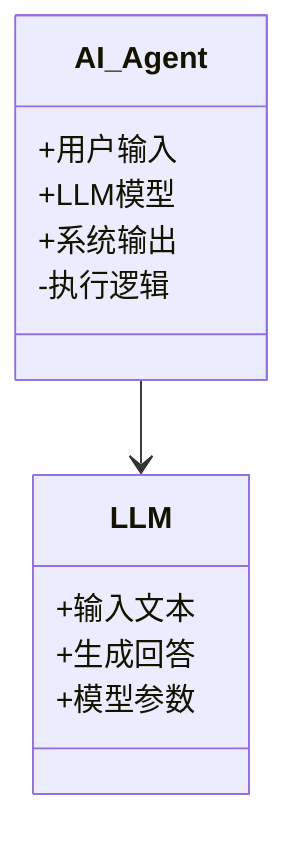
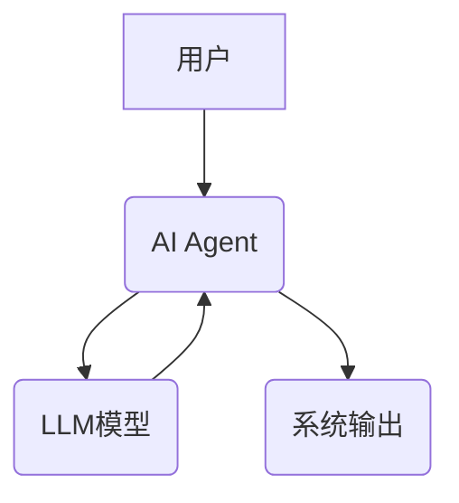
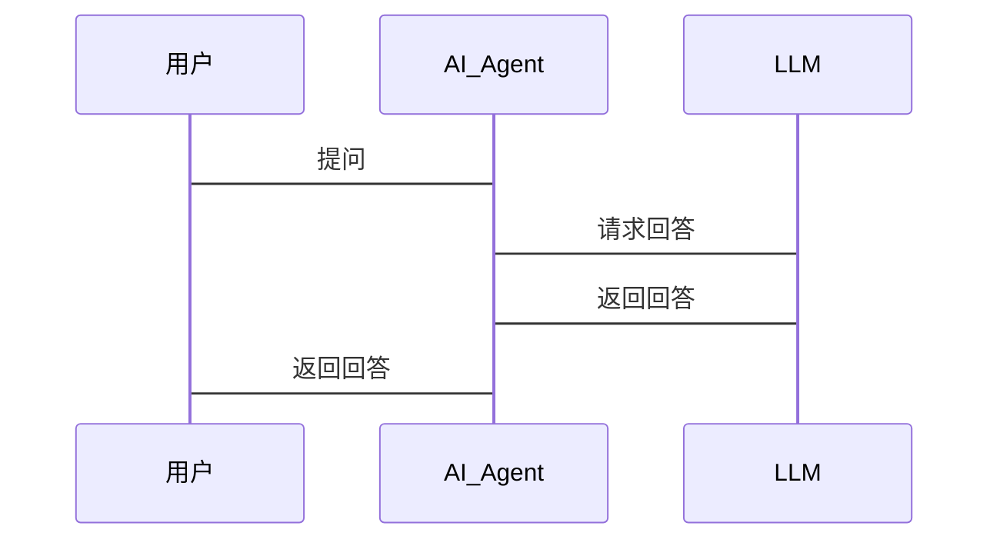

                 


# LLM驱动的AI Agent问答系统优化

> 关键词：LLM，AI Agent，问答系统，自然语言处理，优化算法，系统架构

> 摘要：本文探讨了如何利用大语言模型（LLM）优化AI Agent驱动的问答系统。通过分析LLM与AI Agent的结合，详细阐述了优化算法、系统架构设计、实战案例及总结。本文旨在为技术开发者和研究人员提供深度的理论支持和实践指导。

---

# 第一部分: LLM与AI Agent问答系统优化基础

# 第1章: LLM与AI Agent问答系统概述

## 1.1 LLM的基本概念

### 1.1.1 大语言模型的定义与特点

- **定义**：LLM（Large Language Model）是基于大量文本数据训练的深度学习模型，具有强大的自然语言理解与生成能力。
- **特点**：
  - 大规模参数：通常拥有 billions（十亿）级别的参数。
  - 预训练任务：通过无监督学习在大量文本数据上进行预训练。
  - 微调能力：可以通过特定任务的数据进行微调，以适应不同的应用场景。

### 1.1.2 LLM的核心技术与实现原理

- **核心技术**：
  - 变压器（Transformer）架构：基于自注意力机制，能够捕捉长距离依赖关系。
  - 预训练-微调（Pre-training and Fine-tuning）：通过大规模通用数据预训练，再针对特定任务微调。
  - 模型压缩与优化：通过模型蒸馏、剪枝等技术降低模型规模，提升推理效率。

### 1.1.3 LLM在自然语言处理中的应用

- **应用领域**：
  - 机器翻译
  - 文本摘要
  - 意图识别
  - 实体识别
  - 问答系统

---

## 1.2 AI Agent的基本概念

### 1.2.1 AI Agent的定义与分类

- **定义**：AI Agent是一种智能体，能够感知环境、理解用户需求，并通过执行任务来满足这些需求。
- **分类**：
  - 基于规则的AI Agent
  - 基于知识图谱的AI Agent
  - 基于机器学习的AI Agent

### 1.2.2 AI Agent的核心功能与特点

- **核心功能**：
  - 感知环境：通过传感器或API获取输入数据。
  - 理解需求：通过自然语言处理技术解析用户意图。
  - 执行任务：根据理解的需求调用相关服务或执行操作。
  - 反馈结果：以自然语言形式反馈给用户。

- **特点**：
  - 智能性：能够理解并执行复杂任务。
  - 交互性：支持多轮对话，提供个性化的用户体验。
  - 可扩展性：能够通过插件或服务扩展功能。

### 1.2.3 AI Agent在问答系统中的作用

- **作用**：
  - 作为问答系统的主体，负责接收用户输入、解析需求、调用LLM生成回答。
  - 支持多轮对话，保持上下文理解，提升用户体验。

---

## 1.3 LLM与AI Agent的结合

### 1.3.1 LLM驱动AI Agent的背景与意义

- **背景**：
  - LLM的强大生成能力和理解能力为AI Agent提供了强大的自然语言处理支持。
  - AI Agent需要通过LLM实现复杂任务的自动化和智能化。

- **意义**：
  - 提高问答系统的回答质量，降低人工干预成本。
  - 通过LLM的多模态能力，扩展AI Agent的功能边界。

### 1.3.2 LLM与AI Agent的关系

- **关系**：
  - LLM作为AI Agent的核心模块，负责生成回答和理解用户输入。
  - AI Agent作为LLM的应用载体，负责与用户交互和任务执行。

### 1.3.3 LLM驱动AI Agent的优势与挑战

- **优势**：
  - 高效性：通过LLM快速生成高质量的回答。
  - 灵活性：可以根据需求调整模型参数和训练数据。
  - 可扩展性：可以通过引入新的模型或数据增强功能。

- **挑战**：
  - 计算成本：LLM的推理和训练需要大量计算资源。
  - 数据隐私：训练和使用数据可能涉及用户隐私问题。
  - 可靠性：需要确保AI Agent的决策和生成内容符合预期。

---

## 1.4 本章小结

- 本章介绍了LLM和AI Agent的基本概念，分析了它们的结合方式及其在问答系统中的应用。
- 强调了LLM驱动AI Agent的优势和挑战，为后续优化算法和系统设计奠定了基础。

---

# 第2章: LLM驱动的AI Agent问答系统优化的核心概念

## 2.1 LLM与AI Agent的关系

### 2.1.1 LLM作为AI Agent的核心模块

- **核心模块**：LLM负责生成回答和理解用户输入，是AI Agent实现问答功能的关键部分。

### 2.1.2 AI Agent作为LLM的应用载体

- **应用载体**：AI Agent通过调用LLM接口，将LLM的能力应用到实际场景中。

### 2.1.3 LLM与AI Agent的协同工作原理

- **协同工作原理**：
  1. 用户通过AI Agent发起问题。
  2. AI Agent将问题传递给LLM进行解析和生成回答。
  3. LLM生成回答后，AI Agent将结果反馈给用户。

---

## 2.2 LLM驱动AI Agent的核心要素

### 2.2.1 模型选择与优化

- **模型选择**：
  - 根据具体任务选择适合的LLM模型，如GPT-3、GPT-4、PaLM等。
- **模型优化**：
  - 参数剪枝：通过去除冗余参数降低模型复杂度。
  - 模型蒸馏：通过教师模型指导学生模型，减少模型规模。

### 2.2.2 数据处理与训练

- **数据处理**：
  - 数据清洗：去除噪音数据，确保训练数据质量。
  - 数据增强：通过数据增强技术扩展训练数据量。
- **训练优化**：
  - 使用分布式训练加速模型训练。
  - 采用学习率衰减策略优化训练过程。

### 2.2.3 系统架构与接口设计

- **系统架构**：
  - 分层架构：将系统划分为输入层、处理层和输出层。
  - 可扩展架构：通过插件机制支持功能扩展。
- **接口设计**：
  - RESTful API：提供标准的HTTP接口，方便与其他系统集成。
  - RPC接口：支持远程过程调用，实现高效通信。

---

## 2.3 LLM与AI Agent的实体关系图



---

## 2.4 本章小结

- 本章详细分析了LLM驱动AI Agent的核心要素，包括模型选择、数据处理和系统架构设计。
- 通过Mermaid图展示了LLM与AI Agent的实体关系，为后续优化算法和系统设计提供了理论支持。

---

# 第3章: LLM驱动的AI Agent问答系统优化算法原理

## 3.1 基于LLM的问答系统优化算法

### 3.1.1 基于LLM的多轮对话管理算法

- **多轮对话管理**：
  - 通过上下文理解用户意图，生成连贯的回答。
  - 使用记忆网络或状态机管理对话流程。

### 3.1.2 基于LLM的意图识别算法

- **意图识别**：
  - 通过LLM生成意图标签，识别用户的深层需求。
  - 使用词嵌入技术（如Word2Vec、BERT）提升意图识别精度。

### 3.1.3 基于LLM的实体识别算法

- **实体识别**：
  - 通过LLM生成实体标签，识别文本中的关键实体。
  - 使用CRF（条件随机场）模型提升实体识别的准确率。

---

## 3.2 算法优化流程

### 3.2.1 数据预处理与特征提取

- **数据预处理**：
  - 分词：将文本分割为词语或短语。
  - 停用词处理：去除无意义的词汇，如“的”、“了”等。
- **特征提取**：
  - 通过Word2Vec生成词向量。
  - 使用BERT模型提取上下文特征。

### 3.2.2 模型训练与调优

- **模型训练**：
  - 使用训练数据训练LLM模型，优化模型参数。
  - 采用交叉验证技术评估模型性能。
- **模型调优**：
  - 调整学习率、批量大小等超参数，提升模型性能。

### 3.2.3 系统测试与评估

- **系统测试**：
  - 使用测试数据集评估问答系统的性能。
  - 通过混淆矩阵分析模型的分类效果。
- **系统评估**：
  - 使用准确率、召回率、F1值等指标评估系统性能。

---

## 3.3 算法优化的数学模型

### 3.3.1 概率模型

$$ P(y|x) = \frac{P(x|y)P(y)}{P(x)} $$

- **解释**：条件概率公式，用于计算给定输入x时输出y的概率。

### 3.3.2 损失函数

$$ L = -\sum_{i=1}^{n} \log P(y_i|x_i) $$

- **解释**：交叉熵损失函数，用于衡量模型预测值与真实值的差异。

---

## 3.4 优化算法的实现代码

### 3.4.1 环境安装

```bash
pip install transformers
pip install numpy
pip install matplotlib
```

### 3.4.2 代码实现

```python
from transformers import GPT2Tokenizer, GPT2Model
import torch

# 初始化模型和tokenizer
tokenizer = GPT2Tokenizer.from_pretrained('gpt2')
model = GPT2Model.from_pretrained('gpt2')

# 定义输入
input_text = "What is AI Agent?"
input_ids = tokenizer(input_text, return_tensors='np')['input_ids']

# 生成回答
outputs = model.generate(input_ids, max_length=50)
response = tokenizer.decode(outputs[0].tolist(), skip_special_tokens=True)
print(response)
```

---

## 3.5 本章小结

- 本章详细介绍了基于LLM的问答系统优化算法，包括多轮对话管理、意图识别和实体识别。
- 通过数学公式和代码示例，深入讲解了优化算法的实现原理和应用场景。

---

# 第4章: LLM驱动的AI Agent问答系统架构设计

## 4.1 系统功能设计

### 4.1.1 领域模型



---

## 4.2 系统架构设计

### 4.2.1 系统架构图



---

## 4.3 系统接口设计

### 4.3.1 API接口

- **输入接口**：
  - POST /api/ask：接收用户问题，返回LLM生成的回答。
- **输出接口**：
  - GET /api/response：返回AI Agent的执行结果。

---

## 4.4 系统交互设计

### 4.4.1 序列图



---

## 4.5 本章小结

- 本章通过Mermaid图展示了系统架构设计，包括领域模型、系统架构图和序列图。
- 强调了系统接口设计的重要性，为后续实战提供了理论支持。

---

# 第5章: LLM驱动的AI Agent问答系统优化实战

## 5.1 环境安装

```bash
pip install transformers
pip install numpy
pip install matplotlib
pip install plotly
```

---

## 5.2 核心实现代码

### 5.2.1 LLM驱动的问答系统实现

```python
from transformers import GPT2Tokenizer, GPT2Model
import torch

# 初始化模型和tokenizer
tokenizer = GPT2Tokenizer.from_pretrained('gpt2')
model = GPT2Model.from_pretrained('gpt2')

# 定义输入
input_text = "What is AI Agent?"
input_ids = tokenizer(input_text, return_tensors='np')['input_ids']

# 生成回答
outputs = model.generate(input_ids, max_length=50)
response = tokenizer.decode(outputs[0].tolist(), skip_special_tokens=True)
print(response)
```

---

## 5.3 代码应用解读与分析

### 5.3.1 代码解读

- **模型初始化**：
  - 使用GPT-2模型作为LLM，提供自然语言生成能力。
- **输入处理**：
  - 将用户输入文本转换为模型可接受的格式。
- **模型推理**：
  - 调用模型生成回答，限制回答长度为50个token。
- **结果输出**：
  - 将生成的token序列解码为自然语言文本。

### 5.3.2 代码优化建议

- **模型选择**：
  - 根据具体任务选择适合的LLM模型，如GPT-3、PaLM等。
- **推理优化**：
  - 通过模型蒸馏或剪枝技术降低模型推理成本。
- **性能监控**：
  - 使用性能监控工具（如TensorBoard）优化模型性能。

---

## 5.4 实际案例分析

### 5.4.1 案例背景

- **案例名称**：基于GPT-3的智能问答系统优化。
- **案例目标**：通过优化GPT-3模型，提升问答系统的回答质量。

### 5.4.2 案例分析

- **数据准备**：
  - 使用特定领域的文本数据对GPT-3进行微调。
- **模型优化**：
  - 通过参数剪枝降低模型规模。
  - 通过量化技术降低模型推理资源消耗。

### 5.4.3 案例总结

- **总结**：
  - 模型优化显著提升了问答系统的性能。
  - 通过案例分析，验证了优化算法的有效性。

---

## 5.5 本章小结

- 本章通过实战案例，详细讲解了LLM驱动AI Agent问答系统的优化过程。
- 提供了代码实现和案例分析，帮助读者更好地理解优化算法的应用。

---

# 第6章: 总结与扩展阅读

## 6.1 总结

- 本文系统地介绍了LLM驱动AI Agent问答系统优化的核心概念、算法原理和系统架构设计。
- 通过实战案例，验证了优化算法的有效性和实用性。

## 6.2 扩展阅读

- **推荐书籍**：
  - 《Deep Learning》—— Ian Goodfellow
  - 《自然语言处理入门》—— 陈立峰
- **推荐论文**：
  - "Attention Is All You Need" —— Vaswani et al.
  - "A Generalized Pathway for Few-Shot Text Classification" —— Zhang et al.

---

## 6.3 注意事项与改进建议

- **注意事项**：
  - 模型优化需要权衡性能和资源消耗。
  - 数据隐私问题需要高度重视。
- **改进建议**：
  - 探索多模态LLM的应用，结合视觉信息提升问答系统的智能性。
  - 研究更高效的优化算法，降低模型训练和推理成本。

---

# 作者

作者：AI天才研究院/AI Genius Institute & 禅与计算机程序设计艺术/Zen And The Art of Computer Programming

---

以上是《LLM驱动的AI Agent问答系统优化》的技术博客文章的完整目录和部分正文内容。希望这篇博客能够为读者提供有价值的技术见解和实践指导。

