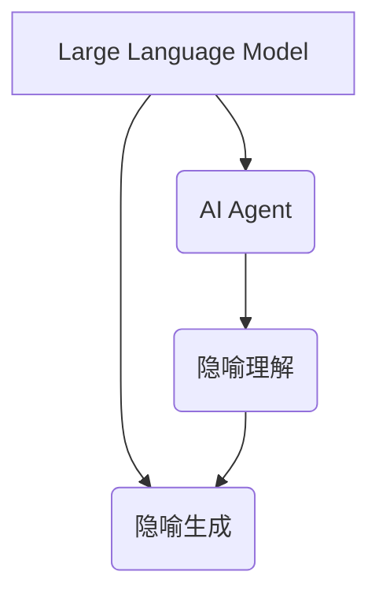
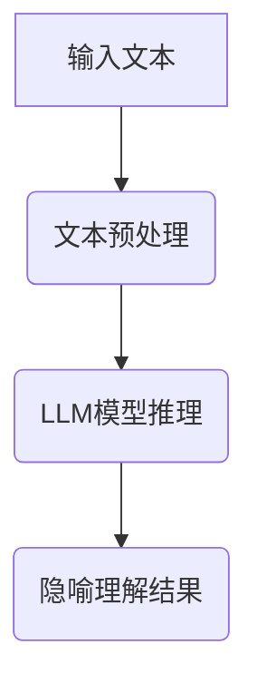
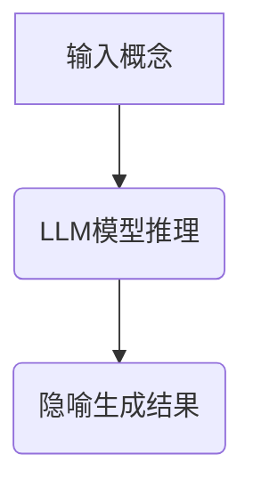
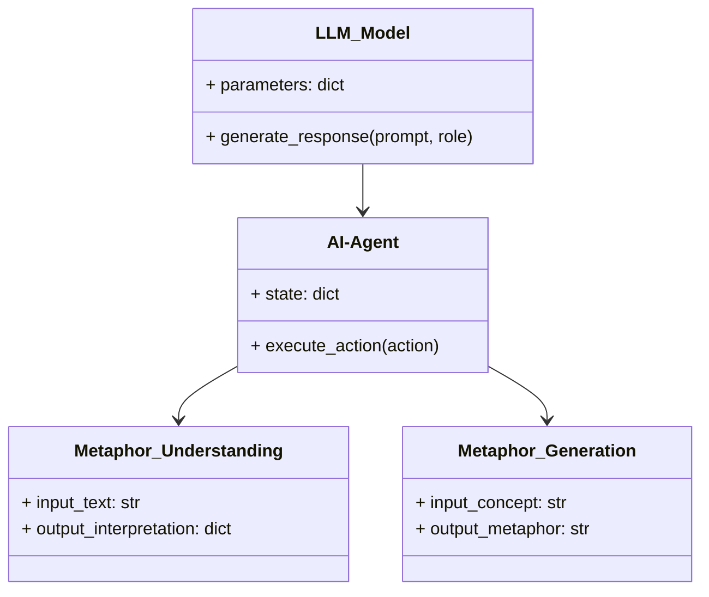
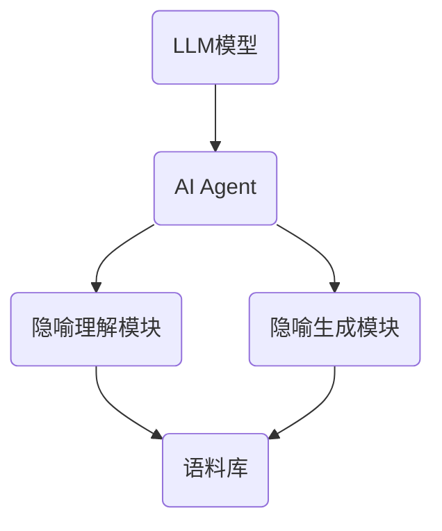

                 


# LLM驱动的AI Agent隐喻理解与生成

> 关键词：LLM, AI Agent, 隐喻理解, 生成, 自然语言处理, 人工智能

> 摘要：本文探讨了大语言模型（LLM）驱动的AI代理（AI Agent）在隐喻理解与生成中的应用。通过分析隐喻理解与生成的理论基础，结合LLM的特性，本文详细阐述了如何利用LLM驱动AI Agent实现隐喻的理解与生成，并通过实际案例展示了系统的实现与应用。

---

# 目录大纲：《LLM驱动的AI Agent隐喻理解与生成》

---

## 第一部分: LLM驱动的AI Agent背景与基础

### 第1章: LLM驱动的AI Agent概述

#### 1.1 问题背景与定义
- **问题背景**
  - 隐喻在自然语言处理中的重要性
  - AI Agent在智能系统中的角色
  - LLM的崛起与AI Agent的结合
- **定义**
  - LLM的定义与核心特性
  - AI Agent的定义与功能
  - LLM驱动的AI Agent的定义
- **问题解决与边界**
  - 隐喻理解与生成的核心问题
  - LLM驱动AI Agent的边界与外延
- **核心概念与联系**
  - LLM与AI Agent的关系
  - 隐喻理解与生成的联系
  - 实体关系图（ER图）：LLM、AI Agent、隐喻之间的关系



### 1.2 LLM与AI Agent的关系
- **LLM的基本原理**
  - 神经网络结构
  - 巨量训练数据与自监督学习
- **AI Agent的基本原理**
  - 行为决策与交互
  - 状态感知与环境建模
- **LLM驱动AI Agent的结合**
  - LLM作为知识库与推理引擎
  - AI Agent作为LLM的应用载体

---

## 第二部分: 隐喻理解与生成的理论与方法

### 第2章: 隐喻的理解与生成机制

#### 2.1 隐喻的理解
- **隐喻的理解过程**
  - 上下文分析
  - 关键词识别
  - 概念映射
- **隐喻理解的关键因素**
  - 上下文信息
  - 领域知识
  - 语境推理
- **隐喻理解的挑战**
  - 多义性与歧义性
  - 文化差异
  - 知识盲点

#### 2.2 隐喻的生成
- **隐喻生成的基本原理**
  - 概念关联
  - 创意表达
  - 符合语境
- **隐喻生成的关键步骤**
  - 概念抽取
  - 关联分析
  - 表达生成
- **隐喻生成的多样性**
  - 不同领域的隐喻特点
  - 不同文化的隐喻差异
  - 不同用户偏好的隐喻风格

#### 2.3 隐喻理解与生成的联系
- **隐喻理解对生成的影响**
  - 理解是生成的基础
  - 理解深度影响生成质量
- **隐喻生成对理解的反哺作用**
  - 生成的隐喻可以验证理解的准确性
  - 生成的隐喻可以丰富理解的语料库
- **隐喻理解与生成的协同进化**
  - 生成推动理解的深化
  - 理解推动生成的创新

---

## 第三部分: LLM驱动的隐喻理解与生成实现

### 第3章: LLM驱动的隐喻理解实现

#### 3.1 隐喻理解的算法原理
- **基于LLM的隐喻理解模型**
  - 输入处理：文本预处理与特征提取
  - 模型推理：上下文分析与关键词识别
  - 输出结果：概念映射与隐喻解析
- **算法流程图**



#### 3.2 隐喻理解的数学模型
- **损失函数**
  $$ \text{Loss} = -\sum_{i=1}^{n} \log p(y_i|x_i) $$
  其中，$y_i$ 是隐喻理解的正确标签，$x_i$ 是输入文本。
- **评估指标**
  - 准确率
  - 召回率
  - F1值
  - 精确度

#### 3.3 隐喻理解的代码实现
```python
def preprocess_text(text):
    # 文本预处理
    return text.lower().strip()

def llm_metaphor_understanding(preprocessed_text):
    # 调用LLM进行隐喻理解
    return llm_model.generate_response(preprocessed_text, "metaphor")
```

---

### 第4章: LLM驱动的隐喻生成实现

#### 4.1 隐喻生成的算法原理
- **基于LLM的隐喻生成模型**
  - 输入处理：概念输入与用户偏好
  - 模型推理：关联分析与创意生成
  - 输出结果：隐喻表达与多样性调整
- **算法流程图**



#### 4.2 隐喻生成的数学模型
- **生成概率**
  $$ P(\text{metaphor}|c) = \frac{N(c)}{\sum_{c'} N(c')} $$
  其中，$N(c)$ 是概念$c$出现的次数，$\sum N(c')$ 是所有概念的总次数。
- **多样性控制**
  - 温度系数
  - 重复惩罚

#### 4.3 隐喻生成的代码实现
```python
def generate_metaphor(concept, llm_model):
    # 生成隐喻
    return llm_model.generate_metaphor(concept)
```

---

## 第四部分: 系统分析与架构设计

### 第5章: 系统架构设计

#### 5.1 问题场景介绍
- **用户需求**
  - 隐喻理解与生成的需求
  - AI Agent的交互需求
- **系统介绍**
  - LLM驱动的AI Agent系统
  - 隐喻理解与生成模块

#### 5.2 系统功能设计
- **领域模型类图**



#### 5.3 系统架构设计
- **系统架构图**



---

## 第五部分: 项目实战

### 第6章: 项目实战

#### 6.1 环境安装
- **工具安装**
  - Python
  - transformers库
  - torch库
- **模型加载**
  ```python
  from transformers import AutoTokenizer, AutoModelForCausalLM
  tokenizer = AutoTokenizer.from_pretrained("gpt2")
  model = AutoModelForCausalLM.from_pretrained("gpt2")
  ```

#### 6.2 系统核心实现
- **隐喻理解模块实现**
  ```python
  def understand_metaphor(text):
      # 实现隐喻理解逻辑
      return interpretation
  ```
- **隐喻生成模块实现**
  ```python
  def generate_metaphor(concept):
      # 实现隐喻生成逻辑
      return metaphor
  ```

#### 6.3 代码解读与分析
- **代码功能解读**
  - 预处理模块
  - 模型调用模块
  - 结果解析模块
- **实际案例分析**
  - 案例1：理解隐喻
  - 案例2：生成隐喻

---

## 第六部分: 总结与展望

### 第7章: 总结与展望

#### 7.1 最佳实践 tips
- **注意事项**
  - 数据质量的重要性
  - 模型选择的策略
  - 用户反馈的处理
- **小结**
  - LLM驱动AI Agent的潜力
  - 隐喻理解与生成的核心价值

#### 7.2 未来研究方向
- **改进方向**
  - 提高隐喻理解的准确性
  - 增强隐喻生成的创造性
  - 优化系统架构的效率
- **拓展阅读**
  - 隐喻学研究
  - LLM的最新进展
  - AI Agent的应用案例

---

## 作者信息

作者：AI天才研究院/AI Genius Institute & 禅与计算机程序设计艺术 /Zen And The Art of Computer Programming

