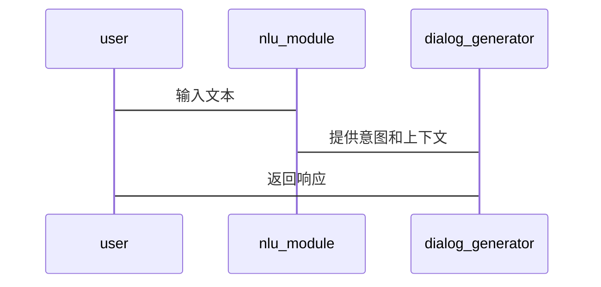

                 


# NLP技术在AI Agent中的应用与实践

## 关键词：NLP技术、AI Agent、自然语言处理、人工智能、机器学习

## 摘要：  
本文系统地探讨了自然语言处理（NLP）技术在人工智能代理（AI Agent）中的应用与实践。首先介绍了NLP和AI Agent的基本概念及其发展历程，分析了NLP技术如何赋能AI Agent的自然语言理解能力。接着，详细讲解了NLP的核心算法原理，包括词嵌入、语言模型和注意力机制等，以及这些技术在AI Agent中的具体应用。随后，从系统架构设计的角度，分析了AI Agent的整体结构和各模块的功能实现，并通过Mermaid图展示了系统的模块划分和交互流程。最后，通过一个具体的项目实战，详细阐述了AI Agent的开发过程，总结了最佳实践和注意事项，为读者提供了全面而深入的技术指导。

---

# 第1章: NLP与AI Agent概述

## 1.1 NLP技术的发展历程  
### 1.1.1 自然语言处理的起源与发展  
自然语言处理（NLP）是人工智能领域的重要分支，旨在使计算机能够理解、生成和处理人类语言。从早期的基于规则的系统到现代的深度学习模型，NLP技术经历了多次重大变革。  

### 1.1.2 NLP技术的核心挑战  
NLP的核心挑战包括语言的歧义性、语境的理解、跨语言差异等。  

### 1.1.3 当前NLP技术的主要应用领域  
当前NLP技术广泛应用于机器翻译、情感分析、文本生成、问答系统等领域。  

## 1.2 AI Agent的基本概念  
### 1.2.1 AI Agent的定义与特征  
AI Agent是一种能够感知环境、自主决策并执行任务的智能实体，具有主动性、反应性、社会性等特征。  

### 1.2.2 AI Agent的分类与应用场景  
AI Agent可以根据智能水平分为简单反应式Agent、基于模型的反应式Agent、目标驱动的Agent等。其应用场景包括智能助手、推荐系统、自动驾驶等。  

### 1.2.3 NLP在AI Agent中的重要性  
NLP技术使得AI Agent能够理解和处理人类语言，从而更好地与用户交互并执行任务。  

## 1.3 NLP与AI Agent的结合  
### 1.3.1 NLP技术如何赋能AI Agent  
通过NLP技术，AI Agent能够实现自然语言理解、意图识别、对话生成等功能。  

### 1.3.2 NLP在AI Agent中的典型应用场景  
例如智能客服、虚拟助手、智能音箱等。  

### 1.3.3 NLP与AI Agent结合的优势与挑战  
优势包括提高用户体验、增强智能化水平等；挑战包括语言理解的准确性、多语言支持等。  

## 1.4 本章小结  
本章介绍了NLP和AI Agent的基本概念及其发展历程，并分析了NLP技术在AI Agent中的重要作用和应用前景。

---

# 第2章: NLP的核心原理  

## 2.1 词嵌入技术  
### 2.1.1 词嵌入的基本概念  
词嵌入是一种将词语映射到低维连续向量的技术，使得词语的语义信息得以保留。  

### 2.1.2 常见词嵌入算法  
- **Word2Vec**: 通过神经网络模型学习词向量，包括CBOW和Skip-Gram模型。  
- **GloVe**: 基于全局词向量的构造，利用矩阵分解方法学习词向量。  
- **FastText**: 通过子词级别的特征提取，提升词向量的表达能力。  

### 2.1.3 词嵌入的特性与应用场景  
词嵌入具有低维性、连续性、语义性等特点，广泛应用于文本分类、情感分析、机器翻译等领域。  

## 2.2 语言模型  
### 2.2.1 语言模型的定义与作用  
语言模型用于预测给定输入序列的下一个词，是NLP技术的核心组件之一。  

### 2.2.2 基于RNN的序列模型  
- **循环神经网络（RNN）**: 通过循环结构处理序列数据，但存在梯度消失问题。  
- **长短期记忆网络（LSTM）**: 通过门控机制解决RNN的梯度消失问题。  

### 2.2.3 Transformer架构的突破与优势  
Transformer架构通过自注意力机制和位置编码，显著提升了语言模型的性能。  

## 2.3 注意力机制  
### 2.3.1 注意力机制的基本原理  
注意力机制通过计算输入序列中每个词的重要性，聚焦于关键信息。  

### 2.3.2 注意力机制在NLP中的应用  
包括机器翻译、文本摘要、问答系统等。  

### 2.3.3 多头注意力机制的创新与优势  
多头注意力机制通过并行计算多个注意力头，进一步提升模型的表达能力。  

## 2.4 本章小结  
本章详细讲解了词嵌入、语言模型和注意力机制等NLP核心概念及其原理，为后续章节的应用奠定了基础。

---

# 第3章: AI Agent的系统架构与设计  

## 3.1 AI Agent的系统组成  
### 3.1.1 感知层  
负责接收和处理来自外部环境的输入，包括语音识别、图像识别等。  

### 3.1.2 理解层  
负责对输入进行语义分析和意图识别，理解用户的需求。  

### 3.1.3 决策层  
基于理解和环境信息，制定行动计划。  

### 3.1.4 执行层  
执行具体的任务，与环境进行交互并返回结果。  

## 3.2 系统架构设计  
### 3.2.1 分层架构设计  
将系统划分为感知层、理解层、决策层和执行层，各层之间通过接口进行交互。  

### 3.2.2 微服务架构设计  
通过微服务架构实现模块化设计，提高系统的可扩展性和可维护性。  

### 3.2.3 模块间的交互关系  
模块间的交互关系可以通过Mermaid图表示，展示各模块之间的调用流程。  

## 3.3 系统功能设计  
### 3.3.1 自然语言理解模块  
负责对用户输入进行语义分析和意图识别。  

### 3.3.2 意图识别模块  
基于上下文信息，识别用户的意图并生成相应的响应。  

### 3.3.3 任务执行模块  
根据意图识别结果，执行具体的任务并返回结果。  

### 3.3.4 学习与优化模块  
通过反馈机制不断优化模型性能。  

## 3.4 本章小结  
本章详细分析了AI Agent的系统架构与功能设计，并通过Mermaid图展示了系统的模块划分和交互流程。

---

# 第4章: NLP技术在AI Agent中的算法实现  

## 4.1 基于Transformer的NLP算法  
### 4.1.1 Transformer模型的原理  
通过自注意力机制和位置编码，Transformer模型在NLP任务中表现出色。  

### 4.1.2 Transformer模型的数学公式  
$$\text{Attention}(Q, K, V) = \text{softmax}\left(\frac{QK^T}{\sqrt{d_k}}\right)V$$  

### 4.1.3 Transformer模型在AI Agent中的应用  
例如对话生成、文本摘要等。  

## 4.2 基于深度学习的意图识别  
### 4.2.1 意图识别的定义与挑战  
意图识别旨在理解用户输入的意图，是AI Agent的核心任务之一。  

### 4.2.2 基于深度学习的意图识别算法  
- **卷积神经网络（CNN）**: 用于局部特征提取。  
- **循环神经网络（RNN）**: 用于序列建模。  
- **Transformer**: 用于全局特征建模。  

## 4.3 基于预训练模型的对话生成  
### 4.3.1 预训练模型的基本概念  
预训练模型如BERT、GPT等，通过大规模数据预训练，具备强大的语言理解能力。  

### 4.3.2 对话生成的实现步骤  
1. 对话历史输入预训练模型进行编码。  
2. 解码生成下一步的回复。  

### 4.3.3 对话生成的数学公式  
$$P(w_{i+1}|w_1, w_2, ..., w_i)$$  

## 4.4 本章小结  
本章详细讲解了基于Transformer的NLP算法及其在AI Agent中的应用，并通过数学公式和算法实现展示了技术细节。

---

# 第5章: 项目实战——构建一个简单的AI Agent  

## 5.1 项目介绍  
本项目旨在通过Python和深度学习框架（如TensorFlow或PyTorch）实现一个简单的AI Agent。  

## 5.2 环境安装  
### 5.2.1 安装Python  
- 安装Python 3.8及以上版本。  

### 5.2.2 安装深度学习框架  
- 安装TensorFlow或PyTorch。  

### 5.2.3 安装NLP库  
- 安装spaCy、NLTK等NLP处理库。  

## 5.3 系统核心实现  
### 5.3.1 自然语言理解模块  
实现基于词嵌入的文本表示和意图识别。  

### 5.3.2 对话生成模块  
基于预训练模型实现对话生成。  

### 5.3.3 系统接口设计  
定义模块之间的接口，如NLU模块与对话生成模块的交互接口。  

## 5.4 代码实现  
### 5.4.1 NLU模块实现  
```python
import spacy

nlp = spacy.load("en_core_web_sm")

def nlu_process(text):
    doc = nlp(text)
    # 提取实体和意图
    return {"entities": [(ent.text, ent.start, ent.end) for ent in doc.ents], "intent": "intent"}
```

### 5.4.2 对话生成模块实现  
```python
import tensorflow as tf

model = tf.keras.load_model("dialog_model.h5")

def generate_response(text):
    input_text = tokenize_and_encode(text)
    prediction = model.predict(input_text)
    response = decode_prediction(prediction)
    return response
```

### 5.4.3 系统交互流程  
通过Mermaid序列图展示系统交互流程：  



## 5.5 项目小结  
本章通过一个具体的项目实战，详细讲解了AI Agent的开发过程，包括环境安装、代码实现和系统交互设计。

---

# 第6章: 最佳实践与小结  

## 6.1 最佳实践  
### 6.1.1 数据预处理的重要性  
确保数据质量，进行分词、去停用词等预处理步骤。  

### 6.1.2 模型调优技巧  
包括超参数调节、模型评估和交叉验证等。  

### 6.1.3 系统优化建议  
通过缓存机制、并行计算等优化系统性能。  

## 6.2 注意事项  
- 数据隐私和安全问题。  
- 模型的可解释性和透明性。  
- 多语言支持和文化差异问题。  

## 6.3 拓展阅读  
推荐阅读《深度学习》、《自然语言处理入门》等相关书籍，以及研究最新的NLP论文和技术动态。  

## 6.4 本章小结  
本章总结了NLP技术在AI Agent中的应用与实践，提出了最佳实践和注意事项，并为读者提供了进一步学习和研究的方向。

---

# 作者  
作者：AI天才研究院 & 禅与计算机程序设计艺术

---

以上是《NLP技术在AI Agent中的应用与实践》的目录大纲，涵盖了从理论到实践的各个方面，适合希望深入了解NLP技术在AI Agent中应用的读者阅读。

