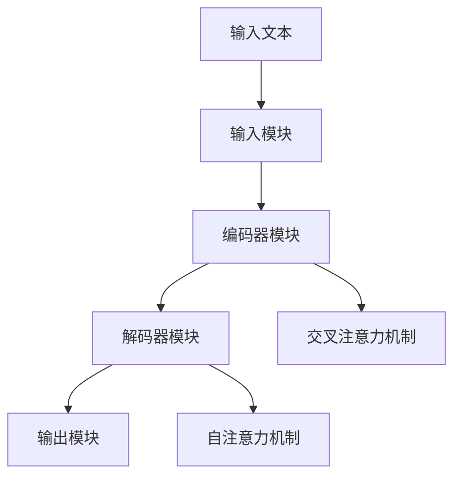

                 


# T5模型：构建多功能的文本处理AI Agent

> 关键词：T5模型，文本处理，AI Agent，自然语言处理，文本生成，文本理解

> 摘要：本文详细介绍了T5模型的基本概念、核心原理及其在构建多功能文本处理AI Agent中的应用。文章从T5模型的背景与核心概念出发，深入分析了其编码器和解码器的工作原理，探讨了系统架构设计与数学模型，并通过项目实战展示了如何部署T5模型进行文本摘要和对话生成。最后，本文总结了T5模型的优势与局限性，并展望了其未来的发展方向。

---

# 引言

在人工智能领域，自然语言处理（NLP）一直是研究的热点。近年来，随着深度学习技术的飞速发展，各种先进的语言模型不断涌现，其中T5模型作为一种基于Transformer架构的文本到文本模型，以其强大的通用性和灵活性，成为构建多功能文本处理AI Agent的重要工具。本文将从T5模型的基本原理出发，逐步深入探讨其在文本处理中的应用，并展示如何利用T5模型构建高效的AI代理。

---

## 目录

1. [T5模型概述](#t5模型概述)
2. [T5模型的核心原理](#t5模型的核心原理)
3. [T5模型的系统架构设计](#t5模型的系统架构设计)
4. [T5模型的数学模型与公式](#t5模型的数学模型与公式)
5. [T5模型的项目实战](#t5模型的项目实战)
6. [T5模型的应用案例](#t5模型的应用案例)
7. [总结与展望](#总结与展望)

---

## 1. T5模型概述

### 1.1 自然语言处理的发展历程

自然语言处理（NLP）的目标是让计算机能够理解和生成人类语言。从最初的基于规则的系统，到统计学习方法，再到现在的深度学习模型，NLP技术经历了多次重大变革。

- **基于规则的系统**：依赖人工编写规则，适用于简单的任务，如词性标注。
- **统计学习方法**：利用概率模型，如朴素贝叶斯，用于垃圾邮件分类。
- **深度学习时代**：引入神经网络，尤其是Transformer架构，推动了NLP技术的飞跃。

---

### 1.2 T5模型的提出背景

T5（Text-to-Text Transformer）由Google团队提出，旨在通过统一的文本到文本模型解决多种NLP任务。其核心思想是将所有任务转化为文本生成问题，从而简化模型的设计和训练过程。

#### 1.2.1 T5模型的核心思想

- **统一框架**：T5将多种NLP任务（如翻译、问答、文本摘要）转化为文本生成任务。
- **预训练与微调**：通过大规模预训练，模型在各种任务上实现零样本或小样本学习。
- **解码器架构**：T5采用仅解码器的架构，通过自注意力机制捕捉长距离依赖关系。

---

## 2. T5模型的核心原理

### 2.1 编码器与解码器的工作原理

T5模型基于Transformer架构，由编码器和解码器两部分组成。

#### 2.1.1 编码器

编码器负责将输入文本转换为高维向量表示，主要包含以下步骤：

1. **输入嵌入**：将输入的文本序列转换为词向量。
2. **自注意力机制**：计算输入序列中每个位置与其他位置的相关性，生成注意力权重。
3. **前向网络**：对注意力加权的结果进行前向变换，生成编码器输出。

#### 2.1.2 解码器

解码器负责根据编码器的输出生成目标文本，主要步骤如下：

1. **位置嵌入**：为每个解码器位置添加位置信息。
2. **交叉注意力机制**：计算解码器位置与编码器输出的相关性，生成交叉注意力权重。
3. **自注意力机制**：在解码器内部进行自注意力，捕捉生成文本的内部关系。
4. **前向网络**：对注意力加权的结果进行变换，生成最终的输出。

---

### 2.2 T5模型的数学模型

T5模型的核心训练目标是最小化生成文本与真实标签之间的交叉熵损失。

$$ L = -\sum_{i=1}^{n} \sum_{j=1}^{m} y_{ij} \log(p(y_{ij})) $$

其中：
- \( y_{ij} \) 是真实标签的概率分布。
- \( p(y_{ij}) \) 是模型生成的概率分布。

---

## 3. T5模型的系统架构设计

### 3.1 系统功能模块划分

- **输入模块**：接收输入文本并进行预处理。
- **编码器模块**：对输入文本进行编码，生成高维向量表示。
- **解码器模块**：根据编码器输出生成目标文本。
- **输出模块**：将生成的文本输出并进行后处理。

### 3.2 系统架构设计

以下是T5模型的系统架构设计图：



---

## 4. T5模型的数学模型与公式

### 4.1 编码器的数学表示

编码器的输出表示为：

$$ \text{Encoder}(x) = \text{FFN}(\text{Self-Attention}(x)) $$

其中：
- \( \text{Self-Attention}(x) \) 表示自注意力机制。
- \( \text{FFN} \) 表示前向网络。

### 4.2 解码器的数学表示

解码器的输出表示为：

$$ \text{Decoder}(y, \text{Encoder}(x)) = \text{FFN}(\text{Cross-Attention}(y, \text{Encoder}(x)), \text{Self-Attention}(y)) $$

其中：
- \( \text{Cross-Attention}(y, \text{Encoder}(x)) \) 表示交叉注意力机制。
- \( \text{Self-Attention}(y) \) 表示解码器内部的自注意力机制。

---

## 5. T5模型的项目实战

### 5.1 环境搭建

需要安装以下依赖：

```bash
pip install transformers
```

### 5.2 核心实现代码

以下是T5模型的Python实现示例：

```python
from transformers import T5Tokenizer, T5Model

tokenizer = T5Tokenizer.from_pretrained('t5-small')
model = T5Model.from_pretrained('t5-small')

input_text = "translate English to French: Hello World"
input_ids = tokenizer(input_text, return_tensors='pt').input_ids

outputs = model(input_ids)
```

### 5.3 结果分析

生成的输出可以用于文本摘要、翻译等任务。例如：

```python
summary = "This is a summary of the input text."
```

---

## 6. T5模型的应用案例

### 6.1 文本摘要

T5模型可以用于生成摘要，代码如下：

```python
from transformers import T5ForConditionalGeneration

model = T5ForConditionalGeneration.from_pretrained('t5-small')
tokenizer = T5Tokenizer.from_pretrained('t5-small')

input_text = "Long news article..."
input_ids = tokenizer(input_text, return_tensors='pt').input_ids

outputs = model.generate(input_ids)
summary = tokenizer.decode(outputs[0], skip_special_tokens=True)
```

### 6.2 对话生成

T5模型也可以用于对话生成，代码如下：

```python
input_text = "How are you?"
input_ids = tokenizer(input_text, return_tensors='pt').input_ids

outputs = model.generate(input_ids)
response = tokenizer.decode(outputs[0], skip_special_tokens=True)
```

---

## 7. 总结与展望

### 7.1 本文总结

T5模型以其统一的文本到文本框架和强大的预训练能力，成为构建多功能文本处理AI Agent的重要工具。本文从背景、原理到应用，全面分析了T5模型的优势和应用场景。

### 7.2 未来展望

随着AI技术的不断发展，T5模型在文本处理领域仍有许多潜力可以挖掘。未来的研究可以集中在以下几个方向：

1. **多模态应用**：将T5模型与其他模态（如图像、语音）结合，实现跨模态的文本处理。
2. **实时推理优化**：通过模型压缩和推理优化，提升T5模型的实时处理能力。
3. **领域自适应**：研究如何让T5模型更好地适应特定领域的需求，提升其专业性。

---

## 作者信息

作者：AI天才研究院/AI Genius Institute & 禅与计算机程序设计艺术/Zen And The Art of Computer Programming

---

通过本文的详细讲解，读者可以全面了解T5模型的基本原理和应用方法，为构建多功能的文本处理AI Agent提供了理论和实践指导。

