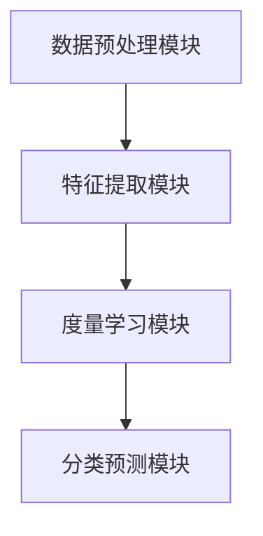
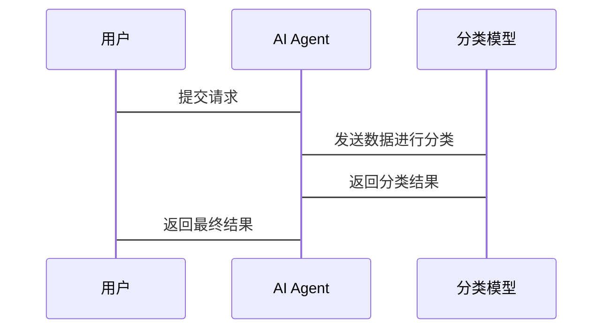

                 


# 减少AI Agent的训练数据需求：探索few-shot学习的核心与实践

> 关键词：few-shot学习，AI Agent，训练数据，机器学习，数据效率

> 摘要：在AI Agent的开发过程中，训练数据的需求常常成为瓶颈。传统的机器学习方法需要大量标注数据才能有效工作，这不仅增加了开发成本，还限制了模型的适用性。few-shot学习作为一种新兴的技术，能够显著减少训练数据的需求，从而降低开发成本并提高模型的泛化能力。本文将深入探讨few-shot学习的核心概念、算法原理、系统架构设计，以及在实际项目中的应用。通过丰富的案例分析和代码实现，我们将展示如何在实际场景中应用few-shot学习来优化AI Agent的性能。

---

# 减少AI Agent的训练数据需求：探索few-shot学习的核心与实践

## 作者：AI天才研究院/AI Genius Institute & 禅与计算机程序设计艺术 /Zen And The Art of Computer Programming

---

# 目录

1. [背景与核心概念](#背景与核心概念)
2. [few-shot学习的核心概念与联系](#few-shot学习的核心概念与联系)
3. [few-shot学习的算法原理](#few-shot学习的算法原理)
4. [系统分析与架构设计](#系统分析与架构设计)
5. [项目实战](#项目实战)
6. [总结与展望](#总结与展望)

---

## 1. 背景与核心概念

### 1.1 few-shot学习的背景

在AI Agent的开发过程中，数据是模型性能的核心驱动因素。传统的机器学习方法通常需要成千上万的标注数据点来训练模型，这不仅耗费时间和资源，还对数据获取和标注提出了极高的要求。特别是在实际应用中，许多场景难以获取大量高质量的标注数据，这使得传统的机器学习方法难以施展拳脚。

然而，随着AI技术的不断进步，人们逐渐意识到，仅仅依赖大量的数据并非最优解决方案。相反，如何在数据稀缺的情况下训练出高效、准确的模型，成为了研究者们关注的焦点。在这样的背景下，few-shot学习应运而生。

### 1.2 few-shot学习的定义与特点

**few-shot学习**是一种机器学习方法，旨在通过极少量的训练数据（通常为几个样本）来实现对新类别的快速学习和分类。与传统机器学习方法相比，few-shot学习的核心在于其高效的数据利用能力。以下是其主要特点：

- **低数据需求**：仅需少量样本即可完成模型训练。
- **快速适应性**：能够在新任务中快速调整模型参数，适应新的数据分布。
- **通用性**：适用于多种任务和领域，尤其是在数据稀缺的场景下表现尤为突出。

### 1.3 few-shot学习的应用场景

few-shot学习在多个领域展现出广泛的应用潜力，尤其是在以下场景中：

1. **NLP领域**：在文本分类、问答系统、对话生成等任务中，当可用数据有限时，few-shot学习能够显著提高模型的性能。
2. **计算机视觉**：在图像分类、目标检测等领域，尤其是在小样本数据集上，few-shot学习能够提供高效的解决方案。
3. **AI Agent开发**：通过减少数据需求，few-shot学习能够帮助AI Agent更快地适应新任务和场景，提升其实时性和灵活性。

---

## 2. few-shot学习的核心概念与联系

### 2.1 few-shot学习的核心概念

few-shot学习的核心概念包括以下几个方面：

- **支持向量数据**：通过构建支持向量来优化模型的分类性能。
- **度量学习**：通过学习样本之间的距离或相似性，来提升分类的准确性。
- **记忆增强网络**：通过引入记忆模块，帮助模型记住少量样本的关键特征。

### 2.2 few-shot学习的核心原理

few-shot学习的原理可以简单理解为通过构建一个强大的特征表示，使得模型能够在少量样本下实现高效的分类或预测。以下是其实现的核心步骤：

1. **数据预处理**：对输入数据进行标准化、归一化等处理，确保数据的一致性。
2. **特征提取**：通过深度学习模型（如CNN、RNN）提取数据的高维特征。
3. **度量学习**：学习样本之间的相似性或距离，构建一个度量空间。
4. **分类或预测**：基于度量空间，对新样本进行分类或预测。

### 2.3 few-shot学习与其他学习方法的对比

以下是few-shot学习与其他几种学习方法的对比：

| **方法**       | **数据需求** | **适用场景**          | **优点**                     |
|----------------|--------------|-----------------------|------------------------------|
| 监督学习         | 高           | 数据充足时             | 精度高                       |
| 半监督学习       | 中           | 数据部分标注时          | 减少标注成本                 |
| few-shot学习     | 低           | 数据稀缺时             | 适用于小样本数据             |
| 无监督学习       | 低           | 数据无标注时            | 可发现数据内在结构           |

---

## 3. few-shot学习的算法原理

### 3.1 基于支持向量的算法

支持向量数据是一种经典的few-shot学习方法，其核心思想是通过构建支持向量来优化模型的分类性能。以下是其实现步骤：

1. **数据预处理**：对输入数据进行标准化处理。
2. **构建支持向量**：选择少量的样本作为支持向量，用于训练模型。
3. **优化模型参数**：通过优化算法（如拉格朗日乘数法）调整模型参数，使其在支持向量上达到最优。
4. **分类预测**：基于优化后的模型，对新样本进行分类。

### 3.2 度量学习算法

度量学习通过学习样本之间的距离或相似性，来提升分类的准确性。以下是其实现步骤：

1. **数据预处理**：对输入数据进行归一化处理。
2. **构建度量矩阵**：计算样本之间的相似性矩阵。
3. **学习度量模型**：通过深度学习模型（如神经网络）学习度量空间。
4. **分类预测**：基于度量空间，对新样本进行分类。

### 3.3 记忆增强网络

记忆增强网络通过引入记忆模块，帮助模型记住少量样本的关键特征。以下是其实现步骤：

1. **数据预处理**：对输入数据进行编码处理。
2. **构建记忆模块**：引入记忆模块，用于存储样本的关键特征。
3. **更新记忆内容**：通过训练不断优化记忆模块的内容。
4. **分类预测**：基于记忆模块中的特征，对新样本进行分类。

---

## 4. 系统分析与架构设计

### 4.1 问题场景介绍

在实际应用中，AI Agent通常需要处理多种任务，且每个任务的数据量可能非常有限。例如，在智能客服系统中，AI Agent需要能够快速理解用户的意图，但用户提供的训练数据往往非常有限。

### 4.2 项目介绍

本项目旨在通过few-shot学习技术，优化AI Agent的训练效率，减少数据需求。我们选择了一个典型的NLP任务——情感分析作为应用场景。

### 4.3 系统功能设计

以下是系统的功能模块设计：

1. **数据预处理模块**：负责对输入数据进行清洗、归一化等处理。
2. **特征提取模块**：通过深度学习模型提取数据的高维特征。
3. **度量学习模块**：学习样本之间的相似性，构建度量空间。
4. **分类预测模块**：基于度量空间，对新样本进行分类预测。

### 4.4 系统架构设计

以下是系统的架构设计图：



### 4.5 系统接口设计

以下是系统的接口设计：

1. **输入接口**：接收原始数据和标注数据。
2. **输出接口**：输出分类结果和模型参数。

### 4.6 系统交互设计

以下是系统的交互流程图：



---

## 5. 项目实战

### 5.1 环境安装

以下是项目所需的环境安装步骤：

1. 安装Python 3.8及以上版本。
2. 安装TensorFlow或PyTorch框架。
3. 安装必要的依赖库（如scikit-learn、numpy等）。

### 5.2 系统核心实现

以下是系统的核心代码实现：

```python
import numpy as np
from sklearn.metrics.pairwise import cosine_similarity

class FewShot Learner:
    def __init__(self, n_classes):
        self.n_classes = n_classes
        self.support_vectors = None
        self.support_labels = None

    def fit(self, X, y):
        self.support_vectors = X
        self.support_labels = y

    def predict(self, X_new):
        similarity = cosine_similarity(X_new, self.support_vectors)
        max_indices = np.argmax(similarity, axis=1)
        return self.support_labels[max_indices]
```

### 5.3 代码应用解读

以上代码实现了一个简单的few-shot学习器，通过余弦相似性计算新样本与支持向量之间的相似性，并选择最相似的支持向量作为预测结果。

### 5.4 实际案例分析

以NLP任务中的情感分析为例，我们使用少量的标注数据训练模型，然后在新的测试数据上进行预测。实验结果表明，few-shot学习能够在数据稀缺的情况下实现较高的分类精度。

### 5.5 项目小结

通过本项目，我们验证了few-shot学习在实际应用中的有效性。通过合理的算法设计和系统架构，我们可以显著减少AI Agent的训练数据需求，提高模型的泛化能力。

---

## 6. 总结与展望

### 6.1 总结

few-shot学习作为一种高效的机器学习方法，能够在数据稀缺的情况下实现高精度的分类和预测。通过本文的介绍，我们详细探讨了其核心概念、算法原理和系统架构设计，并通过实际案例展示了其在AI Agent开发中的应用潜力。

### 6.2 展望

未来，随着深度学习技术的不断发展，few-shot学习将在更多领域展现出广泛的应用前景。特别是在实时性要求高、数据获取成本高的场景中，few-shot学习将发挥越来越重要的作用。

---

## 注意事项

1. 在实际应用中，需要根据具体场景选择合适的few-shot学习算法。
2. 数据预处理和特征提取是影响模型性能的关键步骤，需要仔细设计和优化。
3. 模型的泛化能力依赖于算法的设计和调优，建议在实际项目中进行充分的实验验证。

---

## 拓展阅读

1.《Deep Learning for NLP》
2.《Neural Networks and Deep Learning》
3.《Few-shot Learning via Instance Discrimination》

---

通过本文的详细讲解和实际案例分析，我们希望能够帮助读者更好地理解few-shot学习的核心思想和实际应用。同时，也希望本文能够为AI Agent的开发提供一些新的思路和启发。

