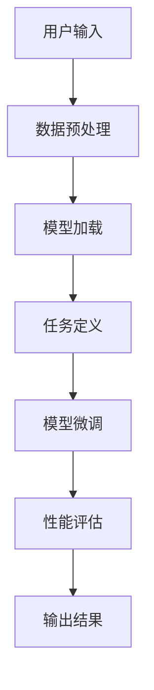
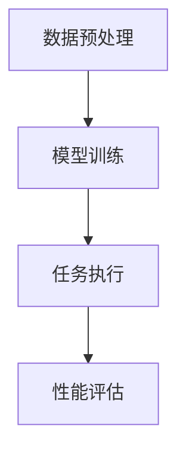

                 


# Fine-tuning LLM模型：提升AI Agent性能的关键

> 关键词：Large Language Models (LLMs), Fine-tuning, AI Agent, 模型微调，性能优化

> 摘要：本文深入探讨了如何通过细粒度调整（Fine-tuning）大语言模型（LLMs）来显著提升AI代理的性能。文章从基本概念到实战应用，系统地分析了Fine-tuning的原理、方法和实际案例，帮助读者全面理解并掌握提升AI代理性能的关键技术。

---

## 第1章: LLM模型与Fine-tuning概述

### 1.1 什么是LLM模型

#### 1.1.1 大语言模型的定义与特点
大语言模型（Large Language Models, LLMs）是指在大规模数据集上进行预训练的深度学习模型，通常使用Transformer架构。其特点包括：
- **大规模**：通常训练数据超过 billions of tokens。
- **多任务能力**：经过预训练后，可以通过微调适应多种下游任务。
- **生成能力**：能够生成自然语言文本，回答问题，完成对话等。

#### 1.1.2 LLM模型的核心技术原理
大语言模型的核心技术包括：
- **Transformer架构**：由Google在2018年提出，包含编码器和解码器，通过自注意力机制捕捉长距离依赖关系。
- **预训练目标**：通常使用语言模型目标（如预测下一个单词）或Masked语言模型目标进行预训练。
- **多层结构**：通过堆叠多个Transformer层来增强模型的表示能力。

#### 1.1.3 LLM模型的应用场景与优势
应用场景包括：
- 自然语言处理任务：文本生成、问答系统、机器翻译。
- AI代理：智能对话、任务执行、用户交互等。

### 1.2 Fine-tuning的概念与重要性

#### 1.2.1 什么是Fine-tuning
Fine-tuning是指在预训练好的模型基础上，针对特定任务进一步优化模型的过程。通过调整模型参数，使其更好地适应特定领域或任务的需求。

#### 1.2.2 Fine-tuning在LLM模型中的作用
- **任务适配**：使模型更适合特定任务，如对话生成、文本摘要。
- **性能提升**：通过调整模型参数，显著提高模型在目标任务上的表现。
- **领域迁移**：将模型从通用任务调整到特定领域，如医疗、法律等。

#### 1.2.3 Fine-tuning与模型性能提升的关系
通过Fine-tuning，模型可以在特定任务上表现出色，尤其是在小规模数据集上，Fine-tuning能够显著提升模型的泛化能力。

---

## 第2章: LLM模型的训练与微调原理

### 2.1 LLM模型的训练过程

#### 2.1.1 预训练的概念与流程
预训练阶段通常包括：
1. **数据准备**：收集和处理大规模数据集。
2. **模型构建**：选择合适的模型架构（如Transformer）。
3. **损失函数设计**：通常使用交叉熵损失函数。
4. **优化器选择**：常用Adam优化器。
5. **训练过程**：通过反向传播更新模型参数，最小化损失函数。

#### 2.1.2 预训练中的损失函数与优化方法
- **损失函数**：交叉熵损失函数，用于衡量预测概率与真实标签的差异。
  $$ \text{Loss} = -\sum_{i=1}^{n} y_i \log p_i $$
- **优化方法**：Adam优化器，结合动量和自适应学习率。

#### 2.1.3 预训练模型的评估与选择
评估预训练模型通常使用验证集的准确率、困惑度（Perplexity）等指标。选择合适的模型需要考虑任务需求和计算资源。

### 2.2 Fine-tuning的实现原理

#### 2.2.1 参数微调的核心思想
Fine-tuning的核心思想是在预训练模型的基础上，仅对部分参数进行微调，通常包括：
- **全连接层**：通常仅微调最后一层或几层全连接层。
- **自注意力层**：有时也会微调自注意力机制的参数。

#### 2.2.2 微调过程中的任务适配策略
- **任务特定的优化**：根据具体任务调整模型输出层的结构。
- **数据增强**：通过数据增强技术（如数据清洗、数据扩展）提升模型的鲁棒性。
- **学习率调整**：在微调过程中，通常会降低学习率以避免破坏预训练参数。

#### 2.2.3 微调对模型性能的影响分析
- **性能提升**：通过Fine-tuning，模型在特定任务上的准确率显著提高。
- **计算效率**：相比于从头训练，Fine-tuning节省了大量的计算资源。

---

## 第3章: Fine-tuning的算法原理与数学模型

### 3.1 Fine-tuning的算法流程

#### 3.1.1 算法输入与输出
- **输入**：预训练好的模型权重、任务特定的数据集。
- **输出**：针对特定任务优化后的模型权重。

#### 3.1.2 算法的步骤分解
1. 加载预训练好的模型权重。
2. 根据任务需求，选择需要微调的层。
3. 使用任务特定的数据集进行训练，计算损失函数。
4. 使用优化器更新模型参数。
5. 重复步骤3和4，直到损失函数达到最小值或达到预设的训练次数。

#### 3.1.3 算法的复杂度分析
- **时间复杂度**：主要取决于训练数据量和模型参数量。
- **空间复杂度**：主要取决于模型参数的存储需求。

### 3.2 Fine-tuning的数学模型

#### 3.2.1 损失函数的数学表达式
常用的损失函数是交叉熵损失：
$$ \text{Loss} = -\frac{1}{N}\sum_{i=1}^{N} y_i \log p_i $$
其中，$N$是训练样本的数量，$y_i$是真实标签，$p_i$是模型预测的概率。

#### 3.2.2 优化器的数学推导
Adam优化器的更新公式为：
$$ m_t = \beta_1 m_{t-1} + (1-\beta_1)g_t $$
$$ v_t = \beta_2 v_{t-1} + (1-\beta_2)g_t^2 $$
$$ \theta_{t} = \theta_{t-1} - \alpha \frac{m_t}{\sqrt{v_t}+\epsilon} $$
其中，$\alpha$是学习率，$\beta_1$和$\beta_2$是动量参数，$\epsilon$是防止除以零的常数。

#### 3.2.3 模型参数更新的数学公式
模型参数更新公式为：
$$ \theta_{t} = \theta_{t-1} - \eta g_t $$
其中，$\eta$是学习率，$g_t$是梯度。

---

## 第4章: Fine-tuning的系统分析与架构设计

### 4.1 系统功能需求分析

#### 4.1.1 系统目标与功能模块划分
- **目标**：提升AI代理的性能。
- **功能模块**：
  - 数据预处理模块。
  - 模型训练与微调模块。
  - 任务执行与评估模块。

#### 4.1.2 系统输入与输出的定义
- **输入**：预训练好的模型权重、任务数据集。
- **输出**：优化后的模型权重、模型性能评估报告。

#### 4.1.3 系统性能指标与评估标准
- **准确率**：模型在特定任务上的正确预测比例。
- **响应时间**：模型处理任务的平均时间。
- **资源消耗**：模型训练和推理的计算资源消耗。

### 4.2 系统架构设计

#### 4.2.1 系统架构的层次划分
- **数据层**：负责数据的输入、处理和存储。
- **模型层**：负责模型的加载、训练和微调。
- **任务层**：负责任务的定义、执行和评估。

#### 4.2.2 各模块之间的交互关系
- 数据层向模型层提供预处理后的数据。
- 模型层向任务层提供优化后的模型权重。
- 任务层向数据层反馈模型性能评估结果。

#### 4.2.3 系统架构的可扩展性设计
- 支持多种任务类型。
- 支持多种模型架构。
- 支持分布式训练和部署。

### 4.3 系统接口设计

#### 4.3.1 接口定义与接口规范
- **输入接口**：接收预训练模型和任务数据。
- **输出接口**：输出优化后的模型和性能报告。

#### 4.3.2 接口之间的调用关系
- 数据层通过输入接口接收数据，传递给模型层。
- 模型层通过输出接口将优化后的模型传递给任务层。

#### 4.3.3 接口的安全性与稳定性设计
- 数据加密：确保数据在传输过程中的安全性。
- 错误处理：设计完善的错误处理机制，确保系统稳定运行。

### 4.4 系统交互流程设计

#### 4.4.1 系统交互流程图（Mermaid）


---

## 第5章: Fine-tuning的项目实战

### 5.1 项目环境与工具安装

#### 5.1.1 开发环境的选择与配置
推荐使用Python 3.8及以上版本，安装必要的库：
- `transformers`：用于加载预训练模型。
- `torch`：用于模型训练和优化。
- `numpy`：用于数据处理。

#### 5.1.2 必要工具与库的安装
```bash
pip install transformers torch numpy
```

#### 5.1.3 环境变量的配置与测试
设置GPU支持（如NVIDIA GPU），确保环境配置正确。

### 5.2 项目核心代码实现

#### 5.2.1 模型加载与初始化
```python
from transformers import AutoTokenizer, AutoModelForMaskedLM
model = AutoModelForMaskedLM.from_pretrained('bert-base-uncased')
tokenizer = AutoTokenizer.from_pretrained('bert-base-uncased')
```

#### 5.2.2 数据预处理
```python
def preprocess_data(data):
    inputs = []
    labels = []
    for text in data:
        inputs.append(tokenizer.encode(text))
        labels.append(tokenizer.encode(text))
    return inputs, labels
```

#### 5.2.3 模型训练与微调
```python
from torch import optim

optimizer = optim.Adam(model.parameters(), lr=1e-5)
criterion = nn.CrossEntropyLoss()

for epoch in range(num_epochs):
    model.train()
    for inputs, labels in dataloader:
        outputs = model(inputs)
        loss = criterion(outputs, labels)
        loss.backward()
        optimizer.step()
        optimizer.zero_grad()
```

#### 5.2.4 模型评估
```python
model.eval()
with torch.no_grad():
    for inputs, labels in val_dataloader:
        outputs = model(inputs)
        loss = criterion(outputs, labels)
        print(f'Epoch {epoch}, Loss: {loss.item()}')
```

### 5.3 案例分析与代码解读

#### 5.3.1 案例分析
假设我们有一个对话生成任务，通过Fine-tuning可以使模型在对话生成中表现更佳。

#### 5.3.2 代码应用解读
```python
# 加载预训练模型
model = AutoModelForMaskedLM.from_pretrained('bert-base-uncased')
# 定义微调任务
def fine_tune_model(model, tokenizer, train_data, val_data, num_epochs=3, learning_rate=1e-5):
    model.train()
    optimizer = optim.Adam(model.parameters(), lr=learning_rate)
    criterion = nn.CrossEntropyLoss()
    train_loader = DataLoader(train_data, batch_size=32, shuffle=True)
    val_loader = DataLoader(val_data, batch_size=32)
    for epoch in range(num_epochs):
        for inputs, labels in train_loader:
            outputs = model(inputs)
            loss = criterion(outputs, labels)
            loss.backward()
            optimizer.step()
            optimizer.zero_grad()
        # 验证
        model.eval()
        with torch.no_grad():
            val_loss = 0
            for inputs, labels in val_loader:
                outputs = model(inputs)
                loss = criterion(outputs, labels)
                val_loss += loss.item()
            avg_val_loss = val_loss / len(val_loader)
            print(f'Epoch {epoch}, Val Loss: {avg_val_loss}')
    return model
```

### 5.4 项目小结

#### 5.4.1 项目总结
通过Fine-tuning，我们显著提升了AI代理在特定任务上的性能。

#### 5.4.2 项目经验
- 数据预处理是关键。
- 学习率和模型参数的选择影响性能。
- 模型评估是优化的重要环节。

---

## 第6章: Fine-tuning的最佳实践与小结

### 6.1 最佳实践

#### 6.1.1 Fine-tuning的注意事项
- 数据质量：确保数据质量，避免过拟合。
- 学习率调整：根据任务需求调整学习率。
- 计算资源：确保足够的计算资源。

#### 6.1.2 Fine-tuning的优化技巧
- 数据增强：通过数据增强技术提升模型的泛化能力。
- 早停：使用早停技术防止过拟合。
- 集成学习：通过集成学习进一步提升模型性能。

### 6.2 小结

#### 6.2.1 总结
通过本文的详细讲解，读者可以全面理解Fine-tuning的原理和应用。

#### 6.2.2 注意事项
在实际应用中，需要根据具体任务需求进行调整和优化。

#### 6.2.3 拓展阅读
建议读者深入研究以下内容：
- 更多的Fine-tuning策略。
- 最新的模型架构。
- 多任务学习方法。

---

## 附录

### 附录A: Fine-tuning的代码示例

#### 附录A.1: 完整代码
```python
import torch
from torch import nn, optim
from transformers import AutoTokenizer, AutoModelForMaskedLM
from torch.utils.data import DataLoader

def fine_tune_model(model, tokenizer, train_data, val_data, num_epochs=3, learning_rate=1e-5):
    model.train()
    optimizer = optim.Adam(model.parameters(), lr=learning_rate)
    criterion = nn.CrossEntropyLoss()
    train_loader = DataLoader(train_data, batch_size=32, shuffle=True)
    val_loader = DataLoader(val_data, batch_size=32)
    for epoch in range(num_epochs):
        for inputs, labels in train_loader:
            outputs = model(inputs)
            loss = criterion(outputs, labels)
            loss.backward()
            optimizer.step()
            optimizer.zero_grad()
        # 验证
        model.eval()
        with torch.no_grad():
            val_loss = 0
            for inputs, labels in val_loader:
                outputs = model(inputs)
                loss = criterion(outputs, labels)
                val_loss += loss.item()
            avg_val_loss = val_loss / len(val_loader)
            print(f'Epoch {epoch}, Val Loss: {avg_val_loss}')
    return model
```

#### 附录A.2: 系统架构图（Mermaid）



---

## 作者

作者：AI天才研究院/AI Genius Institute & 禅与计算机程序设计艺术/Zen And The Art of Computer Programming

---

**全文完。**

