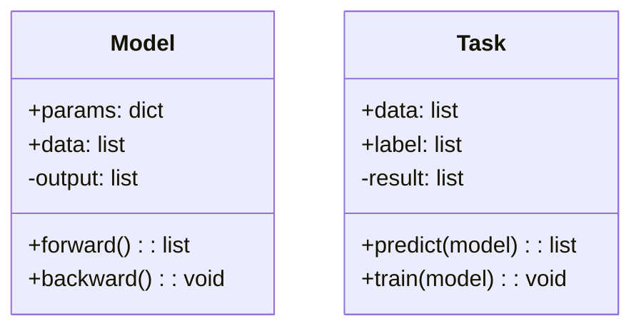
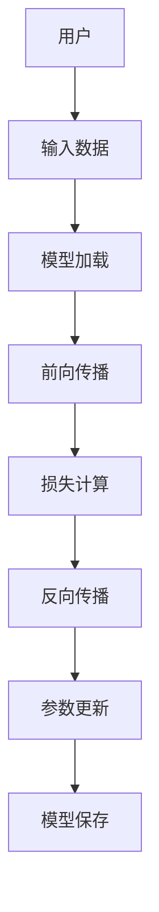
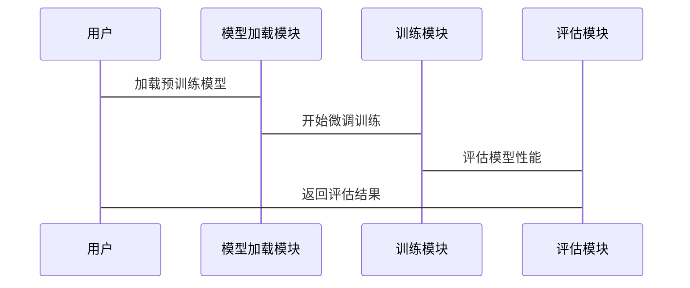

                 


# Fine-tuning技巧：如何让LLM更适应特定任务

## 关键词：Fine-tuning, LLM, Large Language Model, 自然语言处理, 模型优化, 机器学习

## 摘要：  
本文详细探讨了如何通过Fine-tuning技术让大型语言模型（LLM）更好地适应特定任务。文章从Fine-tuning的基本概念出发，深入分析了其核心原理、算法实现、系统设计以及实际应用案例。通过理论与实践相结合的方式，本文为读者提供了全面的指导，帮助他们在实际项目中有效应用Fine-tuning技巧，提升模型的性能和任务适应性。

---

# 第一部分: Fine-tuning技巧与LLM概述

## 第1章: Fine-tuning技巧与LLM概述

### 1.1 什么是Large Language Models (LLM)
#### 1.1.1 LLM的定义与特点  
大型语言模型（LLM）是一种基于深度学习的自然语言处理模型，通常采用Transformer架构，具有以下特点：  
1. **大规模训练数据**：LLM通常使用海量的文本数据进行预训练，具备广泛的知识覆盖能力。  
2. **上下文理解能力**：通过Transformer的自注意力机制，LLM能够理解文本的上下文关系。  
3. **多任务适应性**：LLM可以在多种任务（如文本生成、问答、翻译等）中表现出色。  
4. **参数量大**：典型的LLM模型（如GPT-3）通常包含 billions（十亿）级别的参数。  

#### 1.1.2 LLM的核心技术原理  
LLM的核心技术主要包括：  
1. **预训练**：通过大规模的无监督学习，模型学习语言的通用规律。  
2. **自注意力机制**：模型能够关注输入文本中的重要部分，从而更好地理解上下文。  
3. **生成式模型**：模型可以生成连贯且合理的文本输出。  

#### 1.1.3 LLM的应用场景与优势  
LLM广泛应用于以下场景：  
1. **文本生成**：自动生成文章、摘要、诗歌等。  
2. **问答系统**：回答用户的问题，提供准确的信息。  
3. **机器翻译**：将一种语言翻译成另一种语言。  
4. **对话系统**：构建智能对话机器人。  

**优势**：  
- **通用性**：LLM经过大规模预训练，适用于多种任务。  
- **高效性**：相比于传统模型，LLM的训练和推理效率更高。  
- **可扩展性**：LLM可以通过微调适应特定领域或任务。  

---

### 1.2 Fine-tuning的概念与背景  
#### 1.2.1 什么是Fine-tuning  
Fine-tuning是指在预训练好的LLM基础上，针对特定任务进行进一步的微调。通过在特定领域的数据上进行训练，模型能够更好地适应该任务的需求。  

#### 1.2.2 Fine-tuning的必要性  
尽管LLM在预训练阶段表现优异，但其性能在特定任务上可能不够理想。原因包括：  
1. **数据分布差异**：预训练数据与实际任务数据可能存在分布差异。  
2. **任务目标不同**：预训练目标（如语言模型）与特定任务目标（如文本分类）可能不一致。  
3. **领域专精需求**：特定领域（如医疗、法律）需要更高的专业性。  

#### 1.2.3 Fine-tuning与其他模型优化方法的区别  
Fine-tuning与从头训练（从零开始训练模型）的主要区别在于：  
- **训练数据**：Fine-tuning使用特定任务的数据，而从头训练使用通用数据。  
- **训练目标**：Fine-tuning的目标是优化特定任务的性能，而从头训练的目标是学习语言的通用规律。  

---

### 1.3 本章小结  
本章介绍了LLM的基本概念、技术原理及其应用场景，并强调了Fine-tuning的必要性。通过Fine-tuning，我们可以让预训练好的LLM更好地适应特定任务的需求。

---

# 第二部分: Fine-tuning的核心概念与原理  

## 第2章: Fine-tuning的核心概念  

### 2.1 问题背景与描述  
#### 2.1.1 LLM在特定任务中的局限性  
尽管LLM在通用任务上表现出色，但在特定任务上可能存在以下问题：  
- **领域专精不足**：模型可能对特定领域知识不够熟悉。  
- **任务适配性差**：模型的预训练目标与特定任务目标可能存在偏差。  
- **数据量不足**：特定任务的数据量可能不足以支持从零开始训练。  

#### 2.1.2 Fine-tuning的目标与实现路径  
**目标**：通过在特定任务数据上的微调，提升模型在该任务上的性能。  
**实现路径**：  
1. **选择合适的预训练模型**：选择与任务相关的预训练模型。  
2. **准备特定任务的数据**：收集和整理特定任务的训练数据。  
3. **定义任务目标函数**：根据任务需求定义损失函数。  
4. **微调模型**：在特定任务数据上进行训练，优化模型参数。  

#### 2.1.3 Fine-tuning的边界与外延  
- **边界**：Fine-tuning仅适用于任务目标与预训练目标相似的任务。  
- **外延**：Fine-tuning可以与其他技术（如领域适配、数据增强）结合使用。  

---

### 2.2 核心概念的结构与组成  
#### 2.2.1 数据、模型、任务的关系  
- **数据**：特定任务的数据是Fine-tuning的核心输入。  
- **模型**：预训练好的LLM是Fine-tuning的基础。  
- **任务**：Fine-tuning的目标是优化特定任务的性能。  

#### 2.2.2 Fine-tuning的流程与步骤  
1. **数据预处理**：清洗和标注特定任务的数据。  
2. **模型加载**：加载预训练好的LLM模型。  
3. **任务定义**：定义特定任务的目标函数和评估指标。  
4. **微调训练**：在特定任务数据上训练模型，优化参数。  
5. **模型评估**：在验证集或测试集上评估模型性能。  

#### 2.2.3 Fine-tuning的评价指标与方法  
- **评价指标**：准确率、召回率、F1分数、困惑度（Perplexity）等。  
- **评估方法**：交叉验证、对比实验、性能对比分析。  

---

### 2.3 核心概念的对比分析  
#### 2.3.1 不同Fine-tuning方法的对比表格  

| 方法                | 优缺点                                                                 | 适用场景           |
|---------------------|-----------------------------------------------------------------------|-------------------|
| 全参数微调（Full Fine-tuning） | - 优：性能提升显著；- 缺：计算资源消耗大，训练时间长 | 任务与预训练目标相似度高 |
| 仅微调任务相关层（Layer-wise Fine-tuning） | - 优：计算资源消耗低；- 缺：性能提升有限 | 任务与预训练目标相似度较低 |
| 仅微调嵌入层（Embedding Fine-tuning） | - 优：计算资源消耗极低；- 缺：性能提升有限 | 任务简单，数据量小 |

#### 2.3.2 实体关系图（ER图）展示  

```mermaid
erd
    客户
    + id: string
    + name: string
    ---------
    订单
    + id: string
    + customer_id: string
    + order_date: date
```

---

## 第3章: Fine-tuning的算法原理  

### 3.1 算法原理概述  
#### 3.1.1 Fine-tuning的基本流程  
1. **加载预训练模型**：加载已经经过大规模预训练的LLM模型。  
2. **定义任务目标函数**：根据特定任务定义损失函数。  
3. **微调训练**：在特定任务数据上训练模型，优化参数。  

#### 3.1.2 Fine-tuning的核心算法步骤  
- **输入处理**：将输入数据转换为模型可处理的格式。  
- **前向传播**：模型对输入数据进行前向计算，生成输出。  
- **损失计算**：根据任务目标计算损失值。  
- **反向传播**：计算损失函数的梯度，更新模型参数。  

#### 3.1.3 Fine-tuning的数学模型与公式  
**损失函数**：  
$$L = \frac{1}{N}\sum_{i=1}^{N} \text{loss}(x_i, y_i)$$  
其中，$x_i$是输入数据，$y_i$是目标输出，$N$是训练样本数。  

**优化目标**：  
$$\theta = \arg\min L$$  
其中，$\theta$是模型的参数。  

---

### 3.2 算法原理的详细讲解  
#### 3.2.1 Fine-tuning的数学模型  
**交叉熵损失函数**：  
$$\text{loss}(x_i, y_i) = -\sum_{j=1}^{C} y_{ij} \log p(y_j|x_i)$$  
其中，$C$是类别数，$y_{ij}$是目标标签，$p(y_j|x_i)$是模型预测的概率。  

#### 3.2.2 Fine-tuning的优化方法  
- **梯度下降**：使用随机梯度下降（SGD）或Adam优化器优化模型参数。  
- **学习率调整**：通过学习率衰减策略（如CosineAnnealing）优化训练过程。  

#### 3.2.3 Fine-tuning的实现步骤  
1. **加载预训练模型**：加载模型权重和配置文件。  
2. **定义任务目标函数**：根据任务需求定义损失函数和评估指标。  
3. **准备训练数据**：将数据格式化为模型可接受的输入格式。  
4. **微调训练**：在特定任务数据上进行训练，保存最优模型参数。  

---

### 3.3 算法原理的举例说明  
#### 3.3.1 示例1：文本分类任务中的Fine-tuning  
假设我们使用BERT模型进行文本分类任务，步骤如下：  
1. **加载预训练的BERT模型**。  
2. **定义分类任务的损失函数**：交叉熵损失函数。  
3. **准备训练数据**：将文本样本转换为BERT的输入格式。  
4. **微调训练**：在特定分类任务数据上训练模型，优化分类性能。  

#### 3.3.2 示例2：机器翻译任务中的Fine-tuning  
假设我们使用Transformer模型进行机器翻译任务，步骤如下：  
1. **加载预训练的Transformer模型**。  
2. **定义翻译任务的损失函数**：交叉熵损失函数。  
3. **准备训练数据**：将源语言和目标语言对齐。  
4. **微调训练**：在特定翻译任务数据上训练模型，优化翻译质量。  

---

### 3.4 本章小结  
本章详细讲解了Fine-tuning的算法原理，包括数学模型、优化方法和实现步骤。通过具体案例分析，读者可以更好地理解Fine-tuning的实现细节。

---

# 第三部分: Fine-tuning的系统分析与架构设计  

## 第4章: 系统分析与架构设计  

### 4.1 问题场景介绍  
#### 4.1.1 Fine-tuning的应用场景  
- **医疗领域**：对医疗领域的文本进行分类或生成。  
- **法律领域**：对法律文本进行分析或生成。  
- **教育领域**：对教育相关的文本进行自动问答。  

#### 4.1.2 Fine-tuning的系统目标  
- **任务适配性**：提升模型在特定任务上的性能。  
- **计算效率**：优化训练过程，减少计算资源消耗。  
- **模型可解释性**：提高模型的可解释性，便于分析和优化。  

#### 4.1.3 Fine-tuning的系统约束  
- **计算资源**：微调过程需要大量的计算资源。  
- **数据隐私**：特定任务数据可能涉及敏感信息。  
- **模型复杂性**：微调后的模型可能更加复杂，难以部署。  

---

### 4.2 系统功能设计  
#### 4.2.1 领域模型类图（Mermaid）  



#### 4.2.2 系统架构设计（Mermaid）  



#### 4.2.3 系统交互过程（Mermaid）  



---

## 第5章: Fine-tuning的系统实现与应用案例  

### 5.1 环境安装与配置  
#### 5.1.1 环境依赖  
- **Python 3.8+**  
- **TensorFlow/PyTorch库**  
- **Hugging Face Transformers库**  

#### 5.1.2 安装依赖  
```bash
pip install transformers torch
```

---

### 5.2 系统核心实现代码  
#### 5.2.1 加载预训练模型  
```python
from transformers import AutoTokenizer, AutoModelForMaskedLM
model = AutoModelForMaskedLM.from_pretrained('bert-base-uncased')
tokenizer = AutoTokenizer.from_pretrained('bert-base-uncased')
```

#### 5.2.2 定义任务目标函数  
```python
import torch
def compute_loss(outputs, labels):
    logits, _ = outputs
    loss_fct = torch.nn.CrossEntropyLoss()
    loss = loss_fct(logits.view(-1, logits.size(-1)), labels.view(-1))
    return loss
```

#### 5.2.3 准备训练数据  
```python
from transformers import DataCollatorWithPadding
data_collator = DataCollatorWithPadding(tokenizer=tokenizer, padding=True, max_length=128)
```

#### 5.2.4 微调训练  
```python
optimizer = torch.optim.AdamW(model.parameters(), lr=2e-5)
model.train()
for epoch in range(num_epochs):
    for batch in train_dataloader:
        inputs = data_collator(batch)
        outputs = model(**inputs)
        loss = compute_loss(outputs, inputs['labels'])
        loss.backward()
        optimizer.step()
        optimizer.zero_grad()
```

---

### 5.3 项目实战：Fine-tuning应用于文本分类任务  
#### 5.3.1 数据准备  
- **训练数据**：加载特定领域的文本分类数据集。  
- **验证数据**：预留部分数据用于模型评估。  

#### 5.3.2 模型训练  
- **训练轮数**：建议设置为3-5轮。  
- **学习率**：通常设置为2e-5到1e-5。  

#### 5.3.3 模型评估  
- **准确率**：计算模型在验证集上的准确率。  
- **F1分数**：评估模型的精确率和召回率。  

---

### 5.4 本章小结  
本章通过具体代码示例和实际案例分析，详细讲解了Fine-tuning的系统实现过程。通过环境配置、代码实现和案例分析，读者可以更好地掌握Fine-tuning的实践方法。

---

# 第四部分: Fine-tuning的最佳实践与注意事项  

## 第6章: Fine-tuning的最佳实践  

### 6.1 知识点回顾  
- **Fine-tuning的核心概念**：微调预训练模型以适应特定任务。  
- **Fine-tuning的关键步骤**：数据准备、任务定义、模型训练、性能评估。  

### 6.2 实践技巧与注意事项  
1. **数据质量**：确保训练数据的多样性和代表性。  
2. **任务适配性**：选择与任务相关的预训练模型。  
3. **计算资源**：合理配置计算资源，优化训练效率。  
4. **模型评估**：使用多种评价指标全面评估模型性能。  

---

### 6.3 小结与展望  
- **小结**：Fine-tuning是一种高效的任务适配方法，通过微调预训练模型，可以在特定任务上获得更好的性能。  
- **展望**：未来，随着模型规模的增大和任务需求的多样化，Fine-tuning技术将更加重要，并与其他技术（如知识蒸馏、领域适配）结合，推动LLM在更多领域的应用。  

---

## 第7章: 总结与展望  

### 7.1 总结  
本文详细探讨了如何通过Fine-tuning技术让大型语言模型更好地适应特定任务。通过理论分析和实践案例，我们了解了Fine-tuning的核心概念、算法原理和系统实现。  

### 7.2 展望  
随着自然语言处理技术的不断发展，Fine-tuning将在更多领域得到应用。未来的研究方向包括：  
1. **高效微调方法**：探索更高效的微调策略，减少计算资源消耗。  
2. **多任务微调**：研究如何在同一模型上同时优化多个任务的性能。  
3. **领域适配技术**：结合领域知识，提升模型在特定领域的表现。  

---

## 作者：AI天才研究院/AI Genius Institute & 禅与计算机程序设计艺术/Zen And The Art of Computer Programming  

---

**感谢您的阅读！**

