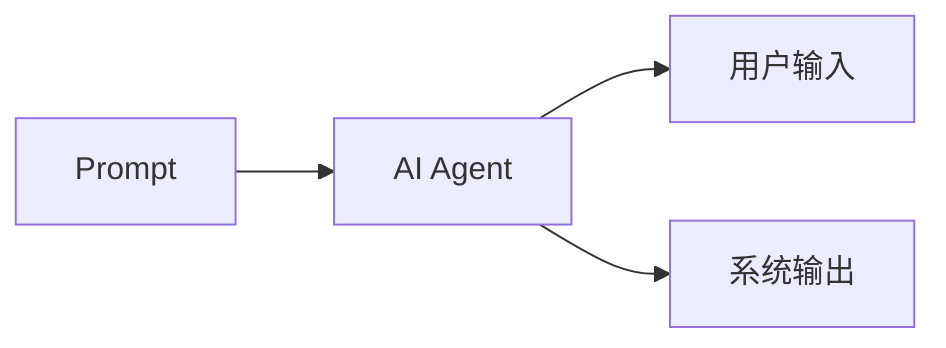
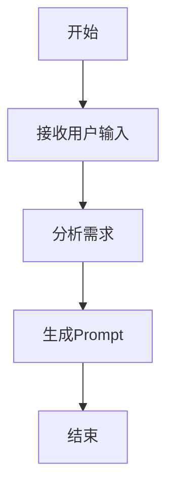
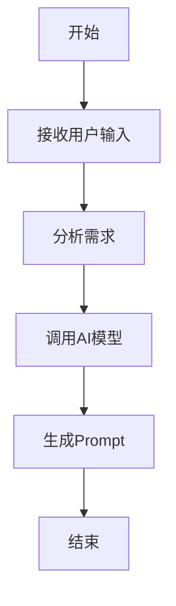
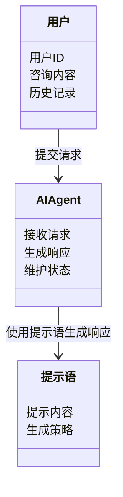
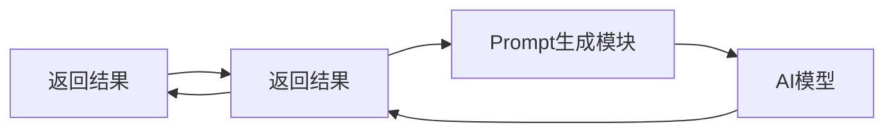
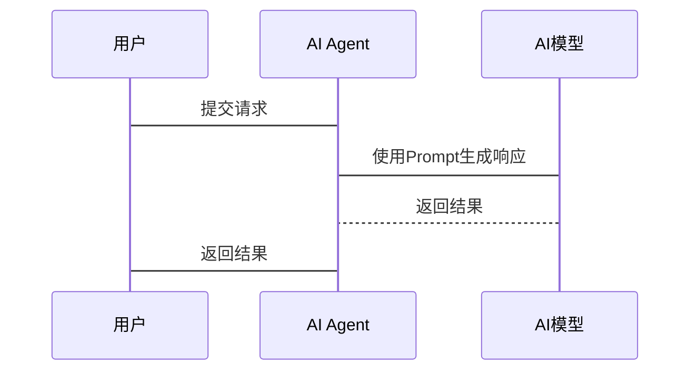

                 


# Prompt工程高级技巧：提升AI Agent性能

## 关键词：Prompt工程，AI Agent，性能优化，算法原理，系统架构，项目实战

## 摘要：本文将深入探讨Prompt工程在提升AI Agent性能中的关键作用，从核心概念、算法原理、系统架构到项目实战，逐步解析如何通过优化Prompt设计来提升AI Agent的智能水平和执行效率。文章结合理论与实践，提供详细的数学模型、算法流程图和系统架构图，帮助读者全面掌握Prompt工程高级技巧。

---

# 第一部分：Prompt工程与AI Agent概述

## 第1章：Prompt工程与AI Agent基础

### 1.1 Prompt工程的基本概念

#### 1.1.1 什么是Prompt工程
Prompt工程是一种通过设计和优化提示语（Prompt）来引导AI模型生成期望输出的技术。它是自然语言处理（NLP）领域的重要分支，广泛应用于聊天机器人、文本生成、对话系统等领域。

#### 1.1.2 Prompt工程的核心目标
Prompt工程的核心目标是通过优化提示语，使得AI模型能够更准确、更高效地生成符合用户需求的结果。这包括提升生成内容的相关性、准确性和创造力。

#### 1.1.3 AI Agent的定义与特点
AI Agent（人工智能代理）是一种能够感知环境、自主决策并执行任务的智能实体。它具有以下特点：
- **自主性**：能够在没有人工干预的情况下独立运作。
- **反应性**：能够实时感知环境并做出反应。
- **目标导向**：具有明确的目标，并通过行动实现目标。
- **学习能力**：能够通过经验改进性能。

### 1.2 问题背景与问题描述

#### 1.2.1 当前AI Agent面临的挑战
尽管AI Agent在许多领域表现出色，但仍面临以下挑战：
- **生成内容的质量不稳定**：AI模型生成的内容可能偏离用户需求。
- **上下文理解不足**：AI Agent难以准确理解复杂上下文。
- **多任务处理能力有限**：AI Agent在处理多任务时容易出现资源分配问题。

#### 1.2.2 Prompt工程在AI Agent中的作用
Prompt工程通过优化提示语，帮助AI Agent更好地理解用户需求，提升生成内容的质量和相关性。它是连接用户需求与AI模型的桥梁。

#### 1.2.3 问题解决的思路与方法
通过优化Prompt设计，可以引导AI模型更准确地生成所需内容，同时提高系统的反应速度和执行效率。

### 1.2.4 问题的边界与外延

#### 1.2.4.1 Prompt工程的边界
Prompt工程的边界包括：
- **输入范围**：用户输入的提示语。
- **输出范围**：AI模型生成的结果。
- **应用场景**：特定领域或任务。

#### 1.2.4.2 AI Agent的适用场景
AI Agent适用于以下场景：
- **客服支持**：处理客户咨询和问题。
- **智能助手**：帮助用户完成日常任务。
- **内容生成**：生成文章、报告等文本内容。

#### 1.2.4.3 Prompt工程的局限性
Prompt工程的局限性包括：
- **依赖模型能力**：Prompt工程的效果依赖于AI模型的能力。
- **复杂场景处理困难**：在复杂场景下，Prompt工程的效果可能不佳。

### 1.2.5 核心概念结构与要素

#### 1.2.5.1 Prompt工程的核心要素
Prompt工程的核心要素包括：
- **Prompt设计**：提示语的设计和优化。
- **AI模型选择**：选择适合任务的AI模型。
- **生成策略**：生成内容的策略和方法。

#### 1.2.5.2 AI Agent的组成结构
AI Agent的组成结构包括：
- **感知模块**：感知环境并提取信息。
- **决策模块**：根据感知信息做出决策。
- **执行模块**：执行决策并生成输出。

#### 1.2.5.3 核心概念之间的关系
Prompt工程与AI Agent的关系可以用以下ER实体关系图表示：



### 1.3 本章小结

---

## 第2章：Prompt工程的核心概念与联系

### 2.1 核心概念原理

#### 2.1.1 Prompt的生成机制
Prompt的生成机制包括：
- **基于规则的生成**：通过预定义规则生成提示语。
- **基于模型的生成**：通过AI模型生成提示语。

#### 2.1.2 AI Agent的执行流程
AI Agent的执行流程包括：
1. 接收用户输入。
2. 分析并生成Prompt。
3. 调用AI模型生成输出。
4. 返回结果给用户。

#### 2.1.3 Prompt与AI Agent的关系
Prompt是AI Agent与用户交互的桥梁，AI Agent通过Prompt理解用户需求并生成相应输出。

### 2.2 核心概念属性特征对比

#### 2.2.1 Prompt的属性分析
Prompt的属性包括：
- **相关性**：与用户需求的匹配程度。
- **简洁性**：提示语的简洁程度。
- **创造性**：生成内容的创新性。

#### 2.2.2 AI Agent的属性分析
AI Agent的属性包括：
- **智能性**：理解和处理复杂问题的能力。
- **响应性**：快速反应的能力。
- **适应性**：适应不同场景的能力。

#### 2.2.3 Prompt与AI Agent的属性对比
以下表格展示了Prompt与AI Agent属性的对比：

| 属性 | Prompt | AI Agent |
|------|--------|----------|
| 相关性 | 提示语与用户需求的匹配程度 | AI Agent生成内容的相关性 |
| 简洁性 | 提示语的简洁程度 | AI Agent的执行效率 |
| 创造性 | 提示语的创新性 | AI Agent的创新能力 |

### 2.3 ER实体关系图


### 2.4 本章小结

---

## 第3章：Prompt工程的算法原理

### 3.1 算法原理概述

#### 3.1.1 基于规则的Prompt生成算法
基于规则的Prompt生成算法是一种通过预定义规则生成提示语的方法。其步骤如下：

1. **接收用户输入**：获取用户的请求。
2. **分析需求**：解析用户需求，提取关键信息。
3. **生成Prompt**：根据规则生成提示语。

例如，用户输入“写一篇关于人工智能的文章”，系统会生成Prompt：“生成一篇关于人工智能的详细文章，重点讨论其在自然语言处理中的应用。”

#### 3.1.2 基于模型的Prompt生成算法
基于模型的Prompt生成算法是一种通过AI模型生成提示语的方法。其步骤如下：

1. **接收用户输入**：获取用户的请求。
2. **分析需求**：解析用户需求，提取关键信息。
3. **调用AI模型**：生成提示语。

例如，用户输入“写一篇关于人工智能的文章”，系统会调用GPT-3模型生成Prompt：“生成一篇关于人工智能的详细文章，重点讨论其在自然语言处理中的应用。”

#### 3.1.3 算法的优缺点分析
- **优点**：基于模型的生成算法能够生成更复杂的提示语，提升生成内容的质量。
- **缺点**：基于规则的生成算法在处理复杂场景时可能表现不佳。

### 3.2 算法流程图

#### 3.2.1 基于规则的生成算法流程图



#### 3.2.2 基于模型的生成算法流程图



### 3.3 本章小结

---

## 第4章：系统分析与架构设计

### 4.1 系统分析

#### 4.1.1 问题场景介绍
我们以一个智能客服系统为例，分析系统的功能需求。智能客服系统需要通过Prompt工程优化对话生成，提高用户体验。

#### 4.1.2 项目介绍
本项目旨在通过优化Prompt设计，提升AI Agent在智能客服系统中的性能。

### 4.2 系统功能设计

#### 4.2.1 领域模型
以下是一个智能客服系统的领域模型：



#### 4.2.2 系统架构设计
以下是系统的架构设计：



### 4.3 系统接口设计

#### 4.3.1 系统接口
系统接口包括：
- **用户接口**：用户提交请求。
- **API接口**：与AI模型交互。

#### 4.3.2 接口设计
以下是接口设计：



### 4.4 本章小结

---

## 第5章：项目实战

### 5.1 环境安装

#### 5.1.1 安装Python
安装Python 3.x版本，确保环境兼容。

#### 5.1.2 安装必要的库
安装以下库：
- `transformers`：用于与AI模型交互。
- `mermaid`：用于生成图表。

### 5.2 系统核心实现源代码

#### 5.2.1 Prompt生成模块
以下是一个简单的Prompt生成模块：

```python
from transformers import pipeline

def generate_prompt(user_input):
    # 分析用户需求
    # 生成Prompt
    prompt = f"生成一篇关于{user_input}的文章"
    return prompt
```

#### 5.2.2 AI模型调用模块
以下是一个AI模型调用模块：

```python
def call_ai_model(prompt):
    # 调用AI模型
    # 返回生成内容
    return generated_content
```

### 5.3 代码应用解读与分析

#### 5.3.1 代码解读
- `generate_prompt`函数接收用户输入，生成提示语。
- `call_ai_model`函数调用AI模型，生成内容。

#### 5.3.2 代码分析
- 代码结构清晰，易于扩展。
- 可以通过替换不同的AI模型实现不同的功能。

### 5.4 实际案例分析与详细讲解剖析

#### 5.4.1 案例介绍
以智能客服系统为例，分析Prompt工程在实际中的应用。

#### 5.4.2 案例分析
通过优化Prompt设计，提升AI Agent的生成质量。

### 5.5 项目小结

---

## 第6章：高级技巧与优化策略

### 6.1 高级技巧

#### 6.1.1 Prompt优化方法
- **精炼语言**：使用简洁的语言描述需求。
- **上下文优化**：在Prompt中加入上下文信息，提升生成内容的相关性。
- **多模态提示**：结合图像、音频等多种模态信息，提升生成效果。

#### 6.1.2 上下文窗口优化
在生成长文本时，可以通过优化上下文窗口，提升生成内容的质量。

#### 6.1.3 多模态Prompt设计
结合多种模态信息，设计更复杂的Prompt，提升生成效果。

### 6.2 优化策略

#### 6.2.1 持续优化
定期分析生成内容，优化Prompt设计。

#### 6.2.2 监控与反馈
通过监控系统性能，及时调整优化策略。

### 6.3 本章小结

---

## 第7章：总结与展望

### 7.1 总结

#### 7.1.1 核心内容回顾
- Prompt工程的基本概念。
- AI Agent的组成与功能。
- 算法原理与系统架构设计。
- 项目实战与高级技巧。

#### 7.1.2 最佳实践tips
- 在设计Prompt时，要充分考虑用户需求。
- 定期优化系统，提升性能。
- 关注AI模型的最新进展，及时更新系统。

### 7.2 小结

#### 7.2.1 本章总结
通过本章的学习，读者能够全面掌握Prompt工程高级技巧，提升AI Agent的性能。

### 7.3 注意事项

#### 7.3.1 使用中的注意事项
- Prompt设计要简洁明了。
- 系统优化要持续进行。
- 要关注AI模型的性能。

### 7.4 拓展阅读

#### 7.4.1 推荐书籍
- 《Deep Learning》
- 《Effective Python》

#### 7.4.2 推荐博客与资源
- Hugging Face Transformers库文档。
- OpenAI官方文档。

### 7.5 作者简介

#### 7.5.1 作者信息
作者：AI天才研究院/AI Genius Institute & 禅与计算机程序设计艺术/Zen And The Art of Computer Programming

---

## 附录：完整代码示例

#### 附录A：Prompt生成模块

```python
from transformers import pipeline

def generate_prompt(user_input):
    # 分析用户需求
    # 生成Prompt
    prompt = f"生成一篇关于{user_input}的文章"
    return prompt
```

#### 附录B：AI模型调用模块

```python
def call_ai_model(prompt):
    # 调用AI模型
    # 返回生成内容
    return generated_content
```

---

## 结语

通过本篇文章的学习，读者可以系统地掌握Prompt工程高级技巧，提升AI Agent的性能。从理论到实践，从基础到高级，全面了解Prompt工程的核心概念与应用方法。希望本文能为读者在Prompt工程领域提供有价值的参考与指导。

--- 

**作者：AI天才研究院/AI Genius Institute & 禅与计算机程序设计艺术/Zen And The Art of Computer Programming**

