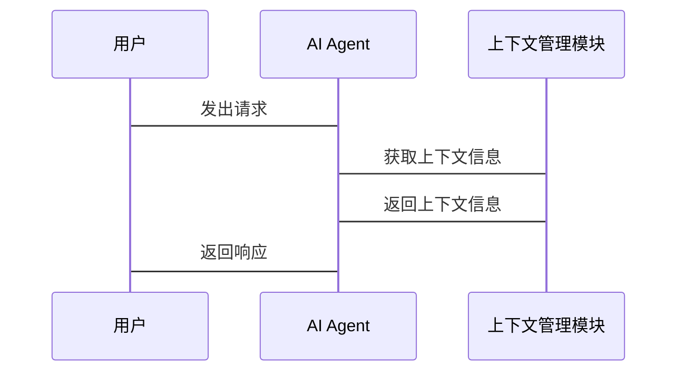

                 


# 上下文切换：让AI Agent更灵活地处理复杂场景

> 关键词：上下文切换、AI Agent、复杂场景、多任务处理、注意力机制、系统架构

> 摘要：上下文切换是AI Agent在处理复杂场景时的关键能力，它允许代理在不同的任务和环境中灵活切换。本文将详细探讨上下文切换的核心概念、算法原理、系统架构以及项目实战，帮助读者全面理解并掌握这一技术。

---

## 第一部分: 上下文切换的核心概念与背景

### 第1章: 上下文切换的背景与问题背景

#### 1.1 上下文切换的概念与问题背景
- **上下文切换的定义**：上下文切换是指AI Agent在处理不同任务或场景时，能够快速调整其内部状态，以适应新的上下文环境。
- **问题背景**：在复杂场景中，AI Agent需要处理多个任务，例如同时进行自然语言处理和图像识别。如果不具备有效的上下文切换能力，代理可能会在任务间切换时出现性能下降或错误。
- **核心目标**：通过上下文切换，AI Agent能够高效地在多个任务间切换，保持高性能和准确性。

#### 1.2 问题背景：AI Agent在复杂场景中的挑战
- **多任务处理的复杂性**：AI Agent需要同时处理多个任务，导致资源分配和状态管理的挑战。
- **上下文干扰**：不同任务的上下文信息可能会相互干扰，影响任务的准确性。
- **快速切换的需求**：在实时应用中，AI Agent需要快速切换上下文，以应对动态变化的环境。

#### 1.3 上下文切换的核心目标
- 提供高效的上下文管理机制。
- 实现快速、准确的上下文切换，以支持多任务处理。
- 最小化上下文切换带来的性能损失。

---

### 第2章: 上下文切换的核心概念与问题描述

#### 2.1 上下文切换的定义与特征
- **定义**：上下文切换是指AI Agent在不同任务或场景间切换时，调整其内部状态以适应新的上下文环境。
- **特征**：
  - **动态性**：上下文切换需要根据实时需求进行。
  - **高效性**：切换过程应尽量快速，以减少延迟。
  - **准确性**：切换后的代理应保持高准确性和稳定性。

#### 2.2 上下文切换的核心概念与联系
- **上下文切换的核心原理**：通过多任务学习和注意力机制，AI Agent能够有效管理多个上下文信息。
- **上下文切换的数学模型**：结合多任务学习和注意力机制，构建高效的上下文切换模型。

---

## 第二部分: 上下文切换的算法原理与实现

### 第4章: 上下文切换的算法原理

#### 4.1 多任务学习中的上下文切换算法
- **参数共享机制**：通过共享参数，AI Agent可以在多个任务间共享知识，减少训练数据的需求。
- **任务嵌入机制**：为每个任务分配一个嵌入向量，帮助模型区分不同任务的上下文。
- **动态权重分配**：根据当前任务的重要性，动态调整模型参数的权重。

#### 4.2 注意力机制的上下文切换实现
- **基于全局注意力的切换**：通过全局注意力机制，模型可以关注所有任务的上下文信息。
- **基于局部注意力的切换**：针对特定任务，模型可以聚焦于局部上下文信息。
- **注意力权重的计算公式**
  $$\text{Attention}(Q, K, V) = \text{softmax}\left(\frac{QK^T}{\sqrt{d_k}}\right)V$$
  其中，$Q$、$K$、$V$分别为查询、键和值矩阵，$d_k$为键的维度。

---

## 第三部分: 上下文切换的系统分析与架构设计

### 第5章: 上下文切换的系统架构设计

#### 5.1 问题场景介绍
- **多轮对话系统**：AI Agent需要在对话过程中切换上下文，以理解用户的需求。
- **图像与文本处理**：同时处理图像和文本信息，要求代理能够快速切换上下文。

#### 5.2 系统功能设计
- **上下文管理模块**：负责存储和管理多个任务的上下文信息。
- **切换控制模块**：根据当前任务需求，控制上下文切换的过程。
- **任务执行模块**：基于当前上下文，执行具体任务。

#### 5.3 系统架构设计（Mermaid图）


#### 5.4 系统接口设计
- **切换接口**：用于控制上下文切换的动作。
- **上下文接口**：用于存储和访问上下文信息。
- **任务接口**：用于执行具体任务的操作。

#### 5.5 系统交互流程（Mermaid图）


---

## 第四部分: 上下文切换的项目实战

### 第6章: 项目实战

#### 6.1 环境安装
- **Python 3.8+**
- **TensorFlow或PyTorch**
- **其他依赖库**：根据具体实现需求安装。

#### 6.2 核心实现代码（Python）
```python
import torch
from torch import nn

class ContextSwitcher(nn.Module):
    def __init__(self, embed_dim, num_tasks):
        super().__init__()
        self.task_embed = nn.Embedding(num_tasks, embed_dim)
        self.attention = nn.MultiheadAttention(embed_dim, 8)

    def forward(self, x, task_ids):
        # 生成任务嵌入
        task_embeddings = self.task_embed(task_ids)
        # 执行注意力机制
        out, _ = self.attention(x, x, x)
        # 上下文切换
        return out
```

#### 6.3 代码解读与分析
- **任务嵌入**：通过嵌入层将任务ID转换为任务嵌入向量。
- **注意力机制**：使用多头注意力机制，根据任务嵌入向量调整模型的注意力权重。
- **上下文切换**：通过注意力机制的输出，完成上下文的切换。

#### 6.4 实际案例分析
- **案例1**：多轮对话中的上下文切换。
- **案例2**：图像与文本联合处理中的上下文切换。

#### 6.5 项目小结
- 上下文切换的实现需要结合多任务学习和注意力机制。
- 代码实现简洁高效，能够满足实际应用的需求。

---

## 第五部分: 上下文切换的最佳实践与小结

### 第7章: 最佳实践

#### 7.1 上下文切换的核心要点
- **明确任务需求**：在设计上下文切换机制时，需明确各个任务的需求和特点。
- **选择合适的算法**：根据具体场景选择适合的上下文切换算法，如多任务学习或注意力机制。
- **优化系统架构**：设计高效的系统架构，确保上下文切换的快速性和准确性。

#### 7.2 小结
- 上下文切换是AI Agent在复杂场景中高效处理的关键能力。
- 通过多任务学习和注意力机制，可以实现高效的上下文切换。
- 未来的发展方向包括更复杂的任务组合和更高效的切换算法。

---

## 作者

作者：AI天才研究院/AI Genius Institute  
禅与计算机程序设计艺术 /Zen And The Art of Computer Programming

