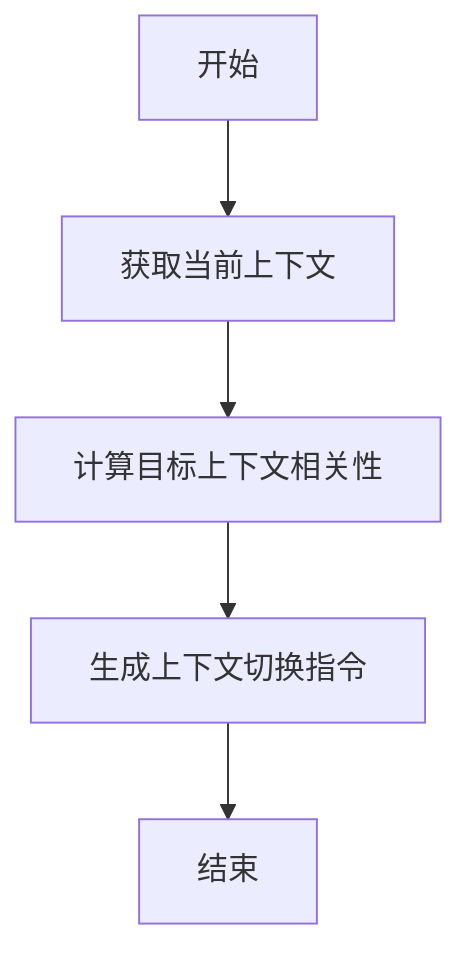
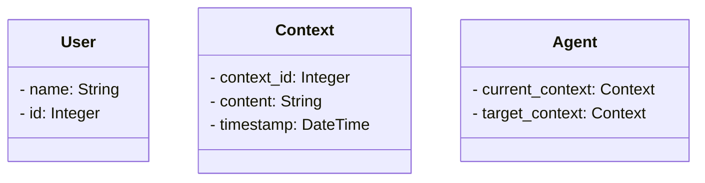
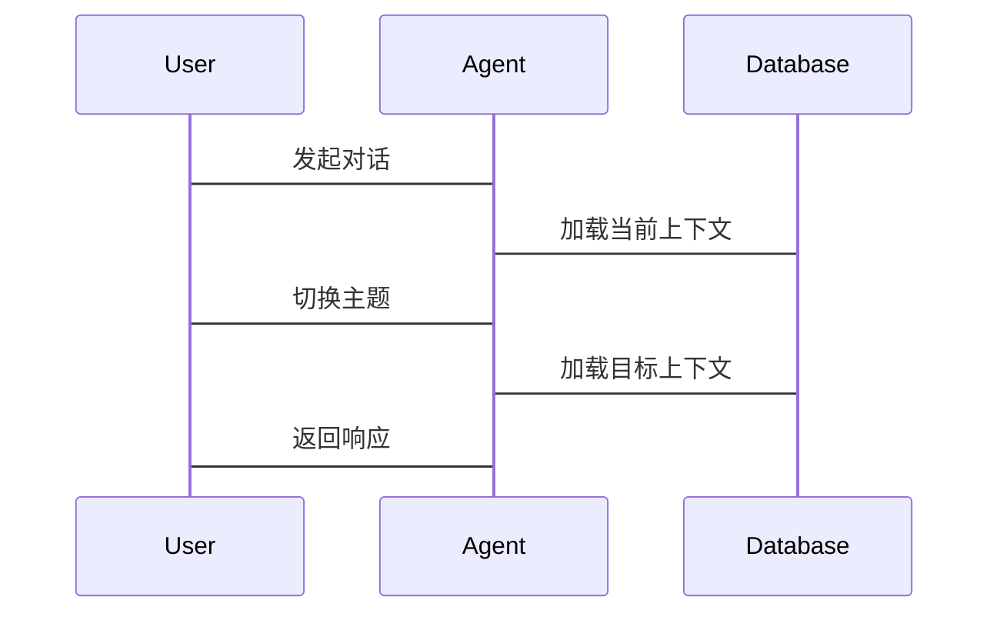

                 


# 上下文切换：让AI Agent灵活应对多主题对话

## 关键词：上下文切换, AI Agent, 多主题对话, 注意力机制, 系统架构, 项目实战

## 摘要：上下文切换是实现AI Agent在多主题对话中灵活应对的关键技术。本文从背景介绍、核心概念、算法原理、系统架构、项目实战到总结，全面探讨上下文切换的实现方法和应用，帮助读者掌握如何设计和实现高效的上下文切换机制，提升AI Agent的对话能力。

---

# 第1章 上下文切换的背景与概念

## 1.1 上下文切换的定义

### 1.1.1 上下文的定义
上下文（Context）指的是在特定场景下，与当前任务相关的背景信息、用户意图、对话历史等。它是理解对话内容的重要基础。

### 1.1.2 上下文切换的定义
上下文切换（Context Switching）是指在多主题对话中，AI Agent根据需要切换当前处理的上下文，以适应对话主题的变化。

### 1.1.3 上下文切换的重要性
上下文切换使得AI Agent能够灵活应对不同主题的对话，提高对话系统的实用性和用户体验。

## 1.2 上下文切换的问题背景

### 1.2.1 多主题对话的挑战
在多主题对话中，AI Agent需要快速切换上下文，以保持对话的连贯性和准确性。

### 1.2.2 AI Agent在多主题对话中的局限性
传统AI Agent通常只能处理单一主题的对话，难以应对多主题切换的复杂场景。

### 1.2.3 上下文切换的需求与应用场景
上下文切换技术能够帮助AI Agent在客服、智能助手、聊天机器人等领域更好地应对多主题对话。

## 1.3 上下文切换的技术演进

### 1.3.1 传统对话系统中的上下文管理
传统对话系统通常依赖基于规则的上下文管理方法，难以适应复杂场景。

### 1.3.2 基于规则的上下文切换方法
通过预定义规则来切换上下文，但灵活性和可扩展性有限。

### 1.3.3 基于深度学习的上下文切换技术
利用深度学习模型，通过注意力机制等方法实现上下文切换，提高系统的智能化水平。

## 1.4 本章小结
本章介绍了上下文切换的定义、重要性及技术演进，为后续内容打下基础。

---

# 第2章 上下文切换的核心概念与联系

## 2.1 上下文切换的原理

### 2.1.1 上下文的表示与存储
上下文通常以结构化数据形式表示，存储在数据库或内存中。

### 2.1.2 上下文切换的触发条件
根据用户输入、对话状态或系统判断触发上下文切换。

### 2.1.3 上下文切换的实现机制
通过加载或清除特定上下文数据，实现上下文的切换。

## 2.2 上下文切换的关键属性

### 2.2.1 上下文的相关性
上下文与当前对话主题的相关性影响切换的准确性和效率。

### 2.2.2 上下文的持久性
上下文的持久性决定了其在对话中的存续时间。

### 2.2.3 上下文的可扩展性
系统应支持新增或修改上下文，以适应不同场景的需求。

## 2.3 上下文切换与其他相关概念的对比

### 2.3.1 上下文切换与任务切换
| 概念          | 上下文切换         | 任务切换         |
|---------------|--------------------|------------------|
| 定义          | 切换对话上下文     | 切换任务执行     |
| 目的          | 支持多主题对话     | 提高任务效率     |
| 实现方式       | 加载上下文数据     | 调度任务执行     |

### 2.3.2 上下文切换与对话管理
| 概念          | 上下文切换         | 对话管理         |
|---------------|--------------------|------------------|
| 定义          | 切换对话上下文     | 管理对话流程     |
| 关键技术       | 注意力机制         | 状态机模型       |
| 应用场景       | 多主题对话         | 全局对话管理     |

### 2.3.3 上下文切换与知识图谱的关系
上下文切换依赖于知识图谱提供相关上下文信息，知识图谱为上下文切换提供数据支持。

## 2.4 上下文切换的ER实体关系图
```mermaid
er
actor: 用户
actor --> provides: 提供上下文
provides --> context: 上下文
context --> agent: 传递给AI Agent
agent --> response: 生成响应
```

## 2.5 本章小结
本章详细分析了上下文切换的核心概念、关键属性及与其他概念的联系，为后续实现奠定了基础。

---

# 第3章 上下文切换的算法原理

## 3.1 基于注意力机制的上下文切换算法

### 3.1.1 注意力机制的基本原理
注意力机制通过计算查询（Query）与键（Key）之间的相似性，确定查询应关注哪些键值对（Value）。

### 3.1.2 上下文切换的注意力模型
上下文切换通过注意力机制确定当前上下文与目标上下文的相关性。

### 3.1.3 算法的实现步骤

#### 步骤1：获取当前上下文
$$ \text{current\_context} = C \times W_c $$
其中，C是上下文嵌入，W_c是上下文权重矩阵。

#### 步骤2：计算目标上下文的相关性
$$ \text{similarity} = \text{softmax}(Q \times K^T / \sqrt{d_k}) $$
其中，Q是查询向量，K是目标上下文的键向量。

#### 步骤3：生成上下文切换指令
$$ \text{switch\_context} = \text{argmax}(similarity) $$

### 3.1.4 算法的流程图


### 3.1.5 Python代码实现
```python
import torch

def attention_query(current_context, target_context, dim):
    # 计算相似性
    similarity = torch.mm(current_context, target_context.transpose(1, 0))
    similarity = torch.softmax(similarity, dim=dim)
    # 生成切换指令
    switch_instruction = torch.argmax(similarity, dim=1)
    return switch_instruction

# 示例
current_context = torch.randn(3, 5)  # 当前上下文嵌入
target_context = torch.randn(5, 4)   # 目标上下文嵌入
switch_instruction = attention_query(current_context, target_context, dim=1)
print(switch_instruction)
```

## 3.2 算法的数学模型与公式

### 3.2.1 注意力机制的数学公式
$$ \text{Attention}(Q, K, V) = \text{softmax}\left(\frac{QK^T}{\sqrt{d_k}}\right)V $$

### 3.2.2 上下文切换的概率分布
$$ P(\text{switch} | Q, K) = \text{softmax}(QK^T) $$

## 3.3 本章小结
本章详细讲解了基于注意力机制的上下文切换算法，包括算法原理、实现步骤和Python代码示例。

---

# 第4章 系统分析与架构设计

## 4.1 问题场景介绍

### 4.1.1 多主题对话场景
用户与AI Agent进行多轮对话，主题从天气切换到旅行计划。

### 4.1.2 上下文切换的需求
在对话过程中，AI Agent需要根据主题变化切换上下文。

## 4.2 系统功能设计

### 4.2.1 领域模型设计


### 4.2.2 系统架构设计
```mermaid
rectangle Database {
    Context Table
}
actor User
agent AI Agent
Database --> Agent: 提供上下文数据
Agent --> Database: 存储上下文数据
User --> Agent: 发起对话请求
Agent --> User: 返回对话响应
```

### 4.2.3 系统交互流程


## 4.3 系统接口设计

### 4.3.1 上下文切换接口
```python
def switch_context(target_context_id):
    # 加载目标上下文
    context = get_context(target_context_id)
    # 更新当前上下文
    set_current_context(context)
```

## 4.4 本章小结
本章分析了系统架构和交互流程，展示了如何在实际系统中实现上下文切换。

---

# 第5章 项目实战

## 5.1 环境安装

### 5.1.1 安装Python和相关库
```bash
pip install torch matplotlib
```

### 5.1.2 安装深度学习框架
```bash
pip install tensorflow
```

## 5.2 核心功能实现

### 5.2.1 上下文切换实现
```python
def switch_context(context):
    global current_context
    current_context = context
```

### 5.2.2 对话生成实现
```python
def generate_response(context):
    # 根据上下文生成响应
    return f"根据上下文{context}，我的响应是..."
```

## 5.3 代码应用解读与分析

### 5.3.1 环境配置
```python
import torch
import torch.nn as nn

# 初始化模型参数
embed_dim = 5
```

### 5.3.2 上下文切换的实现细节
```python
def attention_query(current_context, target_context, dim):
    similarity = torch.mm(current_context, target_context.transpose(1, 0))
    similarity = torch.softmax(similarity, dim=dim)
    switch_instruction = torch.argmax(similarity, dim=1)
    return switch_instruction
```

## 5.4 实际案例分析

### 5.4.1 案例背景
用户先讨论天气，再讨论旅行计划。

### 5.4.2 对话实现
```python
# 初始上下文：天气
current_context = torch.randn(1, embed_dim)
# 切换到旅行计划上下文
target_context = torch.randn(1, embed_dim)
switch_instruction = attention_query(current_context, target_context, dim=1)
print(switch_instruction)
```

## 5.5 本章小结
本章通过实际项目展示了如何实现上下文切换功能，并进行了代码解读和案例分析。

---

# 第6章 总结与展望

## 6.1 本章总结
上下文切换技术是实现AI Agent多主题对话能力的关键，通过注意力机制和系统架构设计，能够有效提升对话系统的灵活性和智能化水平。

## 6.2 当前挑战与未来趋势

### 6.2.1 当前挑战
- 多上下文的高效管理
- 上下文切换的实时性
- 复杂场景下的准确性

### 6.2.2 未来趋势
- 基于强化学习的上下文切换
- 多模态上下文切换技术
- 自适应上下文管理

## 6.3 最佳实践Tips

### 6.3.1 系统设计
- 确保上下文切换的高效性
- 支持多上下文的并行处理

### 6.3.2 实现技巧
- 使用注意力机制提升相关性计算
- 优化模型参数以提高切换准确率

## 6.4 本章小结
本章总结了上下文切换技术的应用，并展望了未来的发展方向，同时给出了实际应用中的注意事项和最佳实践建议。

---

# 作者

作者：AI天才研究院/AI Genius Institute  
& 禅与计算机程序设计艺术 /Zen And The Art of Computer Programming

