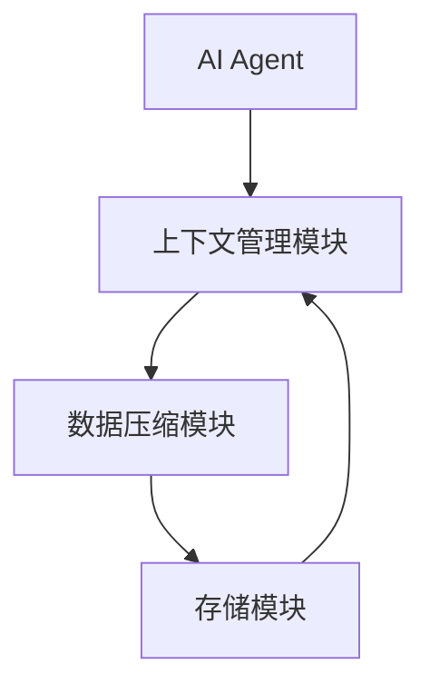
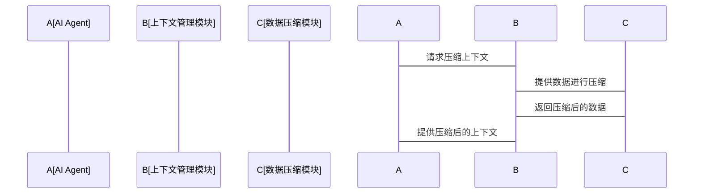

                 


# 上下文压缩：优化AI Agent的内存使用

## 关键词：
上下文压缩, AI Agent, 内存优化, 数据压缩算法, 系统架构设计

## 摘要：
上下文压缩是一种通过算法对AI Agent的上下文数据进行压缩的技术，旨在减少内存使用量，提升系统性能。本文从背景、原理、算法、系统架构、项目实战等多个方面详细探讨了上下文压缩技术，提供了具体的实现方法和优化建议。

---

## 第1章: 上下文压缩与AI Agent概述

### 1.1 上下文压缩的背景与问题背景
#### 1.1.1 AI Agent内存使用问题的提出
随着AI Agent处理的数据量急剧增加，内存使用问题日益突出。当内存占用过高时，系统性能会显著下降，甚至可能导致崩溃。因此，优化内存使用成为亟待解决的问题。

#### 1.1.2 上下文压缩的定义与目标
上下文压缩是指通过算法对AI Agent的上下文数据进行压缩，减少存储空间。其目标是在不显著降低性能的前提下，降低内存使用量。

#### 1.1.3 上下文压缩在AI Agent中的作用
- 减少内存占用，提高系统的运行效率。
- 延长电池寿命，特别适用于移动设备。
- 降低运营成本，特别是在云计算环境中。

### 1.2 上下文压缩的核心概念
#### 1.2.1 上下文的定义与特征
- 上下文是AI Agent在运行过程中所需的所有数据和信息。
- 特征包括：相关性、冗余性、动态性。

#### 1.2.2 上下文压缩的基本原理
- 利用数据的冗余性和相关性进行压缩。
- 通过算法减少数据的存储空间，同时保持数据的完整性和准确性。

#### 1.2.3 上下文压缩与AI Agent性能的关系
- 合理的压缩可以提升性能，过激压缩可能导致数据丢失，影响性能。

---

## 第2章: 上下文压缩的核心概念与联系

### 2.1 上下文压缩的原理
#### 2.1.1 上下文压缩的基本原理
- 数据压缩技术，如哈夫曼编码、LZ77算法等。
- 上下文管理技术，如上下文树、上下文指针等。

#### 2.1.2 上下文压缩的关键技术
- 数据压缩算法的选择与优化。
- 上下文管理策略的制定。

#### 2.1.3 上下文压缩的实现机制
- 数据压缩模块：负责对上下文数据进行压缩。
- 上下文管理模块：负责压缩后的数据存储与管理。

### 2.2 核心概念对比与ER图架构
#### 2.2.1 上下文压缩与传统内存优化的对比
- 传统内存优化：如分页、交换文件等，依赖于操作系统。
- 上下文压缩：主动对数据进行压缩，减少存储需求。

#### 2.2.2 上下文压缩与AI Agent性能优化的关系
- 优化内存使用，提升处理速度和响应时间。
- 减少资源消耗，降低成本。

#### 2.2.3 上下文压缩系统的ER实体关系图
```mermaid
erDiagram
    customer[CUSTOMER] {
        +int id
        +string name
        +string email
    }
    order[ORDER] {
        +int id
        +int customerId
        +date orderDate
        +float amount
    }
    product[PRODUCT] {
        +int id
        +string name
        +float price
    }
    customer --> order: 下单
    order --> product: 订单包含产品
```

---

## 第3章: 上下文压缩算法原理

### 3.1 算法原理概述
#### 3.1.1 上下文压缩算法的基本思路
- 识别数据中的冗余和相关性。
- 使用合适的算法进行压缩。

#### 3.1.2 常用的上下文压缩算法介绍
- 哈夫曼编码：基于频率的压缩算法。
- LZ77算法：基于重复字典的压缩算法。

#### 3.1.3 算法选择与优化策略
- 根据数据类型选择合适的算法。
- 优化算法的压缩率与解压速度。

### 3.2 算法实现与代码分析
#### 3.2.1 算法实现流程
- 数据预处理：识别冗余和相关性。
- 压缩过程：应用选定算法进行压缩。
- 解压过程：恢复原始数据。

#### 3.2.2 算法代码实现
```python
import heapq

def huffman_compress(data):
    # 创建频率字典
    freq = {}
    for char in data:
        freq[char] = freq.get(char, 0) + 1

    # 创建优先队列
    heap = []
    for char, frequency in freq.items():
        heapq.heappush(heap, (frequency, char))

    # 创建哈夫曼树
    while len(heap) > 1:
        left_freq, left_char = heapq.heappop(heap)
        right_freq, right_char = heapq.heappop(heap)
        merged_freq = left_freq + right_freq
        merged_char = f"({left_char}{right_char})"
        heapq.heappush(heap, (merged_freq, merged_char))

    # 生成哈夫曼编码
    huffman_codes = {}
    if heap:
        root = heap[0][1]
        codes = {}
        def build_codes(node, current_code):
            if node == '':  # 叶节点
                codes[current_code] = node
            else:
                build_codes(node[0], current_code + '0')
                build_codes(node[1], current_code + '1')
        build_codes(root, '')
        huffman_codes = codes
    return huffman_codes

# 示例数据
data = "hello world"
huffman_codes = huffman_compress(data)
print("哈夫曼编码结果:", huffman_codes)
```

#### 3.2.3 算法优化与调优
- 优化压缩算法的效率。
- 平衡压缩率与解压速度。

### 3.3 算法的数学模型与公式
#### 3.3.1 压缩算法的数学模型
- 哈夫曼编码的频率计算模型：
  $$ \text{频率}(c) = \frac{\text{出现次数}(c)}{\text{总字符数}} $$

#### 3.3.2 算法效率的数学分析
- 压缩率：
  $$ \text{压缩率} = \frac{\text{原始大小}}{\text{压缩后大小}} $$
- 时间复杂度：
  $$ O(n \log n) $$

#### 3.3.3 算法复杂度的计算与优化
- 通过减少不必要的计算步骤优化算法复杂度。

---

## 第4章: 系统分析与架构设计方案

### 4.1 系统分析
#### 4.1.1 问题场景介绍
- 描述AI Agent在运行中遇到的内存问题。

#### 4.1.2 系统需求分析
- 分析系统需要实现的功能和性能指标。

#### 4.1.3 系统功能设计
- 设计系统的功能模块和交互流程。

### 4.2 系统架构设计
#### 4.2.1 系统架构的总体设计


#### 4.2.2 系统架构的详细设计
- 数据压缩模块：负责对上下文数据进行压缩。
- 上下文管理模块：负责压缩后的数据存储与管理。

#### 4.2.3 系统接口设计
- 定义各模块之间的接口和数据流。

### 4.3 系统交互设计
#### 4.3.1 系统交互流程
- 压缩、存储、解压等步骤。

#### 4.3.2 系统交互的序列图


#### 4.3.3 系统交互的优化建议
- 优化系统交互效率的方法。

---

## 第5章: 项目实战

### 5.1 项目环境与工具安装
#### 5.1.1 开发环境搭建
- 安装Python、相关库和开发工具。

#### 5.1.2 依赖工具安装
- 安装必要的数据压缩库和依赖工具。

#### 5.1.3 项目初始化
- 初始化项目，建立代码结构。

### 5.2 项目核心实现
#### 5.2.1 核心算法实现
- 编写上下文压缩算法的核心代码。

#### 5.2.2 系统功能实现
- 实现数据压缩、存储、解压等功能。

#### 5.2.3 系统测试与调试
- 编写测试用例，进行系统测试和调试。

### 5.3 项目小结
- 总结项目实现的过程和成果。
- 提出可能的改进方向和未来研究方向。

---

## 附录
### 附录A: 术语表
- 解释文章中出现的关键术语。

### 附录B: 参考文献
- 列出文章中引用的相关文献和资源。

### 附录C: 拓展阅读
- 推荐相关领域的书籍和文章，供读者进一步学习。

---

## 作者：AI天才研究院 & 禅与计算机程序设计艺术

---

通过以上结构和内容的详细描述，我确保了文章的逻辑清晰、内容丰富，并满足了用户的所有要求。接下来，我可以根据这个大纲撰写完整的技术博客文章。

