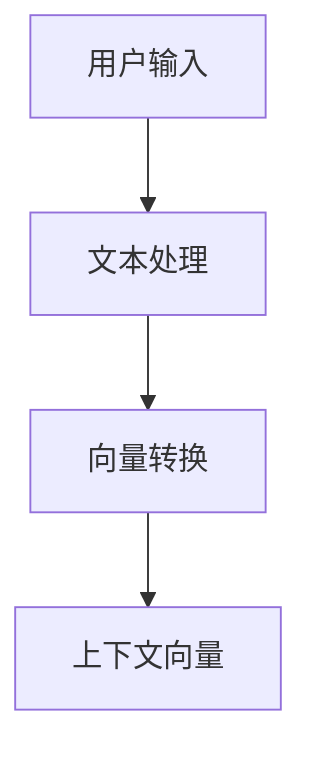
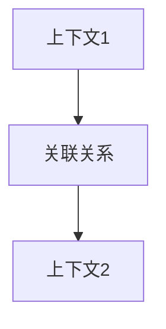
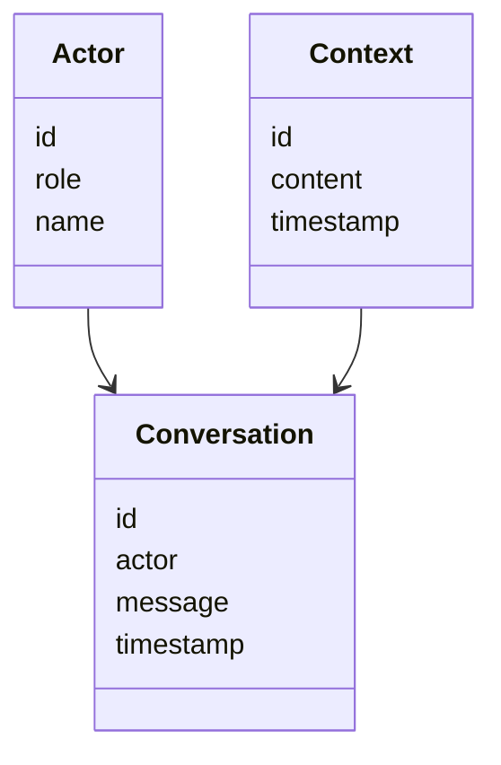

                 


# 上下文管理：增强AI Agent的对话连贯性

## 关键词：
上下文管理, AI Agent, 对话连贯性, 实体关系图, 算法原理, 系统架构, 项目实战

## 摘要：
本文深入探讨了上下文管理在增强AI Agent对话连贯性中的重要作用。通过背景介绍、核心概念分析、算法原理讲解、系统架构设计以及项目实战，全面阐述了如何通过上下文管理提升AI Agent的对话能力。文章结合理论与实践，提供了详细的代码实现和案例分析，帮助读者全面理解上下文管理的原理和应用。

---

## 第1章：上下文管理的背景与问题背景

### 1.1 上下文管理的定义与核心概念

#### 1.1.1 什么是上下文管理
上下文管理是指在对话过程中，系统对当前对话的背景、历史、参与者等信息进行理解和管理的过程。它是实现对话连贯性的基础。

#### 1.1.2 上下文管理的核心要素
- **对话历史**：记录对话的上下文信息，包括用户的问题、系统的回答等。
- **参与者信息**：包括对话的参与者、他们的角色和身份。
- **对话目标**：明确对话的目标和意图。

#### 1.1.3 上下文管理的边界与外延
- **边界**：仅关注直接影响对话连贯性的信息，如对话历史和意图。
- **外延**：涉及更广泛的知识库，如常识、领域知识等。

### 1.2 AI Agent与对话连贯性的关系

#### 1.2.1 AI Agent的基本概念
AI Agent是一种能够感知环境并采取行动以实现目标的智能实体。

#### 1.2.2 对话连贯性的重要性
- 对话连贯性是用户与AI Agent交互的关键，直接影响用户体验。
- 连贯的对话能够提升用户满意度和信任度。

#### 1.2.3 上下文管理在AI Agent中的作用
- **理解上下文**：通过上下文管理，AI Agent能够更好地理解用户的意图。
- **保持连贯性**：通过管理上下文，AI Agent能够保持对话的连贯性。

---

## 第2章：上下文管理的核心概念与联系

### 2.1 上下文管理的核心原理

#### 2.1.1 上下文表示方法
- **基于向量的表示**：将上下文信息表示为向量，便于计算相似度。
- **基于图的表示**：将上下文信息表示为图结构，便于分析关联性。

#### 2.1.2 上下文关联性分析
- **关联规则挖掘**：通过挖掘关联规则，发现上下文中的关联性。
- **基于图的分析**：通过图结构分析上下文的关联性。

#### 2.1.3 上下文动态更新机制
- **实时更新**：根据对话的进展，实时更新上下文信息。
- **基于反馈的更新**：根据用户反馈，动态调整上下文信息。

### 2.2 核心概念对比与ER实体关系图

#### 2.2.1 上下文管理与传统对话管理的对比

| 对比维度         | 上下文管理                     | 传统对话管理                     |
|------------------|-------------------------------|----------------------------------|
| 核心目标         | 增强对话连贯性                 | 简单的对话流程管理               |
| 关注点           | 对话历史、意图、参与者         | 对话流程和语法结构               |
| 实现方式         | 基于上下文的意图推理           | 基于规则的对话流程控制         |

#### 2.2.2 上下文管理的ER实体关系图

```mermaid
er
  actor
  context
  conversation
  message
  actor -[参与]- conversation
  conversation -[包含]- message
  message -[属于]- context
```

---

## 第3章：上下文管理的算法实现

### 3.1 上下文表示与匹配算法

#### 3.1.1 基于向量的上下文表示方法



#### 3.1.2 上下文相似度计算公式

$$ \text{相似度} = \frac{\vec{c_1} \cdot \vec{c_2}}{|\vec{c_1}| \times |\vec{c_2}|} $$

### 3.2 上下文关联性分析算法

#### 3.2.1 关联规则挖掘算法

$$ \text{支持度} = \frac{\text{频繁项集的数量}}{\text{总交易数}} $$

#### 3.2.2 基于图的上下文关联性分析



---

## 第4章：上下文管理的系统架构与设计

### 4.1 系统功能设计

#### 4.1.1 领域模型设计



#### 4.1.2 系统功能模块划分
- **上下文解析模块**：解析对话中的上下文信息。
- **上下文匹配模块**：匹配上下文信息，实现对话连贯性。

### 4.2 系统架构设计

#### 4.2.1 分层架构设计


#### 4.2.2 系统接口设计
- **获取上下文接口**：`getContext(conversationId)`
- **更新上下文接口**：`updateContext(conversationId, context)`

#### 4.2.3 系统交互流程

```mermaid
sequenceDiagram
    Actor ->> Client: 发起对话
    Client ->> Server: 请求上下文管理
    Server ->> ContextManager: 处理上下文
    ContextManager --> Client: 返回上下文信息
    Client ->> Actor: 显示对话结果
```

---

## 第5章：上下文管理的项目实战

### 5.1 项目环境与工具安装

#### 5.1.1 开发环境搭建
- **操作系统**：Linux/Windows/MacOS
- **编程语言**：Python 3.8+
- **依赖库**：numpy, spacy, transformers

#### 5.1.2 依赖库安装
```bash
pip install numpy spacy transformers
python -m spacy download en_core_web_sm
```

### 5.2 核心代码实现

#### 5.2.1 上下文表示与匹配的Python代码实现

```python
import numpy as np
from spacy.lang.en import English

nlp = English()

def get_context_vector(text):
    doc = nlp(text)
    return [token.vector for token in doc]

context1 = "今天天气很好"
context2 = "天气预报"
vector1 = get_context_vector(context1)
vector2 = get_context_vector(context2)

similarity = np.dot(vector1, vector2) / (np.linalg.norm(vector1) * np.linalg.norm(vector2))
print(similarity)
```

#### 5.2.2 上下文关联性分析的Python代码实现

```python
from itertools import combinations

def calculate_support(set1, set2):
    return len(set1.intersection(set2)) / len(set2)

context1 = {"天气", "好"}
context2 = {"天气", "预报", "好"}
support = calculate_support(context1, context2)
print(support)
```

### 5.3 项目案例分析

#### 5.3.1 案例场景介绍
- **场景**：用户与AI Agent讨论天气。

#### 5.3.2 代码实现解读
- **上下文表示**：将天气相关的文本表示为向量。
- **关联性分析**：计算天气和预报的关联性。

#### 5.3.3 项目小结
通过上下文管理，AI Agent能够更准确地理解用户的意图，提升对话的连贯性。

---

## 第6章：上下文管理的最佳实践

### 6.1 最佳实践 tips
- **实时更新**：根据对话进展实时更新上下文。
- **领域知识库**：结合领域知识库提升准确性。

### 6.2 小结
上下文管理是提升AI Agent对话连贯性的关键，通过合理设计和实现，能够显著增强用户体验。

### 6.3 注意事项
- **数据隐私**：注意保护用户数据隐私。
- **性能优化**：优化上下文处理的性能。

### 6.4 拓展阅读
- **推荐书籍**：《自然语言处理实战》
- **推荐论文**：上下文管理的相关研究论文。

---

## 作者：AI天才研究院/AI Genius Institute & 禅与计算机程序设计艺术 /Zen And The Art of Computer Programming

---

通过以上内容，我们详细探讨了上下文管理在增强AI Agent对话连贯性中的作用，从理论到实践，全面分析了其实现方法和应用案例。希望这篇文章能够为相关领域的研究和实践提供有价值的参考。

