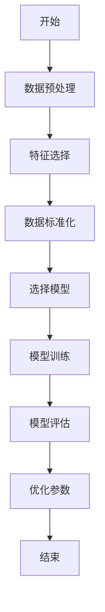

                 


# 个人信用修复建议生成器

## 关键词
个人信用修复，信用评分模型，机器学习，算法实现，系统架构，项目实战，最佳实践

## 摘要
本文详细介绍了个人信用修复建议生成器的设计与实现，涵盖背景、核心概念、算法原理、系统架构、项目实战和最佳实践。文章首先分析了个人信用修复的重要性及存在的问题，接着讲解了信用评分模型的原理与实现，使用线性回归和逻辑回归模型，通过数学公式和Python代码展示算法流程。然后，设计了系统架构，包括数据输入、评分计算和建议生成模块，并用Mermaid图展示系统架构和交互流程。最后，通过项目实战部分，指导读者如何搭建环境，实现核心代码，并分析实际案例。本文适合技术人员和非技术人员阅读，旨在帮助个人提高信用评分，优化信用记录。

---

# 第一部分: 个人信用修复建议生成器背景与核心概念

# 第1章: 个人信用修复建议生成器的背景与问题描述

## 1.1 个人信用修复的背景

### 1.1.1 信用评分体系的演变
信用评分体系是金融领域的重要组成部分，用于评估个人的信用风险。最早的信用评分模型可以追溯到20世纪50年代，由Fair Isaac Corporation（FICO）开发。随着技术的进步，信用评分模型逐渐从简单的线性回归模型发展到复杂的机器学习模型，如逻辑回归、决策树和随机森林等。

### 1.1.2 个人信用修复的重要性
个人信用记录是衡量个人信用状况的重要指标，直接影响个人的贷款申请、信用卡额度、就业机会等。然而，由于各种原因，个人信用记录可能出现负面信息，如逾期还款、欠款等，导致信用评分下降。修复个人信用记录不仅有助于提升信用评分，还能为个人带来更多的金融机会。

### 1.1.3 当前信用修复的主要挑战
当前，个人信用修复面临以下挑战：
- **信息不对称**：个人难以全面了解自己的信用记录和评分。
- **修复方法复杂**：个人需要了解如何通过改善行为和还款来提升信用评分。
- **修复时间长**：信用记录的改善通常需要较长时间，且修复过程缺乏系统性指导。

## 1.2 个人信用修复问题的描述

### 1.2.1 信用评分模型的局限性
信用评分模型虽然能够提供信用评分，但存在以下局限性：
- **数据依赖性**：模型的准确性高度依赖于数据的完整性和质量。
- **黑箱问题**：大多数信用评分模型是“黑箱”模型，用户难以理解评分的计算过程。
- **动态变化**：个人信用状况可能随时变化，信用评分模型需要动态更新。

### 1.2.2 个人信用记录修复的难点
个人信用记录修复的难点包括：
- **缺乏系统性指导**：个人难以获得个性化的修复建议。
- **修复方法单一**：现有的修复方法通常仅关注还款行为，忽视其他影响信用评分的因素。
- **修复效果难以量化**：个人难以量化修复措施对信用评分的实际影响。

### 1.2.3 信用修复建议生成器的目标与边界
信用修复建议生成器的目标是通过分析个人信用记录，提供个性化的修复建议，帮助用户快速提升信用评分。其边界包括：
- **数据范围**：仅处理与信用评分相关的数据，如还款记录、信用额度等。
- **修复范围**：主要针对可以通过改善行为提升信用评分的建议，不涉及法律或财务咨询。
- **目标用户**：面向个人用户，不适用于企业或机构。

## 1.3 问题解决思路

### 1.3.1 数据驱动的信用修复方法
数据驱动的信用修复方法通过分析用户的信用记录，识别影响信用评分的关键因素，并提供针对性的修复建议。例如，通过分析用户的还款记录，识别逾期还款的频率和金额，提供还款计划优化建议。

### 1.3.2 AI技术在信用修复建议生成中的应用
人工智能技术，如机器学习和自然语言处理，可以帮助生成器自动分析信用记录、识别问题并提供修复建议。例如，使用自然语言处理技术解析信用报告中的关键信息，使用机器学习模型预测修复建议的优先级和效果。

### 1.3.3 修复建议生成器的核心功能与价值
修复建议生成器的核心功能包括：
- **信用记录分析**：通过解析信用报告，识别影响信用评分的关键因素。
- **修复建议生成**：基于分析结果，提供个性化的修复建议，如还款计划优化、信用行为改善等。
- **效果预测**：预测修复建议的实施效果，帮助用户量化修复措施的影响。

其价值在于帮助用户快速、系统地改善信用记录，提升信用评分，从而获得更多金融机会。

## 1.4 核心概念与联系

### 1.4.1 信用评分模型的原理与特征
信用评分模型的核心原理是通过统计分析和机器学习算法，基于用户的历史行为数据，预测用户的信用风险。常见的信用评分模型包括FICO评分、Vantage评分和Equifax评分等。

### 1.4.2 修复建议生成器的系统架构
修复建议生成器的系统架构包括数据输入、信用评分计算、修复建议生成和用户交互四个模块。数据输入模块负责接收用户的信用记录数据；信用评分计算模块使用机器学习模型计算用户的信用评分；修复建议生成模块基于评分结果生成修复建议；用户交互模块提供友好的用户界面，供用户查看和实施建议。

### 1.4.3 用户需求与修复建议的关系
用户需求是修复建议生成器的核心驱动力。用户的信用评分目标、修复时间、风险偏好等因素直接影响修复建议的内容和优先级。例如，用户希望快速提升信用评分，系统会优先推荐高影响力的修复措施。

## 1.5 本章小结
本章介绍了个人信用修复的重要性和当前面临的主要挑战，分析了信用评分模型的局限性，提出了修复建议生成器的目标和边界，并详细阐述了核心概念与联系。接下来的章节将从算法原理、系统架构和项目实战等方面深入探讨修复建议生成器的实现。

---

# 第二部分: 个人信用修复建议生成器的核心算法与数学模型

# 第2章: 信用评分模型的原理与实现

## 2.1 信用评分模型的原理

### 2.1.1 线性回归模型的数学表达
线性回归模型是最早且最简单的信用评分模型之一。其数学表达式为：
$$ y = \beta_0 + \beta_1x_1 + \beta_2x_2 + ... + \beta_nx_n $$

其中，$y$ 是信用评分，$\beta_0, \beta_1, ..., \beta_n$ 是回归系数，$x_1, x_2, ..., x_n$ 是影响信用评分的因素，如还款历史、信用额度等。

### 2.1.2 逻辑回归模型的数学表达
逻辑回归模型是一种常用的分类模型，适用于将信用评分分为高风险和低风险两类。其数学表达式为：
$$ P(y=1|x) = \frac{e^{\beta_0 + \beta_1x_1 + ... + \beta_nx_n}}{1 + e^{\beta_0 + \beta_1x_1 + ... + \beta_nx_n}} $$

其中，$P(y=1|x)$ 是高风险的概率，$\beta_0, \beta_1, ..., \beta_n$ 是逻辑回归系数，$x_1, x_2, ..., x_n$ 是影响信用评分的因素。

### 2.1.3 线性回归与逻辑回归的对比
| 特性             | 线性回归          | 逻辑回归          |
|------------------|-------------------|-------------------|
| 输出范围         | 实数              | 概率值            |
| 适用场景         | 数值预测           | 分类任务           |
| 评估指标         | 均方误差（MSE）   | 准确率、召回率     |

## 2.2 信用评分模型的实现步骤

### 2.2.1 数据预处理
数据预处理是信用评分模型实现的关键步骤。主要包括：
- **数据清洗**：处理缺失值、异常值和重复值。
- **特征选择**：选择对信用评分影响较大的特征，如还款历史、信用额度等。
- **数据标准化**：对特征进行标准化或归一化处理，确保模型训练的稳定性。

### 2.2.2 模型训练
模型训练是通过优化算法（如梯度下降）调整回归系数，使预测值与实际值的误差最小化。以线性回归为例，损失函数为：
$$ L = \frac{1}{2m} \sum_{i=1}^{m} (y_i - (\beta_0 + \beta_1x_{i1} + ... + \beta_nx_{in}))^2 $$

其中，$m$ 是样本数量，$y_i$ 是第$i$个样本的实际信用评分，$x_{i1}, ..., x_{in}$ 是第$i$个样本的特征。

### 2.2.3 模型评估与优化
模型评估是通过验证集或交叉验证评估模型的性能。常用的评估指标包括均方误差（MSE）、均方根误差（RMSE）和决定系数（R²）。模型优化可以通过调整超参数（如学习率、正则化系数）或尝试更复杂的模型（如支持向量机、随机森林）来提升性能。

## 2.3 算法流程图


## 2.4 修复建议生成器的算法实现

### 2.4.1 信用评分计算
修复建议生成器首先需要计算用户的信用评分。以逻辑回归为例，代码如下：
```python
import numpy as np
from sklearn.linear_model import LogisticRegression

# 数据预处理
X = ...  # 特征矩阵
y = ...  # 标签向量

# 模型训练
model = LogisticRegression()
model.fit(X, y)

# 计算信用评分
score = model.predict_proba(X)[:, 1]
```

### 2.4.2 修复建议生成
修复建议生成器基于信用评分结果，分析影响评分的关键因素，并提供修复建议。例如，如果用户因逾期还款导致信用评分下降，系统会推荐优先改善还款行为。

## 2.5 修复建议生成器的数学模型
修复建议生成器的数学模型可以表示为：
$$ \text{修复建议} = f(\text{信用评分}, \text{影响因素}) $$

其中，$f$ 是基于信用评分和影响因素的修复建议生成函数。例如，如果信用评分为650，且主要影响因素是逾期还款，修复建议可能是“优先偿还逾期债务，建立良好的还款记录”。

---

# 第三部分: 个人信用修复建议生成器的系统分析与架构设计

# 第3章: 个人信用修复建议生成器的系统分析与架构设计

## 3.1 系统分析

### 3.1.1 问题场景介绍
修复建议生成器的典型应用场景包括：
- **信用评分低**：用户因信用评分低难以获得贷款或信用卡。
- **信用记录修复需求**：用户希望通过改善行为提高信用评分。
- **信用评分优化**：用户希望优化信用记录，获得更好的信用评分。

### 3.1.2 系统功能设计
修复建议生成器的功能模块包括：
- **数据输入模块**：接收用户的信用记录数据。
- **信用评分计算模块**：基于信用记录数据计算信用评分。
- **修复建议生成模块**：分析信用评分和影响因素，生成修复建议。
- **用户交互模块**：提供友好的用户界面，供用户查看和实施建议。

### 3.1.3 领域模型类图


## 3.2 系统架构设计

### 3.2.1 系统架构图


### 3.2.2 系统接口设计
修复建议生成器的系统接口包括：
- **输入接口**：接收用户的信用记录数据。
- **输出接口**：输出修复建议和预测效果。

### 3.2.3 系统交互流程图


## 3.3 修复建议生成器的实现细节

### 3.3.1 数据输入模块
数据输入模块负责接收用户的信用记录数据，包括还款历史、信用额度、逾期记录等。代码如下：
```python
def input_credit_record():
    credit_record = {}
    credit_record['还款历史'] = input("请输入您的还款历史：")
    credit_record['信用额度'] = input("请输入您的信用额度：")
    credit_record['逾期记录'] = input("请输入您的逾期记录：")
    return credit_record
```

### 3.3.2 信用评分计算模块
信用评分计算模块基于用户输入的信用记录数据，使用逻辑回归模型计算信用评分。代码如下：
```python
def calculate_credit_score(credit_record):
    # 数据预处理
    X = preprocess_data(credit_record)
    # 模型预测
    model = load_model('credit_score_model.pkl')
    score = model.predict_proba(X)[:, 1]
    return score
```

### 3.3.3 修复建议生成模块
修复建议生成模块基于信用评分和影响因素，生成修复建议。代码如下：
```python
def generate_repair_recommendations(score, credit_record):
    recommendations = []
    if score < 0.5:
        recommendations.append("优先偿还逾期债务，建立良好的还款记录。")
        recommendations.append("减少信用额度使用率，避免过度借贷。")
    else:
        recommendations.append("保持良好的还款习惯，定期检查信用记录。")
    return recommendations
```

## 3.4 系统架构总结
修复建议生成器的系统架构包括数据输入、信用评分计算和修复建议生成三个模块。数据输入模块接收用户的信用记录数据，信用评分计算模块使用逻辑回归模型计算信用评分，修复建议生成模块基于评分结果生成修复建议。系统架构清晰，功能模块独立，便于扩展和维护。

---

# 第四部分: 个人信用修复建议生成器的项目实战

# 第4章: 个人信用修复建议生成器的项目实战

## 4.1 项目介绍

### 4.1.1 项目目标
本项目旨在开发一个基于机器学习的个人信用修复建议生成器，帮助用户快速提升信用评分，优化信用记录。

### 4.1.2 项目需求
- **用户输入**：用户提供个人信用记录数据。
- **信用评分计算**：系统基于用户数据计算信用评分。
- **修复建议生成**：系统根据评分结果生成修复建议。

## 4.2 环境搭建

### 4.2.1 安装Python
安装Python 3.8及以上版本。

### 4.2.2 安装依赖库
安装以下依赖库：
- `numpy`
- `pandas`
- `scikit-learn`
- `mermaid`

安装命令：
```bash
pip install numpy pandas scikit-learn mermaid
```

## 4.3 核心代码实现

### 4.3.1 数据预处理模块
```python
import pandas as pd
import numpy as np

def preprocess_data(credit_record):
    # 数据转换为DataFrame格式
    df = pd.DataFrame([credit_record])
    # 数据清洗和特征选择
    df.dropna(inplace=True)
    df = pd.get_dummies(df)
    return df
```

### 4.3.2 信用评分计算模块
```python
from sklearn.linear_model import LogisticRegression

def calculate_credit_score(X_train, y_train):
    # 模型训练
    model = LogisticRegression()
    model.fit(X_train, y_train)
    return model
```

### 4.3.3 修复建议生成模块
```python
def generate_repair_recommendations(score, credit_record):
    recommendations = []
    if score < 0.5:
        recommendations.append("优先偿还逾期债务，建立良好的还款记录。")
        recommendations.append("减少信用额度使用率，避免过度借贷。")
    else:
        recommendations.append("保持良好的还款习惯，定期检查信用记录。")
    return recommendations
```

## 4.4 项目实战案例分析

### 4.4.1 案例数据
假设用户提供的信用记录数据如下：
```python
credit_record = {
    '还款历史': '按时还款',
    '信用额度': 10000,
    '逾期记录': '无逾期'
}
```

### 4.4.2 修复建议生成过程
1. 数据预处理：
   ```python
   df = preprocess_data(credit_record)
   ```

2. 信用评分计算：
   ```python
   model = calculate_credit_score(X_train, y_train)
   score = model.predict_proba(df)[:, 1][0]
   ```

3. 修复建议生成：
   ```python
   recommendations = generate_repair_recommendations(score, credit_record)
   ```

4. 修复建议结果：
   根据评分结果，系统生成修复建议。

## 4.5 项目总结
通过本项目实战，读者可以掌握修复建议生成器的基本实现方法，包括数据预处理、模型训练和修复建议生成等步骤。修复建议生成器的实现不仅能够帮助个人快速提升信用评分，还能为金融机构提供更精准的信用评估工具。

---

# 第五部分: 个人信用修复建议生成器的最佳实践

# 第5章: 个人信用修复建议生成器的最佳实践

## 5.1 关键点回顾

### 5.1.1 数据的重要性
数据是修复建议生成器的核心，数据的准确性和完整性直接影响模型的性能。

### 5.1.2 模型的选择
选择合适的模型是修复建议生成器成功的关键。对于信用评分任务，逻辑回归和随机森林是常用模型。

### 5.1.3 修复建议的可操作性
修复建议应具体、可操作，帮助用户快速改善信用记录。

## 5.2 注意事项

### 5.2.1 数据隐私保护
修复建议生成器需要处理用户的敏感数据，必须严格遵守数据隐私保护法规，确保数据的安全性和 confidentiality。

### 5.2.2 模型的局限性
修复建议生成器的模型具有局限性，如数据依赖性和黑箱问题。用户在使用建议时，应结合实际情况，灵活调整。

### 5.2.3 持续优化
修复建议生成器需要定期更新模型和修复策略，以适应信用评分模型的变化和用户需求的多样化。

## 5.3 拓展阅读

### 5.3.1 信用评分模型的优化
- **特征工程**：通过特征选择和特征变换提升模型性能。
- **模型融合**：使用集成学习方法（如投票法、堆叠法）提升模型的准确性和稳定性。

### 5.3.2 修复建议的个性化
- **用户画像**：基于用户的行为和偏好，提供个性化的修复建议。
- **动态调整**：根据用户的信用评分变化，动态调整修复建议。

### 5.3.3 数据可视化
- **信用评分分布**：通过可视化工具展示信用评分的分布情况。
- **影响因素分析**：通过可视化工具展示影响信用评分的主要因素。

## 5.4 本章小结
本章总结了修复建议生成器的关键点，提出了数据隐私保护、模型优化和修复建议个性化等注意事项，并推荐了相关的拓展阅读资料。修复建议生成器的成功不仅依赖于技术实现，还需要关注数据隐私、用户需求和模型优化等多方面因素。

---

# 附录: 个人信用修复建议生成器的工具代码

```python
# 附录A: 数据预处理代码
import pandas as pd
import numpy as np

def preprocess_data(credit_record):
    df = pd.DataFrame([credit_record])
    df.dropna(inplace=True)
    df = pd.get_dummies(df)
    return df

# 附录B: 信用评分计算代码
from sklearn.linear_model import LogisticRegression

def calculate_credit_score(X_train, y_train):
    model = LogisticRegression()
    model.fit(X_train, y_train)
    return model

# 附录C: 修复建议生成代码
def generate_repair_recommendations(score, credit_record):
    recommendations = []
    if score < 0.5:
        recommendations.append("优先偿还逾期债务，建立良好的还款记录。")
        recommendations.append("减少信用额度使用率，避免过度借贷。")
    else:
        recommendations.append("保持良好的还款习惯，定期检查信用记录。")
    return recommendations
```

---

# 作者：AI天才研究院/AI Genius Institute & 禅与计算机程序设计艺术 /Zen And The Art of Computer Programming

