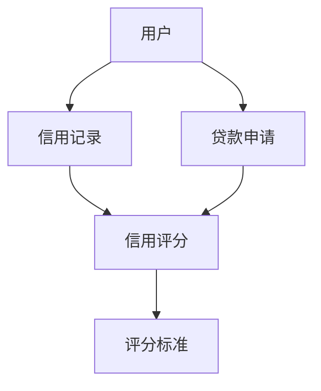
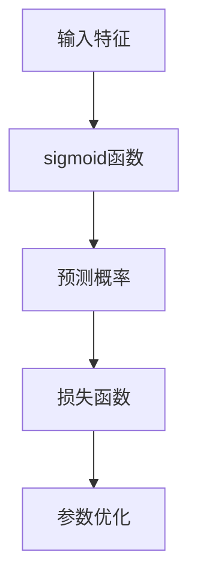
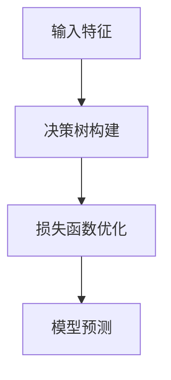
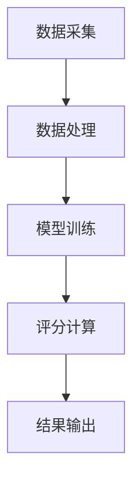
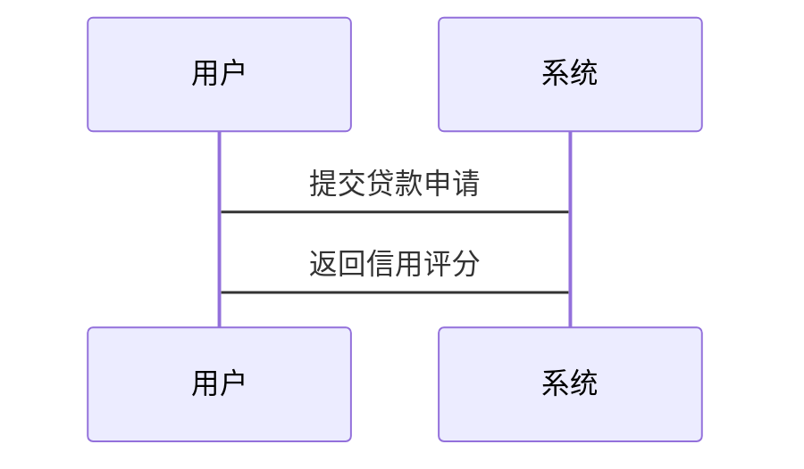

                 


# 个人信用评分系统优化

## 关键词：
个人信用评分系统、优化、算法原理、系统架构、项目实战

## 摘要：
本文深入探讨了个人信用评分系统的优化方法，从背景分析到算法实现，再到系统架构设计，全面解析了如何提高评分系统的准确性和效率。文章结合实际案例，详细讲解了逻辑回归和梯度提升树的算法原理，并通过Mermaid图表和Python代码展示了系统的优化过程。

---

## 第一部分：个人信用评分系统背景与核心概念

### 第1章：个人信用评分系统概述

#### 1.1 问题背景与描述

- **问题背景**：在金融领域，个人信用评分是评估借款人信用风险的重要工具。传统评分系统可能存在数据特征不全、模型过时、评分标准不灵活等问题，导致评分结果不够准确，影响金融机构的风险控制能力。

- **问题描述**：当前评分系统可能无法充分捕捉用户的信用风险特征，导致评分结果存在偏差，影响贷款决策的准确性。

- **问题解决**：通过优化数据特征选择、改进评分模型算法，提高评分系统的准确性和效率。

- **边界与外延**：本文仅讨论个人信用评分系统，不涉及企业信用评分或其他类型的信用评估。

- **核心概念**：信用评分系统的核心概念包括评分模型、数据特征和评分标准。

---

### 第2章：信用评分系统的核心概念

#### 2.1 核心概念原理

- **评分模型**：逻辑回归和梯度提升树是常用的评分模型，通过分析数据特征，输出信用评分。

- **数据特征**：包括还款历史、信用额度、信用历史长度等，特征选择对模型性能至关重要。

- **评分标准**：根据评分结果，将用户分为不同信用等级，指导贷款审批。

#### 2.2 概念属性对比

| 概念         | 特征                         |
|--------------|------------------------------|
| 评分模型     | 逻辑回归、梯度提升树         |
| 数据特征     | 还款历史、信用额度           |
| 评分标准     | 信用等级划分                 |

#### 2.3 ER实体关系架构



---

## 第二部分：算法原理与数学模型

### 第3章：评分模型算法原理

#### 3.1 常用算法与流程

- **逻辑回归**：适用于二分类问题，输出概率，适用于评分系统。

- **梯度提升树**：基于决策树的集成方法，适合处理复杂特征关系。

#### 3.2 逻辑回归算法

##### 3.2.1 原理与流程



##### 3.2.2 Python实现

```python
import numpy as np
from sklearn.linear_model import LogisticRegression

def logistic_regression(X, y):
    model = LogisticRegression()
    model.fit(X, y)
    return model
```

##### 3.2.3 数学模型与公式

$$ P(y=1|x) = \frac{1}{1 + e^{-\beta x}} $$

#### 3.3 梯度提升树算法

##### 3.3.1 原理与流程



##### 3.3.2 Python实现

```python
import xgboost as xgb

def gradient_boosting(X, y):
    model = xgb.XGBClassifier()
    model.fit(X, y)
    return model
```

##### 3.3.3 数学模型与公式

$$ L = -\sum_{i=1}^{n} [y_i \ln(p_i) + (1 - y_i) \ln(1 - p_i)] $$

---

## 第三部分：系统分析与架构设计

### 第4章：系统分析与架构设计

#### 4.1 系统架构设计



#### 4.2 系统接口设计



---

## 第四部分：项目实战

### 第5章：项目实战

#### 5.1 环境安装

- 安装依赖：`pip install numpy scikit-learn xgboost`

#### 5.2 核心实现

```python
import numpy as np
from sklearn.model_selection import train_test_split
from sklearn.metrics import accuracy_score

# 示例数据集
data = {
    '收入': [50000, 60000, 40000, 70000],
    '信用历史': [5, 3, 10, 2],
    '还款历史': [0, 1, 0, 0],
    '信用额度': [30000, 40000, 20000, 50000]
}
X = np.array(list(data.values())).T
y = [1, 0, 0, 1]

# 划分训练集和测试集
X_train, X_test, y_train, y_test = train_test_split(X, y, test_size=0.2)

# 逻辑回归模型
model_logit = LogisticRegression().fit(X_train, y_train)
y_pred_logit = model_logit.predict(X_test)
print("逻辑回归准确率:", accuracy_score(y_test, y_pred_logit))

# 梯度提升树模型
model_gb = xgb.XGBClassifier().fit(X_train, y_train)
y_pred_gb = model_gb.predict(X_test)
print("梯度提升树准确率:", accuracy_score(y_test, y_pred_gb))
```

#### 5.3 案例分析

通过对比两种模型的准确率，选择表现更优的模型部署到评分系统中。

---

## 第五部分：总结与展望

### 第6章：总结与展望

#### 6.1 最佳实践

- 数据特征选择：选择相关性高的特征，提高模型性能。
- 模型调优：通过参数调优和模型融合，进一步提升评分准确性。

#### 6.2 小结

本文系统性地分析了个人信用评分系统的优化方法，通过对比不同算法，提出了基于逻辑回归和梯度提升树的优化方案，为金融机构提供了有效的参考。

#### 6.3 注意事项

- 数据隐私保护：在处理用户数据时，需遵守相关法律法规，保护用户隐私。
- 模型更新：定期更新模型，适应市场变化，保持评分系统的准确性。

#### 6.4 拓展阅读

建议读者进一步学习机器学习中的高级算法，如神经网络和集成学习，以提升评分系统的性能。

---

## 作者

作者：AI天才研究院/AI Genius Institute & 禅与计算机程序设计艺术 /Zen And The Art of Computer Programming

---

本文通过详细分析个人信用评分系统的优化方法，结合实际案例，为读者提供了全面的技术指导。希望本文能为相关领域的技术人员提供有价值的参考。

