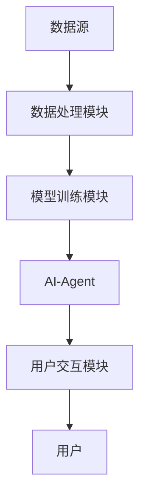

                 


# 个人理财顾问：AI Agent的智能投资建议

## 关键词：
AI Agent，智能投资，个人理财，机器学习，金融数据，投资建议

## 摘要：
本文将探讨AI Agent在个人理财中的应用，特别是其如何通过智能投资建议优化用户的财务决策。文章将详细分析AI Agent的核心概念、算法原理、系统架构，并结合实际案例展示其在投资建议中的优势。通过深入的分析和具体的实现，本文将揭示AI Agent如何成为现代个人理财的重要工具。

---

# 目录大纲：《个人理财顾问：AI Agent的智能投资建议》

## 第一部分：AI Agent与个人理财的背景介绍

### 第1章：AI Agent的基本概念与个人理财

#### 1.1 AI Agent的基本概念

- **1.1.1 什么是AI Agent？**
  - AI Agent的定义
  - AI Agent的核心特点：自主性、反应性、目标导向、社交能力
  - AI Agent与传统投资顾问的区别

- **1.1.2 AI Agent在个人理财中的角色**
  - 作为智能投资顾问
  - 作为财务规划辅助工具

- **1.1.3 AI Agent的优势**
  - 高效性与实时性
  - 个性化与精准性
  - 成本效益与可扩展性

#### 1.2 个人理财与投资顾问的现状

- **1.2.1 传统个人理财服务的局限性**
  - 人工成本高
  - 服务范围有限
  - 个性化不足

- **1.2.2 投资顾问的市场需求与痛点**
  - 高净值客户的需求增长
  - 中小投资者的忽视
  - 传统服务的低效性

- **1.2.3 AI技术在金融领域的应用趋势**
  - 数据驱动决策
  - 个性化服务
  - 高效性与可扩展性

## 第二部分：AI Agent的核心概念与原理

### 第2章：AI Agent的核心概念与联系

#### 2.1 AI Agent的原理

- **2.1.1 数据驱动的决策机制**
  - 数据收集与处理
  - 数据分析与建模
  - 决策优化与执行

- **2.1.2 智能算法的应用**
  - 机器学习算法
  - 强化学习算法
  - 自然语言处理（NLP）

- **2.1.3 用户行为分析与预测**
  - 用户画像构建
  - 投资偏好分析
  - 行为预测与干预

#### 2.2 AI Agent的实体关系图

- **用户实体关系图（ER图）**
  ```mermaid
  erDiagram
    user {
        id
        name
        email
        phone
    }
    account {
        id
        balance
        owner_id
    }
    transaction {
        id
        amount
        date
        account_id
    }
    AI-Agent {
        id
        model_version
        training_data_id
    }
    training_data {
        id
        data_source
        data_type
        timestamp
    }
    user --> account : owns
    account --> transaction : has
    AI-Agent --> training_data : trained_on
  ```

---

### 第3章：AI Agent的算法原理

#### 3.1 机器学习模型的应用

- **3.1.1 算法选择**
  - 线性回归：用于简单预测
  - 支持向量机（SVM）：用于分类问题
  - 随机森林：用于特征重要性分析

- **3.1.2 算法流程图**
  ```mermaid
  graph TD
      A[数据预处理] --> B[特征提取]
      B --> C[选择算法]
      C --> D[训练模型]
      D --> E[模型评估]
      E --> F[优化调整]
      F --> G[部署应用]
  ```

- **3.1.3 机器学习模型实现**
  ```python
  import pandas as pd
  import numpy as np
  from sklearn.ensemble import RandomForestRegressor

  # 数据加载与预处理
  data = pd.read_csv('financial_data.csv')
  X = data.drop('target', axis=1)
  y = data['target']

  # 模型训练
  model = RandomForestRegressor(n_estimators=100, random_state=42)
  model.fit(X, y)

  # 预测与评估
  predictions = model.predict(X)
  print('均方误差:', np.mean((predictions - y) ** 2))
  ```

- **3.1.4 数学模型与公式**
  - 线性回归模型：
    $$ y = \beta_0 + \beta_1x_1 + \beta_2x_2 + \ldots + \beta_nx_n + \epsilon $$
  - 随机森林模型：
    $$ \text{预测值} = \text{多数投票结果} $$

#### 3.2 强化学习的应用

- **3.2.1 强化学习的基本原理**
  - 状态、动作、奖励
  - Q-learning算法
  - 策略评估与更新

- **3.2.2 强化学习在投资中的应用**
  - 股票交易策略优化
  - 资产配置动态调整

- **3.2.3 强化学习实现示例**
  ```python
  import gym
  from gym import spaces
  from gym.utils import seeding

  class StockTradingEnv(gym.Env):
      def __init__(self):
          super(StockTradingEnv, self).__init__()
          self.observation_space = spaces.Box(low=0, high=1, shape=(5,))
          self.action_space = spaces.Discrete(3)  # 0: 持有，1: 买入，2: 卖出
          self.seed()

      def step(self, action):
          # 根据动作更新状态和奖励
          pass

      def reset(self):
          # 初始化环境
          pass
  ```

## 第三部分：AI Agent的系统架构与设计

### 第4章：系统架构设计方案

#### 4.1 系统模块划分

- **4.1.1 数据处理模块**
  - 数据清洗与转换
  - 数据特征提取
  - 数据增强

- **4.1.2 模型训练模块**
  - 模型选择
  - 参数调优
  - 模型保存与加载

- **4.1.3 用户交互模块**
  - 界面设计
  - 交互逻辑
  - 反馈机制

#### 4.2 系统架构图



#### 4.3 接口设计与交互流程

- **4.3.1 接口设计**
  - API定义
  - 接口调用方式
  - 接口文档

- **4.3.2 交互流程**
  - 用户请求投资建议
  - AI-Agent分析数据并生成建议
  - 用户反馈与优化

## 第四部分：AI Agent的项目实战

### 第5章：项目实战与分析

#### 5.1 环境安装与配置

- **5.1.1 安装Python环境**
  - 安装Anaconda或虚拟环境
  - 安装必要的库：pandas、numpy、scikit-learn、gym等

- **5.1.2 数据源获取**
  - 数据集下载
  - 数据清洗与预处理

#### 5.2 核心代码实现

- **5.2.1 数据处理代码**
  ```python
  import pandas as pd
  import numpy as np

  # 加载数据
  data = pd.read_csv('financial_data.csv')

  # 数据清洗
  data = data.dropna()
  data = pd.get_dummies(data, columns=['category'])

  # 划分训练集和测试集
  X_train = data.iloc[:800, :-1]
  y_train = data.iloc[:800, -1]
  X_test = data.iloc[800:, :-1]
  y_test = data.iloc[800:, -1]
  ```

- **5.2.2 模型训练代码**
  ```python
  from sklearn.ensemble import RandomForestRegressor
  from sklearn.metrics import mean_squared_error

  # 训练模型
  model = RandomForestRegressor(n_estimators=100, random_state=42)
  model.fit(X_train, y_train)

  # 预测与评估
  predictions = model.predict(X_test)
  print('均方误差:', mean_squared_error(y_test, predictions))
  ```

- **5.2.3 交互界面设计**
  ```python
  import tkinter as tk

  root = tk.Tk()
  root.title('AI投资顾问')

  def give_advice():
      # 实现投资建议生成逻辑
      pass

  button = tk.Button(root, text='获取投资建议', command=give_advice)
  button.pack()

  root.mainloop()
  ```

#### 5.3 案例分析与总结

- **5.3.1 实际案例分析**
  - 案例背景
  - 数据分析
  - 模型输出
  - 投资建议

- **5.3.2 项目总结**
  - 项目成果
  - 经验与教训
  - 改进建议

## 第五部分：AI Agent的优化与展望

### 第6章：AI Agent的优化与未来展望

#### 6.1 数据隐私与安全优化

- **6.1.1 数据加密与匿名化处理**
  - 数据加密方法
  - 匿名化处理技术

- **6.1.2 模型保护与安全传输**
  - 模型加密传输
  - 模型水印技术

#### 6.2 模型优化与性能提升

- **6.2.1 模型调优**
  - 参数调整
  - 超参数优化

- **6.2.2 多模态数据融合**
  - 文本、图像、数值数据的融合
  - 多模态模型构建

#### 6.3 未来发展方向

- **6.3.1 更智能的投资策略**
  - 自适应投资策略
  - 动态风险管理

- **6.3.2 更广泛的应用场景**
  - 跨领域投资
  - 跨平台服务

## 第六部分：结论与注意事项

### 第7章：结论与注意事项

#### 7.1 结论

- AI Agent在个人理财中的巨大潜力
- 通过智能化手段优化投资决策
- 未来发展方向展望

#### 7.2 注意事项

- 数据隐私与合规性
- 模型风险与局限性
- 用户教育与使用规范

---

# 作者信息

作者：AI天才研究院/AI Genius Institute & 禅与计算机程序设计艺术/Zen And The Art of Computer Programming

---

以上是《个人理财顾问：AI Agent的智能投资建议》的详细目录结构和内容概览，按照逻辑逐步展开，确保每个部分都深入浅出，内容详实。

