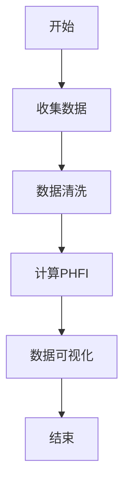
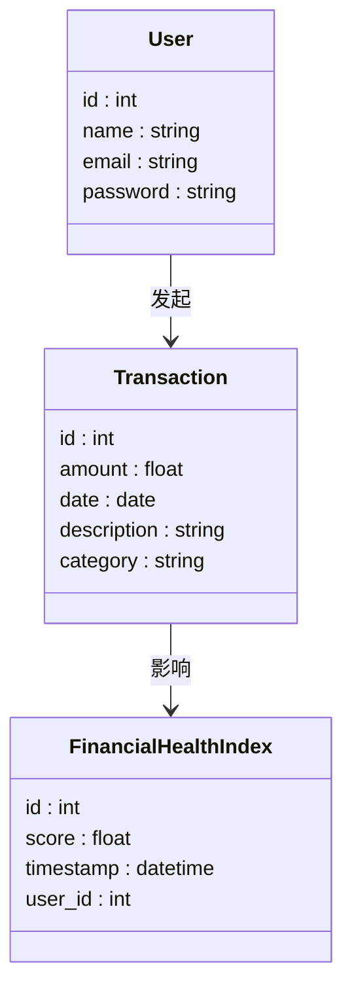

                 


```markdown
# 个人财务健康指数动态跟踪系统

> 关键词：个人财务健康指数，动态跟踪，财务分析，系统设计，Python实现，用户交互

> 摘要：本文详细介绍了个人财务健康指数动态跟踪系统的开发过程，从概念定义、算法原理到系统架构设计，再到项目实现和最佳实践，为读者提供全面的技术指导。

---

# 第1章: 财务健康指数的背景与概念

## 1.1 财务健康指数的定义与重要性

### 1.1.1 什么是个人财务健康指数
个人财务健康指数（PHFI，Personal Financial Health Index）是衡量个人财务状况的综合指标，反映了收入、支出、资产和负债之间的平衡关系。

### 1.1.2 财务健康指数的重要性
- 帮助个人了解财务状况，优化支出结构。
- 为投资决策提供数据支持。
- 提供风险预警，避免财务危机。

### 1.1.3 财务健康指数的计算方法
PHFI = (收入 - 支出) / 资产

---

## 1.2 财务健康指数的核心要素

### 1.2.1 收入与支出分析
- 收入：包括工资、投资收益等。
- 支出：包括日常生活支出、债务还款等。

### 1.2.2 资产与负债评估
- 资产：包括现金、房地产、投资等。
- 负债：包括贷款、信用卡欠款等。

### 1.2.3 财务目标与风险承受能力
- 财务目标：短期目标、长期目标。
- 风险承受能力：高风险、中风险、低风险。

---

## 1.3 财务健康指数的动态跟踪意义

### 1.3.1 动态跟踪的必要性
- 实时了解财务状况。
- 及时调整财务策略。

### 1.3.2 动态跟踪的实现方式
- 数据采集：自动同步银行流水、账单。
- 数据处理：清洗、计算、分析。

### 1.3.3 动态跟踪的用户价值
- 提供个性化建议。
- 预警财务风险。

---

## 1.4 本章小结

---

# 第2章: 财务健康指数的核心概念与联系

## 2.1 核心概念原理

### 2.1.1 财务健康指数的数学模型
$$ PHFI = \frac{\text{收入} - \text{支出}}{\text{资产}} $$

### 2.1.2 财务健康指数的属性特征

| 属性 | 特征 |
|------|------|
| 输入数据 | 收入、支出、资产、负债 |
| 输出结果 | 0到1之间的数值（越接近1，财务状况越好） |
| 计算频率 | 按月或按需 |

---

## 2.2 核心概念对比分析

### 2.2.1 收入与支出对比
- 收入 > 支出：盈余。
- 收入 < 支出：赤字。

### 2.2.2 资产与负债对比
- 资产 > 负债：净资产为正。
- 资产 < 负债：净资产为负。

### 2.2.3 风险与收益对比
- 高风险：高收益。
- 低风险：低收益。

---

## 2.3 ER实体关系图

```mermaid
erDiagram
    user {
        id : int
        name : string
        email : string
        password : string
    }
    transaction {
        id : int
        amount : float
        date : date
        description : string
        category : string
    }
    financial_health_index {
        id : int
        score : float
        timestamp : datetime
        user_id : int
    }
    user --> transaction : 发起
    transaction --> financial_health_index : 影响
```

---

## 2.4 本章小结

---

# 第3章: 财务健康指数的算法原理

## 3.1 算法原理概述

### 3.1.1 算法的数学模型
$$ PHFI = \frac{\sum (\text{收入}_i - \text{支出}_i)}{\sum \text{资产}_j} $$

### 3.1.2 算法流程
1. 收集数据：收入、支出、资产、负债。
2. 数据清洗：处理缺失值、异常值。
3. 计算PHFI：使用数学模型计算指数。
4. 数据可视化：生成图表，展示财务状况。

---

## 3.2 算法实现

### 3.2.1 Python实现代码
```python
def calculate_phfi(income, expenses, assets):
    net_income = sum(income) - sum(expenses)
    total_assets = sum(assets)
    phfi = net_income / total_assets if total_assets != 0 else 0
    return phfi
```

### 3.2.2 算法流程图


---

## 3.3 本章小结

---

# 第4章: 系统分析与架构设计

## 4.1 问题场景介绍

### 4.1.1 用户需求
- 用户需要实时了解自己的财务状况。
- 用户需要个性化的财务建议。

### 4.1.2 系统功能需求
- 用户登录与注册。
- 数据录入与同步。
- 财务健康指数计算与展示。

---

## 4.2 系统功能设计

### 4.2.1 领域模型设计


### 4.2.2 系统架构设计


---

## 4.3 系统接口设计

### 4.3.1 API接口
- 用户登录：`POST /api/login`
- 数据录入：`POST /api/transaction`
- 指数查询：`GET /api/health-index`

---

## 4.4 本章小结

---

# 第5章: 项目实战

## 5.1 环境安装

### 5.1.1 安装Python
```bash
python --version
pip install requests pandas matplotlib
```

## 5.2 系统核心实现

### 5.2.1 核心代码实现
```python
import pandas as pd
import matplotlib.pyplot as plt

def calculate_phfi(income, expenses, assets):
    net_income = sum(income) - sum(expenses)
    total_assets = sum(assets)
    phfi = net_income / total_assets if total_assets != 0 else 0
    return phfi

def visualize_phfi(phfi_scores):
    plt.plot(phfi_scores, label='PHFI 趋势')
    plt.xlabel('时间')
    plt.ylabel('PHFI 值')
    plt.legend()
    plt.show()
```

### 5.2.2 系统功能实现
- 用户登录与注册。
- 数据录入与同步。
- 财务健康指数计算与展示。

## 5.3 实际案例分析

### 5.3.1 案例数据
```python
income = [30000, 30000]
expenses = [20000, 22000]
assets = [100000, 50000]
phfi = calculate_phfi(income, expenses, assets)
print(phfi)  # 输出：0.18
```

## 5.4 项目小结

---

# 第6章: 最佳实践与总结

## 6.1 小结
- 个人财务健康指数是衡量财务状况的重要指标。
- 系统动态跟踪能够帮助用户实时了解财务状况。

## 6.2 注意事项
- 数据安全：保护用户隐私。
- 系统稳定性：确保数据准确性和计算及时性。

## 6.3 拓展阅读
- 《个人财务管理的艺术》
- 《数据可视化入门》

---

# 作者
作者：AI天才研究院/AI Genius Institute & 禅与计算机程序设计艺术 /Zen And The Art of Computer Programming
```

