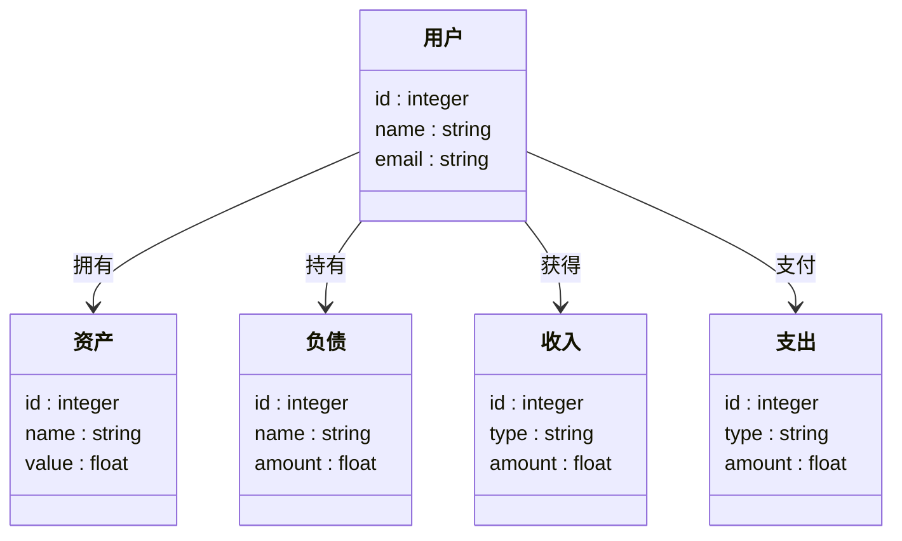
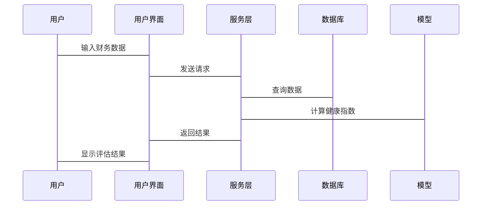

                 


# 个人财务健康指数开发与应用

> 关键词：个人财务健康指数、财务评估、资产负债分析、风险管理、数据科学

> 摘要：个人财务健康指数是衡量个人财务状况的重要工具，通过分析资产、负债、收入和支出等关键指标，评估个人的财务健康状况。本文从概念、算法、系统架构到项目实战，全面解析个人财务健康指数的开发与应用，帮助读者掌握如何利用技术手段实现个性化的财务健康评估。

---

## 第1章: 个人财务健康指数的背景与概念

### 1.1 个人财务健康指数的背景介绍

#### 1.1.1 财务健康评估的起源
个人财务健康指数的概念起源于人们对自身财务状况的关注。随着经济全球化和金融产品的多样化，个人财务管理变得越来越复杂，人们需要一种简单明了的方式评估自己的财务健康状况。

#### 1.1.2 个人财务健康指数的定义与目标
个人财务健康指数是一种通过量化分析个人资产、负债、收入和支出等关键指标，评估个人财务健康状况的综合指数。其目标是帮助个人了解自己的财务状况，制定合理的财务规划，并及时发现和解决问题。

#### 1.1.3 当前社会对个人财务健康指数的需求
在当前经济环境下，个人财务管理的重要性日益凸显。无论是投资、借贷还是日常消费，都需要对个人财务状况有清晰的了解。个人财务健康指数作为一种量化工具，能够为个人提供科学的财务评估依据，帮助其做出更明智的财务决策。

### 1.2 个人财务健康指数的核心要素

#### 1.2.1 资产与负债的评估
资产包括现金、存款、房产、股票等，负债包括贷款、信用卡欠款等。通过分析资产与负债的比值，可以评估个人的财务安全性。

#### 1.2.2 收入与支出的分析
收入是个人的经济来源，支出是日常消费和债务还款。通过分析收入与支出的匹配程度，可以评估个人的财务流动性。

#### 1.2.3 风险承受能力的衡量
通过分析个人的财务状况，评估其在面对突发经济困难时的应对能力。

#### 1.2.4 财务目标与规划的关联
个人财务健康指数需要与长期财务目标（如购房、子女教育、退休规划等）相结合，才能更好地指导个人财务管理。

### 1.3 个人财务健康指数的边界与外延

#### 1.3.1 指数的适用范围
适用于个人或家庭的财务评估，但不适用于企业或其他组织。

#### 1.3.2 指数的局限性
个人财务健康指数是一种量化工具，其结果仅供参考，不能完全反映个人的财务状况。此外，不同人群的财务目标和风险承受能力不同，指数需要根据具体情况调整。

#### 1.3.3 相关概念的区分与联系
与个人信用评分、净资产收益率等其他财务指标的区别与联系。

---

## 第2章: 个人财务健康指数的核心概念与联系

### 2.1 财务健康指数的原理

#### 2.1.1 数据采集与处理
通过问卷调查、银行流水、财务报表等方式采集个人财务数据，并进行清洗和标准化处理。

#### 2.1.2 指标计算与权重分配
根据财务健康指数的定义，选择关键指标并赋予相应的权重，计算综合指数。

#### 2.1.3 综合评估与结果呈现
将计算出的综合指数与行业标准或个人目标进行对比，得出财务健康状况的评估结果。

### 2.2 核心概念的属性对比

#### 2.2.1 动态性与静态性对比
| 属性   | 动态性          | 静态性          |
|--------|----------------|----------------|
| 定义   | 数据随时间变化 | 数据固定       |
| 示例   | 收入与支出      | 资产与负债      |

#### 2.2.2 主观性与客观性对比
| 属性   | 主观性          | 客观性          |
|--------|----------------|----------------|
| 定义   | 依赖个人判断   | 依赖客观数据    |
| 示例   | 财务目标        | 资产与负债      |

#### 2.2.3 简单性与复杂性对比
| 属性   | 简单性          | 复杂性          |
|--------|----------------|----------------|
| 定义   | 易于理解和计算 | 需要复杂模型     |
| 示例   | 资产负债比      | 风险承受能力评估 |

### 2.3 实体关系图（ER图）

```mermaid
erDiagram
    user {
        id : integer
        name : string
        email : string
    }
    asset {
        id : integer
        name : string
        value : float
    }
    liability {
        id : integer
        name : string
        amount : float
    }
    income {
        id : integer
        type : string
        amount : float
    }
    expense {
        id : integer
        type : string
        amount : float
    }
    user
    o--- asset : owns
    o--- liability : owes
    o--- income : earns
    o--- expense : spends
```

---

## 第3章: 个人财务健康指数的算法原理

### 3.1 数据预处理与特征选择

#### 3.1.1 数据清洗
去除重复数据、处理缺失值、异常值。

#### 3.1.2 特征选择
选择对财务健康指数影响较大的指标，如资产总额、负债总额、收入与支出比等。

### 3.2 指数计算模型

#### 3.2.1 线性回归模型
$$ \text{健康指数} = w_1 \times \text{资产} + w_2 \times \text{负债} + w_3 \times \text{收入} + w_4 \times \text{支出} $$

其中，权重 $w_1, w_2, w_3, w_4$ 通过机器学习算法训练得出。

#### 3.2.2 模型训练
使用历史数据训练模型，调整权重以最小化预测误差。

#### 3.2.3 模型评估
通过交叉验证评估模型的准确性和稳定性。

### 3.3 算法实现

#### 3.3.1 数据预处理代码
```python
import pandas as pd

# 假设 data 是原始数据
data = pd.DataFrame({
    '资产': [100000, 80000, 120000],
    '负债': [50000, 60000, 40000],
    '收入': [60000, 70000, 50000],
    '支出': [40000, 50000, 30000]
})

# 处理缺失值
data.dropna(inplace=True)
```

#### 3.3.2 模型训练代码
```python
from sklearn.linear_model import LinearRegression

# 特征矩阵
X = data[['资产', '负债', '收入', '支出']]
# 标签向量
y = data['健康指数']  # 假设 data 中已有 '健康指数' 列

model = LinearRegression()
model.fit(X, y)
```

### 3.4 数学模型

#### 3.4.1 损失函数
$$ \text{损失函数} = \frac{1}{2m} \sum_{i=1}^{m} (y_i - \hat{y_i})^2 $$

其中，$m$ 是样本数量，$y_i$ 是真实值，$\hat{y_i}$ 是预测值。

#### 3.4.2 优化方法
使用梯度下降算法优化权重：
$$ w_j := w_j - \alpha \frac{\partial L}{\partial w_j} $$

其中，$\alpha$ 是学习率，$\frac{\partial L}{\partial w_j}$ 是损失函数对权重 $w_j$ 的偏导数。

---

## 第4章: 个人财务健康指数的系统分析与架构设计

### 4.1 问题场景介绍

#### 4.1.1 问题背景
用户希望通过输入个人财务数据，获得一个综合的财务健康指数。

#### 4.1.2 项目介绍
开发一个基于网络的个人财务健康指数评估系统，提供用户友好的界面和准确的评估结果。

### 4.2 系统功能设计

#### 4.2.1 领域模型


#### 4.2.2 系统架构
```mermaid
rectangle 数据库 {
    用户表
    资产表
    负债表
    收入表
    支出表
}
class 用户界面 {
    输入财务数据
    查看评估结果
}
class 服务层 {
    数据处理
    模型计算
}
```

#### 4.2.3 接口设计
- 用户接口：HTTP POST 请求，传递财务数据。
- 服务接口：调用机器学习模型进行计算。

#### 4.2.4 交互流程


---

## 第5章: 个人财务健康指数的项目实战

### 5.1 环境安装

#### 5.1.1 安装Python
```bash
python --version
pip install --upgrade pip
```

#### 5.1.2 安装依赖库
```bash
pip install pandas scikit-learn
```

### 5.2 核心代码实现

#### 5.2.1 数据预处理
```python
import pandas as pd

data = pd.read_csv('financial_data.csv')
data.dropna(inplace=True)
```

#### 5.2.2 模型训练
```python
from sklearn.linear_model import LinearRegression

X = data[['资产', '负债', '收入', '支出']]
y = data['健康指数']

model = LinearRegression()
model.fit(X, y)
```

### 5.3 案例分析

#### 5.3.1 数据输入
```python
new_data = pd.DataFrame({
    '资产': [200000],
    '负债': [70000],
    '收入': [80000],
    '支出': [50000]
})
```

#### 5.3.2 模型预测
```python
prediction = model.predict(new_data)
print(f'预测的健康指数为：{prediction[0]:.2f}')
```

### 5.4 小结

通过实际案例分析，我们可以看到个人财务健康指数在实际应用中的潜力。通过模型的不断优化和数据的积累，指数的准确性和实用性将不断提高。

---

## 第6章: 个人财务健康指数的最佳实践

### 6.1 小结
个人财务健康指数是一种科学的财务评估工具，能够帮助个人更好地管理财务状况。

### 6.2 注意事项
- 数据的准确性和完整性直接影响评估结果。
- 指数只是一个参考工具，不能完全替代专业的财务建议。
- 定期更新和优化模型以适应变化的经济环境。

### 6.3 拓展阅读
推荐阅读《个人财务管理的艺术》、《数据科学与金融》等书籍，深入了解财务管理和数据科学的结合应用。

---

## 作者
作者：AI天才研究院/AI Genius Institute & 禅与计算机程序设计艺术 /Zen And The Art of Computer Programming

