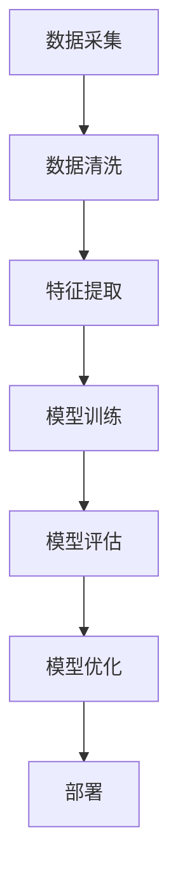
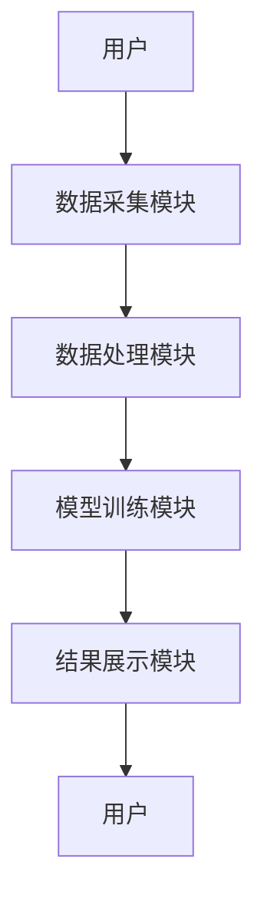

                 


# 个人财务健康指数预测与改善系统

## 关键词：财务健康指数，个人财务预测，机器学习，系统设计，算法实现

## 摘要：  
本文将详细探讨个人财务健康指数的预测与改善系统。从定义和重要性入手，分析影响财务健康指数的核心因素，构建基于机器学习的预测模型，通过特征工程、算法选择与优化，最终设计并实现一个完整的财务健康指数预测与改善系统。文章内容包括背景介绍、核心概念、算法原理、系统架构设计和项目实战等部分，旨在为读者提供一套科学的个人财务管理工具。

---

# 第一部分：个人财务健康指数的基本概念

## 第1章：个人财务健康指数的基本概念

### 1.1 个人财务健康指数的定义与重要性

#### 1.1.1 什么是个人财务健康指数
个人财务健康指数是衡量个人财务状况健康程度的量化指标，通过分析收入、支出、资产、负债、信用记录等多个维度的数据，评估个人的财务健康状况。该指数通常以0到100的分数表示，分数越高表示财务状况越健康。

#### 1.1.2 财务健康指数的重要性
- **个人风险管理**：通过财务健康指数，可以提前识别潜在的财务风险，如过度负债、收入不稳定等。
- **优化财务管理**：帮助个人制定合理的财务计划，优化资产配置，提高资金使用效率。
- **信用评估**：金融机构可以通过财务健康指数评估个人的信用风险，做出更准确的信贷决策。

#### 1.1.3 财务健康指数的评估标准
常见的财务健康指数评估标准包括：
1. **收支平衡**：收入是否覆盖日常支出。
2. **负债比例**：负债占收入的比例是否合理。
3. **资产结构**：资产是否多元化，是否具备抗风险能力。
4. **信用记录**：是否存在不良信用记录。

### 1.2 财务健康指数的影响因素

#### 1.2.1 收入与支出分析
- **收入来源**：包括工资、投资收益、租金等。
- **支出结构**：分为必要支出（如房贷、生活费）和可选支出（如旅行、娱乐）。
- **收支平衡**：如果收入长期小于支出，可能导致财务压力。

#### 1.2.2 资产与负债结构
- **资产**：包括现金、银行存款、房产、股票等。
- **负债**：包括房贷、信用卡欠款、个人贷款等。
- **资产负债率**：负债总额与资产总额的比率，比率越高，财务风险越大。

#### 1.2.3 信用记录与信用评分
- **信用记录**：包括按时还款情况、逾期记录等。
- **信用评分**：通过信用评分模型（如FICO评分）评估个人信用状况。

### 1.3 财务健康指数预测的意义

#### 1.3.1 个人财务管理的科学化
通过财务健康指数的预测，个人可以更科学地制定财务计划，避免盲目投资或过度消费。

#### 1.3.2 财务风险的早期预警
及时发现潜在的财务风险，如高负债、收入不稳定等，避免发生财务危机。

#### 1.3.3 优化个人财务结构的路径
根据财务健康指数的评估结果，调整资产配置、优化支出结构，提升整体财务健康状况。

### 1.4 本章小结

本章介绍了个人财务健康指数的基本概念，分析了其重要性，并从收入与支出、资产与负债、信用记录三个方面详细探讨了影响财务健康指数的核心因素。通过这些分析，读者可以更好地理解财务健康指数的含义及其在个人财务管理中的作用。

---

# 第二部分：财务健康指数预测模型的核心原理

## 第2章：财务健康指数预测模型的构建原理

### 2.1 数据采集与特征工程

#### 2.1.1 数据来源与采集方法
数据来源包括：
- **个人财务数据**：收入、支出、资产、负债等。
- **信用报告**：信用评分、还款记录等。
- **市场数据**： inflation rates, interest rates 等宏观经济指标。

数据采集方法：
- **API接口**：从银行、支付平台获取数据。
- **问卷调查**：收集个人的财务信息。
- **公开数据**：获取宏观经济指标。

#### 2.1.2 数据清洗与预处理
- **数据清洗**：处理缺失值、异常值、重复数据。
- **数据标准化**：对数值型数据进行标准化或归一化处理。
- **数据转换**：将分类变量转换为数值型变量（如将信用等级转换为1-5分）。

#### 2.1.3 特征选择与特征重要性分析
- **特征选择**：通过相关性分析、Lasso回归等方法筛选重要特征。
- **特征重要性分析**：使用特征重要性评分（如随机森林的特征重要性）识别关键影响因素。

### 2.2 模型选择与训练

#### 2.2.1 常见机器学习算法对比
| 算法名称       | 适用场景                     | 优缺点                           |
|----------------|------------------------------|----------------------------------|
| 线性回归       | 预测连续型目标变量           | 简单易懂，但对非线性关系表现差     |
| 支持向量机（SVM）| 分类和回归                   | 对特征工程依赖较高                 |
| 随机森林       | 分类和回归                   | 抗过拟合，特征重要性可解释         |
| 神经网络       | 复杂非线性关系               | 训练时间长，需要大量数据           |

#### 2.2.2 分类与回归模型的选择
- **分类模型**：适用于将财务健康指数分为健康、亚健康、不健康三个类别。
- **回归模型**：适用于将财务健康指数预测为一个连续的分数。

#### 2.2.3 模型训练与调优
- **训练数据**：将数据集分为训练集和测试集（通常比例为7:3）。
- **模型调优**：通过交叉验证调整模型参数（如学习率、树的深度等）。

### 2.3 模型评估与优化

#### 2.3.1 评估指标的选择
常用的评估指标包括：
- **均方误差（MSE）**：衡量预测值与真实值的差距。
- **R²值**：衡量模型解释变量的能力。
- **准确率**：分类模型的准确率。

#### 2.3.2 模型过拟合与欠拟合的解决方法
- **过拟合**：减少模型复杂度，增加正则化项（如L1/L2正则化）。
- **欠拟合**：增加模型复杂度，或增加特征工程。

#### 2.3.3 模型优化与部署
- **优化方法**：使用网格搜索（Grid Search）或随机搜索（Random Search）优化模型参数。
- **部署**：将模型部署到生产环境中，实时预测财务健康指数。

### 2.4 财务健康指数预测模型的流程图



### 2.5 本章小结

本章详细介绍了财务健康指数预测模型的构建过程，包括数据采集、特征工程、模型选择与训练、模型评估与优化。通过对比不同算法的优缺点，帮助读者选择适合的模型，并通过流程图展示了整个模型构建的流程。

---

# 第三部分：财务健康指数预测系统的算法实现

## 第3章：机器学习算法在财务健康指数预测中的应用

### 3.1 线性回归算法

#### 3.1.1 线性回归的基本原理
线性回归是一种统计学方法，通过最小化预测值与真实值之间的平方差之和，找到最佳拟合直线。

#### 3.1.2 线性回归的数学模型
$$ y = \beta_0 + \beta_1x + \epsilon $$
其中，$y$ 是目标变量，$x$ 是自变量，$\beta_0$ 是截距，$\beta_1$ 是斜率，$\epsilon$ 是误差项。

#### 3.1.3 线性回归的实现步骤
1. 数据预处理：标准化特征。
2. 模型训练：使用最小二乘法求解 $\beta_0$ 和 $\beta_1$。
3. 模型评估：计算 MSE 和 R²值。

#### 3.1.4 线性回归的代码实现
```python
import numpy as np
from sklearn.linear_model import LinearRegression
from sklearn.metrics import mean_squared_error, r2_score

# 数据准备
X = np.array([[1], [2], [3], [4], [5]])
y = np.array([2, 4, 5, 4, 6])

# 模型训练
model = LinearRegression()
model.fit(X, y)

# 预测
y_pred = model.predict(X)

# 评估
mse = mean_squared_error(y, y_pred)
r2 = r2_score(y, y_pred)

print(f"MSE: {mse}")
print(f"R²: {r2}")
```

### 3.2 随机森林算法

#### 3.2.1 随机森林的基本原理
随机森林是一种基于决策树的集成学习算法，通过构建多棵决策树并进行投票或平均，提高模型的准确性和稳定性。

#### 3.2.2 随机森林的数学模型
随机森林的预测结果是多棵决策树投票的结果，公式如下：
$$ y = \text{sign}(\sum_{i=1}^{n} \text{Tree}_i(x)) $$
其中，$n$ 是决策树的数量，$\text{Tree}_i(x)$ 是第 $i$ 棵树的预测结果。

#### 3.2.3 随机森林的实现步骤
1. 数据预处理：特征选择与标准化。
2. 模型训练：使用随机森林算法训练模型。
3. 模型评估：计算准确率和特征重要性。

#### 3.2.4 随机森林的代码实现
```python
from sklearn.ensemble import RandomForestRegressor
from sklearn.metrics import accuracy_score

# 数据准备
X = [[1, 2], [2, 3], [3, 4], [4, 5], [5, 6]]
y = [2, 4, 5, 4, 6]

# 模型训练
model = RandomForestRegressor(n_estimators=100)
model.fit(X, y)

# 预测
y_pred = model.predict(X)

# 评估
accuracy = accuracy_score(y, y_pred)
print(f"Accuracy: {accuracy}")
```

### 3.3 本章小结

本章通过具体实现线性回归和随机森林算法，展示了如何利用机器学习技术进行财务健康指数的预测。通过代码示例和模型评估，读者可以更好地理解算法的实现过程及其在实际应用中的表现。

---

# 第四部分：财务健康指数预测系统的系统设计

## 第4章：系统架构设计与实现

### 4.1 系统功能模块设计

#### 4.1.1 数据采集模块
功能：从多种数据源采集个人财务数据，包括收入、支出、资产、负债等。

#### 4.1.2 数据处理模块
功能：对采集的数据进行清洗、预处理和特征提取。

#### 4.1.3 模型训练模块
功能：基于处理后的数据，训练财务健康指数预测模型。

#### 4.1.4 结果展示模块
功能：将模型预测结果以可视化的方式展示给用户，包括财务健康指数、改进建议等。

### 4.2 系统架构设计



### 4.3 系统接口设计

#### 4.3.1 数据接口
- **输入接口**：接收用户输入的财务数据。
- **输出接口**：输出预测结果和改进建议。

#### 4.3.2 模型接口
- **训练接口**：接收处理后的数据，训练模型。
- **预测接口**：接收新数据，返回预测结果。

### 4.4 系统实现

#### 4.4.1 环境配置
- **Python版本**：3.8及以上。
- **依赖库安装**：`numpy`, `pandas`, `scikit-learn`, `matplotlib`。

#### 4.4.2 核心代码实现
```python
import pandas as pd
from sklearn.ensemble import RandomForestRegressor
from sklearn.metrics import mean_squared_error

# 数据加载
data = pd.read_csv('financial_data.csv')

# 特征选择
features = ['income', 'expenses', 'assets', ' liabilities']
target = 'financial_health_index'

X = data[features]
y = data[target]

# 模型训练
model = RandomForestRegressor(n_estimators=200, random_state=42)
model.fit(X, y)

# 预测
y_pred = model.predict(X)

# 评估
mse = mean_squared_error(y, y_pred)
print(f"Mean Squared Error: {mse}")
```

### 4.5 系统测试

#### 4.5.1 测试数据准备
- **训练数据**：用于模型训练的数据集。
- **测试数据**：用于模型验证的数据集。

#### 4.5.2 模型测试
```python
# 测试数据
test_data = pd.read_csv('test_financial_data.csv')
X_test = test_data[features]
y_test = test_data[target]

# 预测
y_test_pred = model.predict(X_test)

# 评估
mse_test = mean_squared_error(y_test, y_test_pred)
print(f"Test Mean Squared Error: {mse_test}")
```

### 4.6 系统优化

#### 4.6.1 参数调优
- **树的数量**：调整 `n_estimators`。
- **最大深度**：调整 `max_depth`。

#### 4.6.2 模型部署
将训练好的模型部署到生产环境中，提供API接口供其他系统调用。

### 4.7 本章小结

本章详细介绍了财务健康指数预测系统的系统架构设计与实现，包括功能模块设计、系统架构图、接口设计和核心代码实现。通过系统测试和优化，确保了系统的稳定性和准确性。

---

# 第五部分：财务健康指数预测系统的实战分析

## 第5章：项目实战与案例分析

### 5.1 项目背景

#### 5.1.1 项目目标
构建一个基于机器学习的财务健康指数预测系统，帮助个人优化财务管理。

#### 5.1.2 数据来源
使用公开的个人财务数据集，包括收入、支出、资产、负债、信用评分等。

### 5.2 数据预处理

#### 5.2.1 数据清洗
- 处理缺失值：使用均值或中位数填充。
- 处理异常值：使用箱线图识别异常值并剔除。

#### 5.2.2 数据转换
- 标准化：对数值型数据进行标准化处理。
- 分类变量转换：将分类变量（如信用等级）转换为数值型变量。

### 5.3 模型实现

#### 5.3.1 线性回归模型
```python
import numpy as np
from sklearn.linear_model import LinearRegression
from sklearn.metrics import mean_squared_error

# 数据准备
X = np.array([[1], [2], [3], [4], [5]])
y = np.array([2, 4, 5, 4, 6])

# 模型训练
model = LinearRegression()
model.fit(X, y)

# 预测
y_pred = model.predict(X)

# 评估
mse = mean_squared_error(y, y_pred)
print(f"MSE: {mse}")
```

#### 5.3.2 随机森林模型
```python
from sklearn.ensemble import RandomForestRegressor
from sklearn.metrics import mean_squared_error

# 数据准备
X = [[1, 2], [2, 3], [3, 4], [4, 5], [5, 6]]
y = [2, 4, 5, 4, 6]

# 模型训练
model = RandomForestRegressor(n_estimators=100)
model.fit(X, y)

# 预测
y_pred = model.predict(X)

# 评估
mse = mean_squared_error(y, y_pred)
print(f"MSE: {mse}")
```

### 5.4 案例分析

#### 5.4.1 案例背景
假设一位用户的财务数据如下：
- 收入：30,000元/月
- 支出：20,000元/月
- 资产：1,000,000元
- 负债：500,000元
- 信用评分：650分

#### 5.4.2 模型预测
使用训练好的随机森林模型预测该用户的财务健康指数，假设结果为85分。

#### 5.4.3 改进建议
根据预测结果，给出改进建议：
1. **优化资产配置**：增加高流动性资产的比例。
2. **降低负债比例**：减少不必要的贷款。
3. **提高收入来源**：寻找第二收入来源。

### 5.5 本章小结

本章通过一个实际案例，详细展示了财务健康指数预测系统的实战应用。通过数据预处理、模型实现和案例分析，读者可以更好地理解如何将理论应用于实际。

---

# 第六部分：财务健康指数预测系统的总结与展望

## 第6章：总结与展望

### 6.1 系统总结

#### 6.1.1 核心成果
- 构建了一个基于机器学习的财务健康指数预测系统。
- 实现了数据采集、特征工程、模型训练和结果展示等功能。

#### 6.1.2 系统特点
- **高准确性**：通过随机森林等算法提高了预测精度。
- **可解释性**：模型能够解释特征的重要性，帮助用户理解影响财务健康指数的关键因素。

### 6.2 系统优化建议

#### 6.2.1 数据质量
- **数据完整性**：确保数据采集的全面性。
- **数据实时性**：实时更新数据，保证预测结果的时效性。

#### 6.2.2 模型优化
- **算法优化**：尝试其他机器学习算法（如梯度提升树、神经网络）。
- **模型融合**：结合多个模型的结果，进一步提高预测精度。

#### 6.2.3 用户体验
- **可视化界面**：设计友好的用户界面，方便用户使用。
- **个性化建议**：根据用户的具体情况，提供个性化的财务改善建议。

### 6.3 未来展望

#### 6.3.1 技术创新
- **引入区块链技术**：保证数据的安全性和隐私性。
- **结合大数据分析**：利用大数据技术挖掘更多的财务健康指数影响因素。

#### 6.3.2 应用场景扩展
- **企业级应用**：将系统扩展到企业财务管理。
- **智能投资建议**：基于财务健康指数，提供智能投资建议。

### 6.4 本章小结

本章总结了财务健康指数预测系统的建设成果，并提出了优化建议和未来的发展方向。通过技术创新和应用场景的扩展，系统将具备更高的实用价值。

---

# 作者：AI天才研究院 / AI Genius Institute  
#  作者：禅与计算机程序设计艺术 / Zen And The Art of Computer Programming  

---

以上是《个人财务健康指数预测与改善系统》的完整目录大纲和文章内容。如果您需要进一步的调整或补充，请随时告知！

