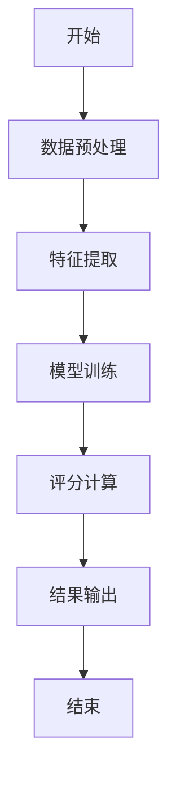
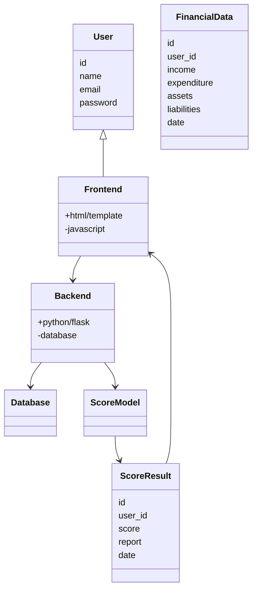
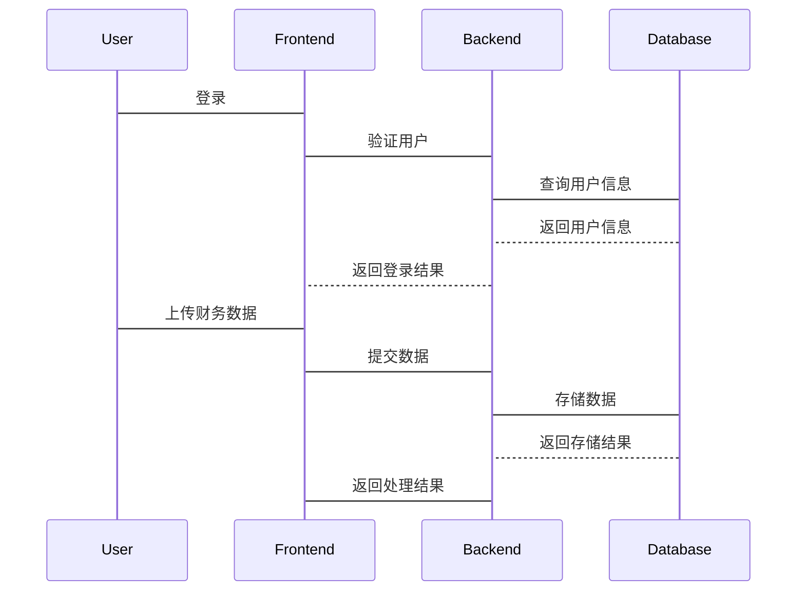

                 


# 《个人财务健康评分系统设计》

> 关键词：个人财务健康评分系统，财务数据分析，评分模型设计，系统架构，项目实战，算法实现

> 摘要：本文详细介绍了个人财务健康评分系统的背景、设计原理、算法实现、系统架构及项目实战。通过系统的分析与设计，结合实际案例，帮助读者理解如何通过技术手段评估和优化个人财务健康状况。

---

## 第1章: 个人财务健康评分系统背景与问题分析

### 1.1 个人财务健康评分系统背景

#### 1.1.1 个人财务管理的重要性

在现代生活中，个人财务管理是每个人不可忽视的重要技能。有效的财务管理不仅能够帮助个人实现财务目标，还能避免因财务问题带来的生活压力和风险。

#### 1.1.2 当前个人财务管理的痛点

- 数据分散：财务数据可能分布在不同的账户和平台，难以整合和分析。
- 缺乏系统性：个人通常缺乏系统化的财务管理工具，难以全面评估财务健康状况。
- 风险预警不足：个人难以及时发现潜在的财务风险，如过度负债、消费不合理等。

#### 1.1.3 财务健康评分系统的概念与目标

财务健康评分系统是一种通过收集和分析个人的财务数据，利用评分模型评估其财务健康状况的工具。其目标是帮助个人了解自身的财务状况，发现潜在问题，并提供改进建议。

---

### 1.2 财务健康评分系统的定义与作用

#### 1.2.1 财务健康评分的定义

财务健康评分是对个人的财务状况进行综合评估，通过量化指标计算得出的一个分数，反映个人的财务健康程度。

#### 1.2.2 财务健康评分的作用与意义

- 提供全面的财务健康评估：通过评分帮助个人了解自身的财务状况。
- 发现潜在问题：及时识别过度消费、负债过高、资产配置不合理等财务风险。
- 提供改进建议：根据评分结果，为个人提供优化财务结构的建议。

#### 1.2.3 系统的边界与外延

系统主要关注个人的财务数据，包括收入、支出、资产、负债等。不涉及企业或机构的财务数据。

---

### 1.3 系统的核心要素与组成

#### 1.3.1 财务数据的采集与处理

- 数据来源：银行账户、信用卡、投资理财平台等。
- 数据清洗：去除异常值、填补缺失值。
- 数据标准化：统一数据格式和单位。

#### 1.3.2 评分模型的设计与实现

- 指标选择：如收入与支出比例、资产与负债比例、消费结构合理性等。
- 指标权重：根据重要性赋予不同的权重。
- 计算方法：加权评分法。

#### 1.3.3 系统的用户界面与交互

- 用户登录与注册：方便用户管理个人数据。
- 数据输入与查询：用户可以输入或上传财务数据，查询评分结果。
- 评分结果展示：以图表或文字形式呈现评分结果和改进建议。

---

## 第2章: 核心概念与联系

### 2.1 财务健康评分模型的原理

#### 2.1.1 评分模型的构建方法

评分模型通常包括以下几个步骤：

1. **数据收集**：收集个人的财务数据。
2. **数据预处理**：清洗和标准化数据。
3. **特征提取**：提取关键财务指标。
4. **模型训练**：通过机器学习或统计方法训练评分模型。
5. **评分计算**：根据模型计算个人的财务健康评分。

#### 2.1.2 模型的输入与输出

- **输入**：个人的财务数据，如收入、支出、资产、负债等。
- **输出**：财务健康评分，如A、B、C、D、E五个等级。

#### 2.1.3 模型的评估与优化

- **评估指标**：准确率、召回率、F1分数等。
- **优化方法**：调整模型参数、增加特征、使用更复杂的算法。

---

### 2.2 核心概念对比表

| 指标 | 定义 | 重要性 | 示例 |
|------|------|--------|------|
| 收入与支出比例 | 收入与支出的比率 | 高 | 3:1 |
| 资产与负债比例 | 资产与负债的比率 | 高 | 2:1 |
| 消费结构 | 消费的分类及占比 | 中 | 餐饮、交通、娱乐 |
| 储蓄率 | 储蓄占收入的比例 | 高 | 30% |

---

### 2.3 ER实体关系图

```mermaid
erd
    User {
        id: integer
        name: string
        email: string
        password: string
    }
    FinancialData {
        id: integer
        user_id: integer
        income: float
        expenditure: float
        assets: float
        liabilities: float
        date: date
    }
    ScoreResult {
        id: integer
        user_id: integer
        score: integer
        report: string
        date: date
    }
    User --> FinancialData
    User --> ScoreResult
```

---

## 第3章: 财务健康评分模型的算法原理

### 3.1 评分模型的数学模型

#### 3.1.1 财务指标的加权计算公式

$$ \text{总评分} = \sum_{i=1}^{n} w_i \cdot x_i $$

其中，$w_i$ 是第 $i$ 个指标的权重，$x_i$ 是第 $i$ 个指标的评分。

---

### 3.2 算法流程图



---

### 3.3 算法实现代码

```python
def calculate_score(financial_data, weights):
    score = 0
    for i in range(len(financial_data)):
        score += weights[i] * financial_data[i]
    return score

# 示例权重
weights = [0.3, 0.3, 0.2, 0.1, 0.1]

# 示例财务数据
financial_data = [80, 60, 70, 50, 40]

# 计算评分
score = calculate_score(financial_data, weights)
print(f"财务健康评分为：{score}")
```

---

## 第4章: 系统分析与架构设计

### 4.1 问题场景介绍

个人用户需要对自己的财务状况进行评估，希望通过系统了解自身的财务健康状况，并获得改进建议。

---

### 4.2 项目介绍

#### 4.2.1 系统功能设计

- 用户管理：注册、登录、个人信息管理。
- 数据采集：手动输入或上传财务数据。
- 评分计算：根据模型计算财务健康评分。
- 结果展示：以图表或文字形式展示评分结果和改进建议。

#### 4.2.2 系统架构设计


---

### 4.3 系统架构图



---

### 4.4 系统接口设计

#### 4.4.1 用户接口

- 登录接口：`POST /api/login`
- 注册接口：`POST /api/register`
- 上传数据接口：`POST /api/upload`

#### 4.4.2 后端接口

- 数据处理接口：`POST /api/process`

---

### 4.5 系统交互流程图



---

## 第5章: 项目实战

### 5.1 环境安装

- Python 3.8+
- Flask
- Pandas
- Scikit-learn

---

### 5.2 核心代码实现

#### 5.2.1 数据预处理代码

```python
import pandas as pd

# 读取数据
data = pd.read_csv('financial_data.csv')

# 数据清洗
data.dropna(inplace=True)
data.drop_duplicates(inplace=True)

# 数据标准化
from sklearn.preprocessing import StandardScaler

scaler = StandardScaler()
scaled_data = scaler.fit_transform(data)
```

#### 5.2.2 模型训练代码

```python
from sklearn.linear_model import LinearRegression

model = LinearRegression()
model.fit(scaled_data, target_scores)
```

---

### 5.3 案例分析

#### 5.3.1 案例背景

假设用户小明的财务数据如下：

- 收入：30000元/月
- 支出：20000元/月
- 资产：100000元
- 负债：50000元

---

#### 5.3.2 计算评分

```python
financial_data = [30000, 20000, 100000, 50000]
weights = [0.3, 0.3, 0.2, 0.1, 0.1]

score = calculate_score(financial_data, weights)
print(f"小明的财务健康评分为：{score}")
```

---

### 5.4 项目总结

通过本项目，我们实现了个人财务健康评分系统的核心功能，包括数据采集、模型训练和评分计算。未来可以通过优化模型和增加更多功能，进一步提升系统的实用性和用户体验。

---

## 第6章: 最佳实践与扩展

### 6.1 总结与经验分享

- 定期更新财务数据，保持评分结果的准确性。
- 根据评分结果调整财务计划，优化资产配置。

---

### 6.2 注意事项

- 数据隐私保护：确保用户数据的安全性。
- 模型的可解释性：评分结果需要清晰明了，便于用户理解。

---

### 6.3 拓展阅读

- 《个人财务管理的艺术》
- 《数据驱动的财务分析》

---

## 附录

### 附录A: 数据字典

| 字段名 | 数据类型 | 描述 |
|------|------|------|
| id | integer | 数据唯一标识符 |
| user_id | integer | 用户标识符 |
| income | float | 收入 |
| expenditure | float | 支出 |
| assets | float | 资产 |
| liabilities | float | 负债 |
| date | date | 数据日期 |

---

## 作者：AI天才研究院/AI Genius Institute & 禅与计算机程序设计艺术 /Zen And The Art of Computer Programming

