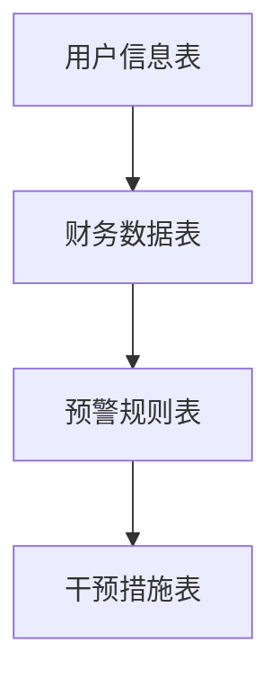
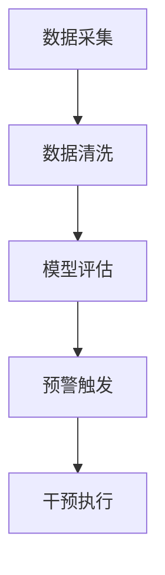
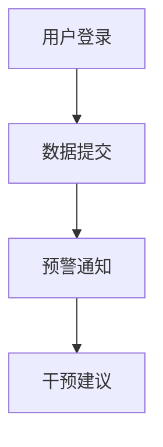

                 


# 个人财务健康预警与干预系统

**关键词：** 个人财务健康、预警系统、干预机制、算法设计、系统架构

**摘要：**  
本文探讨了个人财务健康预警与干预系统的构建，从问题背景到系统设计，详细阐述了系统的功能模块、算法原理、架构设计及实现方案。文章通过实际案例分析，展示了如何利用技术手段实现财务健康的有效管理，为个人用户提供智能化的财务预警和干预服务。

---

## 第一章：背景介绍

### 1.1 问题背景

在现代生活中，个人财务管理的重要性日益凸显。然而，许多人缺乏有效的财务管理工具和方法，导致财务问题频发。常见的问题包括过度消费、债务累积、资产配置不当等。这些问题不仅影响个人生活质量，还可能引发更大的经济危机。因此，建立一个能够实时监控财务状况、预警潜在风险并提供干预策略的系统显得尤为重要。

### 1.2 问题描述

个人财务健康预警与干预系统的目标是通过技术手段，帮助用户实时了解其财务状况，并在问题发生前发出预警，提供可行的干预措施。系统需要处理以下核心问题：

1. 如何采集和处理多源异构的财务数据？
2. 如何建立准确的财务健康评估模型？
3. 如何设计有效的预警和干预机制？

### 1.3 问题解决

本系统通过整合用户的收入、支出、资产、负债等数据，利用大数据分析和人工智能技术，构建财务健康评估模型，并根据评估结果触发预警和干预措施。例如，当用户的信用卡透支比例超过警戒线时，系统会自动发出通知，并建议用户调整消费计划。

### 1.4 边界与外延

系统的边界主要集中在个人用户的财务数据处理和管理上，不涉及企业或机构的财务系统。系统的外延则可以扩展到更多领域，如投资理财建议、税务优化等。

### 1.5 核心要素组成

- **用户信息管理**：包括用户的基本信息和授权。
- **财务数据分析**：涵盖收入、支出、资产、负债等多维度数据。
- **预警与干预机制**：基于数据分析结果，触发预警并执行干预措施。

---

## 第二章：核心概念与联系

### 2.1 核心概念解析

#### 2.1.1 财务健康评估模型

财务健康评估模型是系统的核心，通过多维度指标评估用户的财务状况。模型主要包含以下指标：

- **收入支出比**：评估用户的消费合理性。
- **资产负债比**：衡量用户的财务杠杆风险。
- **储蓄率**：反映用户的财务储备情况。

#### 2.1.2 预警指标体系

系统根据用户的财务指标，设定不同级别的预警阈值。例如：

- **红色预警**：表示财务状况极度危险，需立即干预。
- **橙色预警**：表示财务状况恶化，需密切关注。
- **黄色预警**：表示财务状况不佳，需调整。

#### 2.1.3 干预策略制定

系统根据预警级别，自动触发干预措施。例如：

- **自动调整支出**：优化用户的消费计划。
- **智能投资建议**：推荐适合用户的理财产品。
- **债务重组**：帮助用户合理分配债务。

### 2.2 概念属性特征对比表格

| **指标**       | **定义**                                   | **权重** | **预警阈值** |
|----------------|------------------------------------------|----------|--------------|
| 收入支出比      | 收入与支出的比率                         | 0.4      | <1.5         |
| 资产负债比      | 资产与负债的比率                         | 0.3      | <0.3         |
| 储蓄率         | 储蓄占收入的比例                         | 0.3      | <5%          |

### 2.3 ER实体关系图

```mermaid
er
  actor: 用户
  entity: 用户信息
  entity: 财务数据
  entity: 预警规则
  entity: 干预措施
  relation: 用户 -> 用户信息
  relation: 用户 -> 财务数据
  relation: 财务数据 -> 预警规则
  relation: 预警规则 -> 干预措施
```

---

## 第三章：算法原理讲解

### 3.1 数据分析算法

#### 3.1.1 数据预处理

系统首先对用户的财务数据进行清洗和标准化处理，确保数据质量。例如，使用Python的pandas库进行数据清洗：

```python
import pandas as pd

# 数据加载
df = pd.read_csv('financial_data.csv')

# 删除重复数据
df.drop_duplicates(inplace=True)

# 填充缺失值
df['income'].fillna(df['income'].mean(), inplace=True)
```

#### 3.1.2 财务健康评估模型

模型采用线性回归算法，基于多维度数据预测用户的财务风险。公式如下：

$$
y = \beta_0 + \beta_1x_1 + \beta_2x_2 + \dots + \beta_nx_n + \epsilon
$$

其中，$y$ 表示财务风险评分，$x_i$ 表示各指标变量。

#### 3.1.3 预警触发逻辑

系统根据评估结果，判断是否触发预警。例如：

- 如果 $y > 0.8$，触发红色预警。
- 如果 $0.6 < y \leq 0.8$，触发橙色预警。
- 如果 $0.4 < y \leq 0.6$，触发黄色预警。
- 如果 $y \leq 0.4$，不触发预警。

---

## 第四章：系统分析与架构设计

### 4.1 功能模块设计

系统主要功能模块包括：

- **数据采集模块**：负责采集用户的财务数据。
- **数据处理模块**：对数据进行清洗和转换。
- **预警分析模块**：评估财务状况并触发预警。
- **干预执行模块**：根据预警结果执行干预措施。

### 4.2 系统架构设计

系统采用分层架构，包括数据层、业务逻辑层和用户界面层。

#### 4.2.1 数据层

数据层负责数据的存储和管理，采用关系型数据库：



#### 4.2.2 业务逻辑层

业务逻辑层负责数据处理和业务逻辑实现：



#### 4.2.3 用户界面层

用户界面层提供友好的操作界面：



---

## 第五章：项目实战

### 5.1 环境安装

需要安装以下工具：

- Python 3.8+
- Jupyter Notebook
- Pandas、Scikit-learn 等库
- MySQL 或 PostgreSQL 数据库

### 5.2 核心代码实现

以下是系统核心代码示例：

```python
import pandas as pd
from sklearn.linear_model import LinearRegression
import numpy as np

# 数据加载
df = pd.read_csv('financial_data.csv')

# 数据预处理
df.dropna(inplace=True)

# 模型训练
X = df[['income', 'expenses', 'assets', ' liabilities']]
y = df['risk_score']

model = LinearRegression()
model.fit(X, y)

# 预警判断
def trigger_warning(risk_score):
    if risk_score > 0.8:
        return '红色预警'
    elif 0.6 < risk_score <= 0.8:
        return '橙色预警'
    else:
        return '无预警'

# 示例预测
sample_data = np.array([[50000, 45000, 200000, 150000]])
prediction = model.predict(sample_data)
print(trigger_warning(prediction[0]))
```

### 5.3 案例分析

以一个用户为例，其收入为50000元，支出为45000元，资产为200000元，负债为150000元。模型预测其风险评分为0.75，触发橙色预警。系统会建议用户优化消费计划，并调整资产配置。

---

## 第六章：最佳实践与小结

### 6.1 最佳实践

- **数据隐私保护**：确保用户的财务数据安全。
- **系统维护**：定期更新模型和优化算法。
- **用户教育**：提高用户的财务知识和系统使用能力。

### 6.2 小结

本文详细探讨了个人财务健康预警与干预系统的构建过程，从问题背景到系统设计，再到算法实现和项目实战，为用户提供了一套完整的解决方案。通过技术手段，系统能够有效帮助用户管理财务健康，预防潜在风险。

---

**作者：AI天才研究院 & 禅与计算机程序设计艺术**  
**参考文献：**  
- 《机器学习实战》  
- 《软件体系结构》  
- 《数据挖掘导论》

