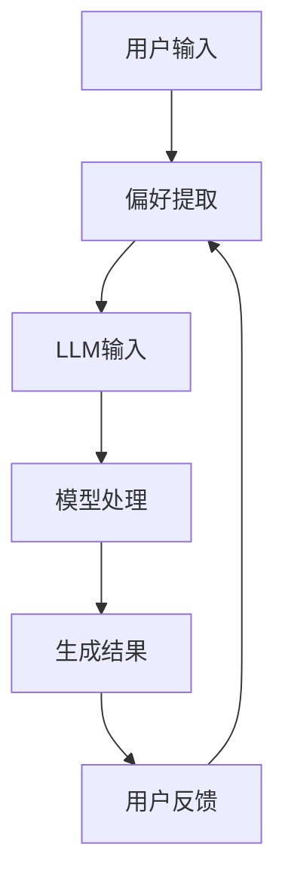
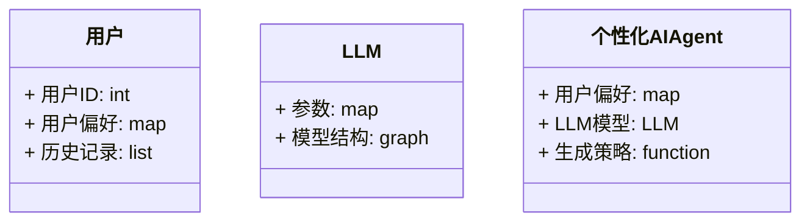
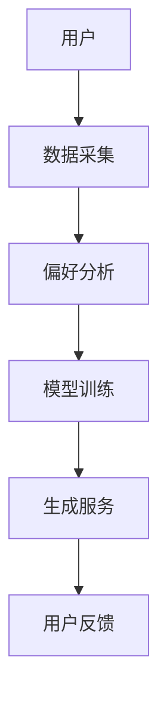

                 


# 个性化AI Agent：根据用户偏好定制LLM

## 关键词
个性化AI Agent、LLM、用户偏好、定制化训练、深度学习、NLP

## 摘要
个性化AI Agent是通过分析用户的偏好，定制大型语言模型（LLM）以提供更符合用户需求的服务。本文从背景、原理、系统架构、项目实战等方面深入探讨这一技术，结合实际案例和代码实现，为读者提供全面的视角。

---

# 第1章 个性化AI Agent的背景与概念

## 1.1 个性化AI Agent的基本概念
### 1.1.1 AI Agent的定义与特点
AI Agent是一种智能体，能够感知环境、理解需求并执行任务。其特点包括自主性、反应性、目标导向和学习能力。

### 1.1.2 个性化AI Agent的内涵
个性化AI Agent通过分析用户偏好，动态调整LLM的行为和输出，以提供更贴合用户需求的服务。

### 1.1.3 个性化AI Agent的核心要素
- 用户偏好：通过数据采集和分析获取用户的兴趣、习惯和需求。
- LLM：预训练或微调的大型语言模型，作为生成内容的核心。
- 个性化生成机制：根据用户偏好调整模型输出。

## 1.2 用户偏好在AI Agent中的作用
### 1.2.1 用户偏好的定义与分类
用户偏好是用户在行为、反馈或历史记录中表现出的兴趣点，可分为显式偏好（主动表达）和隐式偏好（通过行为推断）。

### 1.2.2 用户偏好在LLM中的应用
通过分析用户偏好，优化LLM的训练目标和生成策略，使其输出更符合用户期望。

### 1.2.3 个性化推荐与用户偏好的关联
个性化推荐是基于用户偏好生成的过程，AI Agent通过分析偏好数据，优化推荐结果。

## 1.3 个性化AI Agent的背景与发展趋势
### 1.3.1 人工智能与LLM的演进
从传统规则引擎到深度学习模型，AI技术的进步为个性化服务提供了基础。

### 1.3.2 个性化服务的需求增长
随着用户对个性化体验的需求增加，AI Agent在教育、医疗、金融等领域的应用日益广泛。

### 1.3.3 个性化AI Agent的未来发展
结合多模态数据和实时反馈，未来的个性化AI Agent将更加智能和灵活。

---

# 第2章 个性化AI Agent的核心概念与联系

## 2.1 核心概念原理
### 2.1.1 用户偏好的提取与分析
通过数据挖掘和自然语言处理技术，从用户行为和反馈中提取偏好特征。

### 2.1.2 LLM的定制化训练
基于用户偏好数据，对LLM进行微调，优化其生成能力。

### 2.1.3 个性化生成机制
根据用户偏好调整生成策略，确保输出内容更符合用户需求。

## 2.2 核心概念属性特征对比表
| 概念         | 属性             | 特征                           |
|--------------|------------------|--------------------------------|
| 用户偏好     | 数据来源         | 用户行为、反馈、历史记录       |
| LLM          | 模型类型         | 预训练模型、微调模型           |
| 个性化生成   | 方法             | 基于偏好调整生成策略           |

## 2.3 ER实体关系图
```mermaid
er
actor: 用户
preference: 用户偏好
llm: 大型语言模型
agent: 个性化AI Agent
user_feedback: 用户反馈
preference_analysis: 偏好分析
llm_training: 模型训练
generation: 生成结果
```

---

# 第3章 个性化AI Agent的算法原理

## 3.1 算法流程


## 3.2 算法实现代码
```python
def personalized_agent(user_input, model, user_preference):
    preference_vector = extract_preference(user_input)
    adjusted_model = adjust_model(model, preference_vector)
    output = generate(adjusted_model, user_input)
    return output

def extract_preference(user_input):
    # 使用NLP技术提取用户偏好
    pass

def adjust_model(model, preference_vector):
    # 根据偏好调整模型参数
    pass
```

## 3.3 数学模型与公式
模型调整基于偏好向量$P$，通过优化目标函数$F$：
$$
F = \sum_{i=1}^{n} (y_i - \hat{y}_i)^2
$$
其中，$y_i$为预测值，$\hat{y}_i$为真实值。

---

# 第4章 系统分析与架构设计

## 4.1 问题场景介绍
个性化AI Agent需要处理复杂的用户需求，涉及数据采集、模型训练和实时生成。

## 4.2 系统功能设计


## 4.3 系统架构设计


---

# 第5章 项目实战

## 5.1 环境安装
```bash
pip install transformers
pip install numpy
pip install scikit-learn
```

## 5.2 核心实现代码
```python
from transformers import AutoModelWithLMHead, AutoTokenizer
import numpy as np

def train_model(model, preference_vector, num_epochs=3):
    optimizer = torch.optim.Adam(model.parameters(), lr=1e-5)
    for epoch in range(num_epochs):
        for batch in dataloader:
            outputs = model(batch)
            loss = criterion(outputs, batch.label)
            optimizer.zero_grad()
            loss.backward()
            optimizer.step()
    return model
```

## 5.3 实际案例分析
以电商客服为例，分析如何通过用户偏好优化LLM生成的回复。

---

# 第6章 最佳实践与总结

## 6.1 最佳实践 tips
- 数据隐私保护：确保用户数据的安全性。
- 模型泛化能力：避免过拟合特定偏好。
- 实时反馈机制：及时调整生成策略。

## 6.2 项目小结
个性化AI Agent通过结合用户偏好和LLM技术，能够提供更智能化的服务。

## 6.3 展望与建议
未来，个性化AI Agent将结合多模态数据和实时反馈，进一步提升用户体验。

---

# 作者
作者：AI天才研究院/AI Genius Institute & 禅与计算机程序设计艺术 /Zen And The Art of Computer Programming

