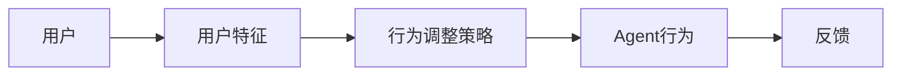
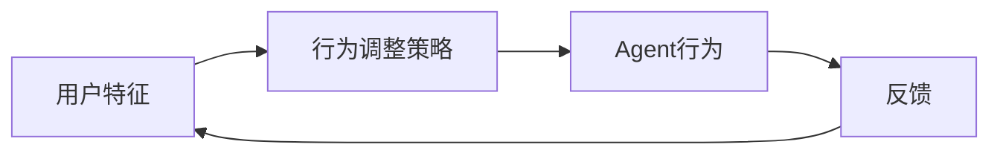
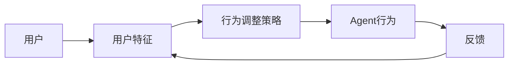

                 


# 个性化定制：为不同用户调整AI Agent的行为

## 关键词：
个性化定制、AI Agent、行为调整、用户需求、机器学习、深度学习、自然语言处理

## 摘要：
个性化定制AI Agent的行为是当前人工智能领域的研究热点。本文将从AI Agent的基本概念出发，探讨如何根据用户需求动态调整其行为。通过分析用户画像、行为模式和偏好，结合机器学习和自然语言处理技术，设计出一种基于强化学习和生成对抗网络的个性化定制方法，并提供详细的算法实现和系统架构设计方案。最后，通过实际案例分析，展示如何在不同场景下实现高效的个性化定制，确保AI Agent能够更好地服务于用户。

---

# 第1章: AI Agent与个性化定制概述

## 1.1 AI Agent的基本概念
### 1.1.1 AI Agent的定义与分类
AI Agent（人工智能代理）是一种能够感知环境、自主决策并执行任务的智能体。根据功能和应用场景的不同，AI Agent可以分为简单规则驱动型、基于机器学习的预测型和复杂推理型三类。

### 1.1.2 个性化定制的必要性
随着AI Agent的应用范围不断扩大，用户对AI Agent的需求日益多样化。不同用户在使用AI Agent时，可能有不同的偏好和需求，因此需要通过个性化定制来满足这些差异化的诉求。

### 1.1.3 个性化定制在AI Agent中的应用场景
个性化定制广泛应用于智能助手、推荐系统、对话系统等领域。例如，智能助手可以根据用户的使用习惯调整交互方式，推荐系统可以根据用户的偏好提供个性化的推荐结果。

## 1.2 个性化定制的核心问题
### 1.2.1 用户需求的多样性
用户需求具有动态性和多样性，同一用户在不同时间可能有不同的需求，不同用户之间也可能存在显著差异。

### 1.2.2 AI Agent行为调整的挑战
AI Agent的行为调整需要考虑数据的实时性、算法的高效性以及模型的可解释性等问题。

### 1.2.3 个性化定制的边界与外延
个性化定制的边界在于如何在尊重用户隐私和数据安全的前提下，最大限度地满足用户的个性化需求。外延则涉及如何将个性化定制技术与其他AI技术相结合。

## 1.3 个性化定制的技术背景
### 1.3.1 机器学习与深度学习的基础
机器学习和深度学习为个性化定制提供了技术支持，尤其是基于用户数据的特征提取和模型训练。

### 1.3.2 自然语言处理在AI Agent中的应用
自然语言处理技术使得AI Agent能够更好地理解用户的意图和情感，从而实现更个性化的交互。

### 1.3.3 个性化推荐系统的演变
个性化推荐系统从最初的基于协同过滤的方法，逐渐发展到基于深度学习的模型，为个性化定制提供了丰富的经验和技术积累。

## 1.4 本章小结
本章主要介绍了AI Agent的基本概念、个性化定制的必要性及其应用场景，并分析了个性化定制的核心问题和技术背景。

---

# 第2章: 个性化定制的核心概念与联系

## 2.1 用户画像与行为分析
### 2.1.1 用户画像的构建方法
用户画像是基于用户数据构建的用户特征描述，通常包括用户的基本信息、兴趣偏好、行为习惯等。

### 2.1.2 用户行为数据的采集与分析
通过收集用户的交互数据，分析用户的使用习惯和偏好，为个性化定制提供数据支持。

### 2.1.3 用户偏好与需求的动态变化
用户偏好和需求会随着时间推移而发生变化，因此个性化定制需要动态调整AI Agent的行为。

## 2.2 AI Agent行为调整的机制
### 2.2.1 基于规则的调整方法
基于规则的调整方法通过预定义的规则来调整AI Agent的行为，适用于场景简单、规则明确的情况。

### 2.2.2 基于模型的自适应调整
基于模型的调整方法通过训练模型来预测用户的偏好，并根据预测结果动态调整AI Agent的行为。

### 2.2.3 混合调整策略的设计
混合调整策略结合了基于规则和基于模型的调整方法，适用于场景复杂、规则动态变化的情况。

## 2.3 个性化定制的核心要素
### 2.3.1 用户特征提取
通过分析用户数据，提取用户的关键特征，为个性化定制提供输入。

### 2.3.2 行为调整策略
根据用户特征，制定AI Agent的行为调整策略，确保AI Agent能够满足用户的个性化需求。

### 2.3.3 反馈机制与优化
通过用户反馈不断优化AI Agent的行为，确保个性化定制的效果能够持续改进。

## 2.4 核心概念对比分析
### 2.4.1 不同个性化定制方法的对比
比较基于规则、基于模型和混合策略的优缺点，分析适用场景。

### 2.4.2 各种行为调整机制的优缺点
分析不同行为调整机制的优缺点，帮助读者更好地理解个性化定制的技术选择。

### 2.4.3 核心要素之间的关系
通过关系图展示用户特征、行为调整策略和反馈机制之间的关系。

## 2.5 实体关系图（ER图）


---

# 第3章: 个性化定制的算法原理

## 3.1 基于用户特征的模型调整
### 3.1.1 模型微调方法
通过在特定数据集上对模型进行微调，使其适应用户的个性化需求。

### 3.1.2 参数初始化与更新策略
根据用户特征初始化模型参数，并通过优化算法动态调整参数。

### 3.1.3 模型训练的数学表达
$$\text{损失函数} = \text{交叉熵损失} + \text{正则化项}$$
$$\text{优化目标} = \min_{\theta} \text{损失函数}$$

## 3.2 基于强化学习的行为调整
### 3.2.1 强化学习的基本原理
通过定义奖励函数，强化学习算法能够通过试错方式优化AI Agent的行为。

### 3.2.2 行为策略的优化方法
使用策略梯度算法或Q-learning算法优化行为策略。

### 3.2.3 奖励机制的设计
根据用户的反馈设计奖励函数，确保奖励能够准确反映用户的偏好。

## 3.3 基于生成对抗网络的定制方法
### 3.3.1 GAN的基本结构
生成器和判别器相互博弈，生成器生成符合用户需求的行为，判别器判断行为是否符合用户偏好。

### 3.3.2 在个性化定制中的应用
通过生成对抗网络生成多样化的用户行为，满足用户的个性化需求。

---

# 第4章: 系统架构与项目实战

## 4.1 系统架构设计
### 4.1.1 项目介绍
一个基于个性化定制的AI Agent系统，旨在为用户提供个性化的交互体验。

### 4.1.2 系统功能设计
- 用户特征采集模块
- 行为调整策略模块
- 反馈优化模块

### 4.1.3 系统架构图


## 4.2 项目实战
### 4.2.1 环境安装
安装必要的依赖包，例如Python、TensorFlow、Keras等。

### 4.2.2 核心代码实现
```python
import tensorflow as tf
from tensorflow.keras import layers

# 定义生成器和判别器
generator = tf.keras.Sequential([
    layers.Dense(256, activation='relu'),
    layers.Dense(1, activation='sigmoid')
])

discriminator = tf.keras.Sequential([
    layers.Dense(256, activation='relu'),
    layers.Dense(1, activation='sigmoid')
])

# 定义损失函数和优化器
cross_entropy = tf.keras.losses.BinaryCrossentropy()
generator_optimizer = tf.keras.optimizers.Adam(0.0002)
discriminator_optimizer = tf.keras.optimizers.Adam(0.0002)

# 定义训练过程
def train_step(real_images, generated_images):
    # 训练判别器
    with tf.GradientTape() as tape:
        real_output = discriminator(real_images)
        generated_output = discriminator(generated_images)
        d_loss = cross_entropy(tf.ones_like(real_output), real_output) + cross_entropy(tf.zeros_like(generated_output), generated_output)
    grads_d = tape.gradient(d_loss, discriminator.trainable_weights)
    discriminator_optimizer.apply_gradients(zip(grads_d, discriminator.trainable_weights))

    # 训练生成器
    with tf.GradientTape() as tape:
        generated_output = discriminator(generated_images)
        g_loss = cross_entropy(tf.ones_like(generated_output), generated_output)
    grads_g = tape.gradient(g_loss, generator.trainable_weights)
    generator_optimizer.apply_gradients(zip(grads_g, generator.trainable_weights))
```

### 4.2.3 系统交互流程图


---

# 第5章: 总结与展望

## 5.1 核心内容总结
本文从AI Agent的基本概念出发，探讨了个性化定制的核心原理和算法实现，分析了系统的架构设计，并通过实际案例展示了个性化定制的应用。

## 5.2 未来研究方向
未来的研究可以集中在如何进一步优化个性化定制算法、提高系统的可解释性和如何在更广泛的应用场景中实现个性化的AI Agent行为调整。

## 5.3 最佳实践 tips
- 在个性化定制中，数据的多样性和质量至关重要。
- 反馈机制的设计需要结合用户的实际需求。
- 算法的选择需要考虑场景的复杂性和数据的规模。

## 5.4 小结
个性化定制是实现高效、智能AI Agent的重要手段，未来随着技术的进步，个性化定制将更加智能化和多样化。

---

# 作者：AI天才研究院/AI Genius Institute & 禅与计算机程序设计艺术 /Zen And The Art of Computer Programming

---

希望这篇文章能满足您的需求！如果需要进一步修改或补充，请随时告诉我。

