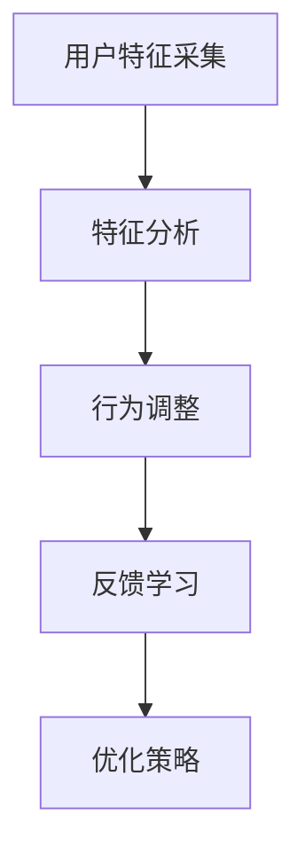
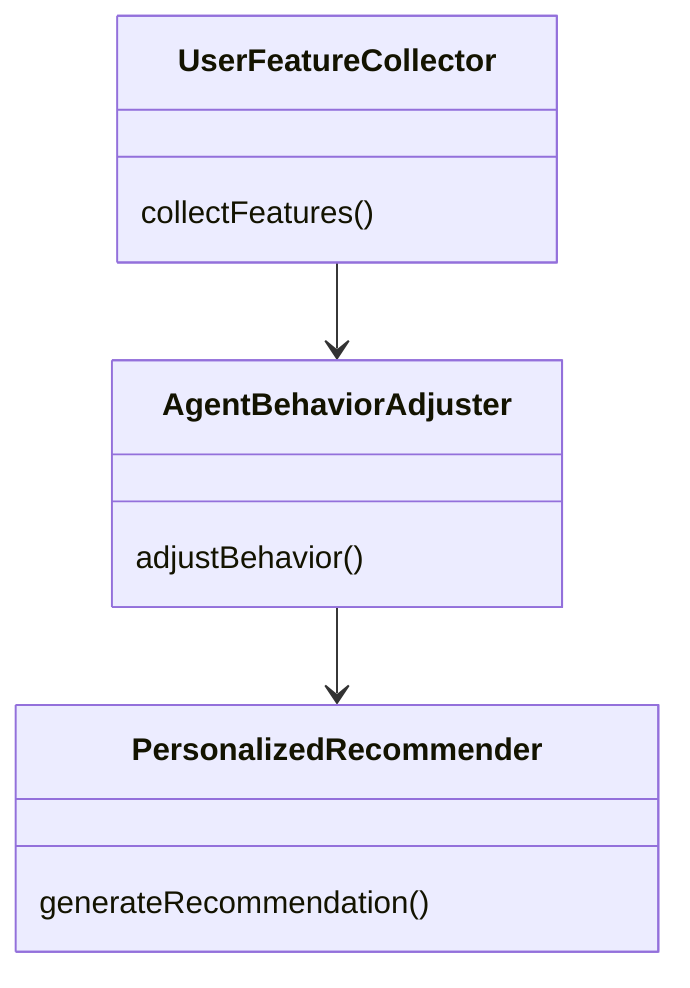
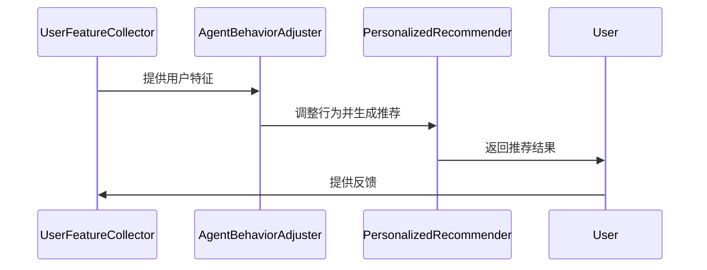

                 


# 个性化定制：根据用户特征调整AI Agent

> 关键词：个性化定制，AI Agent，用户特征，动态调整，推荐系统

> 摘要：本文详细探讨了如何根据用户特征动态调整AI Agent的行为，以提供个性化的服务。通过分析用户特征，结合动态调整机制和推荐算法，实现AI Agent的智能化和个性化。文章从背景、核心概念、算法原理到系统架构和项目实战，全面阐述了个性化定制在AI Agent中的应用。

---

# 第一部分: 背景与概述

## 第1章: AI Agent与个性化定制概述

### 1.1 AI Agent的基本概念

AI Agent（人工智能代理）是指能够感知环境并采取行动以实现目标的智能实体。它可以是一个软件程序，也可以是一个物理设备，通过与用户的交互或环境的反馈来执行任务。AI Agent的核心功能包括感知、推理、规划和执行。

个性化定制在AI Agent中的应用日益广泛。通过分析用户的特征，AI Agent能够动态调整其行为模式，从而提供更加精准和贴心的服务。

### 1.2 用户特征分析

用户特征是个性化定制的基础。用户特征包括用户的兴趣、行为习惯、偏好、背景信息等。这些特征可以通过数据采集、分析和建模来获取。用户特征的动态变化直接影响AI Agent的行为调整。

### 1.3 个性化定制的背景与意义

个性化定制是指根据用户的需求和特征，提供量身定制的服务。在AI Agent中，个性化定制能够提升用户体验，增强系统的智能性和适应性。通过动态调整AI Agent的行为，可以更好地满足用户的个性化需求。

---

## 第2章: 用户特征与AI Agent的动态调整

### 2.1 用户特征的动态变化

用户的行为和偏好是动态变化的。例如，用户的兴趣可能随时间变化，或者用户的环境和场景发生变化。AI Agent需要实时捕捉这些变化，以确保其行为与用户当前的需求一致。

### 2.2 AI Agent的动态调整机制

动态调整机制是根据用户特征的变化，实时修改AI Agent的行为模式。这包括调整交互方式、决策逻辑和响应策略。动态调整机制的触发条件可以是用户的主动反馈，也可以是系统主动监测到的变化。

### 2.3 用户特征与AI Agent行为的关系

用户特征直接影响AI Agent的行为。通过分析用户的特征，AI Agent可以预测用户的偏好，并采取相应的行动。同时，用户的反馈又会影响AI Agent的行为调整，形成一个动态的双向互动过程。

---

## 第3章: 个性化定制的核心概念与联系

### 3.1 核心概念原理

个性化定制的核心在于分析用户特征，并基于这些特征进行推荐和调整。推荐算法是个性化定制的关键技术，它通过分析用户特征和行为数据，生成个性化的推荐结果。

### 3.2 核心概念属性特征对比表格

| 核心概念 | 属性 | 特征 |
|---------|------|------|
| 用户特征 | 类型 | 行为、偏好、背景 |
| AI Agent行为 | 类型 | 交互方式、决策逻辑 |
| 个性化推荐 | 类型 | 算法、模型 |

### 3.3 ER实体关系图架构

```mermaid
er
actor: 用户特征
agent: AI Agent
adjustment: 动态调整
recommendation: 个性化推荐
actor -|> adjustment: 触发调整
adjustment -|> agent: 修改行为
agent -|> recommendation: 生成推荐
```

---

## 第4章: 算法原理讲解

### 4.1 基于用户特征的动态调整算法

#### 算法流程

1. 数据采集：收集用户的特征数据，包括行为、偏好、背景等。
2. 特征分析：对用户特征进行分析，识别关键特征。
3. 行为调整：根据特征分析结果，动态调整AI Agent的行为。
4. 反馈学习：收集用户的反馈，优化调整策略。

#### 算法流程图



#### Python代码实现

```python
def dynamic_adjustment(user_features):
    # 特征分析
    key_features = extract_key_features(user_features)
    # 行为调整
    new_behavior = adjust_behavior(key_features)
    return new_behavior
```

#### 数学模型与公式

推荐算法中的相似度计算公式：

$$
\text{相似度}(u, v) = \sum_{i=1}^{n} (u_i \cdot v_i)
$$

其中，\( u \) 和 \( v \) 分别是两个用户的特征向量。

---

## 第5章: 系统分析与架构设计

### 5.1 问题场景介绍

个性化定制的AI Agent系统需要实时分析用户特征，并动态调整行为。系统需要处理大量的用户数据，并在短时间内做出响应。

### 5.2 系统架构设计



### 5.3 系统交互设计



---

## 第6章: 项目实战

### 6.1 环境安装

安装必要的库：

```bash
pip install numpy pandas scikit-learn
```

### 6.2 核心代码实现

```python
from sklearn.metrics.pairwise import cosine_similarity

def calculate_similarity(user_features):
    # 计算余弦相似度
    similarity_matrix = cosine_similarity(user_features)
    return similarity_matrix

# 示例数据
user_features = [[1, 0, 1], [0, 1, 1]]
similarity = calculate_similarity(user_features)
print(similarity)
```

### 6.3 系统功能设计

系统功能包括用户特征采集、行为调整和推荐生成。通过类图展示系统结构：


### 6.4 实际案例分析

以电商推荐系统为例，系统根据用户的购买历史和浏览记录，推荐相关产品。通过动态调整推荐算法，提升推荐的准确性和用户的满意度。

---

## 第7章: 总结与展望

### 7.1 最佳实践

- 定期更新用户特征数据，确保AI Agent行为的准确性。
- 使用高效的推荐算法，优化系统的响应速度。
- 收集用户的反馈，不断优化个性化定制策略。

### 7.2 小结

个性化定制是提升AI Agent智能化的重要手段。通过分析用户特征，动态调整AI Agent的行为，能够为用户提供更加精准和个性化的服务。

### 7.3 注意事项

- 确保用户数据的安全性和隐私性。
- 定期监控系统性能，避免资源消耗过大。
- 保持系统的可扩展性，适应用户特征的动态变化。

### 7.4 未来展望

未来的研究方向包括更高效的推荐算法、实时动态调整机制以及多模态用户特征分析。通过技术的不断进步，个性化定制的AI Agent将更加智能化和人性化。

---

# 作者：AI天才研究院 & 禅与计算机程序设计艺术

---

以上是《个性化定制：根据用户特征调整AI Agent》的技术博客文章的详细内容，涵盖了从背景到实际项目的各个方面，结合理论与实践，深入浅出地探讨了个性化定制在AI Agent中的应用。

