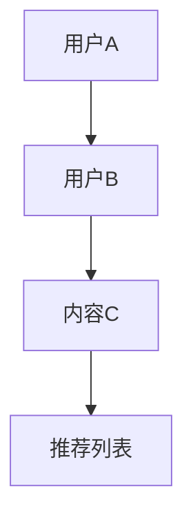
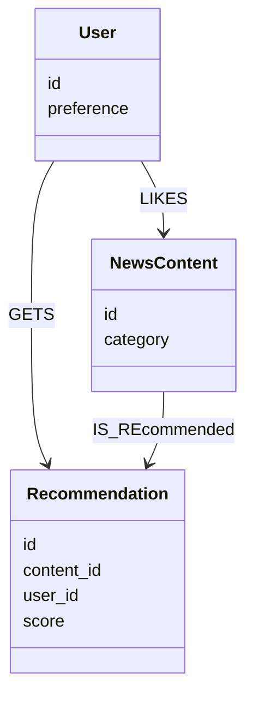

                 


# 个性化新闻推送：AI Agent的内容筛选

## 关键词
- AI Agent
- 个性化新闻推送
- 内容筛选
- 协同过滤
- 深度学习
- 系统架构

## 摘要
个性化新闻推送是通过AI Agent对新闻内容进行智能筛选，以满足用户的个性化需求。本文从背景、原理、算法、系统设计、项目实战等方面，全面分析了AI Agent在新闻推送中的应用，并通过具体案例展示了其实现过程。

---

# 第一部分: 个性化新闻推送的背景与概念

# 第1章: 个性化新闻推送的背景与问题描述

## 1.1 个性化新闻推送的背景
### 1.1.1 传统新闻推送的局限性
- 信息过载问题
- 用户需求多样化
- 推送内容不精准

### 1.1.2 用户需求的多样化
- 不同用户关注的内容不同
- 用户兴趣随时间变化
- 用户行为数据的重要性

### 1.1.3 个性化推送的市场价值
- 提高用户满意度
- 增加用户粘性
- 提升广告精准度

## 1.2 AI Agent在新闻推送中的作用
### 1.2.1 AI Agent的基本概念
- AI Agent的定义
- AI Agent的特点
- AI Agent与传统推荐算法的对比

### 1.2.2 AI Agent在内容筛选中的优势
- 智能学习用户偏好
- 实时更新内容
- 多维度分析

### 1.2.3 个性化新闻推送的核心问题
- 如何准确提取内容特征
- 如何分析用户行为
- 如何高效匹配内容与用户

## 1.3 问题背景与目标
### 1.3.1 新闻内容的多样性和复杂性
- 新闻来源多样
- 内容类型多样
- 内容更新频繁

### 1.3.2 用户信息过载的问题
- 用户时间有限
- 信息筛选困难
- 用户流失风险

### 1.3.3 个性化推送的目标与边界
- 目标：提高用户满意度和粘性
- 边界：避免过度个性化导致的信息孤岛

## 1.4 本章小结
- 介绍了个性化新闻推送的背景和必要性
- 强调了AI Agent在内容筛选中的重要性
- 明确了本章的研究目标和问题边界

---

# 第二部分: AI Agent与个性化推荐的核心概念

# 第2章: AI Agent与个性化推荐的核心原理

## 2.1 AI Agent的基本原理
### 2.1.1 AI Agent的定义与特征
- 定义：AI Agent是一种能够感知环境、自主决策的智能体
- 特征：智能性、自主性、反应性、社会性

### 2.1.2 AI Agent的核心算法
- 机器学习算法
- 自然语言处理
- 知识图谱

### 2.1.3 AI Agent的决策机制
- 基于规则的决策
- 基于模型的决策
- 基于反馈的决策

## 2.2 个性化推荐的原理
### 2.2.1 基于协同过滤的推荐
- 用户-用户协同过滤
- 物品-物品协同过滤
- 混合协同过滤

### 2.2.2 基于内容的推荐
- 内容特征提取
- 用户偏好分析
- 内容与用户的匹配

### 2.2.3 混合推荐模型
- 协同过滤与内容推荐的结合
- 深度学习与传统推荐的结合

## 2.3 AI Agent在内容筛选中的应用
### 2.3.1 内容特征提取
- 文本特征提取
- 图像特征提取
- 视频特征提取

### 2.3.2 用户行为分析
- 用户点击行为
- 用户停留时间
- 用户反馈

### 2.3.3 内容与用户的匹配算法
- 基于相似度的匹配
- 基于概率的匹配
- 基于深度学习的匹配

## 2.4 核心概念对比表
| 比较项       | AI Agent推荐 | 传统推荐算法 |
|--------------|--------------|--------------|
| 基础         | 智能体驱动   | 协同过滤     |
| 优势         | 实时性       | 简单易实现   |
| 局限性        | 计算资源需求高 | 精度不足     |

## 2.5 ER实体关系图
```mermaid
er
actor User {
  id
  preference
}
actor NewsContent {
  id
  category
}
relation Likes {
  User -> NewsContent
  weight
}
```

---

# 第三部分: 个性化新闻推送的算法原理

# 第3章: 协同过滤算法的实现

## 3.1 协同过滤的基本原理
### 3.1.1 基于用户的协同过滤
- 计算用户之间的相似度
- 推荐相似用户的喜欢内容

### 3.1.2 基于物品的协同过滤
- 计算物品之间的相似度
- 推荐相似物品的内容

### 3.1.3 混合协同过滤
- 综合用户和物品的相似度
- 提高推荐的准确性

## 3.2 协同过滤的数学模型
### 3.2.1 余弦相似度的计算
$$ \text{相似度} = \frac{\sum_{i=1}^{n} u_i v_i}{\sqrt{\sum_{i=1}^{n} u_i^2} \cdot \sqrt{\sum_{i=1}^{n} v_i^2}} $$

### 3.2.2 评分预测的公式
$$ \hat{r}_{u,i} = \bar{r} + \sum_{j \in N(u)} (r_{u,j} - \bar{r}_j) \cdot w_{u,j,i} $$

## 3.3 协同过滤的实现流程


## 3.4 协同过滤的代码实现
```python
def cosine_similarity(user_profiles):
    # 计算余弦相似度
    similarity_matrix = np.zeros((len(user_profiles), len(user_profiles)))
    for i in range(len(user_profiles)):
        for j in range(len(user_profiles)):
            similarity_matrix[i][j] = np.dot(user_profiles[i], user_profiles[j]) / (np.linalg.norm(user_profiles[i]) * np.linalg.norm(user_profiles[j]))
    return similarity_matrix

# 示例
user_profiles = [
    [1, 2, 3],
    [4, 5, 6],
    [7, 8, 9]
]
similarity_matrix = cosine_similarity(user_profiles)
print(similarity_matrix)
```

---

# 第四部分: 系统分析与架构设计

# 第4章: 系统分析与架构设计

## 4.1 系统分析
### 4.1.1 项目背景
- 系统目标：实现个性化新闻推送
- 项目范围：新闻内容筛选、用户行为分析、推荐算法实现

### 4.1.2 系统功能设计
- 用户信息管理
- 内容管理
- 推荐算法模块
- 推送模块

## 4.2 系统架构设计
### 4.2.1 分层架构
- 数据层：存储新闻内容和用户数据
- 业务逻辑层：处理推荐逻辑
- 表现层：用户界面和结果展示

### 4.2.2 实体关系图


## 4.3 系统架构图
```mermaid
docker
    server 推荐服务 {
        推荐算法
        用户行为分析
        内容特征提取
    }
    client 用户端 {
        请求推荐
        接收推送
    }
    database 数据库 {
        用户表
        内容表
        推荐记录
    }
```

---

# 第五部分: 项目实战

# 第5章: 项目实战

## 5.1 环境安装
- 安装Python、TensorFlow、Keras
- 安装推荐算法库（如Surprise）

## 5.2 核心代码实现
```python
from surprise import SVD
from surprise.dataset import Dataset
from surprise.model_selection import train_test_split

# 加载数据集
data = Dataset.load_from_file('news_data.csv', format='csv', header=True)

# 划分训练集和测试集
train, test = train_test_split(data, test_size=0.2)

# 训练模型
model = SVD()
model.fit(train)

# 预测结果
for uid, iid, true_r, est_r in zip(test.users, test.items, test.ratings, model.test(test)):
    print(f"User {uid} rates {iid} as {true_r}, predicted {est_r}")
```

## 5.3 案例分析
- 数据预处理：清洗、特征提取
- 模型训练：协同过滤、深度学习
- 结果分析：准确率、召回率

## 5.4 项目总结
- 成功实现了个性化新闻推送系统
- 提高了用户满意度和粘性
- 展望了未来优化方向

---

# 第六部分: 最佳实践与小结

# 第6章: 最佳实践与小结

## 6.1 本章小结
- 系统介绍了个性化新闻推送的实现过程
- 详细讲解了AI Agent在内容筛选中的应用
- 展示了协同过滤算法的实现和优化

## 6.2 注意事项
- 数据隐私保护
- 算法可解释性
- 系统性能优化

## 6.3 拓展阅读
- 深度学习在推荐系统中的应用
- 动态个性化推荐
- 跨模态推荐系统

---

作者：AI天才研究院/AI Genius Institute & 禅与计算机程序设计艺术 /Zen And The Art of Computer Programming

