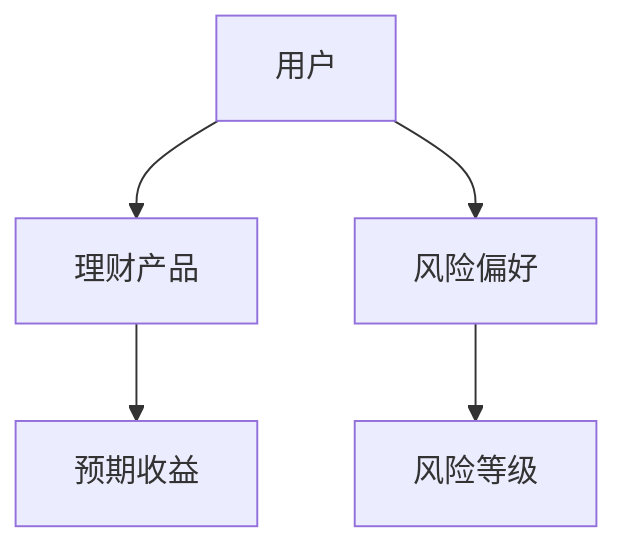
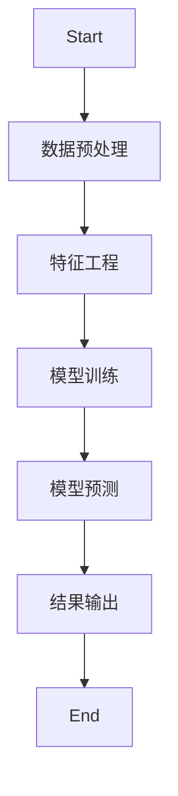
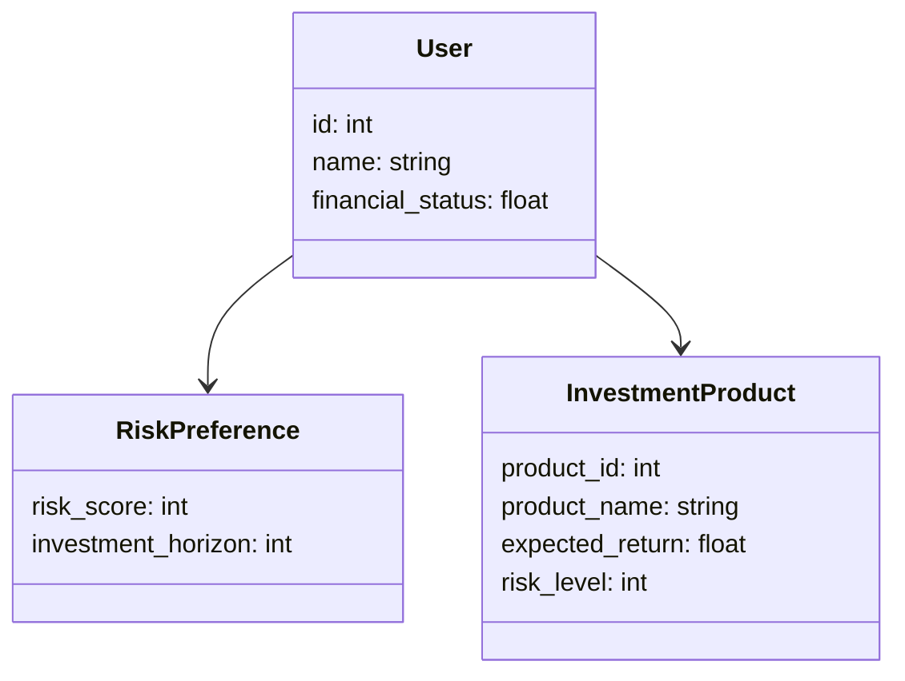
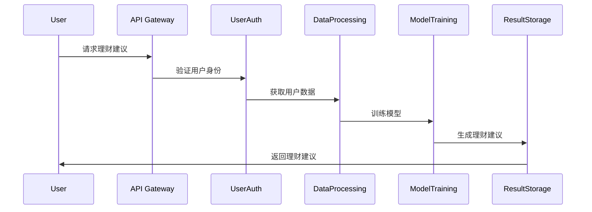

                 


# 个性化理财建议生成算法：原理与实现

> **关键词**：个性化理财、算法、机器学习、特征工程、风险管理、投资组合优化  
> **摘要**：个性化理财是根据用户的财务状况、风险偏好和投资目标，利用机器学习和算法优化技术，生成适合用户的理财建议。本文详细探讨了个性化理财的背景、核心概念、算法原理、系统架构和实际案例，为读者提供从理论到实践的全面解析。

---

## 第一部分: 个性化理财建议的背景与核心概念

### 第1章: 个性化理财建议的背景与需求

#### 1.1 理财行业的现状与挑战
- **传统理财模式的局限性**：传统理财服务依赖人工推荐，效率低且难以满足个性化需求。
- **个性化理财的需求驱动**：随着互联网和大数据技术的发展，用户对个性化、精准化理财服务的需求日益增加。
- **理财行业的挑战**：如何通过技术手段提高理财服务的效率和精准度，降低人工成本。

#### 1.2 个性化理财的核心问题
- **用户需求分析**：了解用户的财务状况、风险承受能力和投资目标。
- **理财产品多样性**：市场上理财产品种类繁多，如何选择适合用户的产品是关键。
- **风险与收益的平衡**：在满足用户风险偏好的前提下，最大化投资收益。

#### 1.3 算法在个性化理财中的作用
- **数据驱动的决策**：通过收集和分析用户数据，为理财建议提供科学依据。
- **算法推荐的优势**：利用机器学习算法，实现个性化推荐和动态调整。
- **个性化理财的实现路径**：从数据采集到算法推荐，再到结果优化。

### 第2章: 个性化理财的核心概念与联系

#### 2.1 核心概念的定义与属性
- **用户画像**：基于用户的基本信息、财务状况和行为数据，构建用户画像。
- **理财产品特征**：包括产品的收益率、风险等级、投资期限等特征。
- **风险偏好模型**：根据用户的问卷调查结果，构建风险偏好的量化模型。

#### 2.2 核心概念的对比分析
- **不同特征工程方法的对比**：例如，使用主成分分析（PCA）与因子分析（FA）的优缺点。
- **理财产品与用户需求的匹配度**：通过相似度计算，匹配最适合的理财产品。
- **风险与收益的权衡分析**：绘制收益-风险曲线，分析不同风险等级下的最优收益。

#### 2.3 实体关系图（ER图）


### 第3章: 个性化理财算法的原理与实现

#### 3.1 算法原理概述
- **机器学习与深度学习的结合**：利用监督学习（如随机森林）和无监督学习（如聚类分析）进行推荐。
- **分类与回归算法的应用**：例如，使用逻辑回归预测用户的投资偏好。
- **聚类算法的优化**：通过K-means算法将用户分为不同类别，进行个性化推荐。

#### 3.2 算法流程图


#### 3.3 核心算法的数学模型
- **线性回归模型**：
  $$ y = \beta_0 + \beta_1 x_1 + \beta_2 x_2 + \dots + \beta_n x_n $$
  其中，$y$ 是目标变量，$x_i$ 是自变量，$\beta$ 是回归系数。

- **随机森林算法**：基于决策树的集成学习方法，通过投票机制进行预测。

---

## 第二部分: 系统分析与架构设计方案

### 第4章: 问题场景介绍与项目介绍

#### 4.1 项目背景
- 项目目标：开发一个基于机器学习的个性化理财建议系统。
- 项目范围：包括数据采集、特征工程、模型训练和结果展示。

#### 4.2 系统功能需求
- 用户登录与注册
- 数据采集与处理
- 理财建议生成
- 结果展示与反馈

### 第5章: 系统功能设计与领域模型

#### 5.1 领域模型类图


### 第6章: 系统架构设计

#### 6.1 系统架构图
```mermaid
graph LR
    Client[客户端] --> API Gateway[API网关]
    API Gateway --> UserAuth[用户认证]
    UserAuth --> Database[数据库]
    API Gateway --> DataProcessing[数据处理]
    DataProcessing --> ModelTraining[模型训练]
    ModelTraining --> ResultStorage[结果存储]
    ResultStorage --> Client
```

### 第7章: 系统接口与交互设计

#### 7.1 用户与系统的交互流程


---

## 第三部分: 项目实战与总结

### 第8章: 个性化理财算法的项目实战

#### 8.1 环境安装
- 安装Python和相关库（如scikit-learn、pandas、numpy）。

#### 8.2 核心代码实现
```python
from sklearn.ensemble import RandomForestRegressor
from sklearn.model_selection import train_test_split

# 数据预处理
data = pd.read_csv('financial_data.csv')
X = data.drop('return', axis=1)
y = data['return']

# 划分训练集和测试集
X_train, X_test, y_train, y_test = train_test_split(X, y, test_size=0.2)

# 模型训练
model = RandomForestRegressor(n_estimators=100)
model.fit(X_train, y_train)

# 预测结果
y_pred = model.predict(X_test)
```

#### 8.3 实际案例分析
- 输入用户数据，运行模型，输出理财建议，并解释结果。

### 第9章: 总结与展望

#### 9.1 总结
- 个性化理财算法的核心在于数据的采集与处理、特征工程和模型优化。
- 通过机器学习算法，可以显著提高理财建议的准确性和个性化程度。

#### 9.2 展望
- 未来可以结合强化学习，进一步优化投资策略。
- 数据隐私和模型解释性是需要重点关注的方向。

---

## 参考文献
1. 刘军. 《机器学习实战》. 北京: 清华大学出版社, 2018.
2. 周志华. 《机器学习简明教程》. 北京: 清华大学出版社, 2016.

---

## 附录
- 附录A: 数据预处理代码示例
- 附录B: 模型调优代码示例
- 附录C: 风险偏好问卷设计

---

## 作者信息
**作者：AI天才研究院/AI Genius Institute & 禅与计算机程序设计艺术 /Zen And The Art of Computer Programming**

---

通过以上内容，文章详细探讨了个性化理财建议生成算法的背景、核心概念、算法原理、系统架构和实际案例，为读者提供了一个从理论到实践的全面解析。

