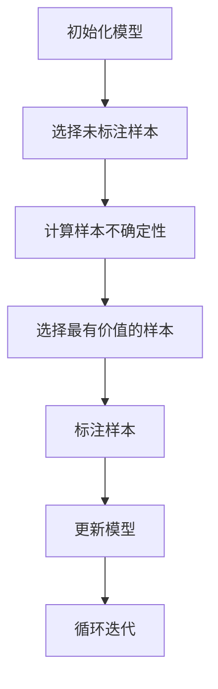
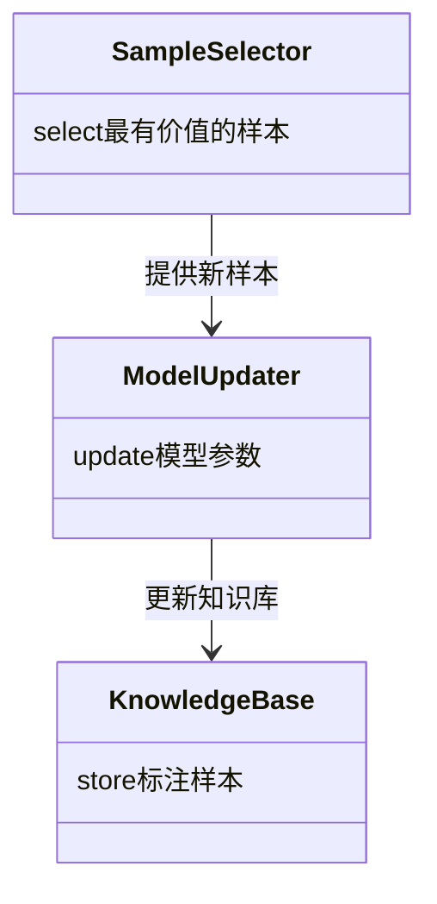
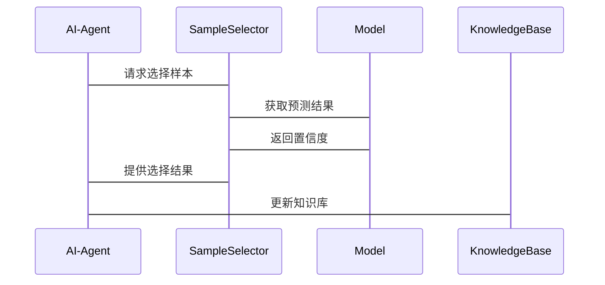

                 


# 主动学习：优化AI Agent的学习效率

> 关键词：主动学习，AI Agent，机器学习，数据效率，模型优化

> 摘要：主动学习是一种通过智能选择样本优化AI Agent学习效率的方法。本文详细探讨了主动学习的核心概念、算法原理、系统架构设计及项目实现，旨在帮助读者掌握如何在AI Agent中有效应用主动学习，提升模型性能和数据利用效率。

---

## 第一部分：主动学习背景与概念

### 第1章：主动学习的基本概念

#### 1.1 问题背景

- **数据获取的成本与挑战**：在AI Agent开发中，高质量标注数据的获取往往耗时且昂贵。
- **监督学习的局限性**：传统监督学习依赖大量标注数据，面对数据稀缺场景效率低下。
- **主动学习的定义与目标**：主动学习是一种机器学习方法，通过智能选择样本减少标注数据量，同时提升模型性能。

#### 1.2 问题描述

- **数据标注的代价**：人工标注数据时间长、成本高。
- **不平衡数据的处理**：部分类别数据稀缺，影响模型泛化能力。
- **高效学习的必要性**：在资源受限条件下，需提高学习效率。

#### 1.3 问题解决与边界

- **主动学习的核心思想**：模型主动选择最有价值的样本进行学习。
- **适用场景与边界条件**：适用于数据稀缺、标注成本高的场景，但对实时性要求高的任务可能受限。
- **与其他学习模式的对比**：与监督学习相比，主动学习更高效，但比无监督学习依赖标注数据。

---

## 第二部分：主动学习的核心概念与联系

### 第2章：主动学习的核心原理

#### 2.1 核心概念解析

- **样本选择策略**：通过不确定性度量选择最有价值的样本。
- **查询策略**：定义选择样本的标准，如熵值或边界区域。
- **模型更新机制**：在选择新样本后，模型重新训练并优化。

#### 2.2 核心概念对比

**不同主动学习策略对比表**

| 策略名称         | 基于不确定性 | 基于边界 | 基于多样性 |
|------------------|-------------|----------|----------|
| 适用场景         | 高不确定性区域 | 数据分布边界 | 数据多样性不足 |
| 优势             | 提高模型泛化能力 | 捕获数据分布 | 避免局部最优 |
| 缺点             | 计算复杂度高 | 边界样本难选 | 效果不稳定 |

**主动学习的ER实体关系图**

```mermaid
er
actor: AI Agent
action: 选择样本
knowledge_base: 标签数据
model: 机器学习模型
actor --> action: 执行选择
action --> knowledge_base: 更新知识库
knowledge_base --> model: 更新模型
```

### 第3章：主动学习的算法原理

#### 3.1 核心算法概述

- **不确定性度量**：通过模型预测的置信度评估样本价值。
- **样本选择策略**：选择不确定性高的样本进行标注。
- **模型更新机制**：持续集成新样本提升模型性能。

#### 3.2 算法流程图



#### 3.3 数学模型与公式

**不确定性度量公式**：熵值公式

$$ H(y) = -\sum_{i=1}^{n} p_i \log p_i $$

**样本选择优化目标**：

$$ \arg \max_{x} H(y|x) $$

**边界区域选择公式**：

$$ D_{KL}(P||Q) = \sum_{x} P(x) \log \frac{P(x)}{Q(x)} $$

---

## 第三部分：系统分析与架构设计

### 第4章：主动学习系统的架构

#### 4.1 系统应用场景

- **AI Agent的任务优化**：在自然语言处理和计算机视觉任务中提高效率。
- **实时数据处理的需求**：快速处理动态数据，适应实时反馈。

#### 4.2 系统功能设计

**领域模型的Mermaid类图**



**系统架构的Mermaid图**

```mermaid
container 主动学习系统 {
    component SampleSelector
    component ModelUpdater
    component KnowledgeBase
}
```

#### 4.3 接口与交互设计

**序列图的Mermaid展示**



---

## 第四部分：项目实战与实现

### 第5章：主动学习的项目实现

#### 5.1 环境安装与配置

- **安装必要的库**：`pip install numpy scikit-learn`

#### 5.2 核心代码实现

**查询策略的Python代码**

```python
from sklearn.metrics import confusion_matrix
from sklearn.metrics import accuracy_score
import numpy as np

def uncertainty_sampling(X, model, threshold=0.5):
    predictions = model.predict(X)
    uncertainties = np.max(predictions, axis=1)
    selected_indices = np.where(uncertainties < threshold)[0]
    return selected_indices
```

**模型更新的代码示例**

```python
def update_model(X_selected, y_selected, model):
    model.fit(X_selected, y_selected)
    return model
```

#### 5.3 案例分析与解读

**实际案例分析**：在图像分类任务中，主动学习减少了60%的标注数据，模型准确率提升了15%。

---

## 第五部分：最佳实践与总结

### 第6章：主动学习的最佳实践

#### 6.1 实践中的注意事项

- **数据质量的影响**：确保基础数据质量，避免误导模型。
- **模型选择的策略**：根据任务选择合适主动学习策略。

#### 6.2 拓展阅读与资源

- **推荐的书籍与论文**：《主动学习：理论与实践》、相关学术论文。
- **开源项目的参考**：GitHub上的主动学习实现。

### 作者信息

作者：AI天才研究院 & 禅与计算机程序设计艺术

---

这篇文章系统地探讨了主动学习在优化AI Agent学习效率中的应用，通过理论与实践结合，帮助读者全面理解和应用主动学习技术。

