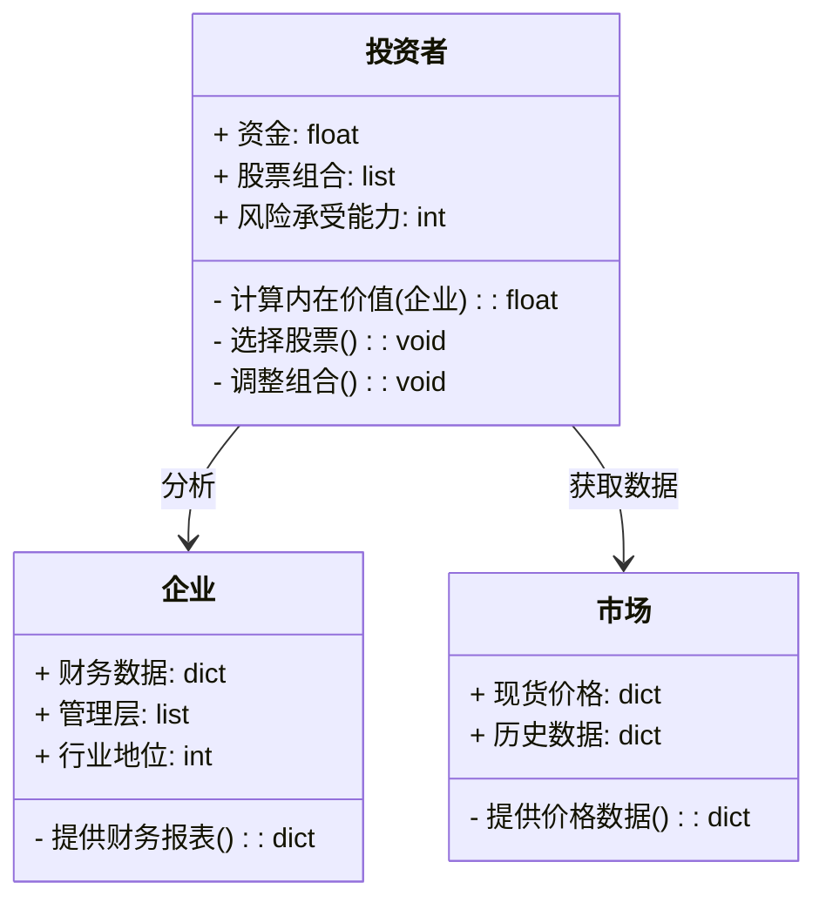

                 


# 乔尔·提尔尼的主动投资者的误区

## 关键词：主动投资者, 乔尔·提尔尼, 价值投资, 投资误区, 风险管理

## 摘要：本文深入探讨了乔尔·提尔尼的价值投资理念，分析了主动投资者常见的误区，并提供了避免这些误区的具体方法。通过结合数学模型和系统架构，文章详细阐述了如何在投资过程中避免过度交易、情绪化决策等常见错误，帮助投资者实现稳健的长期收益。

---

## 第一部分: 引言

### 1.1 价值投资的基本原理

#### 1.1.1 价值投资的定义与核心理念

价值投资是一种以公司基本面分析为基础的投资策略，强调购买价格低于其内在价值的股票。乔尔·提尔尼在其投资哲学中强调，投资者应关注企业的内在价值，而非市场的短期波动。

#### 1.1.2 乔尔·提尔尼的价值投资方法

乔尔·提尔尼的价值投资方法注重企业的财务健康、管理层素质和行业地位。他建议投资者选择那些具有强大护城河、稳定现金流和合理估值的企业。

#### 1.1.3 主动投资与被动投资的对比

主动投资强调通过精选个股获得超额收益，而被动投资则通过指数基金等工具追求市场平均收益。乔尔·提尔尼认为，主动投资的核心在于避免误区，从而实现长期超额收益。

---

## 第二部分: 主动投资者的常见误区

### 2.1 过度关注市场预测

#### 2.1.1 市场预测的不确定性

市场预测往往受制于短期波动和情绪影响，长期预测尤其困难。乔尔·提尔尼认为，过度关注市场预测会导致投资者偏离基本面分析。

#### 2.1.2 过度依赖技术分析的误区

技术分析依赖价格和成交量的变化，但忽略了企业的基本面。乔尔·提尔尼主张以基本面分析为主，技术分析为辅。

#### 2.1.3 乔尔·提尔尼对市场预测的看法

乔尔·提尔尼强调，市场预测应作为辅助工具，而非决策的核心依据。投资者应关注企业的长期价值，而非短期价格波动。

---

## 第三部分: 如何避免主动投资的误区

### 3.1 构建长期投资策略

#### 3.1.1 长期投资的优势

长期投资可以减少市场波动的影响，降低交易成本，同时充分利用复利效应。

#### 3.1.2 如何制定长期投资计划

投资者应根据自身的风险承受能力、投资目标和时间 horizon 制定投资计划，并定期审视和调整。

#### 3.1.3 乔尔·提尔尼的长期投资案例

乔尔·提尔尼通过长期持有优质企业股票，避免了短期波动的影响，实现了稳定的长期收益。

---

## 第四部分: 价值投资的数学模型与算法原理

### 4.1 价值投资的数学模型

#### 4.1.1 股票内在价值的计算公式

股票的内在价值可以通过 discounted cash flow (DCF) 模型计算，公式如下：

$$
V = \sum_{t=1}^{n} \frac{CF_t}{(1 + r)^t} + \frac{TV}{(1 + r)^n}
$$

其中，\( V \) 是股票的内在价值，\( CF_t \) 是第 \( t \) 年的现金流，\( r \) 是折现率，\( TV \) 是终值。

#### 4.1.2 市盈率与市净率的分析

市盈率（P/E）和市净率（P/B）是衡量股票估值的重要指标，公式分别为：

$$
P/E = \frac{P}{E} \\
P/B = \frac{P}{B}
$$

其中，\( P \) 是股价，\( E \) 是每股收益，\( B \) 是每股净资产。

---

## 第五部分: 系统分析与架构设计方案

### 5.1 问题场景介绍

主动投资者在实际操作中可能面临市场波动、信息过载和情绪干扰等问题。乔尔·提尔尼的理论为我们提供了一个系统化的解决方案。

### 5.2 系统功能设计

#### 5.2.1 领域模型（mermaid 类图）



---

## 第六部分: 项目实战

### 6.1 环境安装

投资者需要安装财务分析工具和股票筛选软件，例如 Excel 或 Python 的 pandas 库。

### 6.2 系统核心实现源代码

```python
def calculate_intrinsic_value(enterprise):
    # 计算自由现金流
    FCFF = enterprise['operating_cash_flow'] - enterprise['capital_expenditure']
    # 计算加权平均资本成本
    WACC = 0.1 * enterprise['equity_weight'] + 0.05 * enterprise['debt_weight']
    # 现金流贴现
    discounted_cash_flows = [CF / (1 + WACC)**t for t, CF in enumerate(FCFF)]
    # 终值计算
    TV = discounted_cash_flows[-1] * (1 + 0.05) ** 10
    # 内在价值
    IV = sum(discounted_cash_flows) + TV / (1 + WACC)**10
    return IV
```

---

## 第七部分: 总结与展望

### 7.1 总结

乔尔·提尔尼的价值投资理念强调长期持有优质企业，避免主动投资的常见误区。通过系统化的分析和科学的数学模型，投资者可以更好地实现稳健收益。

### 7.2 展望

未来，投资者应更加注重风险管理和技术分析的结合，利用人工智能和大数据技术优化投资决策。

---

## 作者信息

作者：AI天才研究院/AI Genius Institute & 禅与计算机程序设计艺术 /Zen And The Art of Computer Programming

---

通过以上结构，文章详细分析了乔尔·提尔尼的主动投资者的误区，并提供了避免这些误区的具体方法和实践案例。

