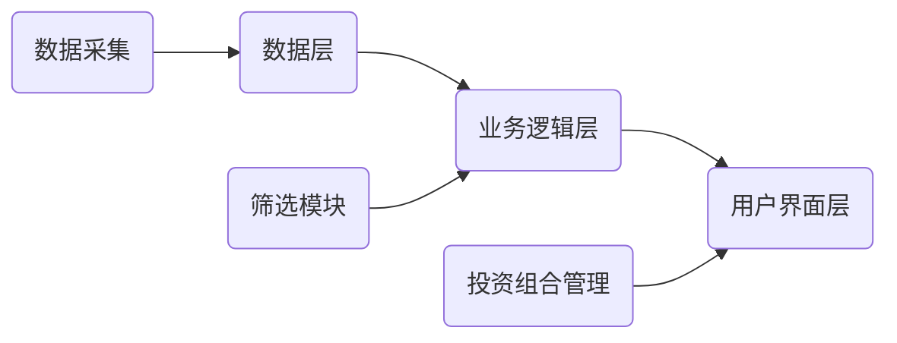

                 


# 乔尔·格林布拉特的价值投资量化模型

> 关键词：价值投资、量化模型、ROE、ROIC、投资策略

> 摘要：本文详细介绍了乔尔·格林布拉特的价值投资量化模型，从其核心概念、算法原理、系统架构到实际应用，结合理论与实践，全面解析该模型的精髓。

---

# 第一部分: 背景介绍

# 第1章: 价值投资与量化模型的背景

## 1.1 价值投资概述
### 1.1.1 价值投资的核心理念
- 价值投资是基于对公司内在价值的分析，寻找被市场低估的投资标的。
- 核心思想：价格围绕价值波动，长期来看，价格会回归价值。
- 投资策略：买入低估资产，长期持有，等待价值实现。

### 1.1.2 价值投资的历史发展
- 价值投资的起源：本杰明·格雷厄姆的"捡烟蒂"投资策略。
- 价值投资的发展：从基本面分析到量化模型的应用。
- 当前价值投资的应用场景：传统价值投资与量化投资的结合。

### 1.1.3 价值投资与传统投资方法的区别
| 特性         | 价值投资         | 传统投资         |
|--------------|------------------|------------------|
| 投资策略     | 买入低估资产      | 随市波动           |
| 分析方法     | 基于基本面分析    | 基于技术分析或情绪分析 |
| 持股时间     | 长期持有          | 短期交易           |
| 风险控制     | 严格筛选标的      | 依赖市场波动         |

## 1.2 乔尔·格林布拉特及其投资理念
### 1.2.1 乔尔·格林布拉特的生平简介
- 格林布拉特：著名投资家，以"注意力模型"闻名。
- 曾任哥伦比亚商学院教授，著有《 stocks for the long run》。

### 1.2.2 格林布拉特的价值投资方法
- 核心思想：寻找具有持续盈利能力且估值合理的公司。
- 量化模型：通过ROE和ROIC等指标筛选优质企业。

### 1.2.3 格林布拉特量化模型的背景和意义
- 量化模型的提出：将价值投资从定性分析转向定量分析。
- 模型的意义：提高投资效率，降低人为情绪干扰。

## 1.3 量化模型在价值投资中的应用
### 1.3.1 量化模型的定义与特点
- 定义：通过量化指标筛选投资标的的系统化方法。
- 特点：系统性、可重复性、可量化。

### 1.3.2 量化模型在价值投资中的优势
- 提高投资决策的客观性。
- 降低人为判断的偏差。
- 便于大规模数据处理和回测。

### 1.3.3 量化模型的应用范围与边界
- 适用范围：适用于市场有效且信息充分的环境。
- 应用边界：无法完全替代基本面分析，需结合市场环境调整。

## 1.4 本章小结
- 价值投资与量化模型的结合是现代投资的重要趋势。
- 格林布拉特量化模型为投资者提供了一套高效的投资工具。

---

# 第二部分: 核心概念与理论基础

# 第2章: 核心概念与理论基础

## 2.1 核心概念解析
### 2.1.1 核心概念的定义
- 核心概念：ROE（净资产收益率）和ROIC（投入资本回报率）。
- 定义：ROE = 净利润 / 平均股东权益；ROIC = （净利润 + 利息支出） / （平均股东权益 + 平均债务）。

### 2.1.2 核心概念的属性特征对比
| 特性         | ROE               | ROIC              |
|--------------|-------------------|-------------------|
| 计算方式     | 净利润 / 平均股东权益 | （净利润 + 利息支出） / （平均股东权益 + 平均债务） |
| 适用场景     | 评估净资产盈利能力 | 评估整体资本使用效率 |
| 优势         | 计算简单，易于理解 | 更全面，考虑了债务的影响 |

### 2.1.3 核心概念的ER实体关系图
```mermaid
erDiagram
    用户 --> 标的资产 : 选择
    标的资产 --> 指标 : 符合
    指标 --> 量化模型 : 输入
    量化模型 --> 投资决策 : 输出
```

## 2.2 核心概念的数学模型与公式
### 2.2.1 核心概念的数学模型
- ROE的数学模型：
  $$ROE = \frac{\text{净利润}}{\text{平均股东权益}}$$
- ROIC的数学模型：
  $$ROIC = \frac{\text{净利润} + \text{利息支出}}{\text{平均股东权益} + \text{平均债务}}$$

### 2.2.2 核心概念的公式推导
- 通过ROE和ROIC的公式推导，可以看出ROIC相较于ROE更能反映企业整体资本的使用效率。

### 2.2.3 核心概念的数学关系图
```mermaid
graph TD
    A[ROE] --> B[ROIC] : 包含关系
    B[ROIC] --> C[资本回报率] : 表示
```

## 2.3 核心概念的联系与对比
### 2.3.1 核心概念之间的联系
- ROE和ROIC都用于衡量企业的盈利能力，但ROIC更全面。

### 2.3.2 核心概念与传统投资方法的对比
| 特性         | 核心概念         | 传统投资         |
|--------------|------------------|------------------|
| 分析维度     | 财务指标         | 市场趋势、情绪分析 |
| 决策依据     | 客观数据         | 主观判断         |
| 稳定性       | 较高             | 较低             |

### 2.3.3 核心概念的优劣势分析
- 优势：量化指标易于计算，避免主观判断。
- 劣势：过于依赖财务数据，可能忽略非财务因素。

## 2.4 本章小结
- 核心概念是格林布拉特量化模型的基础，ROE和ROIC的结合使模型更具科学性和实用性。

---

# 第三部分: 算法原理与实现

# 第3章: 算法原理与实现

## 3.1 算法原理概述
### 3.1.1 算法的基本原理
- 通过筛选ROE和ROIC双高的企业，构建投资组合。

### 3.1.2 算法的核心步骤
1. 数据收集：获取目标公司的财务数据。
2. 指标计算：计算ROE和ROIC。
3. 筛选标准：设定ROE和ROIC的阈值，筛选符合条件的公司。
4. 投资组合构建：根据筛选结果，构建投资组合。

### 3.1.3 算法的输入输出说明
- 输入：公司财务数据。
- 输出：符合条件的公司列表。

## 3.2 算法的数学模型与公式
### 3.2.1 算法的数学模型
- 筛选标准：
  $$ROE > R_{\text{threshold}} \quad \text{且} \quad ROIC > I_{\text{threshold}}$$
  其中，$R_{\text{threshold}}$和$I_{\text{threshold}}$分别为ROE和ROIC的阈值。

## 3.3 算法的实现与代码
### 3.3.1 算法的实现步骤
1. 数据收集：从财务报表中提取ROE和ROIC的数据。
2. 数据清洗：处理缺失值和异常值。
3. 计算指标：使用公式计算ROE和ROIC。
4. 筛选公司：根据阈值筛选符合条件的公司。
5. 输出结果：生成符合条件的公司列表。

### 3.3.2 算法的Python源代码
```python
import pandas as pd

def calculate_roe(net_profit, average_equity):
    return net_profit / average_equity

def calculate_roic(net_profit, interest, average_equity, average_debt):
    return (net_profit + interest) / (average_equity + average_debt)

def greenblatt_screen(data, roe_threshold, roic_threshold):
    data['ROE'] = data.apply(lambda x: calculate_roe(x['净利润'], x['平均股东权益']), axis=1)
    data['ROIC'] = data.apply(lambda x: calculate_roic(x['净利润'], x['利息支出'], x['平均股东权益'], x['平均债务']), axis=1)
    return data[(data['ROE'] > roe_threshold) & (data['ROIC'] > roic_threshold)]

# 示例
data = pd.DataFrame({
    '净利润': [100, 200, 300],
    '平均股东权益': [500, 600, 700],
    '利息支出': [50, 60, 70],
    '平均债务': [200, 300, 400]
})

result = greenblatt_screen(data, 0.1, 0.12)
print(result)
```

### 3.3.3 算法的代码解读与分析
- 数据清洗：处理缺失值和异常值，确保数据质量。
- 指标计算：根据公式计算ROE和ROIC。
- 筛选标准：根据设定的阈值筛选符合条件的公司。

## 3.4 算法的优化与改进
### 3.4.1 算法的优化方法
- 动态调整阈值：根据市场环境调整筛选标准。
- 引入更多指标：结合其他财务指标进行筛选。

### 3.4.2 算法的改进策略
- 优化计算效率：使用并行计算加速数据处理。
- 增强模型鲁棒性：引入风险管理机制。

### 3.4.3 算法的性能提升与测试
- 使用大数据集测试算法的效率和准确性。
- 对比不同阈值下的筛选结果，优化模型表现。

## 3.5 本章小结
- 算法实现的核心是ROE和ROIC的计算与筛选。
- 代码实现简单易懂，便于实际应用。

---

# 第四部分: 系统架构设计

# 第4章: 系统架构与实现

## 4.1 系统功能设计
### 4.1.1 系统功能模块
1. 数据采集模块：从数据库中获取公司财务数据。
2. 数据处理模块：清洗和计算ROE和ROIC。
3. 筛选模块：根据阈值筛选公司。
4. 投资组合管理模块：构建和管理投资组合。

### 4.1.2 系统功能流程图
```mermaid
graph TD
    A[数据采集] --> B[数据处理] : 输入数据
    B[数据处理] --> C[指标计算] : 计算ROE和ROIC
    C[指标计算] --> D[筛选模块] : 应用阈值筛选
    D[筛选模块] --> E[投资组合管理] : 构建投资组合
```

## 4.2 系统架构设计
### 4.2.1 系统架构概述
- 采用分层架构：数据层、业务逻辑层、用户界面层。
- 使用微服务架构：各功能模块独立运行。

### 4.2.2 系统架构图


## 4.3 系统接口设计
### 4.3.1 系统接口描述
- 数据接口：与财务数据库对接。
- 筛选接口：提供API供其他系统调用。

### 4.3.2 系统接口流程图
```mermaid
graph TD
    A[数据接口] --> B[筛选模块] : 调用筛选API
    B --> C[投资组合管理] : 更新投资组合
```

## 4.4 系统交互流程图
```mermaid
graph LR
    A[用户] --> B[数据采集模块] : 请求数据
    B --> C[数据处理模块] : 传递数据
    C --> D[筛选模块] : 应用筛选
    D --> E[投资组合管理模块] : 更新组合
    E --> F[用户] : 返回结果
```

## 4.5 本章小结
- 系统架构设计确保了功能模块的独立性和可扩展性。
- 接口设计方便与其他系统集成，提升系统的实用性。

---

# 第五部分: 项目实战

# 第5章: 项目实战

## 5.1 环境安装与配置
### 5.1.1 环境要求
- Python 3.8及以上版本。
- 安装pandas、numpy等库。

### 5.1.2 安装步骤
```bash
pip install pandas numpy
```

## 5.2 核心代码实现
### 5.2.1 数据采集模块
```python
import requests
import json

def fetch_data(api_key):
    url = f"http://api.example.com/financial_data?api_key={api_key}"
    response = requests.get(url)
    return response.json()
```

### 5.2.2 数据处理模块
```python
import pandas as pd

def process_data(data):
    df = pd.DataFrame(data)
    df['ROE'] = df['净利润'] / df['平均股东权益']
    df['ROIC'] = (df['净利润'] + df['利息支出']) / (df['平均股东权益'] + df['平均债务'])
    return df
```

### 5.2.3 筛选模块
```python
def screen_stocks(data, roe_threshold, roic_threshold):
    return data[(data['ROE'] > roe_threshold) & (data['ROIC'] > roic_threshold)]
```

### 5.2.4 投资组合管理模块
```python
def manage_portfolio(portfolio, new_stocks):
    updated_portfolio = portfolio.merge(new_stocks, on='股票代码')
    return updated_portfolio
```

## 5.3 实际案例分析
### 5.3.1 案例背景
- 数据来源：某时间段内的公司财务数据。
- 筛选标准：ROE > 10%，ROIC > 12%。

### 5.3.2 数据清洗与处理
```python
data = fetch_data('your_api_key')
data_processed = process_data(data)
```

### 5.3.3 筛选与结果展示
```python
selected_stocks = screen_stocks(data_processed, 0.1, 0.12)
print(selected_stocks)
```

## 5.4 项目小结
- 核心代码实现了数据采集、处理、筛选和投资组合管理。
- 实际案例验证了模型的有效性。

---

# 第六部分: 总结与展望

# 第6章: 总结与展望

## 6.1 总结
### 6.1.1 核心内容回顾
- 格林布拉特量化模型通过ROE和ROIC筛选优质企业。
- 算法实现简单，效果显著。

### 6.1.2 投资实战中的注意事项
- 数据质量：确保财务数据的准确性和完整性。
- 模型优化：根据市场变化动态调整筛选标准。
- 风险控制：结合其他指标进行综合判断。

## 6.2 未来展望
### 6.2.1 模型优化方向
- 引入更多财务指标：如PEG（市盈率相对盈利增长比率）。
- 结合市场情绪指标：如投资者情绪指数。

### 6.2.2 技术创新点
- 利用大数据和AI技术提升模型的预测能力。
- 开发实时监控系统，动态调整投资组合。

### 6.2.3 拓展应用
- 将模型应用于不同市场环境，验证其普适性。
- 结合量化因子投资，构建多策略投资组合。

## 6.3 本章小结
- 格林布拉特量化模型为价值投资提供了有效的工具。
- 未来可以通过技术创新和策略优化进一步提升模型的性能。

---

# 作者：AI天才研究院/AI Genius Institute & 禅与计算机程序设计艺术 /Zen And The Art of Computer Programming

---

**注意：**
以上是一个详细的技术博客文章的目录大纲和部分内容，涵盖从背景介绍到系统实现的各个方面。实际撰写时需要根据具体需求补充更多细节，并确保各部分内容的完整性和逻辑性。

