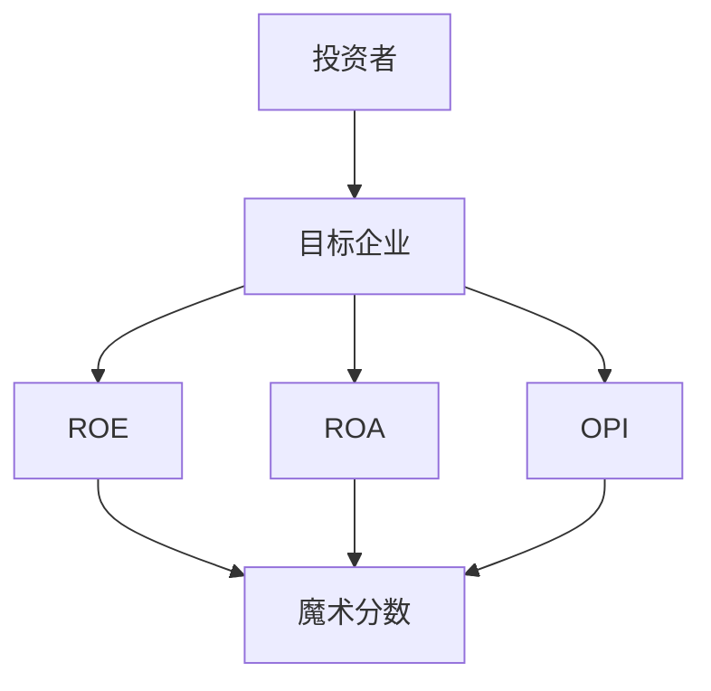
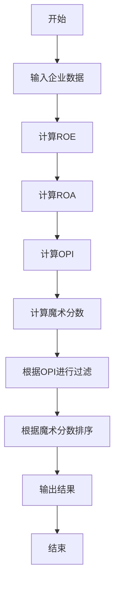
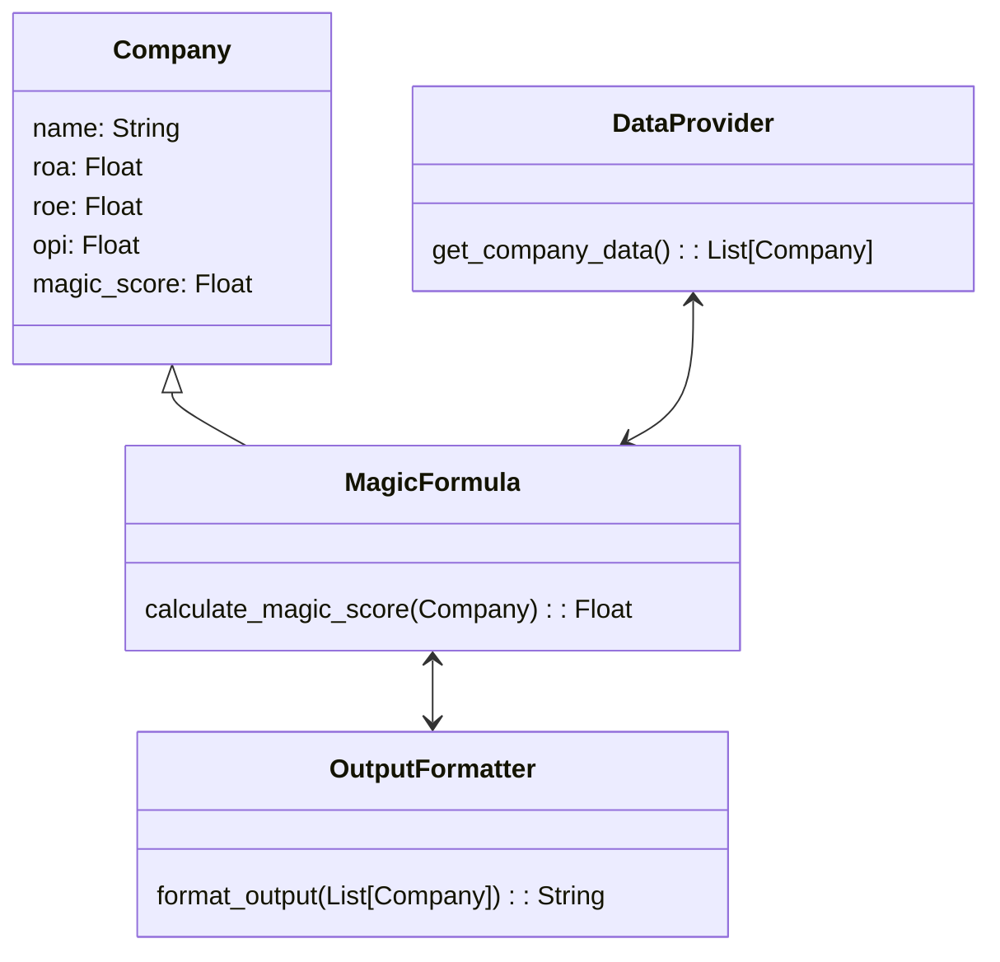
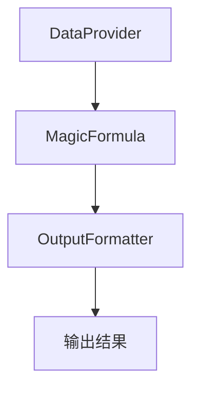

                 


# 乔尔·格林布拉特的魔术公式投资法

> 关键词：魔术公式投资法，乔尔·格林布拉特，ROE，ROA，OPI，投资策略，价值投资

> 摘要：本文深入探讨了乔尔·格林布拉特的魔术公式投资法，从其背景、核心概念到数学模型、系统架构、项目实战等多方面进行了详细分析。文章通过对比表格、Mermaid图以及Python代码示例，帮助读者全面理解并掌握这一投资方法的原理与应用。结合实际案例分析和最佳实践建议，为投资者提供了实用的操作指南。

---

# 第一部分: 魔术公式投资法的背景与核心概念

## 第1章: 魔术公式投资法的背景介绍

### 1.1 投资领域的痛点与挑战

#### 1.1.1 传统投资方法的局限性
传统的投资方法往往依赖于市场情绪、短期波动或复杂的技术分析，这使得投资者难以长期稳定地获得超额收益。此外，许多投资者在选择投资标的时，容易受到市场热点或短期业绩的影响，忽视了企业的基本面和长期发展潜力。

#### 1.1.2 价值投资与成长投资的矛盾
价值投资强调以低于内在价值的价格买入优质企业，而成长投资则关注高成长性的企业。这两种方法各有优缺点，但在实际操作中，如何平衡成长性和安全性是一个难题。乔尔·格林布拉特的魔术公式投资法试图解决这一矛盾，通过量化指标找到兼具价值和成长性的企业。

#### 1.1.3 魔术公式投资法的提出背景
乔尔·格林布拉特在《股市稳赚》一书中提出了魔术公式投资法，旨在通过量化的方法筛选出具有竞争优势且估值合理的优质企业。这种方法结合了价值投资和成长投资的优势，帮助投资者在复杂多变的市场中找到长期稳定的收益来源。

### 1.2 魔术公式投资法的核心目标

#### 1.2.1 寻找具有持续竞争优势的企业
魔术公式投资法通过分析企业的财务指标，寻找那些在行业内具有竞争优势，能够持续创造价值的企业。

#### 1.2.2 识别被市场低估的投资标的
通过量化指标筛选出被市场低估的企业，这些企业通常具有较高的ROE和合理的估值，是长期投资的理想选择。

#### 1.2.3 实现长期稳定的超额收益
通过系统化的方法筛选出优质企业，并长期持有，投资者能够在市场波动中获得稳定的超额收益。

---

## 第2章: 魔术公式投资法的核心概念与联系

### 2.1 核心概念原理

#### 2.1.1 企业基本面分析的重要性
企业基本面分析是魔术公式投资法的核心，通过分析企业的财务指标，评估企业的盈利能力、成长能力和估值水平。

#### 2.1.2 财务指标在投资决策中的作用
财务指标是企业基本面分析的重要工具，能够帮助投资者量化企业的经营状况和财务健康状况。

#### 2.1.3 魔术公式中的关键指标
魔术公式投资法主要关注以下几个关键指标：
- **ROE（净资产收益率）**：衡量企业盈利能力的重要指标，权重为75%。
- **ROA（资产收益率）**：衡量企业资产使用效率的指标，权重为25%。
- **OPI（每股收益与股价比）**：过滤器，用于排除高估值的股票。

### 2.2 核心概念属性对比表格

| 指标名称 | 定义 | 重要性 | 数据来源 |
|----------|------|--------|----------|
| ROE     | 净资产收益率，衡量企业的盈利能力 | 核心指标，权重75% | 公司财报 |
| ROA     | 资产收益率，衡量资产使用效率 | 辅助指标，权重25% | 公司财报 |
| OPI     | 每股收益与股价比，用于过滤高估值股票 | 过滤器 | 公司财报与股价数据 |

### 2.3 实体关系图（Mermaid）



---

# 第二部分: 魔术公式投资法的数学模型与算法原理

## 第3章: 魔术公式投资法的数学模型

### 3.1 魔术公式的核心公式
魔术公式通过将ROE和ROA按权重加权计算，得出企业的综合得分：

$$\text{魔术分数} = \frac{\text{ROE} \times 3}{4} + \frac{\text{ROA} \times 1}{4}$$

### 3.2 魔术公式中的权重分配

| 指标 | 权重 |
|------|------|
| ROE  | 75%  |
| ROA  | 25%  |

### 3.3 魔术公式投资法的筛选逻辑

1. **计算目标企业的ROE、ROA和OPI**
2. **根据公式计算魔术分数**
3. **根据OPI指标进行过滤**
4. **根据魔术分数排序，选择高分企业**

## 第4章: 魔术公式投资法的算法实现

### 4.1 算法流程图（Mermaid）



### 4.2 Python实现代码

```python
def calculate_magic_score(roa, roe, opi):
    magic_score = (roa * 0.25) + (roe * 0.75)
    if opi < 1:
        magic_score *= 0.8
    return magic_score

# 示例数据
companies = [
    {"name": "公司A", "roa": 0.2, "roe": 0.3, "opi": 1.5},
    {"name": "公司B", "roa": 0.3, "roe": 0.4, "opi": 2.0},
    {"name": "公司C", "roa": 0.1, "roe": 0.2, "opi": 0.8}
]

# 计算魔术分数
for company in companies:
    score = calculate_magic_score(company["roa"], company["roe"], company["opi"])
    print(f"{company['name']}的魔术分数为：{score}")
```

### 4.3 代码应用解读与分析

- **代码功能**：上述代码定义了一个计算魔术分数的函数，并对三个公司进行了示例计算。代码中首先计算ROA和ROE的加权和，然后根据OPI指标调整魔术分数。
- **关键点解读**：当OPI小于1时，魔术分数会乘以0.8，这表明OPI作为过滤器的作用，用于排除高估值的股票。

---

# 第三部分: 系统分析与架构设计方案

## 第5章: 系统分析与架构设计

### 5.1 问题场景介绍

- **目标**：构建一个基于魔术公式投资法的股票筛选系统。
- **输入**：企业财务数据和股票价格数据。
- **输出**：符合条件的股票列表，按魔术分数排序。

### 5.2 系统功能设计

- **领域模型**（Mermaid 类图）



### 5.3 系统架构设计

- **系统架构图**（Mermaid 架构图）



---

## 第6章: 项目实战

### 6.1 项目环境安装与配置

- **工具安装**：
  - Python 3.8+
  - Jupyter Notebook（可选）
  - 数据分析库：pandas、numpy
  - 数据可视化库：matplotlib

### 6.2 核心实现代码

```python
import pandas as pd
import numpy as np

def calculate_magic_score(roa, roe, opi):
    magic_score = (roa * 0.25) + (roe * 0.75)
    if opi < 1:
        magic_score *= 0.8
    return magic_score

# 示例数据
data = {
    "公司名称": ["公司A", "公司B", "公司C"],
    "ROE": [0.3, 0.4, 0.2],
    "ROA": [0.2, 0.3, 0.1],
    "OPI": [1.5, 2.0, 0.8]
}

df = pd.DataFrame(data)

# 计算魔术分数
df["魔术分数"] = df.apply(lambda x: calculate_magic_score(x["ROA"], x["ROE"], x["OPI"]), axis=1)

# 根据魔术分数排序
df_sorted = df.sort_values("魔术分数", ascending=False)

print(df_sorted)
```

### 6.3 代码应用解读与分析

- **代码功能**：上述代码将企业数据加载到DataFrame中，计算每个公司的魔术分数，并根据魔术分数对数据进行排序。
- **关键点解读**：通过排序，投资者可以快速找到高魔术分数的企业，从而筛选出潜在的优质投资标的。

---

## 第7章: 实际案例分析

### 7.1 案例背景

假设我们有以下三家企业：

| 公司名称 | ROE | ROA | OPI |
|----------|-----|-----|-----|
| 公司A    | 0.3 | 0.2 | 1.5 |
| 公司B    | 0.4 | 0.3 | 2.0 |
| 公司C    | 0.2 | 0.1 | 0.8 |

### 7.2 计算过程

根据魔术公式：

- 公司A的魔术分数 = (0.3 × 0.75) + (0.2 × 0.25) = 0.225 + 0.05 = 0.275
- 公司B的魔术分数 = (0.4 × 0.75) + (0.3 × 0.25) = 0.3 + 0.075 = 0.375
- 公司C的魔术分数 = (0.2 × 0.75) + (0.1 × 0.25) = 0.15 + 0.025 = 0.175

根据OPI过滤器，公司C的OPI < 1，因此其魔术分数调整为 0.175 × 0.8 = 0.14。

### 7.3 结果分析

最终得分：

- 公司A：0.275
- 公司B：0.375
- 公司C：0.14

根据得分排序，公司B > 公司A > 公司C。

---

## 第8章: 项目小结

- **优点**：
  - 系统化的方法，减少主观判断。
  - 综合考虑了企业的成长性和估值水平。
  - 通过量化指标筛选出潜在的优质企业。

- **不足**：
  - 魔术公式仅考虑了部分财务指标，可能忽略其他重要因素（如行业风险、管理团队等）。
  - 需要定期更新企业数据，保持模型的有效性。

---

# 第四部分: 最佳实践与注意事项

## 第9章: 最佳实践

### 9.1 投资策略

- **多元化投资**：不要将所有资金投入单一行业或企业，分散投资以降低风险。
- **长期持有**：魔术公式筛选出的企业具有长期竞争优势，建议长期持有。
- **定期复盘**：定期检查投资组合，根据企业最新财报和股价变化调整投资策略。

### 9.2 风险管理

- **设定止损点**：在股价大幅下跌时，及时止损以避免进一步损失。
- **分散投资**：通过投资多个行业和企业，降低特定风险。

### 9.3 注意事项

- **数据质量**：确保使用的财务数据准确可靠。
- **市场环境**：关注宏观经济环境和行业趋势，避免投资于衰退行业。
- **时间窗口**：根据市场变化，定期更新和优化筛选模型。

---

## 第10章: 拓展阅读

### 10.1 推荐书籍

- 《股市稳赚》——乔尔·格林布拉特
- 《投资的艺术》——约翰·坦博
- 《证券分析》——本杰明·格雷厄姆

### 10.2 在线资源

- [魔术公式投资法论坛](https://www.magicformulainvesting.com/)
- [投资分析工具](https://www.morningstar.com/)

---

# 作者：AI天才研究院/AI Genius Institute & 禅与计算机程序设计艺术 /Zen And The Art of Computer Programming

---

感谢您的阅读！希望本文能为您提供有价值的投资方法论和实践指导。

