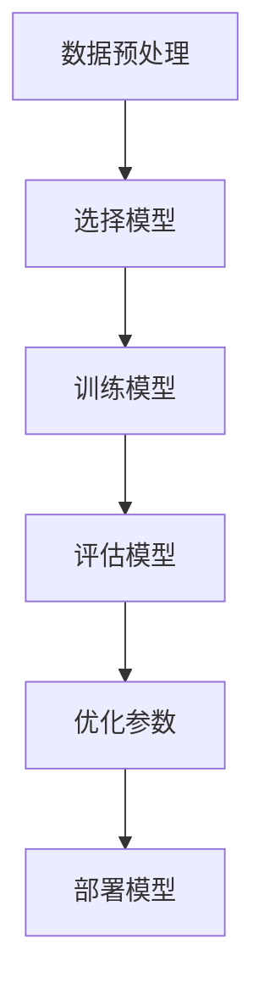
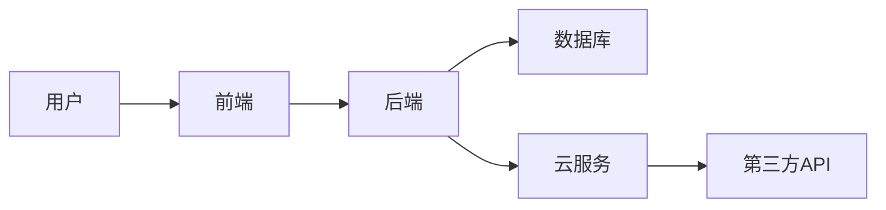
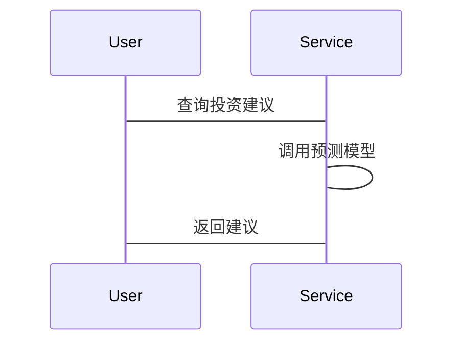

                 


# 云服务在投资理财智能助手中的高效部署

> **关键词**: 云服务, 投资理财, 智能助手, 系统架构, 算法实现

> **摘要**: 本文详细探讨了云服务在投资理财智能助手中的高效部署方法，涵盖背景分析、核心概念、算法原理、系统架构、项目实战等关键环节，通过实际案例和详细代码实现，为读者提供全面的技术指导。

---

## 第1章: 投资理财智能助手的背景与需求

### 1.1 问题背景

#### 1.1.1 投资理财领域的技术挑战
在现代金融环境中，投资者面临日益复杂的投资选择和市场波动。传统的投资工具和方法往往依赖人工分析，效率低下且难以应对快速变化的市场。技术的进步，尤其是人工智能和大数据分析的兴起，为投资理财领域带来了新的机遇和挑战。

#### 1.1.2 传统投资理财工具的局限性
传统的投资理财工具通常依赖于手动数据收集和分析，存在以下问题：
- 数据获取延迟：传统方法依赖于定期报告，无法实时跟踪市场变化。
- 人为错误风险：手动分析容易受到主观判断的影响，可能导致决策失误。
- 缺乏个性化：传统工具难以根据投资者的具体需求提供定制化的建议。

#### 1.1.3 智能化投资理财助手的需求
智能化投资理财助手能够通过自动化数据处理、实时分析和机器学习模型提供更高效、精准的投资建议。投资者需要一个能够实时监控市场动态、提供个性化投资策略、并具备自我优化能力的工具。

### 1.2 问题描述

#### 1.2.1 智能投资理财助手的核心功能
智能投资理财助手应具备以下核心功能：
- 实时数据监控：实时跟踪股票、基金等投资产品的市场动态。
- 个性化投资建议：根据投资者的风险承受能力和财务目标，推荐最优投资组合。
- 市场趋势预测：利用历史数据和机器学习模型预测未来市场走势。
- 风险管理：识别潜在风险并提供规避策略。

#### 1.2.2 云服务在投资理财中的应用场景
云服务在投资理财中的应用主要体现在以下几个方面：
- 数据存储与处理：利用云存储和大数据处理技术高效管理海量金融数据。
- 计算资源弹性扩展：根据计算需求动态调整计算资源，确保系统性能。
- 服务部署与管理：通过云服务快速部署投资理财助手，并实现自动化运维。

#### 1.2.3 投资者行为与需求分析
投资者的行为和需求多样化，主要包括：
- 对实时数据的需求：投资者希望获得最新的市场信息。
- 对个性化建议的需求：不同投资者有不同的财务目标和风险偏好。
- 对高效服务的需求：投资者希望快速获取投资建议和决策支持。

### 1.3 问题解决

#### 1.3.1 智能投资理财助手的解决方案
智能投资理财助手的解决方案主要依赖于以下技术：
- 大数据处理：利用云平台处理海量金融数据。
- 机器学习：构建预测模型，提供智能投资建议。
- 自然语言处理：实现智能交互，理解用户需求。

#### 1.3.2 云服务在解决方案中的作用
云服务在解决方案中扮演着关键角色：
- 提供弹性计算资源：根据负载动态调整资源，降低成本。
- 支持高可用性：通过负载均衡和容灾备份确保服务稳定。
- 数据安全：利用云安全服务保护投资者数据。

#### 1.3.3 投资理财助手的边界与外延
投资理财助手的边界在于其功能模块，包括数据采集、分析、建议生成和用户交互。外延则扩展至与其他金融系统的集成，如银行账户接口和第三方数据源。

### 1.4 核心概念与联系

#### 1.4.1 核心概念的原理
投资理财助手的核心概念包括：
- 数据采集：从多个来源获取实时金融数据。
- 数据分析：利用统计和机器学习方法处理数据。
- 智能建议：基于分析结果生成投资策略。

#### 1.4.2 核心概念的属性特征对比表格

| 核心概念    | 数据采集 | 数据分析 | 智能建议 |
|------------|----------|----------|----------|
| 输入        | 原始数据 | 分析结果 | 用户需求 |
| 输出        | 结构化数据 | 预测结果 | 投资建议 |
| 技术依赖    | 网络接口 | 机器学习 | 自然语言处理 |
| 目标        | 数据完整性 | 预测准确性 | 用户满意度 |

#### 1.4.3 ER实体关系图架构的 Mermaid 流程图

```mermaid
erDiagram
    customer[CUSTOMER] {
        id_customer
        name
        email
        investment_goals
    }
    investment_product[INVESTMENT_PRODUCT] {
        id_product
        product_name
        category
        risk_level
    }
    transaction[TRANSACTION] {
        id_transaction
        amount
        date
        status
    }
    CUSTOMER -> INVESTMENT_PRODUCT : INVESTS_IN
    CUSTOMER -> TRANSACTION : PERFORMS
    INVESTMENT_PRODUCT -> TRANSACTION : INVOLVES
```

---

## 第2章: 投资理财智能助手的核心算法

### 2.1 算法原理讲解

#### 2.1.1 投资理财预测模型的原理
投资理财预测模型通常基于时间序列分析和机器学习算法，如ARIMA、LSTM等。

#### 2.1.2 时间序列分析的算法流程



#### 2.1.3 机器学习算法在投资预测中的应用
机器学习算法如支持向量机（SVM）和随机森林（Random Forest）常用于分类和回归问题。

### 2.2 算法的数学模型与公式

#### 2.2.1 时间序列分析的数学模型
ARIMA模型的数学公式为：
$$ ARIMA(p, d, q) $$
其中，p为自回归阶数，d为差分阶数，q为移动平均阶数。

#### 2.2.2 机器学习算法的数学公式
线性回归的数学公式为：
$$ y = \beta_0 + \beta_1 x + \epsilon $$

---

## 第3章: 系统架构与设计

### 3.1 系统分析

#### 3.1.1 项目背景与目标
本项目旨在开发一个基于云服务的投资理财智能助手，目标是为投资者提供实时、个性化的投资建议。

#### 3.1.2 系统功能需求分析
系统需要实现数据采集、分析、建议生成和用户交互功能。

#### 3.1.3 系统非功能需求分析
系统需具备高可用性、可扩展性和安全性。

### 3.2 系统架构设计

#### 3.2.1 系统架构的 Mermaid 架构图



#### 3.2.2 系统功能模块的类图

```mermaid
classDiagram
    class User {
        id
        username
        password
    }
    class InvestmentData {
        id
        symbol
        price
        time
    }
    class InvestmentService {
        +data InvestmentData
        +predict() { ... }
    }
    User --> InvestmentService
    InvestmentService --> InvestmentData
```

#### 3.2.3 系统接口设计
系统接口主要涉及数据采集、模型训练和用户交互。

### 3.3 系统交互设计

#### 3.3.1 系统交互的 Mermaid 序列图



---

## 第4章: 项目实战

### 4.1 环境安装

#### 4.1.1 安装Python和必要的库
安装Python和以下库：
```bash
pip install pandas numpy scikit-learn flask
```

#### 4.1.2 安装云服务依赖
选择合适的云服务提供商（如AWS、Azure）并配置API密钥。

### 4.2 系统核心实现

#### 4.2.1 数据采集模块
代码示例：

```python
import requests

def get_stock_data(symbol):
    url = f"https://api.example.com/stock/{symbol}"
    response = requests.get(url)
    return response.json()
```

#### 4.2.2 预测模型实现
代码示例：

```python
from sklearn.linear_model import LinearRegression

def train_model(data):
    model = LinearRegression()
    model.fit(data[['feature']], data['target'])
    return model
```

### 4.3 实际案例分析

#### 4.3.1 案例背景
假设一个投资者希望预测某股票的未来价格。

#### 4.3.2 数据处理与分析
处理数据并训练模型，生成投资建议。

### 4.4 项目小结
通过实际案例，展示了云服务在投资理财智能助手中的高效部署和实际应用。

---

## 第5章: 总结与展望

### 5.1 总结
本文详细探讨了云服务在投资理财智能助手中的高效部署，涵盖了从背景分析到系统实现的各个方面。

### 5.2 展望
未来，随着人工智能和大数据技术的进一步发展，投资理财智能助手将更加智能化和个性化。

---

## 第6章: 最佳实践与注意事项

### 6.1 最佳实践 tips
- 定期更新模型，保持预测准确性。
- 优化系统架构，提高服务效率。

### 6.2 小结
云服务在投资理财智能助手中的应用前景广阔，值得进一步研究和探索。

### 6.3 注意事项
- 数据安全是关键，需采取严格的安全措施。
- 系统设计需考虑可扩展性和可维护性。

### 6.4 拓展阅读
推荐阅读《云服务架构设计》和《机器学习在金融中的应用》。

---

## 作者

作者：AI天才研究院 & 禅与计算机程序设计艺术

--- 

**本文由AI天才研究院（AI Genius Institute）创作，转载请注明出处。**

