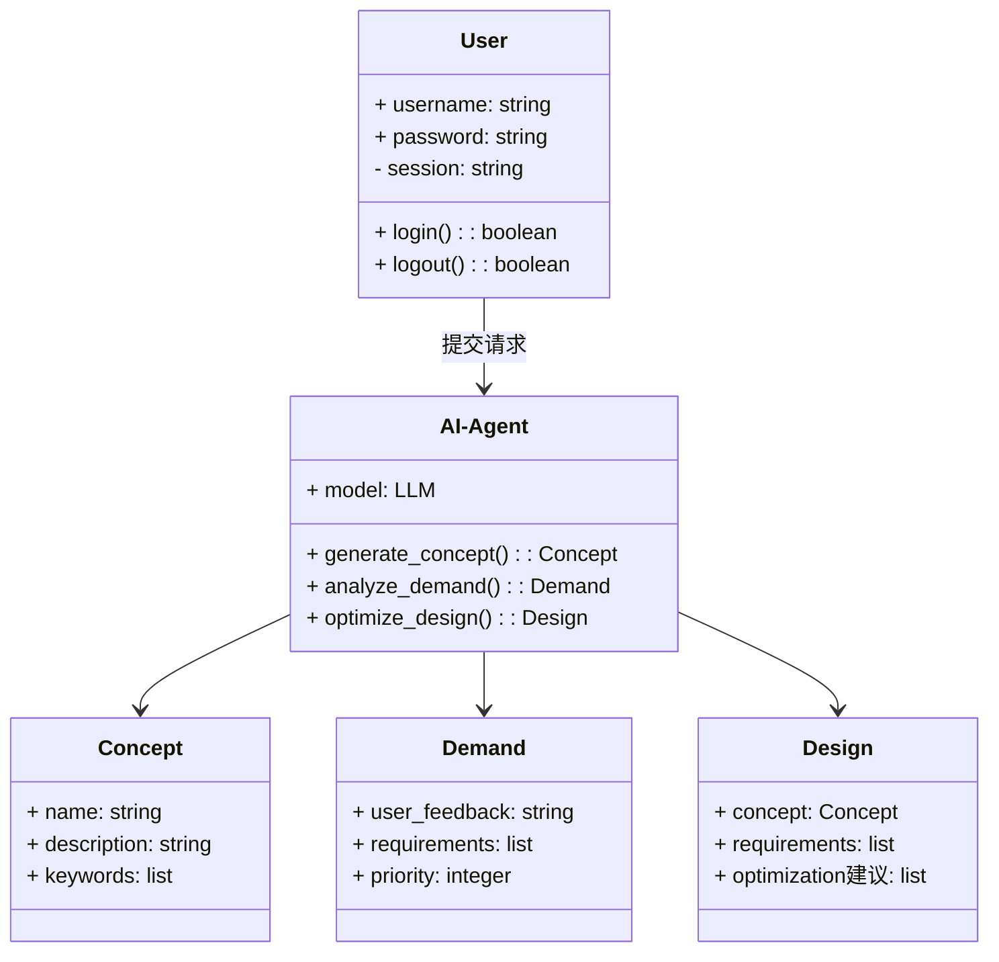
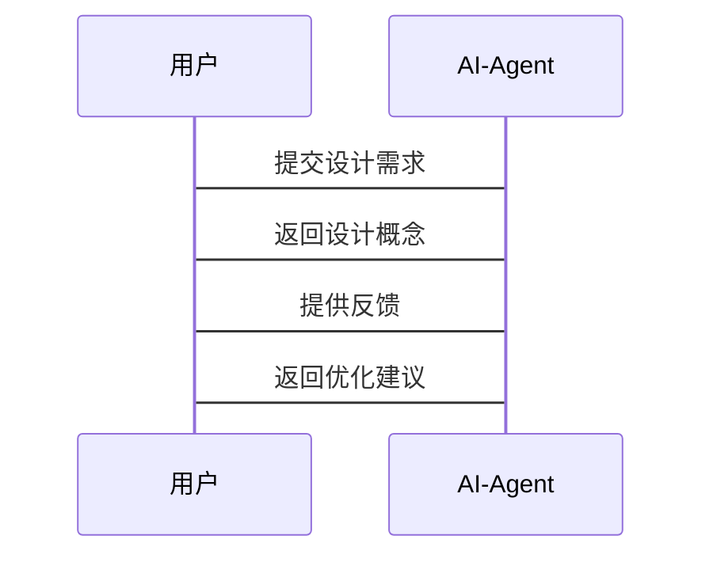

                 


# 产品设计 AI Agent：LLM 辅助创新与概念生成

## 关键词：AI Agent, LLM, 大语言模型, 产品设计, 概念生成, 创意设计, 人工智能

## 摘要：  
随着人工智能技术的飞速发展，大语言模型（Large Language Models, LLM）在产品设计领域的应用日益广泛。本文深入探讨了AI Agent在产品设计中的角色，特别是LLM如何通过辅助创新和概念生成推动产品设计的效率和质量。文章从背景介绍、核心概念、算法原理、系统架构、项目实战到最佳实践，全面解析了AI Agent在产品设计中的应用，展示了如何利用LLM进行创意生成、需求分析和设计优化，为产品经理和设计师提供了实用的工具和方法。

---

## 第一部分: 产品设计 AI Agent 的背景与概念

### 第1章: AI Agent 与 LLM 的基本概念

#### 1.1 AI Agent 的定义与特点

##### 1.1.1 AI Agent 的定义  
AI Agent（人工智能代理）是指能够感知环境、自主决策并执行任务的智能实体。它可以是一个软件程序、一个机器人，甚至是嵌入在系统中的算法。AI Agent的核心目标是通过智能决策和行动，帮助用户完成特定任务或解决问题。

##### 1.1.2 AI Agent 的核心特点  
- **自主性**：AI Agent能够在没有外部干预的情况下自主决策和行动。  
- **反应性**：能够实时感知环境变化并做出响应。  
- **目标导向**：所有行为都以实现特定目标为导向。  
- **学习能力**：通过数据和经验不断优化自身的决策能力。  

##### 1.1.3 AI Agent 与传统 AI 的区别  
传统的AI系统通常依赖于固定的规则和逻辑，而AI Agent具有更强的自主性和适应性。AI Agent能够动态调整策略，适应复杂多变的环境，而传统AI则更多地依赖预定义的规则。

---

#### 1.2 大语言模型（LLM）的基本概念

##### 1.2.1 LLM 的定义  
大语言模型（Large Language Models, LLM）是一种基于深度学习的自然语言处理模型，旨在理解和生成人类语言。LLM通过大量的文本数据进行训练，能够模拟人类的对话、理解和生成能力。

##### 1.2.2 LLM 的主要特点  
- **强大的上下文理解能力**：能够理解复杂句子的语义和上下文关系。  
- **生成能力**：能够生成连贯、自然的文本内容。  
- **多语言支持**：能够理解和生成多种语言。  
- **可扩展性**：可以通过微调和参数调整适应不同的任务和领域。  

##### 1.2.3 LLM 的应用场景  
- **自然语言处理**：文本生成、问答系统、机器翻译。  
- **创意设计**：概念生成、灵感激发、内容创作。  
- **辅助决策**：数据分析、趋势预测、策略制定。  

---

#### 1.3 AI Agent 在产品设计中的作用

##### 1.3.1 AI Agent 在产品设计中的优势  
- **提高效率**：AI Agent能够快速生成设计概念和方案，减少人工设计的时间和成本。  
- **创新性**：通过LLM的生成能力，AI Agent能够提供独特的创意和设计方案。  
- **用户洞察**：能够分析用户需求和反馈，帮助设计师更好地理解用户需求。  

##### 1.3.2 LLM 在概念生成中的应用  
- **创意生成**：LLM能够根据用户输入的关键词生成多个设计概念和灵感。  
- **需求分析**：通过自然语言处理，LLM能够提取用户需求的关键点，并生成设计方向。  
- **优化设计**：通过对现有设计的分析，LLM能够提出改进建议和优化方案。  

##### 1.3.3 产品设计 AI Agent 的核心价值  
AI Agent通过整合LLM的生成能力和自主决策能力，为产品设计提供了智能化的支持，能够显著提升设计效率和创新性，同时降低设计成本。

---

## 第二部分: LLM 的核心原理与算法

### 第3章: 大语言模型的数学基础

#### 3.1 语言模型的基本原理

##### 3.1.1 语言模型的定义  
语言模型是一种能够预测文本序列的概率模型。它通过计算给定上下文的情况下，生成下一个词的概率来实现文本生成。

##### 3.1.2 语言模型的训练目标  
语言模型的训练目标是最大化训练数据的对数似然，即最大化生成训练数据的概率。数学表达式为：

$$ \arg\max_{\theta} \sum_{i=1}^N \log P(x_i | x_{<i}; \theta) $$

其中，$x_i$ 表示输入序列中的第i个词，$\theta$ 表示模型参数。

##### 3.1.3 概率论基础  
概率论是语言模型的核心基础。概率分布、条件概率、贝叶斯定理等概念在语言模型中广泛应用。例如，条件概率公式为：

$$ P(A|B) = \frac{P(A \cap B)}{P(B)} $$

---

#### 3.2 深度学习与神经网络基础

##### 3.2.1 神经网络的基本结构  
神经网络由输入层、隐藏层和输出层组成。每个神经元通过激活函数进行非线性变换，能够学习复杂的输入输出关系。

##### 3.2.2 深度学习的核心思想  
深度学习通过堆叠多层神经网络，学习数据的高层次特征。与传统机器学习不同，深度学习能够自动提取特征，减少了人工特征工程的需求。

##### 3.2.3 神经网络的训练过程  
神经网络的训练过程包括正向传播、损失计算和反向传播。通过梯度下降优化算法，模型参数得以更新，以最小化损失函数。

---

#### 3.3 变压器（Transformer）模型

##### 3.3.1 Transformer 的结构  
Transformer模型由编码器和解码器组成。编码器负责将输入序列转换为语义向量，解码器负责根据编码器的输出生成目标序列。

##### 3.3.2 自注意力机制（Self-Attention）  
自注意力机制通过计算输入序列中每个位置与其他位置的相关性，生成位置权重。其数学公式为：

$$ \text{Attention}(Q, K, V) = \text{softmax}\left(\frac{QK^T}{\sqrt{d_k}}\right)V $$

其中，$Q$、$K$、$V$分别是查询、键和值向量，$d_k$是键的维度。

##### 3.3.3 前馈神经网络  
Transformer的解码器部分包含堆叠的前馈神经网络，每个层包括多头注意力和前馈网络。

---

### 第4章: 大语言模型的训练与推理

#### 4.1 模型训练的基本流程

##### 4.1.1 数据预处理  
数据预处理包括分词、去除停用词、数据清洗等步骤。例如，可以使用以下Python代码进行文本分词：

```python
import jieba
text = "这是一个测试文本"
tokens = jieba.lcut(text)
print(tokens)
```

##### 4.1.2 模型初始化  
模型初始化包括参数的随机初始化和权重的初始化策略。常用的初始化方法有Xavier初始化和He初始化。

##### 4.1.3 梯度下降与优化算法  
梯度下降是模型训练的核心算法。常用的优化算法包括随机梯度下降（SGD）、Adam优化器等。Adam优化器的更新公式为：

$$ \theta_{t+1} = \theta_t - \eta \frac{\beta_1}{1 - \beta_1^t} g_t - \frac{\beta_2}{1 - \beta_2^t} g_t^2 $$

其中，$\eta$ 是学习率，$\beta_1$ 和 $\beta_2$ 是动量参数，$g_t$ 是梯度。

#### 4.2 模型推理的实现

##### 4.2.1 输入处理  
模型推理时，输入文本需要进行分词和编码。例如，使用词嵌入层将文本转换为向量表示。

##### 4.2.2 注意力计算  
在Transformer模型中，注意力计算是关键步骤。通过自注意力机制，模型能够捕捉到输入序列中的长距离依赖关系。

##### 4.2.3 输出生成  
模型生成输出时，通常采用贪心算法或随机采样方法。例如，贪心算法选择概率最高的词作为输出。

#### 4.3 模型调优与优化

##### 4.3.1 参数调整  
模型调优包括学习率调整、批量大小调整、Dropout比例调整等。例如，可以通过网格搜索找到最优的超参数组合。

##### 4.3.2 模型剪枝  
模型剪枝是减少模型复杂度的常用方法。例如，可以通过删除冗余的神经元或合并相似的特征来优化模型。

##### 4.3.3 模型微调  
模型微调是通过在特定领域数据上对预训练模型进行微调，以适应具体任务的需求。例如，可以在产品设计领域数据上微调一个预训练的LLM。

---

## 第三部分: 系统分析与架构设计方案

### 第5章: 产品设计 AI Agent 的系统架构

#### 5.1 问题场景介绍

##### 5.1.1 产品设计的挑战  
产品设计是一个复杂的过程，涉及创意生成、需求分析、方案优化等多个环节。传统设计方法效率低下，难以应对快速变化的市场需求。

##### 5.1.2 问题描述  
如何利用AI技术提高产品设计的效率和创新性，是当前设计师和产品经理面临的重要问题。

##### 5.1.3 问题解决  
通过引入AI Agent和LLM，可以实现自动化的设计概念生成、需求分析和优化建议，显著提升设计效率和质量。

---

#### 5.2 项目介绍

##### 5.2.1 项目目标  
本项目旨在开发一个基于LLM的AI Agent，用于辅助产品设计的创意生成和概念设计。

##### 5.2.2 项目范围  
项目范围包括需求分析、系统设计、功能实现和测试优化。

##### 5.2.3 项目团队  
项目团队包括产品经理、数据科学家、软件工程师和设计师。

---

#### 5.3 系统功能设计

##### 5.3.1 领域模型类图  
以下是一个简化的领域模型类图：



##### 5.3.2 系统架构图  
以下是一个简化的系统架构图：

```mermaid
archi
    客户端 -->(HTTP)--> API网关
    API网关 -->(Rest)--> LLM服务
    LLM服务 -->(Docker)--> 容器化部署
    容器化部署 -->(Kubernetes)--> 集群管理
```

---

#### 5.4 系统接口设计

##### 5.4.1 API 接口定义  
以下是API接口的定义：

```http
POST /api/v1/generate_concept
Content-Type: application/json

{
    "input": "产品设计需求"
}
```

##### 5.4.2 接口返回格式  
接口返回JSON格式的数据：

```json
{
    "status": "success",
    "data": {
        "concept": "创新设计概念1",
        "description": "这是一个创新的设计方案，旨在..."
    }
}
```

---

#### 5.5 系统交互序列图

##### 5.5.1 用户与 AI Agent 的交互流程  
以下是一个简化的用户与AI Agent的交互流程：



---

## 第四部分: 项目实战

### 第6章: 基于 LLM 的产品设计 AI Agent 实现

#### 6.1 环境安装

##### 6.1.1 安装 Python 环境  
安装Python 3.8及以上版本，并安装必要的库：

```bash
pip install numpy pandas torch transformers
```

##### 6.1.2 安装 LLM 模型  
安装预训练的LLM模型，例如GPT-2：

```bash
git clone https://github.com/openai/gpt-2
cd gpt-2 && pip install -r requirements.txt
```

#### 6.2 系统核心实现源代码

##### 6.2.1 LLM 的调用代码  
以下是调用LLM的Python代码：

```python
from transformers import GPT2LMHeadModel, GPT2Tokenizer

model_name = 'gpt2'
tokenizer = GPT2Tokenizer.from_pretrained(model_name)
model = GPT2LMHeadModel.from_pretrained(model_name)

def generate_concept(prompt):
    inputs = tokenizer.encode(prompt, return_tensors='pt')
    outputs = model.generate(inputs, max_length=50, temperature=0.7)
    return tokenizer.decode(outputs[0], skip_special_tokens=True)
```

##### 6.2.2 AI Agent 的实现代码  
以下是AI Agent的实现代码：

```python
class AI-Agent:
    def __init__(self, model):
        self.model = model
        self.tokenizer = GPT2Tokenizer.from_pretrained('gpt2')
    
    def generate_concept(self, prompt):
        return self.model.generate_concept(prompt)
    
    def analyze_demand(self, feedback):
        # 实现需求分析逻辑
        pass
    
    def optimize_design(self, design):
        # 实现设计优化逻辑
        pass
```

#### 6.3 代码应用解读与分析

##### 6.3.1 代码结构分析  
AI Agent类封装了LLM的调用接口，实现了概念生成、需求分析和设计优化的功能。通过调用预训练的GPT-2模型，AI Agent能够生成创新的设计概念。

##### 6.3.2 核心算法解读  
生成概念的核心算法是基于Transformer的自注意力机制，通过概率生成的方式，生成多样化的设计概念。

#### 6.4 实际案例分析与详细讲解剖析

##### 6.4.1 案例背景  
假设我们需要设计一个智能手表，目标是通过AI Agent生成创新的设计概念。

##### 6.4.2 案例分析  
AI Agent通过分析用户需求，生成多个设计概念，包括健康监测、智能提醒、运动追踪等功能。

##### 6.4.3 案例结果  
生成的设计概念包括“健康监测智能手表”、“运动追踪智能手表”、“智能提醒智能手表”等多个方向，为设计师提供了丰富的灵感。

#### 6.5 项目小结

##### 6.5.1 项目成果  
通过本项目，我们成功实现了基于LLM的AI Agent，能够辅助产品设计师生成创新的设计概念。

##### 6.5.2 项目经验  
在项目实施过程中，我们发现模型的生成能力依赖于训练数据的质量和多样性。因此，在后续工作中，需要进一步优化数据预处理和模型微调。

---

## 第五部分: 最佳实践与小结

### 第7章: 最佳实践与总结

#### 7.1 最佳实践 tips

##### 7.1.1 数据质量  
确保训练数据的多样性和高质量，避免模型生成的内容单一化。  
##### 7.1.2 模型调优  
通过微调和参数调整，优化模型的生成效果和推理效率。  
##### 7.1.3 人机协作  
AI Agent应作为设计师的辅助工具，而不是替代设计师的创造力。  

---

#### 7.2 小结

##### 7.2.1 核心内容回顾  
本文深入探讨了AI Agent在产品设计中的应用，特别是LLM如何通过概念生成和需求分析推动设计创新。

##### 7.2.2 未来展望  
随着大语言模型的不断发展，AI Agent在产品设计中的应用将更加广泛和深入。未来的研究方向包括模型的可解释性、多模态设计以及实时交互能力的提升。

---

## 作者：AI天才研究院/AI Genius Institute & 禅与计算机程序设计艺术 /Zen And The Art of Computer Programming

---

**附录：相关工具与资源**  
- **LLM 模型**：GPT-2、GPT-3、BERT、T5等。  
- **编程工具**：Python、PyTorch、TensorFlow。  
- **可视化工具**：Mermaid、Draw.io。

