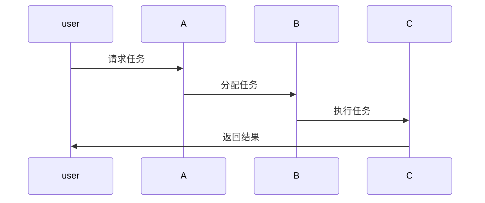

                 


# 人机协作：设计AI Agent与人类的配合模式

## 关键词：人机协作、AI Agent、协作模式、算法原理、系统架构

## 摘要：  
人机协作是人工智能领域的重要研究方向，旨在探索AI Agent与人类之间的高效配合模式。本文从背景、核心概念、算法原理、系统架构、项目实战等多方面展开，系统性地分析人机协作的设计方法与实现技术，探讨如何构建高效的人机协作系统。

---

# 第一部分：人机协作的背景与核心概念

## 第1章：人机协作的背景与问题背景

### 1.1 人机协作的背景

#### 1.1.1 从人机交互到人机协作的演进  
人机交互经历了从简单的命令行输入到图形界面，再到如今的智能交互的演进。AI Agent的出现，使得人机协作成为可能。人机协作不仅仅是技术的进步，更是人类与智能系统深度融合的体现。

#### 1.1.2 AI Agent的定义与特点  
AI Agent（智能体）是指能够感知环境、自主决策并执行任务的实体。其特点包括：  
- **自主性**：能够自主决策，无需外部干预。  
- **反应性**：能够实时感知环境并做出反应。  
- **目标导向**：具有明确的目标导向性。  

#### 1.1.3 人机协作的必要性与优势  
人机协作的必要性来源于人类与AI Agent在能力上的互补性。人类在创造力、情感理解等方面具有优势，而AI Agent则在数据处理、模式识别等方面具有优势。通过协作，可以实现1+1>2的效果。

---

### 1.2 问题背景与问题描述

#### 1.2.1 当前人机协作的主要挑战  
- **理解能力不足**：AI Agent难以完全理解人类的情感和意图。  
- **协作效率问题**：协作过程中可能出现任务分配不均或信息传递不畅的问题。  
- **安全性问题**：协作过程中可能面临数据泄露或系统失控的风险。  

#### 1.2.2 人机协作的核心问题  
- **任务分配**：如何将任务合理分配给人类与AI Agent。  
- **信息共享**：如何实现人与AI Agent之间的高效信息共享。  
- **协作信任**：如何建立人与AI Agent之间的信任关系。  

#### 1.2.3 问题的边界与外延  
人机协作的边界包括技术实现、伦理规范、法律约束等方面。其外延则涉及人机协作的应用场景，如医疗、教育、工业等领域。

---

### 1.3 人机协作的核心要素

#### 1.3.1 人机协作的基本组成  
- **人类**：作为协作的主体之一，具有决策权和创造力。  
- **AI Agent**：作为协作的主体之一，负责执行具体任务。  
- **协作环境**：提供协作的平台和工具。  

#### 1.3.2 核心要素的特征对比  
通过对比表（下图）可以看出，人类与AI Agent在能力上具有互补性。

```mermaid
| 特性 | 人类 | AI Agent |
|------|------|----------|
| 优势 | 创造力、情感理解 | 数据处理、模式识别 |
| 局限性 | 易疲劳、决策慢 | 依赖数据、缺乏情感 |
```

#### 1.3.3 实体关系图（ER图）  
```mermaid
erDiagram
    user {
        id : integer
        name : string
        role : string
    }
    agent {
        id : integer
        type : string
        capability : string
    }
    collaboration {
        id : integer
        task : string
        status : string
    }
    user --|> collaboration : "参与"
    agent --|> collaboration : "执行"
```

---

## 第2章：AI Agent与人类的协作模式

### 2.1 AI Agent的定义与分类

#### 2.1.1 AI Agent的基本定义  
AI Agent是指能够感知环境、自主决策并执行任务的智能实体。

#### 2.1.2 基于任务的AI Agent分类  
- **任务型AI Agent**：专注于完成特定任务，如客服机器人。  
- **决策型AI Agent**：负责做出决策，如自动驾驶系统。  

#### 2.1.3 基于智能水平的AI Agent分类  
- **弱AI Agent**：针对特定任务设计，如语音助手。  
- **强AI Agent**：具备通用智能，能够处理多种任务，如具备推理能力的AI助手。  

---

### 2.2 人类与AI Agent的协作特点

#### 2.2.1 协作的基本特征  
- **目标一致性**：协作目标一致，分工明确。  
- **实时互动**：协作过程中需要实时互动和反馈。  
- **动态调整**：根据环境变化动态调整协作策略。  

#### 2.2.2 人类与AI Agent的协作机制  
- **任务分配**：根据任务特点和能力分配任务。  
- **信息共享**：通过共享信息实现协作。  
- **反馈机制**：通过反馈机制优化协作过程。  

#### 2.2.3 协作的边界与外延  
协作的边界包括技术实现、伦理规范等，其外延则涉及协作的应用场景。

---

### 2.3 人机协作的核心概念与联系

#### 2.3.1 核心概念的原理  
人机协作的核心原理是通过任务分配、信息共享和反馈机制实现协作。

#### 2.3.2 核心概念的属性特征对比  
通过对比表可以看出，人类与AI Agent在协作中的角色和能力具有互补性。

```mermaid
| 特性 | 人类 | AI Agent |
|------|------|----------|
| 协作能力 | 高 | 中 |
| 理解能力 | 高 | 中 |
| 学习能力 | 高 | 高 |
| 执行能力 | 中 | 高 |
```

#### 2.3.3 实体关系图（ER图）  
```mermaid
erDiagram
    collaboration {
        id : integer
        task : string
        status : string
    }
    user --|> collaboration : "参与"
    agent --|> collaboration : "执行"
```

---

# 第二部分：人机协作的算法与数学模型

## 第3章：协作算法原理

### 3.1 协作算法概述

#### 3.1.1 协作算法的基本概念  
协作算法是指在人机协作过程中用于任务分配、信息共享和反馈优化的算法。

#### 3.1.2 协作算法的主要类型  
- **基于规则的协作算法**：通过预定义规则实现协作。  
- **基于优化的协作算法**：通过优化目标函数实现协作。  
- **基于强化学习的协作算法**：通过强化学习实现协作。  

#### 3.1.3 协作算法的优缺点  
- **优点**：能够提高协作效率和准确性。  
- **缺点**：算法复杂，实现难度较高。  

---

### 3.2 任务分配算法

#### 3.2.1 任务分配的基本原理  
任务分配算法的核心是根据任务特点和协作双方的能力进行任务分配。

#### 3.2.2 基于优化的协作算法  
基于优化的协作算法是一种常用的任务分配算法，其数学模型如下：

$$ \text{目标函数} = \sum_{i=1}^{n} w_i x_i $$

其中，$w_i$是任务权重，$x_i$是任务分配变量。

#### 3.2.3 基于强化学习的协作  
基于强化学习的协作算法通过强化学习模型实现任务分配。其算法流程如下：


---

## 第4章：数学模型与公式推导

### 4.1 协作算法的数学模型

#### 4.1.1 基于线性规划的任务分配模型  
线性规划模型用于优化任务分配，其数学表达如下：

$$ \text{最大化} \quad \sum_{i=1}^{n} c_i x_i $$

其中，$c_i$是任务的收益，$x_i$是任务分配变量。

#### 4.1.2 基于强化学习的协作模型  
强化学习模型通过Q-learning算法实现协作，其数学表达如下：

$$ Q(s, a) = r + \gamma \max_{a'} Q(s', a') $$

其中，$s$是状态，$a$是动作，$r$是奖励，$\gamma$是折扣因子。

---

## 第5章：系统分析与架构设计方案

### 5.1 系统分析

#### 5.1.1 系统需求分析  
系统需求包括任务分配、信息共享、反馈优化等功能。

#### 5.1.2 系统功能设计  
系统功能包括任务分配模块、信息共享模块、反馈优化模块。

#### 5.1.3 系统架构设计  
系统架构采用分层设计，包括数据层、业务层和表现层。

---

### 5.2 系统架构设计方案

#### 5.2.1 系统架构图  


#### 5.2.2 系统接口设计  
系统接口包括任务分配接口、信息共享接口和反馈优化接口。

#### 5.2.3 系统交互流程  
系统交互流程如下：



---

## 第三部分：项目实战与应用

## 第6章：项目实战

### 6.1 环境配置

#### 6.1.1 系统环境  
- 操作系统：Linux  
- 开发工具：Python、PyTorch  

#### 6.1.2 依赖安装  
安装必要的依赖项，如numpy、pandas等。

---

### 6.2 核心代码实现

#### 6.2.1 任务分配模块  
任务分配模块实现基于线性规划的任务分配：

```python
import numpy as np
from scipy.optimize import linprog

# 定义目标函数
c = [-2, -3]
# 定义约束条件
A = [[1, 1]]
b = [4]
# 定义变量范围
x_bounds = (0, None)
y_bounds = (0, None)

# 求解线性规划问题
result = linprog(c, A, b, bounds=(x_bounds, y_bounds), method='highs')

# 输出结果
print(result.x)
```

#### 6.2.2 信息共享模块  
信息共享模块实现基于区块链的信息共享：

```python
from hashlib import sha256

# 定义区块链类
class Block:
    def __init__(self, index, data, prev_hash):
        self.index = index
        self.data = data
        self.prev_hash = prev_hash
        self.hash = self.compute_hash()

    def compute_hash(self):
        return sha256(str(self.index) + str(self.data) + str(self.prev_hash)).hexdigest()
```

---

### 6.3 功能解读与分析

#### 6.3.1 任务分配功能  
任务分配模块通过线性规划算法实现任务的最优分配。

#### 6.3.2 信息共享功能  
信息共享模块通过区块链技术实现信息的安全共享。

---

### 6.4 实际案例分析

#### 6.4.1 案例背景  
以智能客服系统为例，实现人机协作的任务分配和信息共享。

#### 6.4.2 案例实现  
通过上述代码实现智能客服系统的任务分配和信息共享功能。

#### 6.4.3 案例分析  
分析系统的性能和效果，提出改进建议。

---

## 第四部分：总结与展望

## 第7章：总结与展望

### 7.1 小结  
人机协作是人工智能领域的研究热点，本文从背景、核心概念、算法原理、系统架构和项目实战等多个方面进行了详细探讨。

### 7.2 注意事项  
在实际应用中，需要注意数据安全、算法优化和用户体验等问题。

### 7.3 拓展阅读  
推荐阅读相关领域的书籍和论文，深入学习人机协作的理论与实践。

---

## 作者：AI天才研究院/AI Genius Institute & 禅与计算机程序设计艺术/Zen And The Art of Computer Programming

