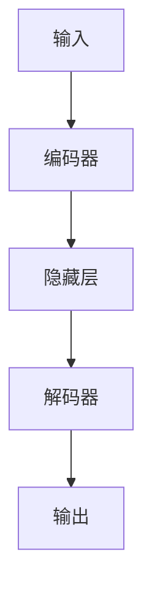
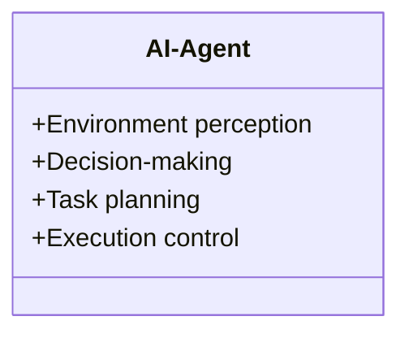
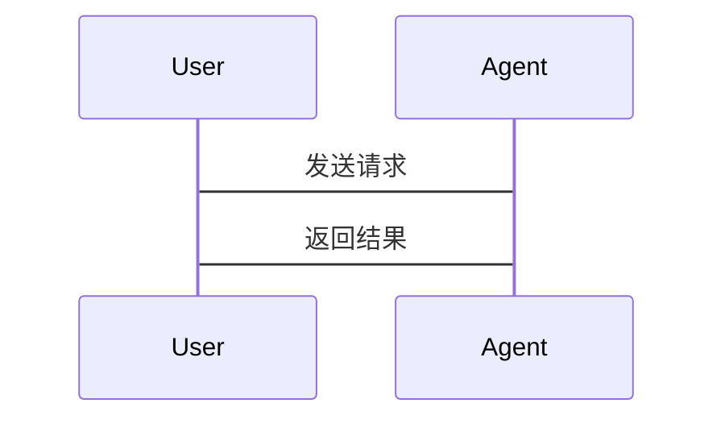

                 


# 从GPT到AI Agent：技术演进与应用变革

## 关键词：生成式AI、AI Agent、技术演进、应用变革、深度学习、自然语言处理、智能系统

## 摘要：本文探讨生成式AI从GPT演进到AI Agent的技术变革，分析其核心概念、算法原理、系统架构及应用场景。通过详细的技术分析和实例，揭示生成式AI与AI Agent的融合如何推动智能系统的发展。

---

## 第一部分：生成式AI与AI Agent的背景与演进

### 第1章：生成式AI的起源与发展

#### 1.1 生成式AI的定义与特点
- **生成式AI的基本概念**：生成式AI通过深度学习模型生成文本、图像等数据，模仿人类创造力。
- **生成式AI的核心特点**：数据生成能力、上下文理解、多模态输出。
- **生成式AI与传统AI的区别**：传统AI侧重于分类和识别，生成式AI侧重于生成新内容。

#### 1.2 GPT系列模型的演进历程
- **GPT-1的诞生与特点**：2018年发布，1.1亿参数，奠定生成式AI基础。
- **GPT-2的技术突破与应用**：改进生成质量，参数增至15亿，应用于文本生成。
- **GPT-3及后续版本的革新**：2020年发布，1750亿参数，具备零样本学习能力，广泛应用于各种场景。

### 第2章：AI Agent的定义与核心能力

#### 2.1 AI Agent的基本概念
- **AI Agent的定义**：具备感知、决策、规划和执行能力的智能体，能自主完成任务。
- **AI Agent的核心能力**：感知环境、自主决策、学习与适应、多模态交互。

#### 2.2 生成式AI在AI Agent中的应用
- **生成式AI作为AI Agent的核心技术**：通过生成式AI处理自然语言，提升对话能力。
- **AI Agent的多模态能力**：结合视觉、听觉等多模态输入，增强交互体验。
- **AI Agent的自主决策能力**：通过强化学习优化决策策略，提高任务执行效率。

---

## 第二部分：核心概念与技术联系

### 第3章：生成式AI与AI Agent的核心原理

#### 3.1 生成式AI的原理
- **大语言模型的训练过程**：基于大量数据预训练，采用自监督学习优化模型。
- **生成式AI的推理机制**：通过解码器生成目标输出，采用贪心算法或随机采样。
- **生成式AI的损失函数与优化方法**：交叉熵损失函数，采用Adam优化器。

#### 3.2 AI Agent的原理
- **AI Agent的感知与决策过程**：通过传感器获取环境信息，利用生成式AI进行理解和生成。
- **AI Agent的规划与执行机制**：采用状态空间和动作空间，通过强化学习优化决策。
- **AI Agent的多任务处理能力**：通过任务分解和优先级排序，提高多任务处理效率。

### 第4章：生成式AI与AI Agent的技术对比与联系

#### 4.1 核心概念对比
- **生成式AI与AI Agent的功能对比**：生成式AI专注于内容生成，AI Agent专注于任务执行。

#### 4.2 技术对比与联系
- **生成式AI与AI Agent的技术对比**：
| 技术特点 | 生成式AI | AI Agent |
|----------|----------|----------|
| 核心任务 | 内容生成 | 任务执行 |
| 输入输出 | 文本/图像 | 动作/状态 |
| 模型结构 | 解码器架构 | 复杂架构 |

- **生成式AI与AI Agent的关系**：生成式AI是AI Agent的核心技术之一，AI Agent结合生成式AI实现更复杂的任务。

---

## 第三部分：算法原理与系统架构

### 第5章：生成式AI的算法原理

#### 5.1 生成式AI的算法流程


#### 5.2 生成式AI的数学模型
- **交叉熵损失函数**：$$\mathcal{L} = -\sum_{t=1}^{T} y_t \log p(y_t|x)$$
- **生成过程**：通过解码器生成概率分布，采用随机采样生成输出。

#### 5.3 生成式AI的Python实现示例
```python
import torch
import torch.nn as nn

class Generator(nn.Module):
    def __init__(self, input_dim, output_dim):
        super(Generator, self).__init__()
        self.fc = nn.Linear(input_dim, output_dim)
    
    def forward(self, x):
        return torch.softmax(x, dim=-1)
```

### 第6章：AI Agent的系统架构

#### 6.1 AI Agent的系统功能设计


#### 6.2 AI Agent的系统架构设计


#### 6.3 AI Agent的接口与交互


---

## 第四部分：项目实战与应用案例

### 第7章：生成式AI与AI Agent的项目实战

#### 7.1 项目环境安装
- 安装PyTorch和Hugging Face库：
  ```bash
  pip install torch transformers
  ```

#### 7.2 核心代码实现
- AI Agent的对话生成模块：
```python
from transformers import GPT2LMHeadModel, GPT2Tokenizer

model = GPT2LMHeadModel.from_pretrained('gpt2')
tokenizer = GPT2Tokenizer.from_pretrained('gpt2')

def generate_response(input_text):
    inputs = tokenizer(input_text, return_tensors='np')
    outputs = model.generate(**inputs, max_length=50)
    return tokenizer.decode(outputs[0], skip_special_tokens=True)
```

#### 7.3 项目案例分析
- 案例：智能客服系统
  - **功能**：用户咨询，系统生成回复。
  - **实现**：使用生成式AI生成回复，结合AI Agent进行上下文管理。

#### 7.4 项目总结
- 成果：实现了基于生成式AI的智能客服系统，提升了用户体验。
- 经验：模型调优和接口设计是关键。

---

## 第五部分：最佳实践与未来展望

### 第8章：生成式AI与AI Agent的最佳实践

#### 8.1 最佳实践
- **数据质量**：确保训练数据多样性和代表性。
- **模型调优**：通过微调和参数调整优化生成效果。
- **安全与伦理**：避免生成有害内容，确保AI Agent的行为符合伦理规范。

#### 8.2 小结
- 生成式AI与AI Agent的结合推动了智能系统的进步，未来将在更多领域发挥作用。

#### 8.3 注意事项
- 数据隐私保护
- 模型可解释性
- 多模态交互的优化

#### 8.4 拓展阅读
- 推荐书籍：《Deep Learning》、《Generative AI: Concepts and Practices》
- 推荐论文：《The GPT-3 paper》、《Reinforcement Learning for AI Agents》

---

## 作者：AI天才研究院 & 禅与计算机程序设计艺术

---

以上是完整的目录和文章内容，涵盖了从GPT到AI Agent的技术演进与应用变革的各个方面。

