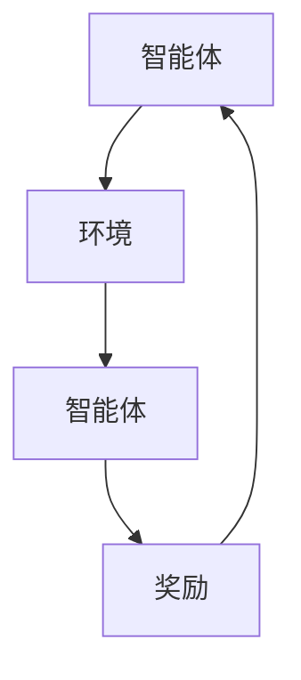
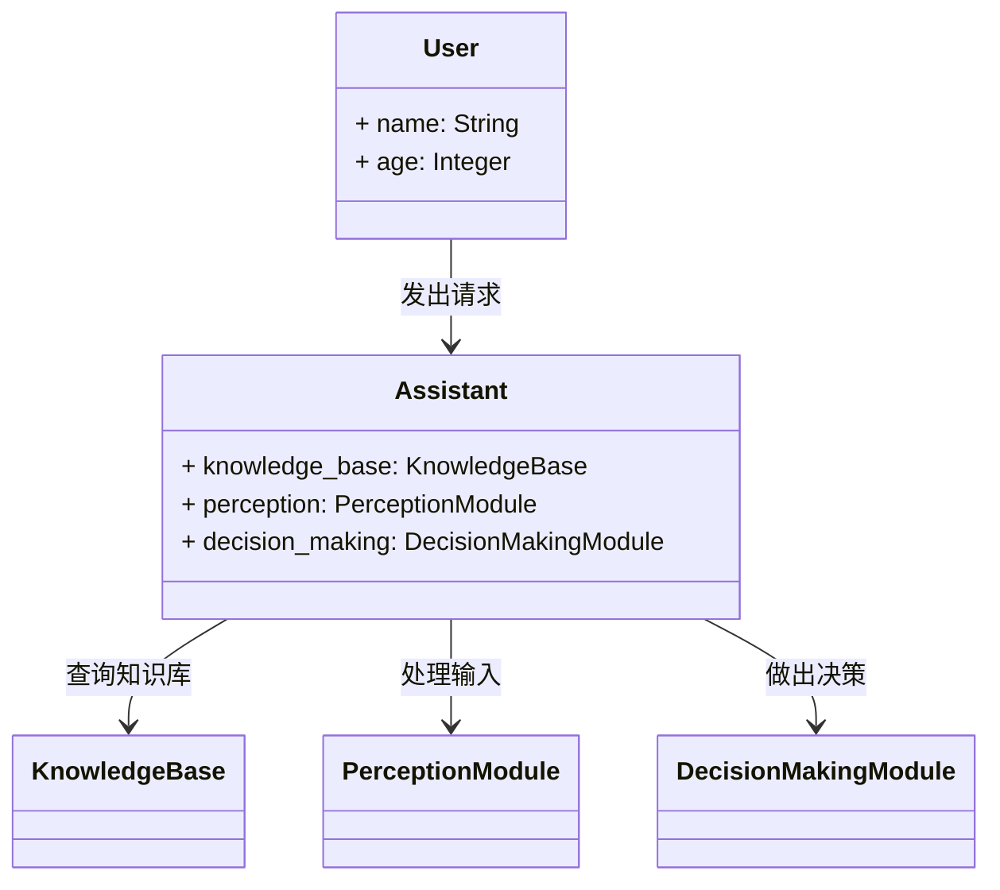
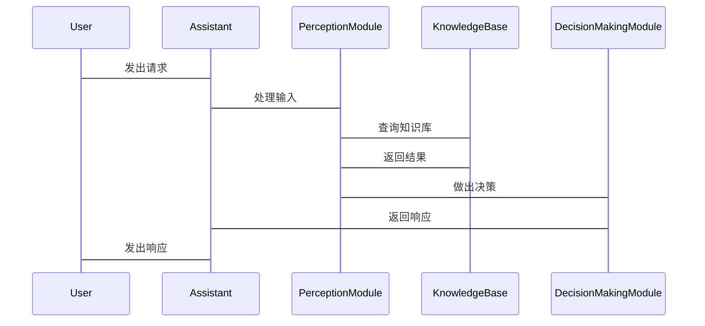

                 


# 从零开始：AI Agent的认知架构设计

> 关键词：AI Agent, 认知架构, 人工智能, 知识表示, 决策推理, 强化学习

> 摘要：AI Agent作为人工智能领域的核心概念，其认知架构设计是实现智能体高效运行的关键。本文将从AI Agent的基本概念出发，逐步深入分析其认知架构的核心要素、算法原理、系统设计与实现，最后通过实战项目展示AI Agent认知架构的实际应用。通过本文的系统阐述，读者可以全面理解AI Agent的认知架构设计，并掌握实际开发中的关键技能。

---

# 第一部分: AI Agent认知架构设计基础

## 第1章: AI Agent的基本概念与背景

### 1.1 AI Agent的定义与特点

AI Agent（智能体）是指能够感知环境并采取行动以实现目标的实体。与传统的被动程序不同，AI Agent具有自主性、反应性、目标导向性和社交能力等特性。它能够通过感知输入做出决策，并通过行动与环境交互，从而实现特定的目标。

#### 1.1.1 AI Agent的定义
AI Agent是一种能够感知环境、做出决策并执行行动的智能实体。它通常被设计为能够适应动态变化的环境，并通过学习和优化来提高其性能。

#### 1.1.2 AI Agent的核心特点
1. **自主性**：AI Agent能够在没有外部干预的情况下自主运行。
2. **反应性**：AI Agent能够实时感知环境并做出反应。
3. **目标导向性**：AI Agent的行为是为了实现特定的目标。
4. **社交能力**：AI Agent能够与其他智能体或人类进行交互和协作。

#### 1.1.3 AI Agent与传统AI的区别
传统的AI程序通常是基于规则的，而AI Agent具有更强的自主性和适应性。AI Agent不仅能够执行任务，还能够根据环境的变化调整其行为。

### 1.2 AI Agent的认知架构背景

#### 1.2.1 认知科学与AI Agent的关系
认知科学的研究成果为AI Agent的设计提供了理论基础，特别是关于感知、推理和学习等方面的知识。

#### 1.2.2 AI Agent在现代信息技术中的地位
AI Agent是实现智能化系统的核心技术，广泛应用于机器人、自动驾驶、智能助手等领域。

#### 1.2.3 AI Agent的应用领域与前景
AI Agent的应用领域包括但不限于：
- 自动驾驶汽车
- 智能助手（如Siri、Alexa）
- 机器人
- 智能推荐系统

AI Agent的认知架构设计是实现这些应用的关键技术。

## 1.3 本章小结
本章从AI Agent的基本概念出发，介绍了其核心特点和与传统AI的区别，并探讨了其在现代信息技术中的地位和应用前景。

---

## 第2章: AI Agent的认知架构核心概念

### 2.1 认知架构的定义与组成

#### 2.1.1 认知架构的定义
认知架构是指智能体内部用于处理信息和做出决策的结构和机制。

#### 2.1.2 认知架构的核心组成要素
1. **知识表示**：用于存储和处理智能体的知识。
2. **感知与理解**：用于获取和理解环境中的信息。
3. **决策与推理**：用于根据感知的信息做出决策。
4. **学习与自适应**：用于通过学习优化自身的认知架构。

#### 2.1.3 认知架构的边界与外延
认知架构的边界在于智能体与环境的交互，外延则涉及智能体内部各个模块的协同工作。

### 2.2 AI Agent认知架构的核心要素

#### 2.2.1 知识表示
知识表示是认知架构的核心要素之一。常用的知识表示方法包括：
1. **框架**：用于表示对象的属性和关系。
2. **语义网络**：用于表示概念及其之间的关系。

#### 2.2.2 感知与理解
感知与理解模块负责从环境中获取信息并进行处理。常见的感知方式包括：
1. **视觉感知**：通过摄像头获取图像信息。
2. **听觉感知**：通过麦克风获取音频信息。
3. **触觉感知**：通过传感器获取触觉信息。

#### 2.2.3 决策与推理
决策与推理模块负责根据感知的信息做出决策。常见的推理方法包括：
1. **逻辑推理**：基于逻辑规则进行推理。
2. **概率推理**：基于概率论进行推理。

#### 2.2.4 学习与自适应
学习与自适应模块负责通过学习优化认知架构。常见的学习方法包括：
1. **监督学习**：通过标记数据进行学习。
2. **无监督学习**：通过无标记数据进行学习。
3. **强化学习**：通过与环境的交互进行学习。

### 2.3 本章小结
本章详细介绍了AI Agent认知架构的核心要素，包括知识表示、感知与理解、决策与推理以及学习与自适应。

---

## 第3章: AI Agent认知架构的核心概念联系

### 3.1 认知架构的核心概念原理

#### 3.1.1 知识表示的原理
知识表示是认知架构的基础，通过合理的知识表示方法，智能体能够更好地理解和处理环境中的信息。

#### 3.1.2 感知与理解的机制
感知与理解模块通过多种方式获取环境中的信息，并将其转化为智能体内部可处理的形式。

#### 3.1.3 决策与推理的过程
决策与推理模块根据感知的信息，结合内部知识，通过推理过程做出决策。

#### 3.1.4 学习与自适应的算法
学习与自适应模块通过各种学习算法优化认知架构，提高智能体的性能。

### 3.2 核心概念属性特征对比表

| 概念       | 属性特征1 | 属性特征2 | 属性特征3 |
|------------|-----------|-----------|-----------|
| 知识表示    | 表达方式   | 可解释性   | 灵活性     |
| 感知与理解  | 输入方式   | 处理方式   | 输出形式   |
| 决策与推理  | 输入条件   | 推理方法   | 决策策略   |
| 学习与自适应 | 学习数据   | 更新频率   | 性能提升    |

### 3.3 ER实体关系图架构

```mermaid
er
actor(AI Agent) -|> knowledge_base: 管理知识表示
actor(AI Agent) -|> perception: 处理感知输入
actor(AI Agent) -|> decision_making: 执行决策
actor(AI Agent) -|> learning_module: 实现自适应学习
```

### 3.4 本章小结
本章通过对比表和实体关系图，详细分析了AI Agent认知架构核心概念之间的联系。

---

## 第4章: AI Agent认知架构的算法原理

### 4.1 算法原理概述

#### 4.1.1 强化学习
强化学习是一种通过与环境交互来学习策略的方法。其核心思想是智能体通过与环境的交互，不断优化其行为策略，以最大化累计奖励。

##### 强化学习流程图



##### 强化学习数学模型

$$ Q(s, a) = Q(s, a) + \alpha (r + \max_{a'} Q(s', a') - Q(s, a)) $$

其中：
- \( Q(s, a) \) 表示在状态 \( s \) 下采取动作 \( a \) 的价值。
- \( \alpha \) 是学习率。
- \( r \) 是奖励。
- \( \max_{a'} Q(s', a') \) 是下一状态的最大价值。

##### Python代码实现

```python
class QLearning:
    def __init__(self, state_space, action_space):
        self.state_space = state_space
        self.action_space = action_space
        self.Q = np.zeros((state_space, action_space))

    def choose_action(self, state, epsilon):
        if np.random.random() < epsilon:
            return np.random.randint(self.action_space)
        return np.argmax(self.Q[state, :])

    def update_Q(self, state, action, reward, next_state, gamma):
        self.Q[state, action] = self.Q[state, action] + 0.1 * (reward + gamma * np.max(self.Q[next_state, :]) - self.Q[state, action])
```

---

## 第5章: AI Agent认知架构的数学模型

### 5.1 知识表示的数学模型

#### 5.1.1 概念网络模型
概念网络是一种常用的知识表示方法，它通过节点表示概念，通过边表示概念之间的关系。

#### 5.1.2 概念网络的数学表示

$$ C = \{ (c_1, c_2, r) \} $$

其中：
- \( c_1 \) 和 \( c_2 \) 是概念节点。
- \( r \) 是概念之间的关系。

### 5.2 决策与推理的数学模型

#### 5.2.1 逻辑推理模型
逻辑推理是基于逻辑规则进行推理的方法。常用的逻辑推理规则包括命题逻辑和谓词逻辑。

#### 5.2.2 逻辑推理的数学表示

$$ \forall x (P(x) \rightarrow Q(x)) $$

其中：
- \( P(x) \) 表示前提。
- \( Q(x) \) 表示结论。

---

## 第6章: AI Agent认知架构的系统设计与实现

### 6.1 问题场景介绍

#### 6.1.1 问题背景
假设我们正在设计一个智能助手，该智能助手需要能够理解用户的需求，并根据需求做出相应的回应。

#### 6.1.2 问题描述
智能助手需要能够处理用户的自然语言输入，并根据输入的信息做出相应的回应。

### 6.2 系统功能设计

#### 6.2.1 领域模型



#### 6.2.2 系统架构设计


#### 6.2.3 系统交互设计



---

## 第7章: AI Agent认知架构的项目实战

### 7.1 环境安装

#### 7.1.1 安装Python
```bash
python --version
pip install --upgrade pip
```

#### 7.1.2 安装依赖包
```bash
pip install numpy
pip install matplotlib
pip install scikit-learn
```

### 7.2 系统核心实现源代码

#### 7.2.1 知识表示模块

```python
class KnowledgeBase:
    def __init__(self):
        self.concepts = {}

    def add_concept(self, concept, properties):
        self.concepts[concept] = properties

    def get_concept(self, concept):
        return self.concepts.get(concept, {})
```

#### 7.2.2 决策与推理模块

```python
class DecisionMakingModule:
    def __init__(self, knowledge_base):
        self.knowledge_base = knowledge_base

    def make_decision(self, input):
        # 假设输入是用户的需求
        return self.knowledge_base.get_concept(input)
```

### 7.3 代码应用解读与分析

#### 7.3.1 知识表示模块的实现
知识表示模块通过字典存储概念及其属性，能够方便地进行知识查询和更新。

#### 7.3.2 决策与推理模块的实现
决策与推理模块根据输入的需求，查询知识库，返回相应的决策结果。

### 7.4 实际案例分析

#### 7.4.1 案例背景
假设用户输入“我要买一台MacBook”，智能助手需要根据知识库中的信息做出回应。

#### 7.4.2 知识库中的概念表示

```python
kb = KnowledgeBase()
kb.add_concept("MacBook", {
    "价格": "8999元",
    "型号": "MacBook Pro 16英寸",
    "库存": "有货"
})
```

#### 7.4.3 决策过程

```python
dm = DecisionMakingModule(kb)
response = dm.make_decision("我要买一台MacBook")
print(response)  # 输出：{'价格': '8999元', '型号': 'MacBook Pro 16英寸', '库存': '有货'}
```

---

## 第8章: 总结与展望

### 8.1 本章总结
本文从AI Agent的认知架构设计基础出发，详细介绍了其核心概念、算法原理、系统设计与实现，并通过实战项目展示了AI Agent认知架构的实际应用。

### 8.2 未来展望
随着人工智能技术的不断发展，AI Agent的认知架构设计将更加复杂和智能化。未来的研究方向包括更高效的知识表示方法、更强大的学习算法以及更灵活的系统架构设计。

---

## 附录: AI Agent认知架构设计的注意事项

1. **数据质量**：确保知识库中的数据准确、完整且易于理解。
2. **算法选择**：根据具体场景选择合适的算法，避免盲目追求复杂性。
3. **系统优化**：定期优化系统架构，提高性能和可扩展性。
4. **安全问题**：确保AI Agent的行为符合安全规范，避免潜在的安全风险。

---

## 参考文献

1. Russell, S., & Norvig, P. (2010). Artificial Intelligence: A Modern Approach.
2. 李航. (2006). 统计学习方法.

---

## 作者

作者：AI天才研究院/AI Genius Institute & 禅与计算机程序设计艺术 /Zen And The Art of Computer Programming

