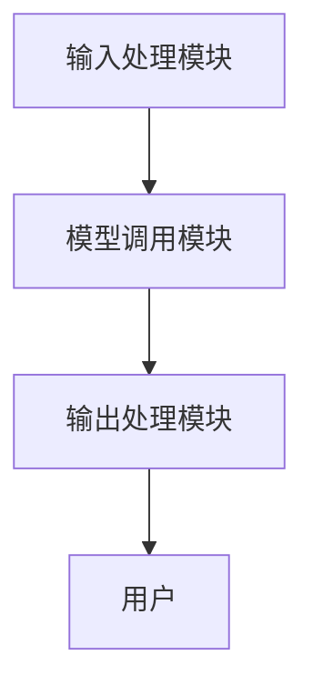

                 


# 从零构建 AI Agent：LLM 大模型应用开发实践

> 关键词：AI Agent, LLM 大模型, 人工智能, 自然语言处理, 系统架构设计

> 摘要：本文旨在从零开始构建一个基于大语言模型（LLM）的AI Agent，涵盖其核心概念、算法原理、系统架构设计、项目实战和最佳实践。通过详细的技术分析和实践案例，帮助读者全面理解AI Agent的开发过程，掌握从理论到实践的每一个关键步骤。

---

## 第1章: AI Agent 与 LLM 大模型概述

### 1.1 AI Agent 的定义与核心概念

AI Agent（人工智能代理）是一种能够感知环境、自主决策并执行任务的智能实体。它通过与用户或环境交互，实现特定目标，例如信息检索、任务处理或提供咨询服务。

#### 1.1.1 AI Agent 的定义
AI Agent 是具备以下特点的智能系统：
- **自主性**：无需外部干预，自主决策。
- **反应性**：能够感知环境并实时响应。
- **目标导向**：为实现特定目标而行动。
- **学习能力**：通过数据和经验不断优化性能。

#### 1.1.2 LLM 大模型在 AI Agent 中的作用
大语言模型（LLM）通过自然语言处理技术，赋予AI Agent以下能力：
- **理解上下文**：通过上下文理解用户需求。
- **生成自然语言**：用自然语言与用户交互。
- **推理与决策**：基于模型生成多种可能性，选择最优方案。

#### 1.1.3 AI Agent 的核心功能与特点
AI Agent 的核心功能包括：
- **自然语言处理**：理解和生成人类语言。
- **知识库查询**：基于知识库回答问题。
- **推理与决策**：根据输入生成合理输出。
- **交互与反馈**：与用户实时互动并提供反馈。

### 1.2 AI Agent 的演进与技术优势

#### 1.2.1 从传统 AI 到 AI Agent 的演进
传统AI依赖规则和预定义逻辑，而AI Agent则通过大数据和深度学习实现更灵活和智能的交互。

#### 1.2.2 LLM 大模型的技术优势
- **强大的语言理解能力**：基于大量数据训练，能够理解复杂语义。
- **动态推理能力**：能够根据上下文生成合理输出。
- **可扩展性**：支持多种应用场景和功能扩展。

#### 1.2.3 AI Agent 在企业级应用中的潜力
AI Agent 可以广泛应用于客服、智能助手、智能推荐等领域，为企业提升效率和用户体验。

### 1.3 LLM 大模型的应用现状与挑战

#### 1.3.1 当前 LLM 大模型的应用领域
- **自然语言处理**：文本生成、翻译、问答系统。
- **智能助手**：Siri、Alexa 等虚拟助手。
- **内容生成**：自动化生成文章、报告等。

#### 1.3.2 AI Agent 开发中的主要挑战
- **模型性能**：大模型的计算资源需求高。
- **数据隐私**：数据安全和隐私保护问题。
- **可解释性**：模型决策的可解释性不足。

#### 1.3.3 未来 AI Agent 的发展趋势
- **多模态能力**：结合视觉、听觉等多模态信息。
- **实时交互**：支持更高效的实时对话。
- **个性化服务**：提供个性化、定制化服务。

### 1.4 学习路线与开发入门

#### 1.4.1 初学者的学习建议
- 掌握Python编程基础。
- 学习深度学习和自然语言处理基础。
- 研究主流的大模型框架，如GPT、BERT等。

#### 1.4.2 开发环境的搭建指南
- **安装Python**：确保安装最新版本的Python。
- **安装深度学习框架**：如TensorFlow、PyTorch。
- **安装NLP工具库**：如Transformers库。

#### 1.4.3 常用工具与框架推荐
- **Hugging Face**：提供丰富的预训练模型和工具。
- **OpenAI API**：方便调用大模型进行文本生成。

---

## 第2章: LLM 大模型的核心概念与原理

### 2.1 LLM 模型的输入输出机制

#### 2.1.1 模型的输入方式
输入可以是文本、图像或其他形式的数据。模型通过处理这些输入生成相应的输出。

#### 2.1.2 模型的输出方式
输出可以是文本、数值或其他形式的数据，具体取决于任务需求。

#### 2.1.3 输入输出的上下文关系
模型通过维护上下文来生成连贯的输出，例如在对话中保持对话历史。

### 2.2 LLM 模型的训练过程

#### 2.2.1 数据预处理
- **清洗数据**：去除噪声数据，确保数据质量。
- **分词处理**：将文本划分为词汇单元。
- **数据增强**：通过技术手段增加数据多样性。

#### 2.2.2 模型训练流程
1. **输入数据**：将预处理后的数据输入模型。
2. **计算损失**：使用损失函数计算预测值与真实值之间的差异。
3. **反向传播**：通过反向传播算法更新模型参数。
4. **优化参数**：使用优化算法（如Adam）调整模型参数以最小化损失。

#### 2.2.3 模型调优与优化
- **超参数调整**：优化学习率、批次大小等超参数。
- **模型剪枝**：去除冗余参数，减少计算量。
- **模型融合**：结合多个模型的优势，提升性能。

### 2.3 LLM 模型的结构与特点

#### 2.3.1 模型的架构特点
- **深度神经网络**：多层神经网络结构，提升模型表达能力。
- **注意力机制**：通过注意力机制捕捉文本中的关键信息。
- **Transformer架构**：基于Transformer架构，提升模型并行计算能力。

#### 2.3.2 模型的参数规模
- 参数规模越大，模型的容量越大，但计算资源需求也越高。

#### 2.3.3 模型的可扩展性
- 支持多种任务，如文本生成、问答系统等。

---

## 第3章: LLM 大模型的数学基础

### 3.1 神经网络基础

#### 3.1.1 神经网络的定义与特点
神经网络是一种模拟人脑结构的计算模型，由神经元和连接权重组成。

#### 3.1.2 神经网络的输入输出关系
- **输入层**：接收输入数据。
- **隐藏层**：通过非线性变换处理数据。
- **输出层**：生成模型输出。

#### 3.1.3 神经网络的训练过程
- **前向传播**：输入数据经过网络生成输出。
- **反向传播**：计算损失并更新权重。

### 3.2 深度学习基础

#### 3.2.1 深度学习的核心概念
- **深度学习**：通过多层网络结构学习数据高层次特征。

#### 3.2.2 深度学习的训练方法
- **监督学习**：基于标注数据进行训练。
- **无监督学习**：基于未标注数据进行训练。

#### 3.2.3 深度学习的应用场景
- **图像识别**：识别图像中的物体。
- **自然语言处理**：处理文本数据。

### 3.3 模型训练的数学公式

#### 3.3.1 损失函数的定义
交叉熵损失函数：
$$
\text{loss} = -\frac{1}{N}\sum_{i=1}^{N} \sum_{j=1}^{M} y_{ij} \log(p_{ij})
$$

#### 3.3.2 优化算法的原理
Adam优化算法：
$$
\theta_{t+1} = \theta_t - \eta \left(\beta_1 g_t + (1-\beta_1)g_t \right)
$$

#### 3.3.3 模型训练的数学推导
- **梯度计算**：通过链式法则计算损失对参数的梯度。
- **参数更新**：根据梯度更新参数，最小化损失。

---

## 第4章: AI Agent 的系统分析与架构设计

### 4.1 AI Agent 的系统功能设计

#### 4.1.1 系统功能模块划分
- **输入处理模块**：接收用户输入并进行预处理。
- **模型调用模块**：调用大模型生成输出。
- **输出处理模块**：对模型输出进行后处理并返回给用户。

#### 4.1.2 系统功能流程
1. **输入处理**：接收用户输入并进行分词处理。
2. **模型调用**：将预处理后的输入传递给大模型。
3. **输出处理**：对模型输出进行格式化处理并返回给用户。

---

### 4.2 系统架构设计

#### 4.2.1 系统架构设计图


#### 4.2.2 系统模块交互流程
1. 用户输入请求。
2. 输入处理模块对输入进行预处理。
3. 模型调用模块调用大模型生成响应。
4. 输出处理模块对响应进行后处理。
5. 响应返回给用户。

---

## 第5章: 项目实战

### 5.1 开发环境搭建

#### 5.1.1 安装Python
```bash
python --version
```

#### 5.1.2 安装深度学习框架
```bash
pip install tensorflow
```

#### 5.1.3 安装NLP工具库
```bash
pip install transformers
```

### 5.2 系统核心实现

#### 5.2.1 模型加载与调用
```python
from transformers import AutoTokenizer, AutoModelForCausalLM
import torch

tokenizer = AutoTokenizer.from_pretrained('gpt2')
model = AutoModelForCausalLM.from_pretrained('gpt2')

inputs = tokenizer("Hello, how are you?", return_tensors='pt')
outputs = model.generate(**inputs, max_length=50)
print(tokenizer.decode(outputs[0], skip_special_tokens=True))
```

#### 5.2.2 对话系统实现
```python
class AI-Agent:
    def __init__(self):
        self.tokenizer = AutoTokenizer.from_pretrained('gpt2')
        self.model = AutoModelForCausalLM.from_pretrained('gpt2')
    
    def generate_response(self, input_text):
        inputs = self.tokenizer(input_text, return_tensors='pt')
        outputs = self.model.generate(**inputs, max_length=50)
        return self.tokenizer.decode(outputs[0], skip_special_tokens=True)
```

### 5.3 项目小结

通过以上步骤，我们成功构建了一个简单的AI Agent系统，能够实现基本的对话功能。实际应用中，还需要优化模型性能、增强系统的健壮性和可扩展性。

---

## 第6章: 最佳实践与小结

### 6.1 最佳实践 tips

- **模型选择**：根据任务需求选择合适的模型。
- **性能优化**：通过模型剪枝和量化技术优化模型性能。
- **数据安全**：确保数据的安全性和隐私性。

### 6.2 小结

本文详细介绍了从零构建AI Agent的过程，涵盖核心概念、算法原理、系统架构设计和项目实战。通过本文的学习，读者可以掌握AI Agent的开发技能，并能够独立完成相关项目的开发。

### 6.3 注意事项

- **模型性能**：大模型的计算资源需求较高，需确保硬件配置充足。
- **数据质量**：数据质量直接影响模型性能，需做好数据预处理。
- **可解释性**：模型的决策过程需要具备可解释性，便于调试和优化。

### 6.4 拓展阅读

- **深度学习书籍**：《深度学习入门：基于Python的理论与实践》。
- **自然语言处理书籍**：《自然语言处理入门：基于Python的理论与实践》。

---

## 作者信息

作者：AI天才研究院/AI Genius Institute & 禅与计算机程序设计艺术/Zen And The Art of Computer Programming

---

以上是《从零构建 AI Agent：LLM 大模型应用开发实践》的完整目录和内容概要。如需进一步展开每个章节的具体内容，可以根据上述结构进行详细撰写。

