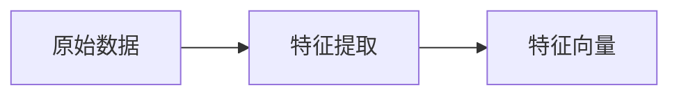
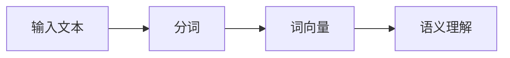
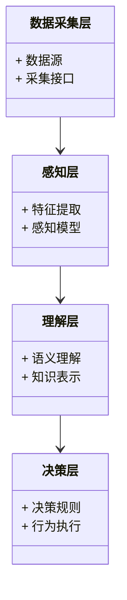

                 


# 从零构建AI Agent的情境感知系统

> **关键词**：AI Agent、情境感知、智能体、机器学习、实时反馈、系统架构、技术实现  
> 
> **摘要**：构建一个AI Agent的情境感知系统，需要综合运用数据采集、特征提取、模型训练、系统架构设计等技术。本文将从AI Agent的基本概念出发，详细探讨情境感知的核心模型、系统架构设计以及实现过程中的关键技术细节，通过实际案例分析和代码示例，帮助读者从零开始构建一个高效的情境感知AI Agent系统。

---

## 第1章: AI Agent的基本概念与背景

### 1.1 AI Agent的定义与核心概念

#### 1.1.1 AI Agent的定义
AI Agent（人工智能代理）是指能够感知环境、自主决策并执行任务的智能实体。它通过传感器获取信息，利用计算模型进行分析，并通过执行器与环境交互。AI Agent的核心目标是通过智能化的手段，解决复杂问题并提供高效的解决方案。

#### 1.1.2 AI Agent的核心属性
| 属性 | 描述 |
|------|------|
| 感知能力 | 能够从环境中获取信息（如图像、文本、语音等） |
| 计算能力 | 具备处理信息、进行推理和决策的能力 |
| 行为能力 | 能够根据决策结果执行动作（如输出结果、控制设备等） |
| 自适应能力 | 能够根据环境变化动态调整行为 |

#### 1.1.3 情境感知的定义与特征
情境感知（Situation Awareness）是指系统能够理解当前环境的状态、目标和潜在问题的能力。其核心特征包括实时性、上下文相关性和动态性。

---

### 1.2 AI Agent的应用场景

#### 1.2.1 智能助手与个人代理
AI Agent可以作为个人助手，帮助用户处理日常任务，如日历管理、信息检索、任务提醒等。

#### 1.2.2 智慧城市中的AI Agent
在智慧城市中，AI Agent可以用于交通管理、资源分配、公共安全等领域，提升城市管理的智能化水平。

#### 1.2.3 游戏开发与虚拟代理
在游戏开发中，AI Agent可以模拟玩家行为，提供更加智能的对手或队友。

---

### 1.3 情境感知系统的发展历程

#### 1.3.1 情境感知的起源
情境感知的概念最早源于军事领域，用于战场态势感知。随着技术的发展，逐渐扩展到民用领域。

#### 1.3.2 AI技术对情境感知的影响
人工智能技术的进步，特别是深度学习和自然语言处理的发展，为情境感知提供了强大的技术支持。

#### 1.3.3 当前研究热点与趋势
当前，情境感知研究的热点包括多模态数据融合、实时性优化、可解释性增强等。

---

### 1.4 本章小结

本章介绍了AI Agent的基本概念、核心属性以及情境感知的定义与发展历程。通过这些背景知识的铺垫，为后续的技术实现奠定了基础。

---

## 第2章: AI Agent的情境感知模型与算法

### 2.1 感知层模型

#### 2.1.1 数据采集与特征提取
数据采集是情境感知的第一步，常用的传感器包括摄像头、麦克风、GPS等。特征提取则是将原始数据转化为有意义的特征向量。



#### 2.1.2 感知模型的构建与训练
感知模型通常采用深度学习方法，如卷积神经网络（CNN）用于图像识别，循环神经网络（RNN）用于序列数据处理。

#### 2.1.3 感知模型的评估指标
| 指标 | 描述 |
|------|------|
| 准确率 | 正确识别的数量与总数量的比值 |
| 召回率 | 正确识别的数量与实际正样本数量的比值 |
| F1分数 | 准确率和召回率的调和平均数 |

---

### 2.2 理解层模型

#### 2.2.1 语义理解与知识表示
语义理解是情境感知的核心，常用技术包括自然语言处理（NLP）和知识图谱构建。



#### 2.2.2 关系推理与情境建模
通过关系推理，模型能够理解不同实体之间的关联，构建完整的上下文理解。

---

### 2.3 决策层模型

#### 2.3.1 决策规则的制定
决策规则通常基于预定义的逻辑或学习得到的策略，如基于Q-learning的强化学习方法。

#### 2.3.2 基于模型的决策优化
通过构建决策模型，优化决策策略以提高系统的整体性能。

#### 2.3.3 多目标决策与权衡
在多目标决策问题中，需要对不同目标进行权衡，找到最优解。

---

### 2.4 情境感知模型的融合与优化

#### 2.4.1 多模型融合方法
通过将多个模型的结果进行融合，提升系统的准确性和鲁棒性。

#### 2.4.2 模型优化策略
采用剪枝、蒸馏等技术，降低模型的复杂度，提高运行效率。

#### 2.4.3 模型的可解释性与鲁棒性
确保模型在不同环境下的稳定性和可解释性。

---

## 第3章: AI Agent的情境感知系统架构

### 3.1 系统总体架构

#### 3.1.1 系统模块划分


#### 3.1.2 各模块的功能描述
- 数据采集层：负责从环境中获取数据。
- 感知层：对数据进行处理，提取特征。
- 理解层：对特征进行语义理解，构建上下文。
- 决策层：基于理解结果，制定决策并执行。

#### 3.1.3 模块之间的交互关系
模块之间通过数据传递和调用接口进行交互，确保系统的高效运行。

---

### 3.2 数据采集与处理层

#### 3.2.1 数据采集接口的设计
数据采集接口需要兼容多种传感器类型，支持实时数据流的处理。

#### 3.2.2 数据预处理与特征提取
对原始数据进行清洗、归一化等预处理，提取有意义的特征向量。

#### 3.2.3 数据存储与管理
使用数据库或分布式存储系统，对数据进行高效的管理和访问。

---

### 3.3 感知与理解层

#### 3.3.1 感知模型的实现
基于深度学习框架（如TensorFlow、PyTorch）构建感知模型，并进行训练和优化。

#### 3.3.2 理解模型的实现
利用NLP技术进行语义理解，构建知识图谱，支持上下文推理。

#### 3.3.3 模型的动态更新与优化
通过在线学习和模型微调，保持系统的实时性和准确性。

---

### 3.4 决策与执行层

#### 3.4.1 决策策略的制定
基于感知结果和理解信息，制定最优决策策略。

#### 3.4.2 决策结果的输出
通过执行器将决策结果转化为具体动作，如发送指令、触发设备等。

#### 3.4.3 执行层的反馈机制
收集执行结果，反馈到系统中，用于模型的优化和调整。

---

## 第4章: AI Agent的情境感知系统实现

### 4.1 系统实现的整体流程

#### 4.1.1 系统输入与输出
- 输入：环境数据、用户指令
- 输出：决策结果、执行动作

#### 4.1.2 各模块的实现步骤
- 数据采集：连接传感器，获取实时数据。
- 特征提取：对数据进行预处理，提取特征向量。
- 感知模型训练：基于训练数据，训练感知模型。
- 语义理解：利用NLP技术，构建知识图谱。
- 决策制定：基于当前状态，制定决策策略。
- 行为执行：通过执行器，将决策转化为具体动作。

#### 4.1.3 系统的运行机制
系统通过模块化的设计，实现数据流的高效处理和模块间的协同工作。

---

### 4.2 数据采集与处理的实现

#### 4.2.1 数据采集接口的设计
编写接口代码，支持多种传感器的数据采集。

```python
def采集数据():
    # 从传感器获取数据
    data = sensor.read()
    return data
```

#### 4.2.2 数据预处理与特征提取
对原始数据进行清洗、归一化等处理，提取特征向量。

```python
def预处理(data):
    # 数据清洗
    cleaned_data = data.dropna()
    # 特征提取
    features = cleaned_data[['特征1', '特征2', '特征3']]
    return features
```

---

### 4.3 感知与理解的实现

#### 4.3.1 感知模型的训练与部署
基于训练数据，训练感知模型，并部署到生产环境中。

```python
model = 感知模型()
model.fit(训练数据, 标签)
```

#### 4.3.2 理解模型的实现
利用NLP技术，进行语义理解，构建知识图谱。

```python
def语义理解(text):
    # 分词
    words = 分词工具.segment(text)
    # 词向量转换
    vector = 词向量模型.encode(words)
    return vector
```

---

### 4.4 决策与执行的实现

#### 4.4.1 决策策略的制定与实现
基于当前状态，制定决策策略，并通过执行器执行。

```python
def制定决策(状态):
    # 基于规则或模型制定决策
    决策 = 决策模型.predict(状态)
    return 决策
```

#### 4.4.2 决策结果的输出
将决策结果输出到执行器，触发具体动作。

```python
def执行动作(决策):
    执行器.执行(决策)
```

#### 4.4.3 执行层的反馈机制
收集执行结果，反馈到系统中，用于模型的优化和调整。

---

## 第5章: 项目实战

### 5.1 环境安装与配置

#### 5.1.1 安装所需的库
安装必要的Python库，如TensorFlow、PyTorch、Numpy、Pandas等。

```bash
pip install tensorflow pytorch numpy pandas
```

#### 5.1.2 配置开发环境
配置IDE（如PyCharm、VS Code）和Jupyter Notebook，确保环境正常运行。

---

### 5.2 系统核心实现

#### 5.2.1 数据采集与预处理
编写代码，从传感器获取数据，并进行预处理。

```python
import pandas as pd
import numpy as np

def采集数据():
    data = pd.read_csv('传感器数据.csv')
    return data

def预处理(data):
    cleaned_data = data.dropna()
    features = cleaned_data[['温度', '湿度', '光照']]
    return features

原始数据 = 采集数据()
特征向量 = 预处理(原始数据)
```

#### 5.2.2 感知模型的训练与部署
基于训练数据，训练感知模型，并部署到生产环境。

```python
import tensorflow as tf
from tensorflow.keras import layers

model = tf.keras.Sequential([
    layers.Dense(64, activation='relu'),
    layers.Dense(10, activation='softmax')
])

model.compile(optimizer='adam', loss='sparse_categorical_crossentropy', metrics=['accuracy'])
model.fit(训练数据, 标签, epochs=10, batch_size=32)
```

#### 5.2.3 语义理解与知识表示
利用NLP技术，进行语义理解，构建知识图谱。

```python
from transformers import BertTokenizer, TFBertModel

tokenizer = BertTokenizer.from_pretrained('bert-base-chinese')
model = TFBertModel.from_pretrained('bert-base-chinese')

def语义理解(text):
    tokens = tokenizer.encode(text, return_tensors='tf')
    outputs = model(tokens)
    return outputs.last_hidden_state.numpy()
```

---

### 5.3 代码应用解读与分析

#### 5.3.1 数据采集与预处理代码解读
代码从CSV文件中读取传感器数据，并进行缺失值处理，提取特征向量。

#### 5.3.2 感知模型的训练与部署代码解读
使用TensorFlow框架，构建一个简单的神经网络模型，并进行训练和优化。

#### 5.3.3 语义理解代码解读
基于BERT模型，进行文本的语义理解，提取文本的词向量。

---

### 5.4 案例分析与详细讲解

#### 5.4.1 案例分析
以一个智能家居系统为例，展示AI Agent在情境感知中的应用。

#### 5.4.2 详细讲解
从数据采集、特征提取、模型训练到系统部署，详细讲解每个步骤的具体实现。

---

### 5.5 项目小结

本章通过实际案例，展示了AI Agent的情境感知系统的实现过程。从环境配置到代码实现，每个步骤都进行了详细的讲解，帮助读者更好地理解和掌握相关技术。

---

## 第6章: 总结与展望

### 6.1 总结

本文从AI Agent的基本概念出发，详细探讨了情境感知的核心模型、系统架构设计以及实现过程中的关键技术细节。通过实际案例分析和代码示例，帮助读者从零开始构建一个高效的情境感知AI Agent系统。

---

### 6.2 展望

未来，随着人工智能技术的不断发展，AI Agent的情境感知系统将在更多领域得到应用。研究的重点将放在如何进一步提升系统的实时性、可解释性和鲁棒性上，为人类社会创造更大的价值。

---

## 作者信息

作者：AI天才研究院/AI Genius Institute & 禅与计算机程序设计艺术 /Zen And The Art of Computer Programming

---

以上是《从零构建AI Agent的情境感知系统》的技术博客文章的完整目录和内容概要。通过一步步的分析与推理，确保文章内容符合逻辑、结构清晰、技术详实，帮助读者从零开始构建AI Agent的情境感知系统。

