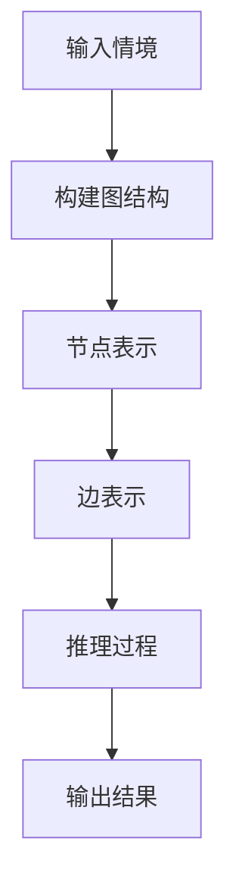
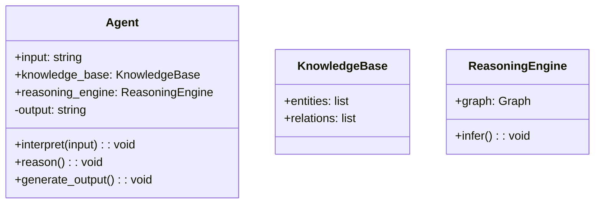
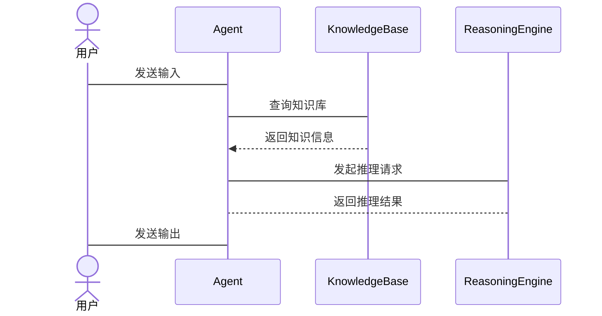

                 


# 《从零构建AI Agent的情境推理能力》

> 关键词：AI Agent、情境推理、知识图谱、自然语言处理、强化学习、图神经网络、数学模型

> 摘要：本文旨在从零开始构建AI Agent的情境推理能力，系统地介绍从基础概念到高级算法的实现过程。通过分析情境推理的核心要素、模型构建、算法实现、数据处理、系统架构设计以及项目实战，本文将帮助读者逐步掌握构建具有情境推理能力的AI Agent的完整流程。

---

# 第一部分: AI Agent 情境推理能力的背景与基础

## 第1章: AI Agent 的基本概念与情境推理的定义

### 1.1 AI Agent 的定义与核心特征

AI Agent（智能体）是指在环境中能够感知并自主行动以实现目标的实体。AI Agent 可以是软件程序、机器人或其他智能系统，其核心特征包括：

- **自主性**：能够自主决策，无需外部干预。
- **反应性**：能够感知环境并实时响应。
- **目标导向性**：所有行动均以实现特定目标为导向。
- **社交能力**：能够与其他 Agent 或人类进行交互。

#### 表1-1: AI Agent 的分类与应用场景

| 分类标准       | 类型                     | 应用场景示例                                   |
|----------------|--------------------------|-----------------------------------------------|
| 智能水平       | 简单反射型 Agent         | 自动门、温控器                                 |
|                | 知识驱动型 Agent         | 智能音箱、推荐系统                             |
|                | 学习驱动型 Agent         | 机器学习模型驱动的自动驾驶汽车                 |
| 行为方式       | 反应式 Agent             | 基于实时感知行动的机器人                       |
|                | 计划式 Agent             | 基于规划的工业自动化系统                       |
|                | 学习式 Agent             | 基于强化学习的棋牌游戏 Agent                   |

### 1.2 情境推理的定义与重要性

情境推理是指在特定环境中，通过感知输入信息，结合背景知识和逻辑推理，推断出隐含事实或潜在意图的过程。它是 AI Agent 实现复杂任务的核心能力，尤其是在需要处理语义理解、意图识别和决策支持的场景中。

#### 图1-1: 情境推理的核心要素 ER 实体关系图

```mermaid
entity_relationshipDiagram
actor(Agent)
link(拥有)
relation(情境推理能力)
```

### 1.3 情境推理与相关技术的联系

- **知识图谱**：提供丰富的语义信息，帮助 Agent 理解情境中的实体关系。
- **自然语言处理**：通过文本分析提取上下文信息，增强情境理解能力。
- **强化学习**：通过与环境的交互优化推理策略。

---

## 第2章: 情境推理的模型构建

### 2.1 情境推理的基本原理

情境推理的数学模型可以表示为：

$$ P(e | u, t) $$

其中，$e$ 表示推理结果，$u$ 表示输入信息，$t$ 表示背景知识。通过概率推理，模型可以计算出在给定输入和背景知识下，推理结果的概率分布。

### 2.2 基于图结构的情境推理模型

图神经网络（Graph Neural Network，GNN）是实现情境推理的有效工具。其基本思想是将情境中的实体及其关系建模为图结构，通过节点表示和边表示来捕捉语义信息。

#### 图2-1: 基于图神经网络的推理流程图



---

## 第3章: 情境推理的算法实现

### 3.1 基于规则的推理算法

基于规则的推理算法通过预定义的规则集进行推理，适用于简单的情境理解任务。例如：

$$ \text{如果 } A \text{ 并且 } B \text{，那么 } C $$

### 3.2 基于概率的推理算法

基于概率的推理算法通过贝叶斯网络等工具计算条件概率，适用于复杂的情境推理任务。

$$ P(h | e) = \frac{P(e | h) P(h)}{P(e)} $$

### 3.3 基于深度学习的推理算法

深度学习模型（如 Transformer）通过端到端的训练方式，自动学习情境推理所需的特征表示。

---

## 第4章: 数据在情境推理中的作用

### 4.1 数据的获取与预处理

数据是情境推理的基础。通过清洗、特征提取和标注，可以构建结构化的知识库。

#### 表4-1: 数据预处理步骤对比

| 步骤       | 描述                               |
|------------|------------------------------------|
| 数据清洗   | 去除噪声数据                       |
| 特征提取   | 提取关键特征                       |
| 数据标注   | 手动或自动标注数据                |

### 4.2 数据驱动的推理模型

通过监督学习训练模型，使其能够从数据中学习情境推理的规律。

---

## 第5章: 系统架构设计与实现

### 5.1 系统功能设计

系统功能包括数据输入、情境理解、推理计算和结果输出。

#### 图5-1: 系统功能设计类图



### 5.2 系统接口设计

系统接口包括输入接口（如自然语言输入）、推理接口（如调用推理引擎）和输出接口（如生成自然语言输出）。

#### 图5-2: 系统交互序列图



---

## 第6章: 项目实战与代码实现

### 6.1 环境搭建

安装必要的库，如 TensorFlow、PyTorch 和网络x库。

### 6.2 核心代码实现

以下是基于图神经网络的情境推理实现代码示例：

```python
import networkx as nx
from sklearn.feature_extraction.text import TfidfVectorizer

def build_graph(sentences):
    vectorizer = TfidfVectorizer()
    vectors = vectorizer.fit_transform(sentences)
    graph = nx.Graph()
    for i in range(len(sentences)):
        for j in range(i+1, len(sentences)):
            if vectors[i].dot(vectors[j]) > 0.5:
                graph.add_edge(i, j)
    return graph

def infer(graph):
    # 实现推理逻辑
    pass

# 示例用法
sentences = ["The cat sits on the mat.", "The dog barks at the cat."]
graph = build_graph(sentences)
result = infer(graph)
print(result)
```

---

## 第7章: 总结与展望

### 7.1 总结

本文从零开始构建了 AI Agent 的情境推理能力，涵盖了从基础概念到算法实现的完整流程。

### 7.2 最佳实践 Tips

- **数据质量**：确保数据的多样性和准确性。
- **模型选择**：根据任务需求选择合适的推理算法。
- **系统优化**：通过并行计算和缓存优化提升性能。

### 7.3 注意事项

- 避免过度拟合，确保模型的泛化能力。
- 定期更新知识库，保持推理的准确性。

### 7.4 拓展阅读

- 《Deep Learning》——Ian Goodfellow
- 《Natural Language Processing with Python》——Steven Bird

---

# 作者：AI天才研究院/AI Genius Institute & 禅与计算机程序设计艺术 /Zen And The Art of Computer Programming

