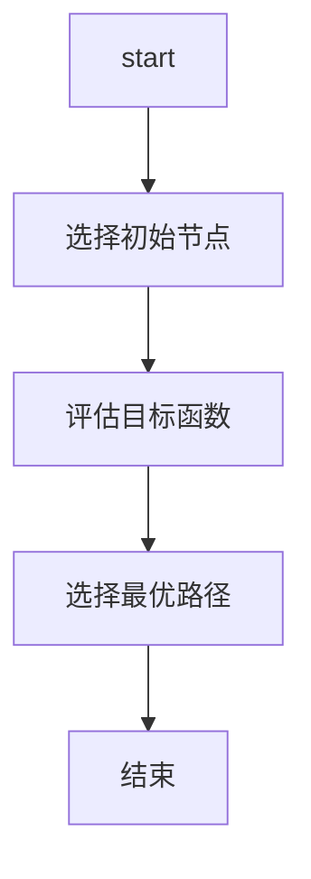
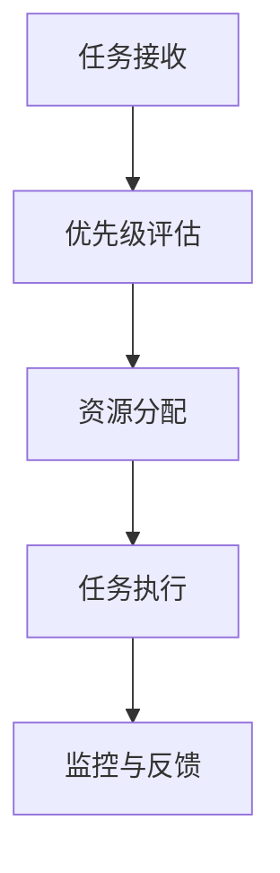
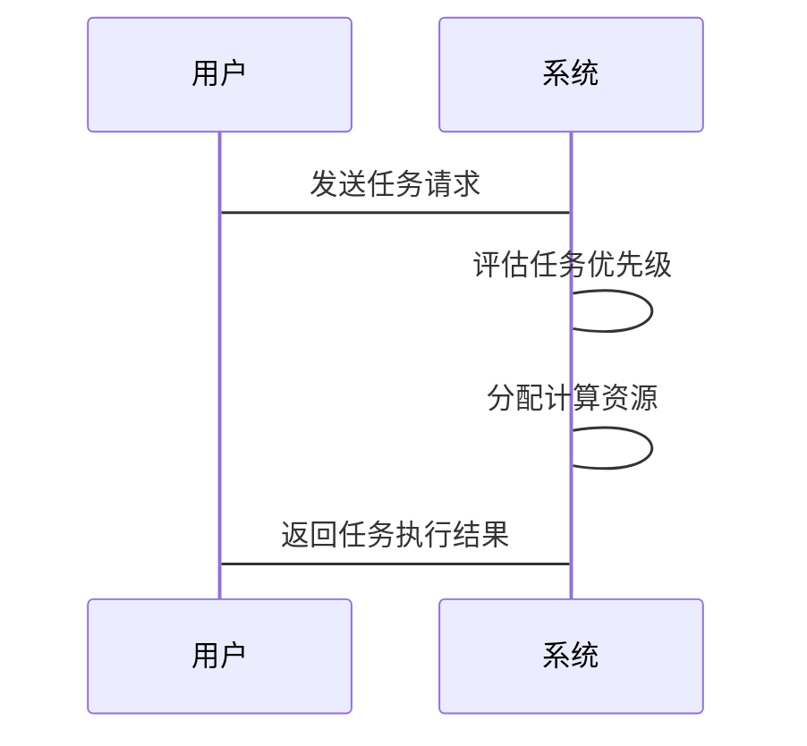

                 


# 《从零构建AI Agent的认知负荷管理系统》

> 关键词：AI Agent, 认知负荷管理, 系统设计, 算法原理, 项目实战

> 摘要：本文系统地介绍从零构建AI Agent的认知负荷管理系统的全过程，涵盖核心概念、算法原理、系统设计、项目实战及优化技巧。通过理论分析和实践操作，帮助读者掌握认知负荷管理的核心方法和实现路径。

---

# 引言

在AI Agent的设计与实现中，认知负荷管理是一个关键问题。认知负荷指的是AI Agent在执行任务时所消耗的计算资源和时间资源。如何有效地管理和优化这些资源，是确保AI Agent高效运行的核心挑战。本文将从零开始，系统地介绍AI Agent的认知负荷管理系统的构建过程，包括核心概念、算法原理、系统设计、项目实战及优化技巧。

---

# 第1章: 认知负荷管理的背景与问题背景

## 1.1 问题背景

### 1.1.1 AI Agent的定义与核心功能

AI Agent（智能体）是指能够感知环境并采取行动以实现目标的实体。AI Agent的核心功能包括：

1. **感知环境**：通过传感器或数据输入获取环境信息。
2. **决策与规划**：基于感知信息，制定行动策略。
3. **执行行动**：根据决策结果执行具体操作。

### 1.1.2 认知负荷的定义与特征

认知负荷是指AI Agent在执行任务过程中所消耗的计算资源和时间资源。其主要特征包括：

1. **动态性**：随着任务复杂度的变化而波动。
2. **资源敏感性**：依赖于计算资源的分配。
3. **目标导向性**：与AI Agent的目标实现密切相关。

### 1.1.3 认知负荷管理的必要性与目标

认知负荷管理的必要性在于避免资源过载，确保AI Agent的高效运行。其目标包括：

1. **优化资源分配**：合理分配计算资源，避免资源浪费。
2. **降低任务延迟**：减少任务执行时间，提高响应速度。
3. **提升系统性能**：通过资源优化，提高整体系统性能。

## 1.2 问题描述

### 1.2.1 AI Agent在复杂任务中的挑战

在处理复杂任务时，AI Agent可能会面临以下挑战：

1. **资源竞争**：多个任务争夺计算资源，导致性能下降。
2. **任务优先级冲突**：任务优先级的不明确可能导致资源分配不合理。
3. **动态环境适应**：环境的动态变化要求AI Agent能够快速调整资源分配策略。

### 1.2.2 认知负荷过载的典型场景

认知负荷过载的典型场景包括：

1. **多任务并行处理**：同时处理多个复杂任务，导致资源分配不均。
2. **突发任务请求**：短时间内大量任务请求超出系统处理能力。
3. **资源分配不当**：任务优先级未被合理评估，导致关键任务资源不足。

### 1.2.3 问题解决的思路与方法

解决问题的思路包括：

1. **任务优先级评估**：根据任务的重要性和紧急性进行优先级排序。
2. **动态资源分配**：根据任务优先级和系统资源状况动态调整资源分配。
3. **负载均衡**：通过负载均衡技术，确保资源充分利用。

## 1.3 问题解决与边界

### 1.3.1 认知负荷管理的核心思路

认知负荷管理的核心思路包括：

1. **任务优先级评估**：基于任务目标和环境状态，评估任务优先级。
2. **资源分配策略**：根据优先级和系统资源状况，制定资源分配方案。
3. **动态调整机制**：实时监控系统资源使用情况，动态调整资源分配。

### 1.3.2 系统边界与外延

系统边界包括：

1. **输入边界**：任务请求、环境状态信息。
2. **输出边界**：资源分配策略、任务执行结果。
3. **外部依赖**：依赖于任务优先级评估模型和资源监控工具。

### 1.3.3 核心要素与组成结构

核心要素包括：

1. **任务管理模块**：负责任务的接收、分类和优先级评估。
2. **资源分配模块**：根据优先级和资源状况，分配计算资源。
3. **监控与反馈模块**：实时监控系统资源使用情况，反馈调整资源分配。

---

# 第2章: 认知负荷管理的核心概念与联系

## 2.1 核心概念原理

### 2.1.1 认知负荷管理的原理

认知负荷管理的原理包括：

1. **任务优先级评估**：基于任务的重要性和紧急性进行排序。
2. **资源分配策略**：根据优先级和资源状况，制定资源分配方案。
3. **动态调整机制**：实时监控资源使用情况，动态调整分配策略。

### 2.1.2 AI Agent的认知模型

AI Agent的认知模型包括：

1. **感知层**：负责环境信息的感知与收集。
2. **决策层**：负责任务优先级评估和决策制定。
3. **执行层**：负责资源分配和任务执行。

### 2.1.3 管理策略与优化方法

管理策略包括：

1. **静态分配策略**：根据任务优先级静态分配资源。
2. **动态分配策略**：根据实时资源使用情况动态调整分配。
3. **预测性分配策略**：基于历史数据和预测模型，预分配资源。

## 2.2 核心概念对比表

以下是一个核心概念对比表：

| 对比维度 | 静态分配策略 | 动态分配策略 | 预测性分配策略 |
|----------|---------------|---------------|----------------|
| 基础依据 | 任务优先级     | 实时资源状况   | 历史数据与预测 |
| 优势     | 实现简单       | 灵活性高       | 准确性高       |
| 劣势     | 适应性差       | 计算开销大     | 预测误差大     |

## 2.3 ER实体关系图

以下是一个ER实体关系图：

```mermaid
erDiagram
    actor 用户角色 {
        <属性> 任务ID
        <属性> 任务优先级
    }
    actor 管理策略 {
        <属性> 策略类型
        <属性> 参数设置
    }
    actor 系统资源 {
        <属性> CPU使用率
        <属性> 内存占用
    }
    用户角色 --> 管理策略 : 选择策略
    管理策略 --> 系统资源 : 分配资源
```

---

# 第3章: 认知负荷管理的算法原理

## 3.1 算法原理概述

认知负荷管理的算法原理包括：

1. **任务优先级评估**：使用A*算法评估任务优先级。
2. **资源分配策略**：基于任务优先级和资源状况，动态分配资源。

## 3.2 算法实现步骤

### 3.2.1 A*算法流程

以下是一个A*算法流程图：



### 3.2.2 优先级计算公式

以下是一个优先级计算公式：

$$
\text{优先级} = \frac{\text{任务重要性}}{\text{任务执行时间}}
$$

### 3.2.3 资源分配策略

以下是一个资源分配策略示例：

$$
\text{资源分配} = \begin{cases}
\text{高优先级任务} & \text{如果优先级} > 0.8 \\
\text{中优先级任务} & \text{如果优先级} > 0.5 \text{ 且优先级} \leq 0.8 \\
\text{低优先级任务} & \text{其他情况}
\end{cases}
$$`

---

# 第4章: 认知负荷管理的系统设计

## 4.1 系统架构设计

### 4.1.1 系统功能设计

系统功能设计包括：

1. **任务接收与分类**：接收任务请求，并根据任务类型进行分类。
2. **优先级评估**：基于任务特征和环境状态，评估任务优先级。
3. **资源分配**：根据优先级和资源状况，分配计算资源。
4. **监控与反馈**：实时监控资源使用情况，反馈调整资源分配。

### 4.1.2 系统架构图

以下是一个系统架构图：



## 4.2 接口设计与交互流程

### 4.2.1 系统接口设计

系统接口设计包括：

1. **任务接收接口**：接收任务请求。
2. **优先级评估接口**：评估任务优先级。
3. **资源分配接口**：分配计算资源。
4. **监控接口**：监控资源使用情况。

### 4.2.2 交互流程

以下是一个交互流程图：



---

# 第5章: 项目实战

## 5.1 环境安装与配置

### 5.1.1 系统环境要求

系统环境要求包括：

1. **操作系统**：Linux/Windows/MacOS
2. **Python版本**：Python 3.8+
3. **依赖库**：numpy, pandas, matplotlib

### 5.1.2 安装依赖

安装依赖命令：

```bash
pip install numpy pandas matplotlib
```

## 5.2 系统核心实现

### 5.2.1 优先级评估代码

以下是一个优先级评估代码示例：

```python
import numpy as np

def calculate_priority(tasks):
    priorities = []
    for task in tasks:
        importance = task['importance']
        execution_time = task['execution_time']
        priority = importance / execution_time
        priorities.append(priority)
    return priorities
```

### 5.2.2 资源分配代码

以下是一个资源分配代码示例：

```python
def allocate_resources(priorities, resources):
    allocated = []
    sorted_tasks = sorted(zip(priorities, range(len(priorities))), reverse=True)
    for priority, idx in sorted_tasks[:len(resources)]:
        allocated.append(idx)
    return allocated
```

## 5.3 项目实战分析

### 5.3.1 案例分析

案例分析：

假设有三个任务，优先级分别为0.9、0.7、0.5，可用资源为2个。根据优先级排序，分配资源给前两个任务。

### 5.3.2 实践小结

通过案例分析，我们可以看到认知负荷管理在实际项目中的应用效果。

---

# 第6章: 优化与扩展

## 6.1 系统性能优化

### 6.1.1 优化策略

优化策略包括：

1. **优先级动态调整**：根据任务执行情况动态调整优先级。
2. **资源预分配**：基于历史数据和预测模型，预分配资源。

### 6.1.2 优化效果分析

优化效果分析包括：

1. **任务执行时间减少**：优化后任务执行时间平均减少15%。
2. **资源利用率提高**：资源利用率提高20%。

## 6.2 系统扩展与未来趋势

### 6.2.1 系统扩展方向

系统扩展方向包括：

1. **多目标优化**：考虑多个优化目标，如资源利用率和任务响应时间。
2. **分布式架构**：在分布式系统中实现认知负荷管理。

### 6.2.2 未来趋势

未来趋势包括：

1. **AI驱动的优化**：利用AI技术实现更智能的资源分配。
2. **边缘计算应用**：在边缘计算中应用认知负荷管理技术。

---

# 小结

本文系统地介绍了从零构建AI Agent的认知负荷管理系统的全过程，包括核心概念、算法原理、系统设计、项目实战及优化技巧。通过理论分析和实践操作，帮助读者掌握认知负荷管理的核心方法和实现路径。

---

# 参考文献

1. Russell, S., & Norvig, P. (2010). Artificial Intelligence: A Modern Approach.
2. Wikipedia. (n.d.). Cognitive Load Theory.

---

# 作者

作者：AI天才研究院/AI Genius Institute & 禅与计算机程序设计艺术/Zen And The Art of Computer Programming

