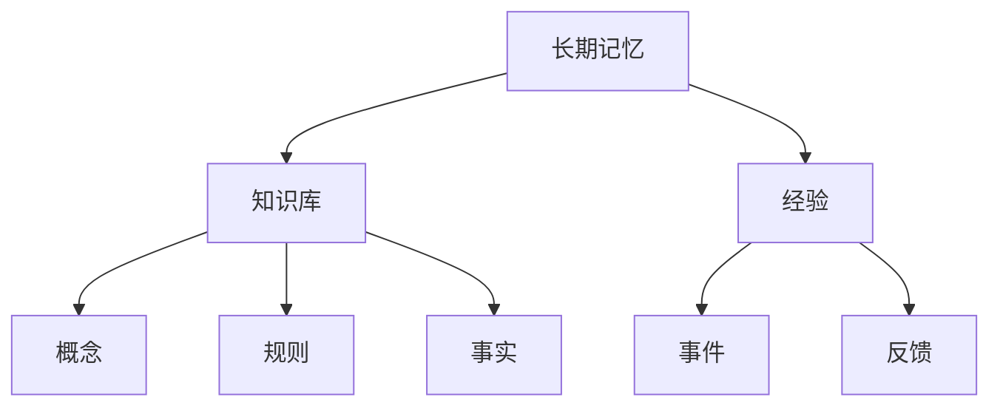
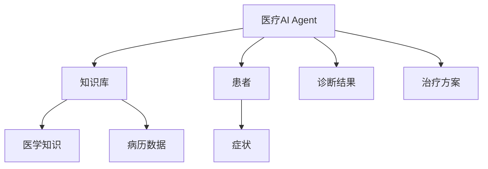

                 


# 从零构建AI Agent的长期记忆机制

## 关键词：长期记忆机制、AI Agent、知识图谱、向量数据库、分布式存储

## 摘要：  
本文系统地介绍了AI Agent的长期记忆机制，从基本概念到核心算法，再到系统设计和项目实现，全面解析了如何构建支持长期记忆的AI Agent。文章首先阐述了AI Agent的定义和长期记忆机制的重要性，接着深入分析了长期记忆的存储模型、检索算法和更新机制，通过对比不同模型的特点，帮助读者理解其优缺点。随后，文章详细讲解了基于向量数据库和知识图谱的长期记忆实现方法，并通过Python代码示例展示了具体实现。最后，结合系统架构设计和项目实战，本文提供了完整的AI Agent构建方案，并总结了长期记忆机制的关键点及未来发展方向。

---

## 第一部分: AI Agent与长期记忆机制概述

### 第1章: AI Agent的背景与基本概念

#### 1.1 AI Agent的定义与分类

##### 1.1.1 什么是AI Agent  
AI Agent（人工智能代理）是指能够感知环境、自主决策并执行任务的智能实体。它可以是一个软件程序、机器人或任何具备人工智能能力的系统。AI Agent的核心目标是通过与环境交互，完成特定任务，例如信息检索、决策优化或问题解决。

##### 1.1.2 AI Agent的分类  
AI Agent可以根据智能水平、应用场景和交互方式进行分类：  
- **按智能水平**：  
  - **反应式AI Agent**：基于当前感知做出反应，不具备复杂的学习能力。  
  - **认知式AI Agent**：具备推理、规划和学习能力，能够处理复杂任务。  
- **按应用场景**：  
  - **服务型AI Agent**：用于客服、推荐系统等场景。  
  - **自主型AI Agent**：用于自动驾驶、机器人等领域。  
- **按交互方式**：  
  - **基于规则的AI Agent**：通过预定义规则执行任务。  
  - **基于模型的AI Agent**：通过学习模型自主决策。  

##### 1.1.3 AI Agent的核心特征  
AI Agent的核心特征包括：  
- **自主性**：能够自主决策和执行任务。  
- **反应性**：能够感知环境并实时响应。  
- **学习性**：能够通过经验改进性能。  
- **社交性**：能够与其他系统或用户进行交互。  

---

#### 1.2 长期记忆机制的定义与作用

##### 1.2.1 长期记忆机制的定义  
长期记忆机制是指AI Agent能够存储、检索和更新知识或经验的能力，这些知识或经验可以用于未来的任务决策或推理。与短期记忆（例如即时感知的信息）不同，长期记忆注重存储持久性的信息，如知识库、经验库等。

##### 1.2.2 长期记忆机制的作用  
长期记忆机制在AI Agent中的作用包括：  
- **知识存储**：存储结构化的知识，例如概念、规则和事实。  
- **经验积累**：记录过去的交互和行为，用于未来的决策优化。  
- **推理支持**：通过调用长期记忆中的信息，支持复杂的推理过程。  

##### 1.2.3 长期记忆与短期记忆的区别  
下表对比了长期记忆和短期记忆的主要区别：

| **特性**       | **长期记忆**                  | **短期记忆**                  |
|-----------------|-------------------------------|-------------------------------|
| 存储内容         | 知识、经验、规则               | 即时感知的信息                 |
| 存储时间         | 较长，可持续数天、数月或更久     | 较短，通常在任务结束后清除     |
| 访问方式         | 主动检索或被动触发             | 基于当前任务或上下文主动调用   |
| 更新机制         | 增量式或定期更新               | 实时更新或任务结束后清除       |

---

#### 1.3 本章小结  
本章介绍了AI Agent的基本概念和分类，并重点阐述了长期记忆机制的定义、作用及其与短期记忆的区别。理解这些概念是构建支持长期记忆的AI Agent的基础。

---

## 第二部分: 长期记忆机制的核心概念与原理

### 第2章: 长期记忆机制的核心概念

#### 2.1 长期记忆的存储模型

##### 2.1.1 知识图谱模型  
知识图谱是一种以图结构表示知识的模型，节点表示实体或概念，边表示实体之间的关系。例如，知识图谱可以表示“人→居住在→城市”的关系。

##### 2.1.2 向量数据库模型  
向量数据库将知识表示为高维向量，并通过向量相似度（如余弦相似度）进行检索。例如，将“猫”和“狗”表示为向量，通过计算相似度来判断它们的语义接近程度。

##### 2.1.3 分布式存储模型  
分布式存储模型将记忆数据分散存储在多个节点中，通过一致性协议（如RAFT）保证数据的一致性。例如，使用分布式文件系统存储大规模的知识库。

---

#### 2.2 长期记忆的检索机制

##### 2.2.1 基于关键词的检索  
基于关键词的检索通过匹配存储的数据中的关键词进行检索。例如，输入“猫的特征”可以检索出“猫有四条腿”的知识。

##### 2.2.2 基于语义的检索  
基于语义的检索通过理解查询的语义进行检索。例如，输入“猫的特征”可以检索出“猫喜欢活动”等语义相关的知识。

##### 2.2.3 基于上下文的检索  
基于上下文的检索结合当前任务的上下文进行检索。例如，在医疗场景中，输入“心脏病症状”可以检索出与心脏病相关的症状知识。

---

#### 2.3 长期记忆的更新机制

##### 2.3.1 增量式更新  
增量式更新是指随着时间的推移，逐步添加新的知识或经验。例如，每天新增一些新闻事件到知识库中。

##### 2.3.2 批量式更新  
批量式更新是指定期批量更新知识库，例如每周进行一次大规模的知识更新。

##### 2.3.3 基于反馈的更新  
基于反馈的更新是指根据用户反馈或任务结果更新知识库。例如，用户指出“猫喜欢牛奶”是错误的，系统会更新相关知识。

---

#### 2.4 核心概念对比表  
下表对比了不同存储模型的特点：

| **模型**         | **优点**                          | **缺点**                          |
|-------------------|-----------------------------------|-----------------------------------|
| 知识图谱模型       | 结构化能力强，支持语义检索        | 构建复杂，存储空间需求大          |
| 向量数据库模型     | 检索速度快，支持高维数据         | 语义理解能力有限                  |
| 分布式存储模型     | 扩展性强，支持大规模数据         | 一致性维护复杂                    |

---

#### 2.5 ER实体关系图  
下图展示了长期记忆机制的核心要素及其关系：



---

### 第3章: 长期记忆机制的算法原理

#### 3.1 知识图谱构建算法

##### 3.1.1 实体识别与抽取  
实体识别是指从文本中提取实体（如“猫”、“狗”）的过程。常用算法包括基于规则的方法和基于深度学习的方法。

##### 3.1.2 关系抽取与建模  
关系抽取是指从文本中提取实体之间的关系（如“猫属于哺乳动物”）。常用算法包括基于模板的方法和基于关系抽取模型的方法。

##### 3.1.3 知识图谱存储  
知识图谱可以存储在图数据库（如Neo4j）中，支持高效的查询和推理。

---

#### 3.2 向量数据库的构建与检索

##### 3.2.1 向量空间模型  
向量空间模型将文本表示为向量空间中的点，计算向量之间的相似度进行检索。例如，使用TF-IDF或Word2Vec生成向量表示。

##### 3.2.2 向量索引技术  
向量索引技术（如ANN）用于高效检索向量数据库中的相似向量。

##### 3.2.3 余弦相似度计算  
余弦相似度公式为：  
$$ \cos\theta = \frac{\vec{A} \cdot \vec{B}}{\|\vec{A}\| \|\vec{B}\|} $$

---

#### 3.3 分布式存储与一致性协议

##### 3.3.1 分布式存储的基本原理  
分布式存储将数据分散存储在多个节点中，通过一致性协议保证数据的一致性。

##### 3.3.2 基于RAFT的一致性协议  
RAFT是一种常用的分布式一致性协议，通过选举领导者和日志复制实现数据一致性。

---

### 第4章: 长期记忆机制的系统分析与架构设计

#### 4.1 问题场景介绍  
以医疗AI Agent为例，长期记忆机制需要存储病人的病史、诊断结果和治疗方案。

#### 4.2 系统功能设计  
- **知识存储**：存储医学知识库、病历数据。  
- **知识检索**：根据患者症状检索相关知识。  
- **知识更新**：根据最新医学研究更新知识库。

#### 4.3 系统架构设计  
下图展示了医疗AI Agent的系统架构：



---

## 第三部分: 项目实战与总结

### 第5章: 项目实战

#### 5.1 环境安装  
安装Python、TensorFlow、Neo4j等工具。

#### 5.2 核心代码实现  
- 知识图谱构建代码示例：
  ```python
  # 知识图谱构建示例代码
  from neo4j import GraphDatabase

  def add_entity(tx, entity_type, entity_name):
      tx.run("CREATE (:Entity {type: $type, name: $name})",
              type=entity_type, name=entity_name)

  driver = GraphDatabase.driver("neo4j://localhost:7687", auth=("user", "password"))
  with driver.session() as session:
      session.write_transaction(add_entity, "animal", "猫")
      session.write_transaction(add_entity, "animal", "狗")
  ```

- 向量检索代码示例：
  ```python
  # 向量检索示例代码
  import numpy as np

  def compute_cosine_similarity(vector1, vector2):
      return np.dot(vector1, vector2) / (np.linalg.norm(vector1) * np.linalg.norm(vector2))

  vector1 = np.array([1, 2, 3])
  vector2 = np.array([2, 4, 6])
  similarity = compute_cosine_similarity(vector1, vector2)
  print(similarity)
  ```

#### 5.3 案例分析  
以医疗AI Agent为例，展示如何通过长期记忆机制检索患者病史并生成诊断建议。

---

### 第6章: 总结与展望

#### 6.1 本章总结  
本文系统地介绍了AI Agent的长期记忆机制，从核心概念到算法实现，再到系统设计，全面解析了如何构建支持长期记忆的AI Agent。

#### 6.2 未来展望  
未来，随着AI技术的发展，长期记忆机制将更加智能化和高效化。例如，结合大语言模型（如GPT）实现更强大的知识推理和记忆管理。

#### 6.3 最佳实践Tips  
- 定期更新知识库，保持长期记忆的准确性。  
- 结合上下文进行检索，提高检索的准确性。  
- 使用分布式存储，支持大规模数据的高效管理。

---

## 作者：AI天才研究院/AI Genius Institute & 禅与计算机程序设计艺术 /Zen And The Art of Computer Programming

