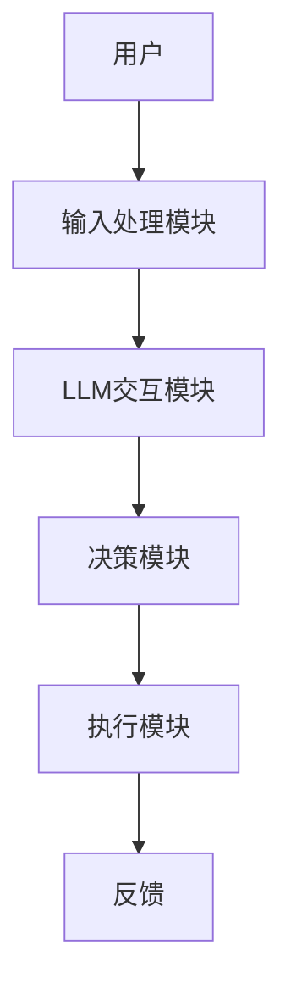

                 


# 从零构建AI Agent：LLM大模型应用开发实践

## 关键词：AI Agent, LLM, 大语言模型, 人工智能代理, 应用开发

## 摘要：  
本文将深入探讨从零开始构建AI Agent的过程，结合大语言模型（LLM）的应用开发实践。通过系统化的分析和实践，详细讲解AI Agent的核心概念、LLM的算法原理、系统架构设计以及项目实战，帮助开发者掌握构建智能代理系统的关键技术和方法。文章内容涵盖背景介绍、核心概念、算法原理、系统架构、项目实战、进阶内容和最佳实践，为读者提供全面的技术指导。

---

# 第1章 AI Agent与LLM大模型概述

## 1.1 AI Agent的基本概念

### 1.1.1 AI Agent的定义与特点
- **定义**：AI Agent（人工智能代理）是指能够感知环境、自主决策并执行任务的智能实体。
- **特点**：
  - **自主性**：能够在没有外部干预的情况下运行。
  - **反应性**：能够实时感知环境并做出响应。
  - **目标导向**：通过优化目标函数来实现特定任务。
  - **可扩展性**：能够处理多种任务和复杂场景。

### 1.1.2 AI Agent的核心功能与应用场景
- **核心功能**：
  - 感知与交互：通过传感器或API获取环境信息。
  - 决策与推理：基于感知信息进行逻辑推理和决策。
  - 行动与执行：通过执行器或API实现目标。
- **应用场景**：
  - 智能助手：如虚拟助手、客服机器人。
  - 智能推荐：个性化推荐系统。
  - 自动化控制：工业自动化、智能家居。

### 1.1.3 LLM大模型在AI Agent中的作用
- **LLM的核心作用**：
  - 提供自然语言理解与生成能力。
  - 支持复杂场景下的决策推理。
  - 通过上下文理解实现动态交互。

## 1.2 LLM大模型的背景与发展

### 1.2.1 大语言模型的起源与演进
- **起源**：基于神经网络的语言模型，如RNN和Transformer。
- **演进**：从BERT到GPT系列，再到PaLM等多模态模型。

### 1.2.2 LLM与AI Agent的结合
- **技术融合**：LLM为AI Agent提供强大的自然语言处理能力。
- **协同进化**：AI Agent为LLM提供上下文和应用场景。

### 1.2.3 当前LLM大模型的技术挑战
- **计算资源需求**：训练和推理需要大量算力。
- **模型可解释性**：提升模型的透明性和可信度。
- **实时性与响应速度**：优化模型的推理效率。

## 1.3 AI Agent与LLM的结合

### 1.3.1 AI Agent的典型应用场景
- **智能客服**：通过LLM实现自动问答和问题解决。
- **智能助手**：提供个性化的任务执行和信息检索。
- **智能监控**：实时分析监控数据并触发警报。

### 1.3.2 LLM在AI Agent中的角色
- **语言理解与生成**：处理自然语言输入并生成有意义的输出。
- **知识表示与推理**：结合知识图谱进行逻辑推理。
- **上下文管理**：维护对话历史和任务状态。

### 1.3.3 AI Agent与LLM的交互机制
- **输入输出接口**：通过API或消息队列传递数据。
- **上下文管理**：维护对话历史和任务状态。
- **动态推理**：根据实时信息调整推理过程。

## 1.4 本章小结
本章介绍了AI Agent和LLM的基本概念、应用场景以及它们的结合方式。通过理解AI Agent的核心功能和LLM的潜力，我们可以为构建智能代理系统奠定基础。

---

# 第2章 AI Agent与LLM的核心概念

## 2.1 AI Agent的核心概念

### 2.1.1 AI Agent的体系结构
- **感知层**：负责获取环境信息。
- **决策层**：基于信息进行推理和决策。
- **执行层**：通过执行器或API实现任务。

### 2.1.2 AI Agent的决策机制
- **基于规则的决策**：简单场景下的规则匹配。
- **基于模型的决策**：使用机器学习模型进行预测。
- **基于知识图谱的推理**：通过知识图谱进行复杂推理。

### 2.1.3 AI Agent的状态管理
- **状态表示**：通过向量或符号表示状态。
- **状态转移**：根据决策结果更新状态。
- **状态记忆**：维护长期记忆以支持复杂任务。

## 2.2 LLM大模型的核心概念

### 2.2.1 LLM的训练目标与损失函数
- **训练目标**：最小化生成概率的负对数似然。
- **损失函数**：
  $$ \mathcal{L}(\theta) = -\frac{1}{N}\sum_{i=1}^{N} \log P_\theta(x_i) $$
  其中，$x_i$ 是训练样本，$\theta$ 是模型参数。

### 2.2.2 LLM的生成机制与采样策略
- **生成机制**：通过自注意力机制生成序列。
- **采样策略**：
  - **贪心采样**：选择概率最大的词。
  - **随机采样**：基于概率分布随机选择。
  - **温度采样**：通过调整温度参数软化概率分布。

### 2.2.3 LLM的注意力机制与序列建模
- **自注意力机制**：计算序列中每个位置的注意力权重。
- **序列建模**：通过递归或并行方式处理序列。

## 2.3 AI Agent与LLM的关系

### 2.3.1 AI Agent对LLM的需求
- **多轮对话**：支持连续的上下文交互。
- **动态推理**：根据实时信息调整生成内容。
- **可解释性**：提供推理过程的解释。

### 2.3.2 LLM对AI Agent的增强
- **自然语言理解**：提升信息处理能力。
- **知识表达**：通过语言模型表示知识。
- **推理能力**：通过上下文生成推理结果。

### 2.3.3 AI Agent与LLM的交互机制
- **输入输出接口**：通过API传递文本输入和输出。
- **上下文管理**：维护对话历史和任务状态。
- **动态调整**：根据反馈实时调整生成内容。

## 2.4 本章小结
本章详细讲解了AI Agent和LLM的核心概念及其相互关系，为后续章节的系统设计和项目实践奠定了理论基础。

---

# 第3章 AI Agent与LLM的算法原理

## 3.1 LLM的算法原理

### 3.1.1 LLM的训练过程
- **前向传播**：输入序列通过编码器生成隐藏状态。
- **解码器**：基于编码器输出生成目标序列。

### 3.1.2 LLM的数学模型
- **编码器-解码器结构**：
  $$ \text{编码器: } \mathbf{X} \rightarrow \mathbf{H} $$
  $$ \text{解码器: } \mathbf{H} \rightarrow \mathbf{Y} $$
  其中，$\mathbf{X}$ 是输入序列，$\mathbf{H}$ 是编码器输出，$\mathbf{Y}$ 是目标序列。

### 3.1.3 LLM的训练目标
- **交叉熵损失**：
  $$ \mathcal{L}(\theta) = -\frac{1}{N}\sum_{i=1}^{N} \log P_\theta(y_i|x_i) $$

## 3.2 AI Agent的算法原理

### 3.2.1 AI Agent的感知与决策
- **感知模块**：通过传感器或API获取环境信息。
- **决策模块**：基于感知信息进行推理和决策。

### 3.2.2 AI Agent的数学模型
- **状态空间**：$S$ 表示所有可能的状态。
- **动作空间**：$A$ 表示所有可能的动作。
- **决策函数**：$a = \pi(s)$，根据当前状态选择动作。

## 3.3 AI Agent与LLM的协同算法

### 3.3.1 AI Agent与LLM的联合推理
- **联合训练**：将LLM的生成能力与AI Agent的决策能力结合。
- **联合推理**：通过交互式推理提升决策的准确性。

### 3.3.2 基于LLM的AI Agent算法
- **输入处理**：将环境信息输入LLM生成决策建议。
- **决策优化**：基于LLM的建议进行优化选择。

## 3.4 本章小结
本章从算法层面详细讲解了AI Agent和LLM的实现原理，为后续的系统设计和项目实践提供了理论支持。

---

# 第4章 AI Agent与LLM的系统架构设计

## 4.1 项目介绍
- **项目名称**：智能助手AI Agent。
- **项目目标**：构建一个基于LLM的智能助手，支持多轮对话和任务执行。

## 4.2 系统功能设计

### 4.2.1 功能模块划分
- **输入处理模块**：接收用户输入并解析。
- **LLM交互模块**：与大语言模型进行交互。
- **决策模块**：基于LLM的输出进行决策。
- **执行模块**：通过API执行任务。

### 4.2.2 功能流程
1. 用户输入问题。
2. 输入处理模块解析问题。
3. LLM交互模块生成回复。
4. 决策模块根据回复选择动作。
5. 执行模块执行任务并反馈结果。

## 4.3 系统架构设计

### 4.3.1 系统架构图


### 4.3.2 接口设计
- **输入接口**：HTTP REST API。
- **输出接口**：WebSocket实时反馈。

## 4.4 本章小结
本章通过系统架构设计，详细讲解了如何构建基于LLM的AI Agent系统，为后续的项目实战奠定了基础。

---

# 第5章 AI Agent与LLM的项目实战

## 5.1 环境配置

### 5.1.1 环境需求
- **Python 3.8+**
- **TensorFlow或PyTorch框架**
- **LLM模型（如GPT-3、PaLM）**

### 5.1.2 安装依赖
```bash
pip install tensorflow transformers
```

## 5.2 核心代码实现

### 5.2.1 输入处理模块
```python
def process_input(user_input):
    return user_input.lower().strip()
```

### 5.2.2 LLM交互模块
```python
from transformers import AutoTokenizer, AutoModelForCausalLM

tokenizer = AutoTokenizer.from_pretrained("gpt2")
model = AutoModelForCausalLM.from_pretrained("gpt2")
```

### 5.2.3 决策模块
```python
def make_decision(context):
    # 基于上下文生成决策
    pass
```

### 5.2.4 执行模块
```python
def execute_action(action):
    # 执行具体任务
    pass
```

## 5.3 功能扩展与优化

### 5.3.1 对话历史管理
```python
class ConversationManager:
    def __init__(self):
        self.history = []

    def add_to_history(self, message):
        self.history.append(message)
```

### 5.3.2 模型优化
- **微调LLM模型**：基于特定任务数据进行微调。
- **缓存机制**：减少重复计算，提高效率。

## 5.4 测试与优化

### 5.4.1 功能测试
- **单轮对话测试**。
- **多轮对话测试**。
- **任务执行测试**。

### 5.4.2 性能优化
- **模型压缩**：减少模型参数量。
- **并行计算**：优化推理速度。

## 5.5 本章小结
本章通过具体的项目实战，详细讲解了如何从零开始构建AI Agent系统，并提供了代码实现和优化建议。

---

# 第6章 AI Agent与LLM的进阶内容

## 6.1 当前研究热点

### 6.1.1 多模态模型
- **图像与文本结合**。
- **语音与文本结合**。

### 6.1.2 实时推理优化
- **边缘计算**：在本地设备上进行推理。
- **分布式计算**：优化推理性能。

### 6.1.3 可解释性增强
- **可视化工具**：帮助理解模型决策过程。
- **可解释算法**：设计更透明的模型。

## 6.2 未来研究方向

### 6.2.1 更强的推理能力
- **通用推理框架**。
- **跨领域的推理能力**。

### 6.2.2 更高的效率
- **推理加速技术**。
- **轻量化模型设计**。

### 6.2.3 更好的可解释性
- **可解释模型设计**。
- **用户友好型解释工具**。

## 6.3 本章小结
本章探讨了当前的研究热点和未来的研究方向，为读者提供了进一步学习和研究的参考。

---

# 第7章 总结与展望

## 7.1 总结

### 7.1.1 核心内容回顾
- AI Agent的核心概念。
- LLM的算法原理。
- 系统架构设计。
- 项目实战经验。

### 7.1.2 开发中的注意事项
- 模型的可解释性。
- 系统的实时性。
- 资源的优化利用。

## 7.2 展望

### 7.2.1 技术发展
- 更强的推理能力。
- 更高的效率。
- 更好的可解释性。

### 7.2.2 应用场景扩展
- 多模态应用。
- 边缘计算应用。
- 跨领域应用。

## 7.3 本章小结
本章总结了全文的核心内容，并展望了未来的技术发展趋势和应用场景。

---

# 作者

作者：AI天才研究院/AI Genius Institute & 禅与计算机程序设计艺术/Zen And The Art of Computer Programming

---

通过以上内容，读者可以系统地了解从零构建AI Agent和LLM大模型应用开发的实践过程，掌握相关的技术和方法。

