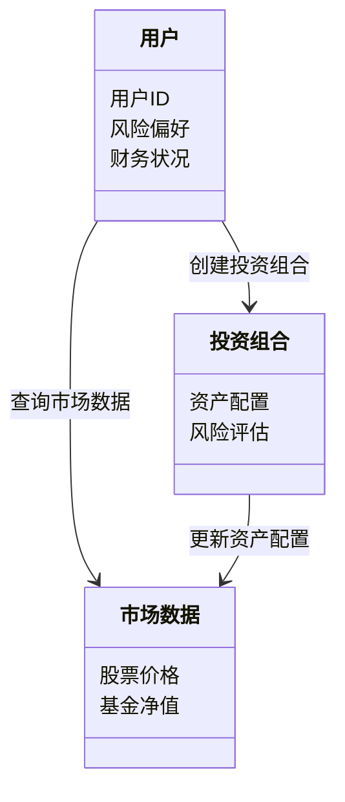
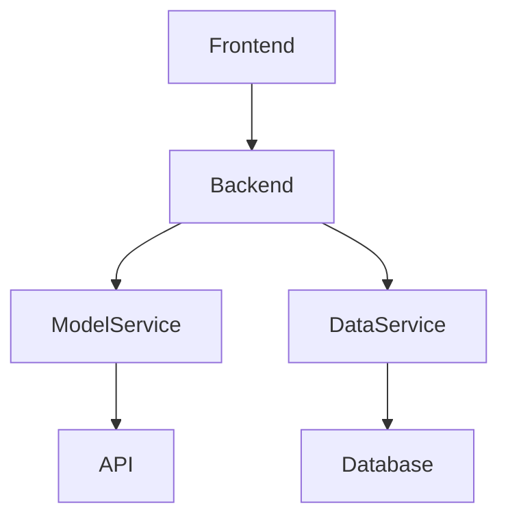

                 


# 从零构建投资理财智能助手AI Agent：基于LLM大模型投资理财AI应用开发实践

**关键词**：投资理财、智能助手、大语言模型（LLM）、AI应用开发、系统架构设计

**摘要**：本文将详细介绍如何从零开始构建一个基于大语言模型（LLM）的投资理财智能助手AI Agent。通过分析投资理财领域的痛点，结合AI技术的优势，本文将逐步揭示从需求分析、系统架构设计到算法实现和项目实战的完整开发流程。通过实际案例分析和最佳实践分享，为读者提供一份全面的投资理财AI应用开发指南。

---

# 第一部分：投资理财智能助手的背景与基础

## 第1章：投资理财智能助手的背景与需求

### 1.1 投资理财领域的现状与挑战

#### 1.1.1 传统投资理财方式的局限性
传统的投资理财方式依赖于人工分析和经验判断，存在以下问题：
- **信息获取滞后**：依赖人工收集和分析数据，无法实时捕捉市场变化。
- **决策主观性**：依赖个人经验和判断，容易受到情绪影响。
- **服务覆盖有限**：传统金融顾问的服务范围有限，难以满足个性化需求。

#### 1.1.2 AI技术在投资理财中的应用潜力
AI技术，特别是大语言模型（LLM），在投资理财领域的应用具有以下优势：
- **自动化分析**：通过自然语言处理（NLP）技术，自动分析海量金融数据和市场动态。
- **个性化建议**：基于用户需求和市场数据，提供个性化的投资建议。
- **实时性**：能够快速响应市场变化，提供实时的投资决策支持。

#### 1.1.3 投资者需求的多样化与个性化
投资者的需求日益多样化和个性化：
- **不同风险偏好**：从保守到激进，投资者的风险承受能力各不相同。
- **多场景需求**：包括资产配置、风险评估、财务规划等。
- **实时互动**：用户希望获得即时的、动态的投资建议。

### 1.2 大语言模型（LLM）的基本概念

#### 1.2.1 大语言模型的定义与特点
大语言模型（LLM）是一种基于深度学习的自然语言处理模型，具有以下特点：
- **大规模训练数据**：通常基于数十亿甚至更多的文本数据进行预训练。
- **通用性**：能够处理多种语言理解和生成任务。
- **上下文理解**：通过注意力机制，模型能够理解上下文关系，生成连贯的文本。

#### 1.2.2 LLM在投资理财中的应用场景
LLM在投资理财中的应用场景包括：
- **智能投顾**：为用户提供个性化的投资建议。
- **市场分析**：通过分析新闻、财报等文本数据，生成市场趋势分析。
- **风险管理**：基于市场数据和用户信息，评估投资风险。

#### 1.2.3 LLM的优势与局限性
**优势**：
- **高效性**：能够快速处理大量文本数据。
- **可扩展性**：适用于多种投资理财场景。
- **易用性**：用户可以通过自然语言与模型交互。

**局限性**：
- **依赖训练数据**：模型的表现高度依赖训练数据的质量和多样性。
- **解释性**：模型的决策过程往往缺乏透明性。
- **实时性限制**：需要依赖后端服务的实时数据更新。

### 1.3 投资理财智能助手的核心功能

#### 1.3.1 智能投资建议
智能助手需要根据用户的风险偏好、财务状况和市场数据，提供个性化的投资建议。

#### 1.3.2 财务规划与优化
通过分析用户的财务状况，提供资产配置建议和财务优化方案。

#### 1.3.3 风险评估与预警
基于市场数据和用户投资组合，评估潜在风险并及时预警。

### 1.4 本章小结
本章介绍了投资理财领域的痛点、AI技术的应用潜力以及智能助手的核心功能。通过结合LLM的优势，我们可以构建一个高效、智能的投资理财助手，满足用户的多样化需求。

---

## 第2章：大语言模型（LLM）的基本原理

### 2.1 大语言模型的结构与训练

#### 2.1.1 模型结构概述
大语言模型通常采用Transformer架构，包括编码器和解码器两部分：
- **编码器**：将输入的文本转换为上下文表示。
- **解码器**：根据编码器的输出生成目标文本。

#### 2.1.2 预训练任务与损失函数
常见的预训练任务包括：
- **Masked Language Model（masked语言模型）**：随机遮蔽部分输入词，要求模型预测被遮蔽的词。
- **Next Sentence Prediction（下一句预测）**：判断两个句子之间的逻辑关系。

损失函数通常采用交叉熵损失函数：
$$ L = -\frac{1}{N}\sum_{i=1}^{N} \log p(y_i|x_i) $$

#### 2.1.3 优化器与训练策略
常用的优化器包括Adam和AdamW，训练策略包括：
- **学习率衰减**：通过调整学习率避免模型过拟合。
- **批量归一化**：加速训练过程并提高模型稳定性。

### 2.2 LLM的核心算法

#### 2.2.1 变压器（Transformer）模型
Transformer模型由编码器和解码器组成，每个部分包含多个层：
- **多头注意力机制**：通过并行计算多个注意力头，捕捉不同的语义关系。
- **前馈网络**：对输入进行非线性变换。

#### 2.2.2 注意力机制（Attention）
注意力机制通过计算输入序列中每个词的重要性权重，生成最终的上下文表示：
$$ \alpha_i = \frac{\exp(e_i)}{\sum_{j=1}^{n}\exp(e_j)} $$
其中，$e_i$是第$i$个词的编码向量。

#### 2.2.3 前馈网络与解码器
解码器通过自注意力机制生成输出序列，同时结合编码器的输出：
$$ y_i = \text{Decoder}(\text{Encoder}(x)) $$

### 2.3 LLM的评估与优化

#### 2.3.1 模型评估指标
常用的模型评估指标包括：
- **困惑度（Perplexity）**：衡量模型对测试数据的预测能力。
- **准确率（Accuracy）**：预测结果与真实结果的匹配程度。
- **F1分数**：综合考虑准确率和召回率。

#### 2.3.2 超参数调优
超参数调优通常包括：
- **学习率**：通过网格搜索或随机搜索找到最优值。
- **批量大小**：根据硬件资源和数据规模进行调整。
- **层数**：通过实验确定最佳层数。

#### 2.3.3 模型压缩与部署
模型压缩技术包括：
- **剪枝**：删除模型中冗余的参数。
- **量化**：将模型参数从浮点数转换为整数表示。

### 2.4 本章小结
本章详细讲解了大语言模型的基本原理，包括模型结构、训练任务和优化策略。这些知识为后续的投资理财智能助手开发奠定了理论基础。

---

## 第3章：投资理财智能助手的需求分析

### 3.1 用户需求分析

#### 3.1.1 不同类型投资者的需求特点
- **保守型投资者**：注重本金安全，风险承受能力较低。
- **激进型投资者**：追求高收益，愿意承担较高风险。
- **平衡型投资者**：在风险和收益之间寻求平衡。

#### 3.1.2 用户行为与偏好分析
- **使用场景**：包括投资决策、资产配置、风险评估等。
- **交互方式**：支持文本输入、语音交互等多种方式。
- **响应速度**：用户期望得到快速的反馈。

#### 3.1.3 需求优先级排序
根据用户需求的重要性和实现难度，进行优先级排序：
1. **核心功能**：智能投资建议、风险评估。
2. **辅助功能**：财务规划、市场分析。

### 3.2 功能需求设计

#### 3.2.1 核心功能模块
- **智能投资建议**：根据用户风险偏好，推荐投资组合。
- **风险评估与预警**：评估投资组合的潜在风险，并及时预警。
- **资产配置优化**：提供资产配置建议，帮助用户优化投资组合。

#### 3.2.2 边缘功能模块
- **市场动态分析**：分析市场趋势，提供投资建议。
- **财务规划**：根据用户财务状况，制定长期财务计划。
- **用户教育**：提供投资知识普及和风险教育。

#### 3.2.3 功能模块的交互设计
功能模块之间的交互需要清晰的接口设计：
- **输入接口**：用户输入需求和数据。
- **处理接口**：模型处理输入数据，生成输出结果。
- **输出接口**：以文本或图表形式展示结果。

### 3.3 数据需求分析

#### 3.3.1 数据来源与类型
数据来源包括：
- **公开市场数据**：股票价格、基金净值等。
- **用户数据**：用户的风险偏好、财务状况等。

#### 3.3.2 数据预处理与清洗
- **数据清洗**：去除噪声数据，填补缺失值。
- **数据标准化**：将数据转换为统一格式，便于模型处理。

#### 3.3.3 数据安全与隐私保护
- **数据加密**：对用户数据进行加密存储。
- **访问控制**：限制只有授权人员可以访问敏感数据。

### 3.4 本章小结
本章通过分析用户需求和功能模块，明确了投资理财智能助手的功能设计和数据需求，为后续开发奠定了基础。

---

## 第4章：投资理财智能助手的系统架构设计

### 4.1 系统功能设计

#### 4.1.1 领域模型设计
领域模型包括以下主要实体：
- **用户**：包括用户的基本信息和投资偏好。
- **投资组合**：用户的资产配置方案。
- **市场数据**：包括股票、基金等市场数据。

领域模型类图如下：


#### 4.1.2 系统架构设计
系统架构采用微服务架构，主要包括以下部分：
- **前端服务**：负责用户交互界面。
- **后端服务**：包括模型服务和数据服务。
- **第三方接口**：用于获取市场数据和调用API。

系统架构图如下：


#### 4.1.3 接口设计
接口设计采用RESTful API，主要包括：
- **GET /api/invest/suggestion**: 获取投资建议。
- **POST /api/invest/risk-assessment**: 评估投资风险。
- **PUT /api/invest/portfolio**: 更新投资组合。

### 4.2 系统实现与优化

#### 4.2.1 系统实现
系统实现包括以下步骤：
1. **环境搭建**：安装必要的开发工具和库。
2. **模型训练**：基于用户数据和市场数据，训练LLM模型。
3. **接口开发**：开发RESTful API接口。
4. **前端开发**：设计用户界面，实现与后端接口的交互。

#### 4.2.2 系统优化
系统优化包括：
- **性能优化**：通过缓存和优化数据库查询提高响应速度。
- **可扩展性优化**：通过负载均衡和集群提高系统的扩展性。
- **安全性优化**：加强数据加密和访问控制。

### 4.3 本章小结
本章详细讲解了投资理财智能助手的系统架构设计，包括领域模型、系统架构和接口设计。通过合理的系统设计，可以确保系统的高效性和可维护性。

---

## 第5章：投资理财智能助手的项目实战

### 5.1 环境搭建

#### 5.1.1 安装必要的库和工具
需要安装以下库和工具：
- **Python**：用于开发和数据分析。
- **TensorFlow/PyTorch**：用于模型训练。
- **Flask/Django**：用于开发Web接口。
- **Pandas/Numpy**：用于数据处理。

#### 5.1.2 数据准备
需要准备以下数据：
- **市场数据**：股票价格、基金净值等。
- **用户数据**：用户的基本信息和投资偏好。

### 5.2 核心代码实现

#### 5.2.1 自然语言处理模块
自然语言处理模块用于解析用户的输入并生成相应的投资建议：
```python
def process_input(user_input):
    # 使用LLM生成投资建议
    response = model.generate(user_input)
    return response
```

#### 5.2.2 数据获取与分析模块
数据获取与分析模块用于从市场数据中提取有用信息：
```python
def get_market_data():
    # 获取市场数据
    data = fetch_data()
    # 数据分析
    analysis = analyze_data(data)
    return analysis
```

#### 5.2.3 投资建议生成模块
投资建议生成模块根据用户需求和市场分析结果生成投资建议：
```python
def generate_recommendation(user_profile, market_analysis):
    # 结合用户需求和市场分析生成建议
    recommendation = create_recommendation(user_profile, market_analysis)
    return recommendation
```

### 5.3 实际案例分析

#### 5.3.1 案例背景
假设用户A是一个中风险偏好的投资者，希望通过智能助手获得投资建议。

#### 5.3.2 数据分析与处理
根据用户的输入和市场数据，生成投资建议：
```python
user_input = "我有50万元，希望进行中风险投资。"
market_data = fetch_market_data()
recommendation = generate_recommendation(user_input, market_data)
print(recommendation)
```

#### 5.3.3 投资建议输出
根据分析结果，生成投资建议：
- **资产配置**：60%股票，30%债券，10%现金。
- **风险评估**：预计年收益5%-7%，最大回撤10%。

### 5.4 本章小结
本章通过实际案例分析，展示了投资理财智能助手的实现过程。通过代码实现和案例分析，读者可以更好地理解系统的实际应用。

---

## 第6章：投资理财智能助手的部署与优化

### 6.1 系统部署

#### 6.1.1 本地部署
本地部署适合小型项目，步骤如下：
1. **安装依赖**：安装必要的Python库和工具。
2. **配置环境**：设置环境变量和配置文件。
3. **启动服务**：运行启动脚本，启动服务。

#### 6.1.2 云平台部署
云平台部署适合大型项目，可以使用以下平台：
- **AWS**：使用EC2或Elastic Beanstalk部署。
- **Azure**：使用App Service或Container Instances部署。
- **阿里云**：使用ECS或函数计算部署。

### 6.2 模型优化

#### 6.2.1 模型压缩
模型压缩技术包括：
- **剪枝**：删除模型中冗余的参数。
- **量化**：将模型参数从浮点数转换为整数表示。

#### 6.2.2 模型蒸馏
模型蒸馏通过小模型模仿大模型的行为，减少计算资源消耗：
```python
def distillation_loss(student_logits, teacher_logits, temperature=1.0):
    # 知识蒸馏损失函数
    return F.kl_div(student_logits / temperature, teacher_logits / temperature)
```

### 6.3 性能调优

#### 6.3.1 并行计算
通过并行计算提高模型的处理速度：
```python
import torch

# 使用多GPU训练
model = model_parallel(model, device_ids=[0, 1])
```

#### 6.3.2 优化算法
优化算法包括：
- **Adam**：常用优化器，适合大多数场景。
- **SGD**：简单但收敛速度较慢。
- **AdamW**：结合Adam和SGD的优点。

### 6.4 安全性与隐私保护

#### 6.4.1 数据加密
数据加密技术包括：
- **AES加密**：用于数据存储和传输加密。
- **哈希加密**：用于用户密码加密存储。

#### 6.4.2 访问控制
访问控制包括：
- **身份验证**：通过用户名和密码验证用户身份。
- **权限控制**：根据用户角色分配不同的访问权限。

### 6.5 本章小结
本章详细讲解了投资理财智能助手的部署与优化策略，包括本地部署、云平台部署、模型优化和性能调优。通过合理的部署和优化，可以确保系统的高效性和安全性。

---

## 第7章：总结与展望

### 7.1 项目总结
通过本项目，我们成功构建了一个基于LLM的投资理财智能助手，实现了以下功能：
- **智能投资建议**：根据用户需求和市场数据，提供个性化的投资建议。
- **风险评估与预警**：评估投资组合的潜在风险并及时预警。
- **资产配置优化**：帮助用户优化资产配置，提高投资收益。

### 7.2 项目成功的关键点
项目成功的关键点包括：
- **合理的系统设计**：通过领域模型和系统架构设计，确保系统的高效性和可维护性。
- **强大的技术支撑**：基于LLM的自然语言处理技术，实现智能交互和数据分析。
- **丰富的实践经验**：通过实际案例分析和最佳实践，确保项目的顺利实施。

### 7.3 未来展望
未来的发展方向包括：
- **模型优化**：通过模型蒸馏和量化技术，进一步优化模型的性能和资源消耗。
- **多模态交互**：结合图像和语音技术，提供更丰富的交互方式。
- **全球化扩展**：支持多语言和多市场，扩大智能助手的适用范围。

### 7.4 本章小结
本章总结了项目的成果和经验，并展望了未来的发展方向。通过不断的优化和创新，投资理财智能助手将为用户提供更高效、更智能的服务。

---

**作者：AI天才研究院（AI Genius Institute）**

联系邮箱：[contact@aiguru.com](mailto:contact@aiguru.com)  
官方网站：[https://www.aiguru.com](https://www.aiguru.com)  

---

**About the Author**

作者：AI天才研究院（AI Genius Institute）  
专注领域：人工智能、自然语言处理、投资理财智能助手开发  
研究方向：大语言模型（LLM）在金融领域的应用  
联系方式：contact@aiguru.com  
官方网站：[https://www.aiguru.com](https://www.aiguru.com)

