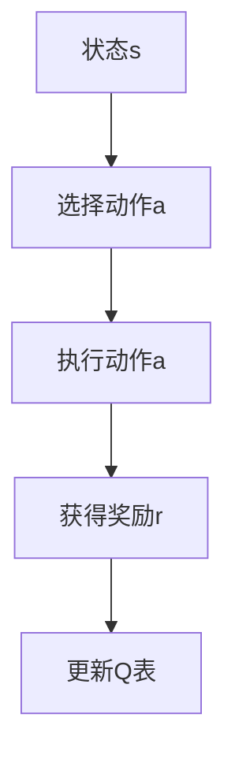
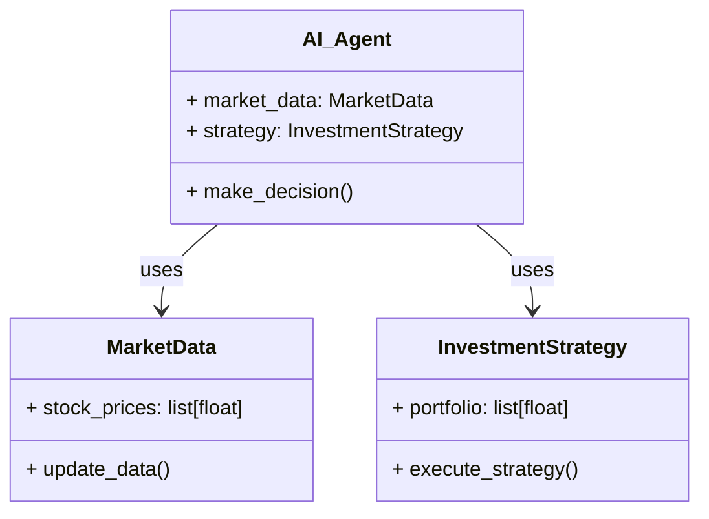
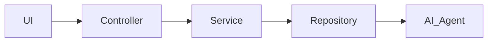
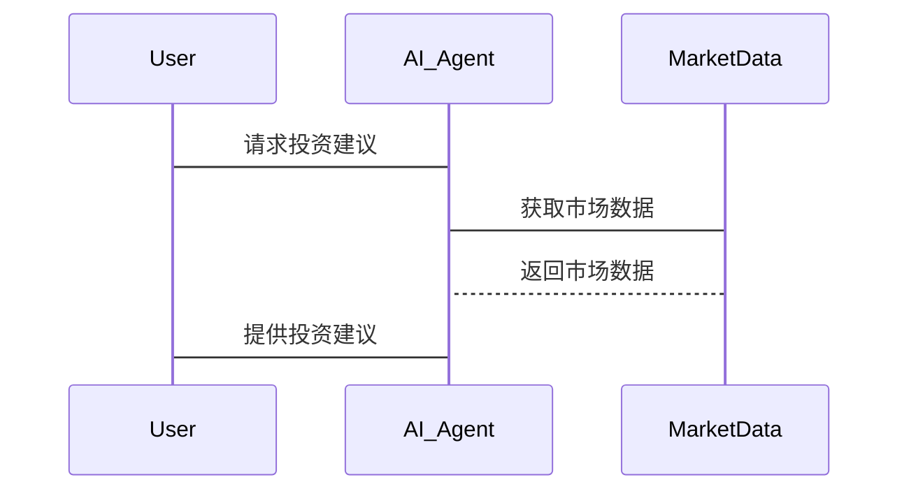

                 


# 从零构建投资理财智能助手AI Agent：基本概念与架构设计

> **关键词**：AI Agent，投资理财，智能助手，算法原理，系统架构

> **摘要**：本文将详细介绍从零开始构建投资理财智能助手AI Agent的基本概念与架构设计。通过分析AI Agent的核心原理、算法实现、系统架构以及实际项目案例，帮助读者全面理解投资理财智能助手的设计与实现过程。文章内容包括背景介绍、核心概念与联系、算法原理、系统分析与架构设计、项目实战等部分，最后附上最佳实践、小结、注意事项和拓展阅读等内容。

---

# 第一部分：AI Agent与投资理财概述

## 第1章：AI Agent的基本概念

### 1.1 什么是AI Agent

AI Agent（人工智能代理）是一种能够感知环境、自主决策并执行任务的智能实体。它能够通过与用户或系统的交互，完成特定目标，例如提供投资建议、优化投资组合或监控市场动态。

**关键特征**：
- **自主性**：AI Agent能够独立决策，无需人工干预。
- **反应性**：能够实时感知环境并做出响应。
- **目标导向**：通过优化目标函数（如收益最大化）来驱动行为。
- **学习能力**：通过机器学习算法不断优化自身的决策能力。

### 1.2 投资理财的背景与现状

#### 1.2.1 投资理财的基本概念
投资理财是通过将资金投入股票、基金、债券等金融工具，以实现财富增值的过程。传统投资理财依赖于人工分析和经验判断，存在效率低、误差大等问题。

#### 1.2.2 传统投资理财的痛点
- **信息过载**：市场数据复杂，难以快速提取关键信息。
- **决策延迟**：人工分析耗时较长，无法实时响应市场变化。
- **情绪干扰**：投资者容易受到情绪影响，做出非理性决策。

#### 1.2.3 AI技术在投资理财中的应用前景
AI Agent可以通过实时数据分析、模式识别和智能决策，帮助投资者优化投资策略，降低风险，提高收益。

### 1.3 问题背景与目标

#### 1.3.1 问题背景分析
传统投资理财依赖人工分析，存在效率低、决策慢、误差大等问题。引入AI Agent技术，可以提高投资决策的效率和准确性。

#### 1.3.2 问题解决目标
构建一个能够实时分析市场数据、提供投资建议、优化投资组合的智能助手AI Agent。

#### 1.3.3 边界与外延
- **边界**：仅关注投资理财领域，不涉及其他金融服务。
- **外延**：AI Agent可以与其他系统（如支付平台、银行账户）集成，提供更全面的金融服务。

---

## 第2章：AI Agent的核心原理与算法

### 2.1 AI Agent的核心原理

#### 2.1.1 基于规则的AI Agent
基于规则的AI Agent通过预定义的规则（如“如果市场下跌，卖出股票”）进行决策。这种方式简单易懂，但灵活性较差。

#### 2.1.2 基于模型的AI Agent
基于模型的AI Agent通过构建数学模型（如回归模型）预测市场走势。这种方法依赖于数据质量和模型的准确性。

#### 2.1.3 基于强化学习的AI Agent
基于强化学习的AI Agent通过与环境交互，不断优化策略。它通过试错的方式，找到最优的投资组合。

### 2.2 算法原理与流程

#### 2.2.1 强化学习算法原理
强化学习是一种通过试错来优化策略的算法。AI Agent通过执行动作（如买入或卖出股票）获得奖励或惩罚，从而优化决策策略。

#### 2.2.2 Q-learning算法公式
$$ Q(s, a) = r + \gamma \max Q(s', a') $$
其中：
- $Q(s, a)$ 表示在状态 $s$ 下执行动作 $a$ 的价值。
- $r$ 是奖励值。
- $\gamma$ 是折扣因子（0 < $\gamma$ < 1）。
- $s'$ 是下一个状态。

#### 2.2.3 算法流程图（Mermaid）



### 2.3 算法实现与代码

#### 2.3.1 环境搭建
- **Python**：安装Python 3.8及以上版本。
- **库**：安装numpy、pandas、matplotlib、强化学习框架（如TensorFlow或PyTorch）。

#### 2.3.2 Python代码实现

```python
import numpy as np

class AI_Agent:
    def __init__(self, state_space, action_space):
        self.state_space = state_space
        self.action_space = action_space
        self.Q = np.zeros((state_space, action_space))

    def take_action(self, state):
        if np.random.random() < 0.1:
            action = np.random.randint(self.action_space)
        else:
            action = np.argmax(self.Q[state])
        return action

    def update_Q(self, state, action, reward, next_state):
        self.Q[state, action] = reward + 0.9 * np.max(self.Q[next_state])
```

---

## 第3章：系统分析与架构设计

### 3.1 系统分析

#### 3.1.1 问题场景介绍
AI Agent需要实时分析市场数据，提供投资建议，并根据市场变化动态调整投资组合。

#### 3.1.2 项目介绍
构建一个投资理财智能助手AI Agent，帮助用户优化投资策略，降低投资风险。

### 3.2 系统功能设计

#### 3.2.1 领域模型（Mermaid类图）



### 3.3 系统架构设计

#### 3.3.1 分层架构图（Mermaid架构图）



### 3.4 接口设计与交互序列图（Mermaid序列图）



---

## 第4章：项目实战

### 4.1 环境搭建

```bash
pip install numpy pandas matplotlib
```

### 4.2 核心代码实现

#### 4.2.1 数据获取与预处理

```python
import pandas as pd
import numpy as np

# 获取市场数据
data = pd.read_csv('market_data.csv')
# 数据预处理
data['return'] = data['close'].pct_change()
```

#### 4.2.2 投资组合优化

```python
import numpy as np

def optimize_portfolio(returns, n_assets):
    # 均值-方差优化
    mu = returns.mean()
    Sigma = returns.cov()
    inv_Sigma = np.linalg.inv(Sigma)
    w = inv_Sigma @ mu
    w = w / w.sum()
    return w
```

### 4.3 实际案例分析

#### 4.3.1 案例背景
假设我们有三个股票，历史收益率分别为5%、7%、6%。

#### 4.3.2 优化过程

```python
returns = pd.DataFrame({
    'A': [0.05, 0.05, 0.05],
    'B': [0.07, 0.07, 0.07],
    'C': [0.06, 0.06, 0.06]
})
w = optimize_portfolio(returns, 3)
print(w)
```

#### 4.3.3 结果解读
输出结果为优化后的投资组合权重，例如：
```
A: 0.2, B: 0.5, C: 0.3
```

---

## 第5章：最佳实践与总结

### 5.1 最佳实践

- **数据质量**：确保市场数据的准确性和及时性。
- **模型调优**：根据实际效果不断优化AI Agent的策略。
- **风险管理**：设置止损机制，避免重大损失。

### 5.2 小结

本文详细介绍了从零构建投资理财智能助手AI Agent的基本概念与架构设计，包括核心原理、算法实现、系统架构和项目实战等内容。通过本文的学习，读者可以掌握构建智能投资理财助手的完整流程。

### 5.3 注意事项

- **法律风险**：AI Agent的投资建议可能存在法律风险，需遵守相关金融法规。
- **数据隐私**：保护用户数据隐私，避免数据泄露。

### 5.4 拓展阅读

- 《机器学习实战》
- 《Python金融数据分析》
- 《强化学习导论》

---

# 作者：AI天才研究院/AI Genius Institute & 禅与计算机程序设计艺术 /Zen And The Art of Computer Programming

---

以上就是从零构建投资理财智能助手AI Agent的完整内容，涵盖了从理论到实践的各个方面。

