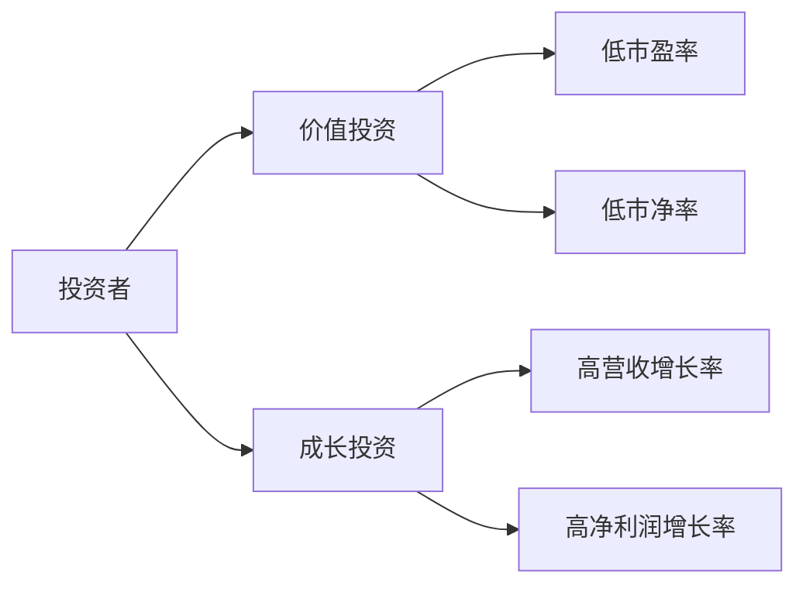
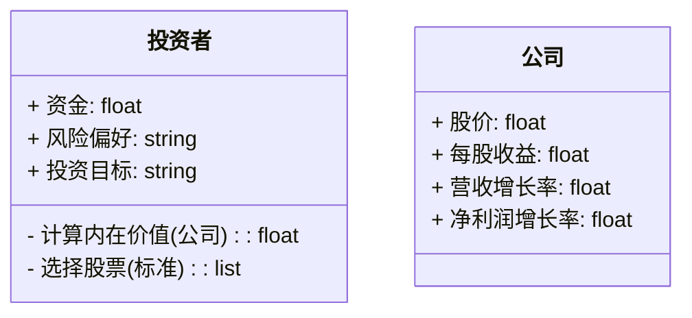

                 


# 价值投资 vs 成长投资：格雷厄姆与费雪的对比

> 关键词：价值投资，成长投资，格雷厄姆，费雪，投资策略，股票分析，数学模型

> 摘要：本文通过详细对比格雷厄姆的价值投资与费雪的成长投资，分析两种投资策略的核心理念、数学模型、适用场景及优缺点。文章从理论背景、核心概念、算法原理、系统架构、项目实战等多个维度展开，结合Mermaid图表和数学公式，深入剖析两种投资方法的异同，并为读者提供实际操作的建议。

---

## 第一部分：价值投资与成长投资的理论基础

### 第1章：价值投资与成长投资的概述

#### 1.1 价值投资的核心理念

##### 1.1.1 价值投资的定义与起源
价值投资是由本杰明·格雷厄姆提出的一种投资策略，强调以低于内在价值的价格购买优质股票。其核心理念是通过分析企业的基本面，寻找市场估值低于其实际价值的公司。这种方法注重安全边际，即买入价格与内在价值的差距越大，投资的安全性越高。

##### 1.1.2 价值投资的核心原则
- 买入价格低于内在价值。
- 长期持有优质资产。
- 避免情绪化决策，坚持理性分析。

##### 1.1.3 价值投资的适用场景
- 市场低迷或估值偏低时。
- 投资者希望降低风险，追求长期稳定的收益。

#### 1.2 成长投资的核心理念

##### 1.2.1 成长投资的定义与起源
成长投资是由菲利普·费雪提出的一种投资策略，强调投资于具有高成长潜力的公司。这种方法认为，公司未来的增长潜力比当前的估值更重要，通过投资于高速增长的公司，可以获得超额收益。

##### 1.2.2 成长投资的核心原则
- 投资于高成长性的公司。
- 长期持有，分享公司成长的成果。
- 重视管理团队和公司竞争优势。

##### 1.2.3 成长投资的适用场景
- 市场处于上升周期，成长型企业表现突出时。
- 投资者愿意承担较高的短期波动风险，以换取长期增长收益。

---

### 第2章：格雷厄姆与费雪的投资理念对比

#### 2.1 格雷厄姆的价值投资理论

##### 2.1.1 格雷厄姆的投资哲学
格雷厄姆认为，市场先生是疯狂的，股票价格经常偏离其内在价值。投资者的任务是发现这种偏离，并利用它来获取超额收益。他强调安全边际的重要性，认为只有在买入价格远低于内在价值时，投资才是安全的。

##### 2.1.2 格雷厄姆的防御性投资策略
格雷厄姆提出防御性投资策略，即通过分散投资和严格估值，降低投资风险。他认为，投资者应该投资于那些具有稳定收益、良好财务状况和较低估值的公司。

##### 2.1.3 格雷厄姆的数学模型与公式
格雷厄姆的内在价值公式是价值投资的核心工具：
$$
\text{内在价值} = \sum_{t=1}^{\infty} \frac{\text{现金流}_t}{(1 + r)^t}
$$
其中，$r$ 是折现率，$\text{现金流}_t$ 是第 $t$ 年的现金流。

#### 2.2 费雪的成长投资理论

##### 2.2.1 费雪的投资哲学
费雪认为，股票价格是公司价值的反映，而公司的价值取决于其未来的盈利能力。他强调，投资者应该关注公司的成长性，尤其是营收和净利润的增长率。他认为，投资于高成长的公司，可以带来超额收益。

##### 2.2.2 费雪的成长性投资策略
费雪提出，投资者应该寻找那些具有竞争优势、管理团队优秀且成长性高的公司。他认为，成长性是决定股票长期表现的最关键因素。

##### 2.2.3 费雪的数学模型与公式
费雪的成长性模型强调对公司未来现金流的预测：
$$
\text{复合年增长率} = \left( \frac{\text{终值}}{\text{初值}} \right)^{\frac{1}{n}} - 1
$$
其中，$n$ 是时间跨度，终值和初值分别是最终和初始的现金流。

---

### 第3章：价值投资与成长投资的核心概念对比

#### 3.1 核心概念对比表格
| 比较维度 | 价值投资 | 成长投资 |
|----------|----------|----------|
| 核心目标 | 以低于内在价值的价格买入 | 买入具有高成长潜力的公司 |
| 选股标准 | 低市盈率、低市净率 | 高营收增长率、高净利润增长率 |
| 持股期限 | 中长期 | 中长期 |
| 风险控制 | 严格控制估值风险 | 通过成长性降低风险 |

#### 3.2 价值投资与成长投资的实体关系图


---

## 第4章：价值投资与成长投资的数学模型与算法

### 4.1 价值投资的数学模型

#### 4.1.1 市盈率公式
$$
\text{市盈率} = \frac{\text{股价}}{\text{每股收益}}
$$

#### 4.1.2 内在价值公式
$$
\text{内在价值} = \sum_{t=1}^{\infty} \frac{\text{现金流}_t}{(1 + r)^t}
$$

### 4.2 成长投资的数学模型

#### 4.2.1 股票增长率公式
$$
\text{增长率} = \frac{\text{净利润增长率} + \text{营收增长率}}{2}
$$

#### 4.2.2 复合年增长率公式
$$
\text{CAGR} = \left( \frac{\text{终值}}{\text{初值}} \right)^{\frac{1}{n}} - 1
$$

---

## 第5章：价值投资与成长投资的系统架构设计

### 5.1 问题场景介绍
在金融投资中，投资者需要根据市场环境和个人风险偏好选择合适的投资策略。价值投资和成长投资是两种截然不同的方法，各有优缺点。

### 5.2 系统功能设计

#### 5.2.1 领域模型类图


#### 5.2.2 系统架构图
```mermaid
container 投资系统 {
    投资者
    公司
    价值投资模块
    成长投资模块
}
价值投资模块 --> 公司: 计算市盈率
成长投资模块 --> 公司: 计算增长率
```

---

## 第6章：价值投资与成长投资的项目实战

### 6.1 环境安装
- 数据来源：股票数据库（如Yahoo Finance）
- 工具：Python编程语言，Pandas、NumPy库
- 环境：Jupyter Notebook

### 6.2 核心实现代码

#### 6.2.1 价值投资策略实现
```python
import pandas as pd

def calculate_intrinsic_value(company_data, discount_rate):
    cash_flow = company_data['现金流']
    intrinsic_value = 0
    for t in range(len(cash_flow)):
        intrinsic_value += cash_flow[t] / (1 + discount_rate) ** t
    return intrinsic_value

# 示例数据
company_data = pd.DataFrame({
    '现金流': [100, 120, 140, 160],
    '折现率': [0.1, 0.1, 0.1, 0.1]
})
intrinsic_value = calculate_intrinsic_value(company_data, 0.1)
print(f"内在价值：{intrinsic_value}")
```

#### 6.2.2 成长投资策略实现
```python
def calculate_growth_rate(company_data):
    revenue_growth = (company_data['营收'].iloc[-1] / company_data['营收'].iloc[0]) ** (1 / (len(company_data) - 1)) - 1
    net_profit_growth = (company_data['净利润'].iloc[-1] / company_data['净利润'].iloc[0]) ** (1 / (len(company_data) - 1)) - 1
    return (revenue_growth + net_profit_growth) / 2

# 示例数据
company_data = pd.DataFrame({
    '营收': [100, 120, 140, 160],
    '净利润': [20, 24, 28, 32]
})
growth_rate = calculate_growth_rate(company_data)
print(f"增长率：{growth_rate}")
```

### 6.3 实际案例分析
以某公司为例，分析其是否符合价值投资或成长投资的标准。

---

## 第7章：总结与小结

### 7.1 总结
价值投资和成长投资是两种截然不同的投资策略，各有优缺点。价值投资注重安全边际，适合风险厌恶型投资者；成长投资注重成长潜力，适合风险偏好型投资者。投资者应根据市场环境和个人风险偏好选择合适的方法。

### 7.2 最佳实践 tips
- 价值投资：选择低市盈率、低市净率的公司，长期持有。
- 成长投资：选择高营收增长率、高净利润增长率的公司，长期持有。
- 组合投资：结合价值和成长策略，分散风险。

### 7.3 注意事项
- 价值投资需要严格估值，避免高估。
- 成长投资需要关注公司的财务健康状况。
- 投资者应定期复盘，调整投资策略。

---

## 作者

作者：AI天才研究院/AI Genius Institute & 禅与计算机程序设计艺术 /Zen And The Art of Computer Programming

