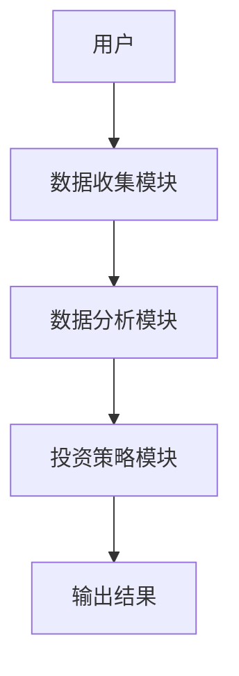

                 


# 价值投资与人口统计学：把握人口结构变化带来的机遇

## 关键词：价值投资，人口统计学，人口结构，投资策略，数学模型

## 摘要： 
本文探讨了价值投资与人口统计学的结合，分析了人口结构变化对投资机会的影响。通过详细分析人口统计学的核心指标和数学模型，结合价值投资的基本原则，本文提出了如何利用人口结构变化来优化投资策略的方法，并通过实际案例和系统架构设计，展示了如何在实际投资中应用这些理论。

---

# 第一部分: 价值投资与人口统计学的基础

## 第1章: 价值投资与人口统计学概述

### 1.1 价值投资的核心理念

#### 1.1.1 价值投资的定义与特点
价值投资是一种以基本面分析为基础的投资策略，强调购买价格低于其内在价值的资产。其核心理念是寻找市场低估的股票，长期持有，等待其价值回归。价值投资的特点包括长期性、安全性、逆向思维和对公司基本面的深入分析。

#### 1.1.2 价值投资的基本原则
- 市场先生理论：市场的短期波动是不可预测的，但长期趋势是由基本面决定的。
- 安全边际：买入价格低于内在价值，以降低投资风险。
- 股东价值：关注企业的内在价值，包括盈利能力、竞争优势和管理能力。

#### 1.1.3 价值投资与人口统计学的关联
人口统计学研究人口结构、分布和趋势，这些因素直接影响市场的供需关系和行业发展趋势。例如，老龄化社会可能增加对医疗和养老服务的需求，而年轻人口的增长可能推动消费和科技行业的发展。

### 1.2 人口统计学的基本概念

#### 1.2.1 人口统计学的定义与研究方法
人口统计学是研究人口数量、结构和分布的科学，主要通过收集和分析数据来预测人口变化趋势。研究方法包括横截面分析、时间序列分析和空间分析。

#### 1.2.2 人口结构的主要指标
- 年龄结构：包括少儿人口、劳动年龄人口和老年人口的比例。
- 性别比例：男性和女性人口的比例。
- 城市化率：城市人口占总人口的比例。
- 人口增长率：单位时间内的新增人口数量。

#### 1.2.3 人口变化对经济和社会的影响
人口结构的变化直接影响经济增长、就业、消费和政策制定。例如，劳动年龄人口的减少可能导致劳动力短缺，而老年人口的增加可能增加社会保障压力。

### 1.3 人口结构变化对投资的影响

#### 1.3.1 人口结构变化的周期性
人口结构的变化具有周期性，例如人口红利期和老龄化期。不同阶段的经济表现和投资机会有所不同。

#### 1.3.2 不同人口群体的投资偏好
不同年龄段的人口对投资的需求和偏好不同。例如，年轻人更倾向于投资科技和消费行业，而中老年人可能更倾向于低风险投资。

#### 1.3.3 人口结构对行业选择的影响
人口结构的变化直接影响行业的兴衰。例如，老龄化社会可能推动医疗和养老服务行业的发展，而年轻人口增长可能促进消费和科技行业。

## 第2章: 价值投资与人口统计学的结合

### 2.1 人口结构与投资策略的关系

#### 2.1.1 不同人口群体的投资行为分析
不同人口群体的投资行为受到其生命周期、收入水平和风险偏好的影响。例如，年轻人可能更倾向于高风险高回报的投资，而中老年人可能更注重稳定收益。

#### 2.1.2 人口结构变化对市场供需的影响
人口结构的变化直接影响市场的供需关系。例如，劳动年龄人口的减少可能导致劳动力短缺，从而推动工资上涨，进而影响企业的盈利能力和股票价值。

#### 2.1.3 人口结构与资产价格波动的关联
人口结构的变化可能通过影响市场情绪、资金流动和政策制定，从而影响资产价格的波动。例如，老龄化可能导致资本市场流动性下降，从而影响股票价格。

### 2.2 人口统计学在价值投资中的应用

#### 2.2.1 人口统计学在行业选择中的应用
通过分析人口结构的变化趋势，投资者可以更好地选择具有增长潜力的行业。例如，老龄化社会可能推动医疗和养老服务行业的发展。

#### 2.2.2 人口统计学在个股分析中的应用
通过分析公司的目标客户群体，投资者可以更好地评估公司的市场前景。例如，年轻人口增长可能推动消费和科技公司的增长。

#### 2.2.3 人口统计学在风险控制中的作用
通过分析人口结构的变化趋势，投资者可以更好地识别和管理投资风险。例如，老龄化可能导致社会保障压力增加，从而影响政府的财政政策。

### 2.3 人口结构变化的长期趋势分析

#### 2.3.1 全球人口结构变化趋势
全球人口结构的变化趋势包括人口老龄化、城市化和人口迁移。这些变化对全球经济和投资机会有重要影响。

#### 2.3.2 中国人口结构变化的特殊性
中国的人口结构变化具有特殊性，例如人口红利期的结束和老龄化加速。这些变化对中国经济和投资机会有重要影响。

#### 2.3.3 人口结构变化对全球经济格局的影响
人口结构的变化影响全球经济格局，例如劳动成本的变化、技术进步和国际贸易关系。

---

## 第三部分: 人口统计学的核心指标与模型

### 3.1 人口统计学的主要指标

#### 3.1.1 人口增长率
人口增长率是单位时间内的新增人口数量，反映了人口的扩张速度。高增长率可能意味着更多的劳动力和消费市场。

#### 3.1.2 年龄结构
年龄结构包括少儿人口、劳动年龄人口和老年人口的比例。不同年龄结构对经济增长和投资机会的影响不同。

#### 3.1.3 性别比例
性别比例影响社会的婚姻状况、家庭结构和消费行为。例如，性别比例失衡可能导致婚姻市场紧张，进而影响社会稳定。

#### 3.1.4 城市化率
城市化率是城市人口占总人口的比例，反映了经济发展的水平和结构。高城市化率可能意味着更多的消费和投资机会。

### 3.2 人口结构变化的数学模型

#### 3.2.1 人口增长模型（如马尔萨斯模型）
马尔萨斯模型认为人口增长是几何级数，而食物供应是算术级数，最终会导致资源短缺和人口控制。

#### 3.2.2 年龄结构模型
年龄结构模型通过分析不同年龄段的人口比例，预测未来的人口变化趋势。

#### 3.2.3 人口周期模型
人口周期模型将人口结构的变化分为不同的周期，例如人口红利期和老龄化期。

### 3.3 人口统计学指标与投资决策的关系

#### 3.3.1 指标之间的相关性分析
通过分析不同人口统计学指标之间的相关性，投资者可以更好地理解它们对投资决策的影响。

#### 3.3.2 指标对投资策略的影响
例如，劳动年龄人口比例的变化可能影响企业的劳动力成本和盈利能力，进而影响股票价值。

#### 3.3.3 指标变化的预警机制
通过建立人口统计学指标的预警机制，投资者可以提前识别潜在的投资机会和风险。

---

## 第四部分: 价值投资中的数学模型与人口统计学分析

### 4.1 价值投资的核心数学模型

#### 4.1.1 股票估值模型（如DCF模型）
DCF模型通过计算未来现金流的现值，评估股票的内在价值。公式为：

$$
\text{内在价值} = \sum_{t=1}^{n} \frac{\text{现金流}_t}{(1 + r)^t}
$$

其中，\( r \) 是折现率，\( n \) 是现金流的期限。

#### 4.1.2 市盈率与市净率分析
市盈率（P/E）= 股价 / 每股收益
市净率（P/B）= 股价 / 每股净资产

#### 4.1.3 股息率与投资回报模型
股息率 = 每股股息 / 股价

### 4.2 人口统计学与投资模型的结合

#### 4.2.1 人口结构对股票估值的影响
例如，老龄化社会可能增加对医疗和养老服务的需求，从而提高相关行业的估值。

#### 4.2.2 人口变化对行业景气度的影响
例如，劳动年龄人口减少可能导致劳动力短缺，从而提高工资成本，影响企业的盈利能力。

#### 4.2.3 人口统计学指标在投资组合优化中的应用
通过分析不同行业的人口统计学指标，投资者可以优化投资组合，降低风险，提高收益。

### 4.3 数学模型的实证分析

#### 4.3.1 历史数据验证
通过分析历史人口数据和股票市场数据，验证人口统计学指标对投资决策的影响。

#### 4.3.2 模型的有效性评估
通过统计学方法评估模型的预测能力和准确性，例如使用回归分析和时间序列分析。

---

## 第五部分: 系统分析与架构设计

### 5.1 问题场景介绍

#### 5.1.1 项目背景
随着人口结构的变化，投资者需要更精准的工具来预测市场趋势和优化投资策略。

#### 5.1.2 项目目标
开发一个基于人口统计学和价值投资的分析系统，帮助投资者识别投资机会和风险。

### 5.2 系统功能设计

#### 5.2.1 数据收集模块
收集人口统计学数据和市场数据，包括人口增长率、年龄结构、市盈率、市净率等。

#### 5.2.2 数据分析模块
使用数学模型和统计方法分析数据，预测人口结构变化对市场的影响。

#### 5.2.3 投资策略模块
根据分析结果，生成投资策略，包括行业选择和个股分析。

### 5.3 系统架构设计

#### 5.3.1 系统架构图
使用 Mermaid 绘制系统架构图，展示数据流、功能模块和系统交互。



#### 5.3.2 接口设计
定义系统接口，包括数据输入、模型调用和结果输出。

#### 5.3.3 系统交互设计
使用 Mermaid 绘制系统交互图，展示用户与系统之间的交互流程。

---

## 第六部分: 项目实战

### 6.1 环境安装

#### 6.1.1 安装 Python 和相关库
安装 Python 和 pandas、numpy、scikit-learn 等数据分析库。

### 6.2 系统核心实现源代码

#### 6.2.1 数据收集模块
```python
import pandas as pd

def collect_data():
    # 从数据库或API获取人口统计数据和市场数据
    population_data = pd.read_csv('population.csv')
    market_data = pd.read_csv('market.csv')
    return population_data, market_data

collect_data()
```

#### 6.2.2 数据分析模块
```python
import numpy as np

def analyze_data(population_data, market_data):
    # 使用回归分析模型预测人口结构变化对市场的影响
    X = population_data[['age_ratio', 'gender_ratio']]
    y = market_data['stock_price']
    model = np.polyfit(X, y, 1)
    return model

analyze_data(population_data, market_data)
```

#### 6.2.3 投资策略模块
```python
from sklearn import linear_model

def generate_strategy(model):
    # 根据模型生成投资策略
    strategy = '买入' if model.predict(new_data) > current_price else '卖出'
    return strategy

generate_strategy(model)
```

### 6.3 实际案例分析

#### 6.3.1 案例分析
假设某国家的人口老龄化加速，分析医疗和养老服务行业的投资机会。

#### 6.3.2 详细讲解剖析
通过具体数据和模型，分析人口结构变化对行业和个股的影响。

### 6.4 项目小结

#### 6.4.1 项目总结
总结项目的实现过程和成果，强调人口统计学在投资中的重要性。

#### 6.4.2 项目意义
说明项目对投资者和学术研究的价值。

---

## 第七部分: 最佳实践与注意事项

### 7.1 最佳实践 tips

#### 7.1.1 数据的准确性和及时性
确保数据的准确性和及时性，以提高模型的预测能力。

#### 7.1.2 模型的可解释性
选择可解释性强的模型，以便更好地理解人口结构变化对投资的影响。

#### 7.1.3 风险管理
在实际投资中，注重风险管理，避免过度依赖模型预测。

### 7.2 小结

#### 7.2.1 核心观点总结
总结文章的核心观点，强调人口结构变化对投资机会的影响。

### 7.3 注意事项

#### 7.3.1 投资者需具备的基本素质
包括数据分析能力、风险意识和长期投资理念。

#### 7.3.2 模型的局限性
说明模型的局限性，例如假设条件和数据偏差。

### 7.4 拓展阅读

#### 7.4.1 相关书籍
推荐相关书籍，如《价值投资实战策略》和《人口统计学与经济发展》。

#### 7.4.2 相关网站
推荐相关数据和研究网站，如世界银行数据平台和美联储经济指标数据库。

---

## 作者：AI天才研究院/AI Genius Institute & 禅与计算机程序设计艺术 /Zen And The Art of Computer Programming

---

通过以上步骤，文章从基础理论到实际应用，全面探讨了价值投资与人口统计学的结合，为投资者提供了新的视角和工具，以更好地把握人口结构变化带来的投资机会。

