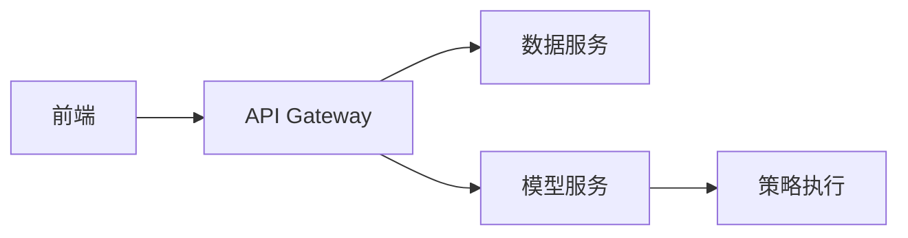

                 


# 价值投资与人工智能：AI辅助决策的潜力与局限

## 关键词：价值投资、人工智能、机器学习、金融决策、风险管理

## 摘要：  
本文探讨人工智能在价值投资中的潜力与局限性。通过分析价值投资的核心理念和人工智能的技术特点，结合实际案例，揭示AI在数据处理、预测建模和投资组合优化中的优势，同时指出其在金融市场中的局限性，如数据偏差和黑箱问题。文章还介绍了基于AI的系统架构，并提出了结合人机协作的未来发展方向。

---

## 第一部分：价值投资与人工智能的背景介绍

### 第1章：价值投资与人工智能的概述

#### 1.1 价值投资的核心概念

价值投资是一种长期投资策略，强调以低于市场价值的价格买入优质资产。其核心理念包括：

- **安全边际**：买入价格低于内在价值，以降低风险。
- **长期视角**：关注企业的基本面，而非短期市场波动。
- **分散投资**：通过投资多样化资产降低风险。

#### 1.2 人工智能的基本概念

人工智能（AI）通过模拟人类智能处理数据、学习和做出决策。核心组成部分包括：

- **机器学习**：通过数据训练模型，使其能够识别模式。
- **深度学习**：基于神经网络的算法，擅长处理复杂数据。
- **自然语言处理**：分析文本数据，提取情感和关键词。

#### 1.3 价值投资与人工智能的结合背景

随着金融市场数据的爆炸式增长，人工智能在金融领域的应用日益广泛。AI能够处理大量数据，识别潜在投资机会，辅助投资决策。价值投资与AI的结合，旨在利用技术提升分析效率和准确性。

---

## 第二部分：人工智能在价值投资中的应用潜力

### 第2章：AI在价值投资数据处理中的应用

#### 2.1 金融数据的特征与挑战

金融数据具有以下特征：

- **多样性**：包括股票价格、财务报表、新闻等多种数据。
- **复杂性**：数据关系复杂，需深度分析。
- **实时性**：需要快速处理和响应。

#### 2.2 自然语言处理在财经新闻中的应用

AI通过NLP技术分析财经新闻，提取关键词和情感倾向，帮助投资者识别市场情绪和潜在风险。

##### 示例：新闻关键词提取

使用TF-IDF算法提取财经新闻中的关键词：

1. 收集新闻文本。
2. 去除停用词。
3. 计算关键词权重。
4. 提取Top 10关键词。

##### 代码示例：

```python
from sklearn.feature_extraction.text import TfidfVectorizer

# 初始化模型
vectorizer = TfidfVectorizer(max_features=10)
# 训练模型
tfidf_matrix = vectorizer.fit_transform(texts)
# 提取关键词
keywords = vectorizer.get_feature_names_out()
```

### 第3章：AI在投资决策中的预测与优化

#### 3.1 金融时间序列预测的AI方法

使用LSTM模型预测股价，结合时间序列特征。

##### LSTM模型结构


##### 代码实现：

```python
import keras
from keras.layers import LSTM, Dense
from keras.models import Sequential

# 模型构建
model = Sequential()
model.add(LSTM(64, input_shape=(timesteps, features)))
model.add(Dense(1, activation='sigmoid'))
model.compile(loss='binary_crossentropy', optimizer='adam')
```

---

## 第三部分：AI辅助决策的局限性

### 第4章：AI的局限性与克服方法

#### 4.1 数据偏差问题

AI模型依赖于训练数据，若数据存在偏差，可能导致错误结论。解决方法包括数据清洗和使用多样化的数据源。

#### 4.2 模型过拟合问题

过拟合会导致模型在测试数据上表现不佳。解决方案包括正则化和交叉验证。

#### 4.3 黑箱问题

AI模型的决策过程难以解释，影响投资者信任。解决方法包括可解释性AI（XAI）技术。

#### 4.4 价值投资的主观性

价值投资涉及主观判断，如公司基本面评估，AI难以完全替代人类的判断。

---

## 第四部分：系统架构与实现方案

### 第5章：系统架构设计

#### 5.1 系统功能设计

系统包括数据采集、特征工程、模型训练和策略生成模块。

##### 功能模块图


#### 5.2 系统架构设计

系统采用微服务架构，包括数据处理、模型训练和策略执行模块。

##### 系统架构图



---

## 第五部分：项目实战

### 第6章：AI辅助价值投资系统的实现

#### 6.1 环境配置

安装必要的库，如Pandas、Scikit-learn和Keras。

#### 6.2 数据获取与预处理

从金融数据库获取数据，清洗和标准化处理。

##### 数据清洗代码：

```python
import pandas as pd

# 读取数据
df = pd.read_csv('stock_data.csv')
# 处理缺失值
df.dropna(inplace=True)
# 标准化处理
from sklearn.preprocessing import StandardScaler
scaler = StandardScaler()
scaled_data = scaler.fit_transform(df['close'].values.reshape(-1,1))
```

#### 6.3 特征工程

提取技术指标，如移动平均线和相对强弱指数。

##### 特征工程代码：

```python
import talib

# 计算EMA
df['EMA'] = df['close'].ewm(span=20).mean()
# 计算RSI
df['RSI'] = talib.RSI(df['close'], timeperiod=14)
```

#### 6.4 模型训练与评估

训练机器学习模型，评估性能。

##### 模型训练代码：

```python
from sklearn.ensemble import RandomForestClassifier
from sklearn.metrics import accuracy_score

# 训练模型
model = RandomForestClassifier()
model.fit(X_train, y_train)
# 评估模型
y_pred = model.predict(X_test)
print(accuracy_score(y_test, y_pred))
```

#### 6.5 策略生成与回测

生成交易策略，使用回测工具验证收益和风险。

##### 回测代码：

```python
import backtrader as bt

class MyStrategy(bt.Strategy):
    def __init__(self):
        self.data = self.datas[0]
        self.buy_price = None
        self.sell_price = None

    def next(self):
        # 生成信号
        signal = model.predict([self.data.open, self.data.high, self.data.low, self.data.close])
        if signal == 1:
            self.buy()
        elif signal == -1:
            self.sell()

# 回测设置
cerebro = bt.Cerebro()
cerebro.addstrategy(MyStrategy)
cerebro.broker.setcash(100000)
cerebro.run()
```

---

## 第六部分：总结与展望

### 第7章：总结与展望

#### 7.1 总结

人工智能在价值投资中具有巨大潜力，能够提升数据分析效率和预测准确性，但也存在数据偏差和黑箱问题等局限性。未来的发展方向包括结合人机协作，优化模型解释性，提升数据质量。

#### 7.2 展望

随着技术进步，AI在金融领域的应用将更加广泛，价值投资与AI的结合将推动投资决策的智能化和高效化。

---

## 作者：AI天才研究院 & 禅与计算机程序设计艺术

