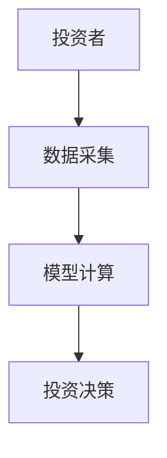
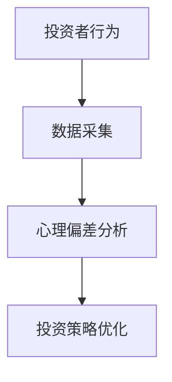

                 


# 价值投资与行为金融学：心理偏差的识别与克服

## 关键词：价值投资，行为金融学，心理偏差，投资决策，风险管理

## 摘要：  
本文深入探讨了价值投资与行为金融学的结合，重点分析了心理偏差对投资决策的影响，并提供了识别与克服这些偏差的方法。通过结合理论与实践，本文为投资者提供了一套系统的投资策略，帮助他们在复杂多变的市场环境中做出更理性、更高效的决策。

---

## 第1章：引言

### 1.1 价值投资的起源与发展
#### 1.1.1 价值投资的定义与核心理念
价值投资是一种以股票的内在价值为导向的投资策略，强调通过基本面分析发现市场定价低于内在价值的投资机会。其核心理念是“买便宜的”，而非“追涨杀跌”。

#### 1.1.2 价值投资的历史发展与主要流派
价值投资起源于20世纪初，由本杰明·格雷厄姆和戴维·多德提出，后来被沃伦·巴菲特发扬光大。主要流派包括格雷厄姆的“捡烟蒂”策略和芒格的价值投资哲学。

#### 1.1.3 价值投资与基本面分析的关系
价值投资的核心在于基本面分析，包括对财务报表、行业地位、竞争优势等方面的研究，以评估股票的内在价值。

### 1.2 行为金融学的背景与核心概念
#### 1.2.1 行为金融学的定义与研究范围
行为金融学研究投资者心理与行为如何影响金融市场，突破了传统金融学假设（理性人假设）的局限性。

#### 1.2.2 行为金融学与传统金融学的区别
行为金融学强调心理因素的作用，而传统金融学假设投资者是理性的。

#### 1.2.3 心理偏差在金融决策中的作用
心理偏差（如认知偏差、情绪偏差）会影响投资者的决策，导致非理性行为。

### 1.3 心理偏差对投资决策的影响
#### 1.3.1 常见的心理偏差类型
- 认知偏差：确认偏差、选择性偏差等。
- 情绪偏差：损失厌恶、从众心理等。
- 行为偏差：过度自信、 herd behavior 等。

#### 1.3.2 心理偏差如何影响投资决策
心理偏差会导致投资者做出非理性决策，如高位追涨、低位恐慌等，影响投资收益。

#### 1.3.3 心理偏差的识别与克服的重要性
识别和克服心理偏差是提升投资决策质量的关键。

---

## 第2章：价值投资的核心理论与实践

### 2.1 价值投资的理论基础
#### 2.1.1 价值投资的核心原则
- 股票的内在价值与市场价值。
- 安全边际的概念与应用。
- 长期投资与价值发现。

#### 2.1.2 价值投资的选股策略
- 基本面分析的关键指标。
- 行业分析与竞争优势评估。
- 财务报表分析与估值方法。

#### 2.1.3 价值投资的案例分析
- 经典投资案例解析。
- 价值陷阱的识别与避免。
- 价值投资在不同市场环境中的应用。

### 2.2 价值投资的算法与数学模型
#### 2.2.1 价值投资的数学模型
- 内在价值计算公式：
  $$ V = \frac{EFC}{(r - g)} $$
  其中，V为内在价值，EFC为未来现金流，r为折现率，g为增长率。

#### 2.2.2 基于价值投资的决策树
- 通过决策树分析不同市场环境下的投资策略。

#### 2.2.3 基于价值投资的系统架构
- 系统架构图展示价值投资的流程。

### 2.3 价值投资的系统架构设计
#### 2.3.1 系统功能设计
- 数据采集：收集公司财务数据、行业信息等。
- 模型计算：计算内在价值、安全边际等。
- 投资决策：根据模型结果制定投资策略。

#### 2.3.2 系统架构图
使用 Mermaid 绘制系统架构图：



#### 2.3.3 系统接口设计
- API接口用于数据交互。

---

## 第3章：行为金融学与心理偏差分析

### 3.1 行为金融学的核心理论
#### 3.1.1 心理偏差的分类与特征
- 认知偏差：确认偏差、选择性偏差等。
- 情绪偏差：损失厌恶、从众心理等。
- 行为偏差：过度自信、 herd behavior 等。

#### 3.1.2 心理偏差对投资决策的影响机制
- 心理偏差如何影响投资者的决策过程。
- 心理偏差与市场波动的关系。

#### 3.1.3 行为金融学的实证
- 通过实证研究分析心理偏差对市场的影响。

### 3.2 心理偏差对投资决策的影响机制
#### 3.2.1 认知偏差的数学模型
- 使用数学模型分析确认偏差：

  $$ P(确认偏差) = \frac{E[|θ - θ_0|]}{E[θ_0]} $$

#### 3.2.2 情绪偏差的数学模型
- 情绪偏差的量化模型：

  $$ M(情绪偏差) = \sum_{i=1}^{n} w_i \cdot D_i $$

  其中，\( w_i \) 为权重，\( D_i \) 为情绪指标。

#### 3.2.3 行为偏差的算法实现
- 通过算法分析 herd behavior 的传播过程。

### 3.3 行为金融学的系统架构设计
#### 3.3.1 系统功能设计
- 数据采集：收集投资者行为数据。
- 模型计算：分析心理偏差。
- 投资决策：优化投资策略。

#### 3.3.2 系统架构图
使用 Mermaid 绘制系统架构图：



---

## 第4章：心理偏差的识别与克服方法

### 4.1 心理偏差的识别方法
#### 4.1.1 自我反思法
- 投资者通过反思自己的决策过程，识别潜在的心理偏差。

#### 4.1.2 数据驱动法
- 通过数据分析识别投资者的非理性行为。

#### 4.1.3 投资决策框架
- 构建基于价值投资和行为金融学的决策框架。

### 4.2 心理偏差的克服方法
#### 4.2.1 自我调节法
- 通过心理调节克服心理偏差。

#### 4.2.2 数据驱动法
- 通过数据和逻辑分析克服情绪偏差。

#### 4.2.3 投资纪律法
- 建立严格的投资纪律，避免非理性决策。

### 4.3 投资决策框架
#### 4.3.1 框架设计
- 结合价值投资和行为金融学，构建投资决策框架。

#### 4.3.2 框架实现
- 使用 Mermaid 绘制决策框架图：

  ```mermaid
  graph TD
  A[价值投资原则] --> B[心理偏差分析]
  B --> C[投资决策]
  ```

---

## 第5章：结合价值投资与行为金融学的投资策略

### 5.1 投资策略的设计
#### 5.1.1 基于价值投资的核心策略
- 以内在价值为导向，选择被低估的股票。

#### 5.1.2 行为金融学的辅助策略
- 结合心理偏差分析，优化投资决策。

### 5.2 投资策略的实现
#### 5.2.1 系统设计
- 使用 Mermaid 绘制投资策略系统图：

  ```mermaid
  graph TD
  A[价值投资] --> B[行为金融学]
  B --> C[投资策略]
  ```

#### 5.2.2 算法实现
- 通过算法实现投资策略的优化。

### 5.3 案例分析
#### 5.3.1 经典案例
- 分析巴菲特的投资策略。

#### 5.3.2 实战案例
- 结合心理偏差分析，优化投资策略。

---

## 第6章：风险管理与心理偏差的控制

### 6.1 风险管理的核心原则
#### 6.1.1 现代投资组合理论
- 通过分散投资降低风险。

#### 6.1.2 风险管理策略
- 结合心理偏差分析，制定风险管理策略。

### 6.2 风险管理的实现
#### 6.2.1 系统设计
- 使用 Mermaid 绘制风险管理系统图：

  ```mermaid
  graph TD
  A[风险管理] --> B[心理偏差控制]
  B --> C[投资组合优化]
  ```

#### 6.2.2 算法实现
- 通过算法实现风险管理策略的优化。

---

## 第7章：实战技巧与最佳实践

### 7.1 心态调整与投资纪律
#### 7.1.1 心态调整
- 通过心理调节克服心理偏差。

#### 7.1.2 投资纪律
- 建立严格的投资纪律，避免非理性决策。

### 7.2 决策流程优化
#### 7.2.1 流程优化
- 优化投资决策流程，提高决策效率。

#### 7.2.2 决策工具
- 使用工具辅助决策，如财务分析工具。

### 7.3 长期投资与价值发现
#### 7.3.1 长期投资
- 长期投资策略的优势与应用。

#### 7.3.2 价值发现
- 通过基本面分析发现投资机会。

---

## 结论

本文系统地探讨了价值投资与行为金融学的结合，分析了心理偏差对投资决策的影响，并提供了识别与克服这些偏差的方法。通过结合理论与实践，本文为投资者提供了一套系统的投资策略，帮助他们在复杂多变的市场环境中做出更理性、更高效的决策。

---

## 作者：AI天才研究院/AI Genius Institute & 禅与计算机程序设计艺术 /Zen And The Art of Computer Programming

