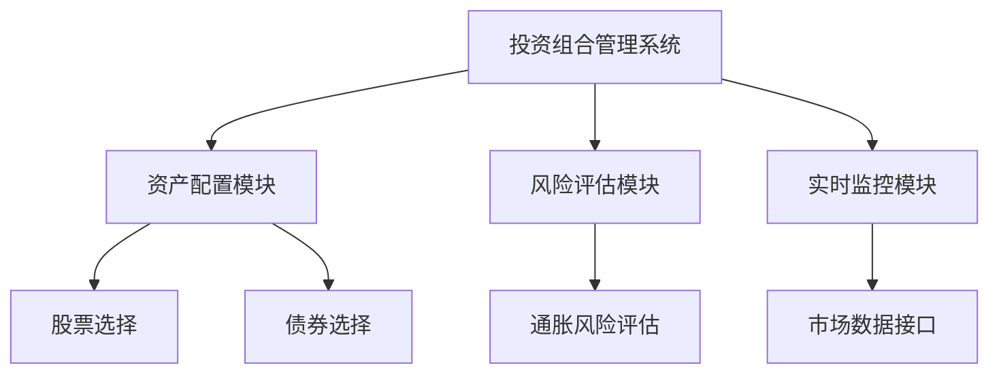
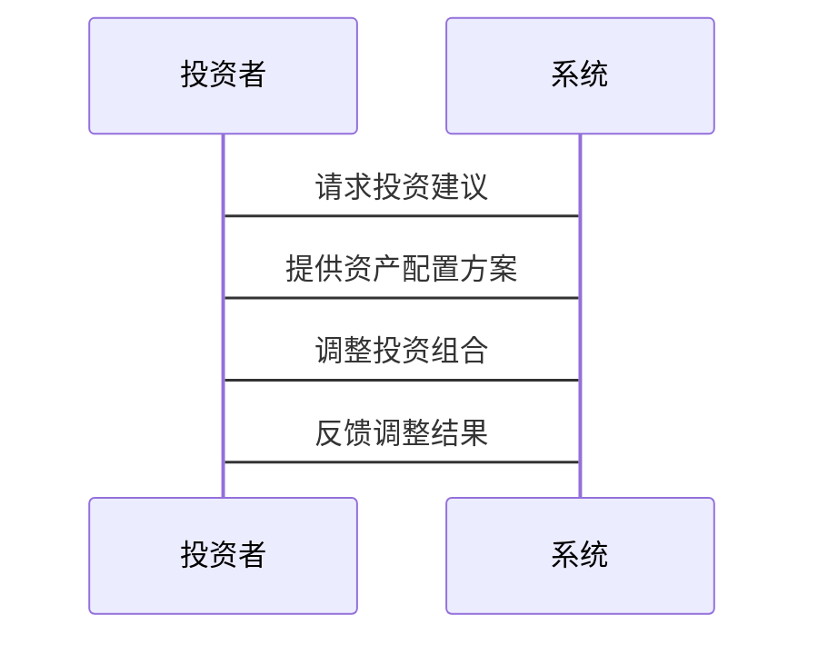

                 


---

# 价值投资与通货膨胀：保护投资组合购买力的策略

## 关键词：价值投资，通货膨胀，投资组合，购买力，资产配置，风险管理，金融策略

## 摘要：  
本文探讨了在通货膨胀环境下，如何通过价值投资策略保护投资组合的购买力。文章从通货膨胀的基本概念出发，分析其对投资组合的影响，深入阐述价值投资的核心理念和优势。通过构建数学模型和系统分析，本文提出了有效的抗通胀投资策略，并提供了实际案例和最佳实践建议，帮助投资者在通货膨胀中实现长期稳健的投资回报。

---

# 第一部分：通货膨胀与投资的基础知识

## 第1章：通货膨胀的基本概念

### 1.1 通货膨胀的定义与类型

通货膨胀是指物价总水平在一段时间内持续上涨，导致货币购买力下降的经济现象。通货膨胀可以分为以下几种类型：

- **温和通胀**：年通胀率在2%-5%之间，是大多数经济体的常态。
- **恶性通胀**：通胀率超过50%，通常伴随着货币贬值和经济不稳定。
- **隐蔽通胀**：物价上涨不明显，但实际购买力下降。

### 1.2 投资与通货膨胀的关系

投资是指通过购买资产以期获得未来收益的行为。通货膨胀对投资的影响是多方面的：

- **资产价格影响**：通货膨胀可能导致股票、债券、房地产等资产价格上涨。
- **购买力侵蚀**：货币的实际购买力下降，影响投资的实际收益。
- **投资机会影响**：通货膨胀可能促使投资者转向抗通胀资产。

### 1.3 价值投资的核心理念

价值投资是一种以基本面分析为基础的投资策略，强调以低于内在价值的价格购买资产。其核心理念包括：

- **安全边际**：购买价格低于内在价值，以降低风险。
- **长期视角**：关注企业的长期价值，而非短期市场波动。
- **逆周期投资**：在市场低迷时寻找被低估的资产。

---

## 第二部分：通货膨胀对投资组合的影响

### 第2章：通货膨胀对投资组合的冲击

#### 2.1 通货膨胀对资产价格的影响

- **股票**：通胀初期可能受益，但过高的通胀可能导致企业利润下降，股价承压。
- **债券**：通胀上升会增加债券的违约风险，降低其吸引力。
- **房地产**：通胀可能导致房地产价格上涨，但也可能引发泡沫风险。

#### 2.2 通货膨胀对投资组合回报的影响

- **实际收益下降**：名义收益可能无法抵消通胀侵蚀。
- **资产配置的重要性**：不同资产在通胀周期中的表现差异显著。

#### 2.3 通货膨胀对投资者心理的影响

- **情绪波动**：通胀可能导致投资者恐慌或贪婪，影响理性决策。
- **行为偏差**：投资者可能在通胀上升时追涨，通胀下降时恐慌抛售。

---

## 第三部分：价值投资在通货膨胀环境下的优势

### 第3章：价值投资的核心策略

#### 3.1 价值投资的核心原则

- **内在价值计算**：通过DCF模型等方法评估资产的真实价值。
- **安全边际**：买入价格低于内在价值，以降低风险。
- **长期持有**：避免频繁交易，减少交易成本和税收负担。

#### 3.2 价值投资的选股标准

- **低市盈率（P/E）**：市盈率低于行业平均水平。
- **低市净率（P/B）**：市净率低于行业平均水平。
- **高股息率**：稳定的股息收益，提供额外现金流。

#### 3.3 价值投资与通货膨胀的结合

- **抗通胀资产配置**：选择那些在通胀上升时表现稳定的资产。
- **分散投资**：通过多元化配置降低风险。

---

## 第四部分：保护投资组合购买力的策略

### 第4章：构建抗通胀投资组合

#### 4.1 投资组合的基本构建原则

- **资产配置**：根据通胀预期调整股票、债券、房地产等资产的比例。
- **风险分散**：避免过度集中于单一资产或行业。
- **定期再平衡**：根据市场变化调整投资组合。

#### 4.2 抗通胀资产的选择

- **大宗商品**：黄金、石油等大宗商品具有抗通胀特性。
- **房地产**：实物资产在通胀上升时通常表现较好。
- **高质量债券**：选择通胀指数化债券，以对冲通胀风险。

#### 4.3 数学模型与投资策略

- **通胀对购买力的侵蚀模型**：  
  实际购买力 = 名义购买力 / (1 + 通胀率)  
  例如：通胀率为5%，实际购买力为原购买力的95.24%。

- **价值投资收益模型**：  
  投资收益 = 内在价值增长 + 安全边际收益  
  例如：买入价格为50元，内在价值为100元，投资收益为50元。

---

## 第五部分：系统分析与项目实战

### 第5章：系统分析与架构设计

#### 5.1 问题场景介绍

- 投资者面临通货膨胀压力，希望构建一个抗通胀的投资组合管理系统。

#### 5.2 系统功能设计

- 资产配置模块：根据通胀预期调整资产比例。
- 风险评估模块：评估投资组合的抗通胀能力。
- 实时监控模块：跟踪市场变化，及时调整投资组合。

#### 5.3 系统架构设计



#### 5.4 系统接口设计

- 数据接口：获取市场数据和通胀指标。
- 用户接口：显示投资组合状态和调整建议。

#### 5.5 系统交互设计



### 第5章：项目实战

#### 5.6 环境安装

- 安装Python、Pandas、Matplotlib等工具。

#### 5.7 核心实现代码

```python
import pandas as pd
import numpy as np
import matplotlib.pyplot as plt

def calculate_inflation_adjusted_return(returns, inflation):
    return (1 + returns) / (1 + inflation) - 1

# 示例数据
returns = [0.05, 0.03, 0.07, 0.02]
inflation = 0.03

adjusted_returns = [calculate_inflation_adjusted_return(r, inflation) for r in returns]
print("Adjusted Returns:", adjusted_returns)

# 绘制图表
plt.plot(adjusted_returns)
plt.title('Inflation Adjusted Returns')
plt.xlabel('Year')
plt.ylabel('Return')
plt.show()
```

#### 5.8 数据收集与分析

- 收集历史通胀数据和资产回报数据。
- 计算实际回报，分析抗通胀资产的表现。

#### 5.9 结果展示

- 绘制通胀调整后的回报曲线。
- 对比不同资产在通胀周期中的表现。

---

## 第六部分：最佳实践与小结

### 第6章：最佳实践

- **分散投资**：避免过度集中于单一资产。
- **长期视角**：坚持价值投资，避免短期波动干扰。
- **定期再平衡**：根据市场变化调整投资组合。
- **风险管理**：设定止损点，控制投资风险。

### 第6章：小结

通过本文的分析，读者可以了解到通货膨胀对投资组合的影响，以及价值投资在保护购买力方面的优势。通过构建数学模型和系统分析，我们可以更好地应对通货膨胀带来的挑战，实现稳健的投资回报。

---

## 作者：AI天才研究院/AI Genius Institute & 禅与计算机程序设计艺术 /Zen And The Art of Computer Programming

