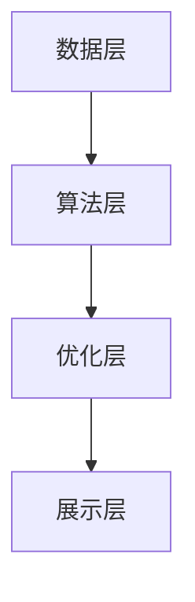
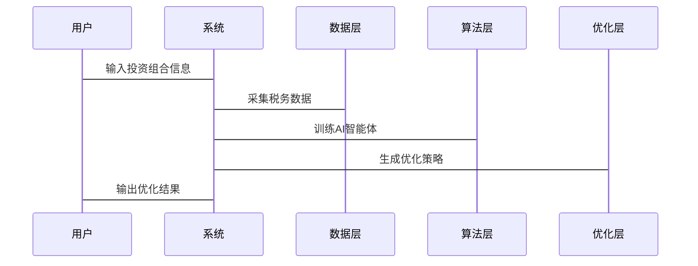

                 


# 价值投资中的AI智能体税收优化系统

---

## 关键词
- 价值投资, AI智能体, 税收优化, 强化学习, 算法原理, 系统架构

---

## 摘要
价值投资是一种以长期收益为目标的投资策略，而税收优化是提升投资回报的重要手段。本文介绍了一种基于AI智能体的税收优化系统，该系统通过强化学习和遗传算法优化税务策略，帮助投资者在价值投资中实现更高的回报。文章详细阐述了系统的核心概念、算法原理、系统架构，并通过实际案例展示了系统的实现和应用效果。

---

# 第一部分: 价值投资与AI智能体税收优化系统概述

---

## 第1章: 价值投资与AI智能体税收优化系统概述

### 1.1 价值投资的核心理念
价值投资是一种以基本面分析为基础的投资策略，旨在通过寻找被市场低估的优质资产，实现长期稳定的回报。其核心理念包括：
1. **安全边际**：投资于价格低于内在价值的资产。
2. **长期持有**：避免短期波动，关注企业的长期价值。
3. **分散投资**：通过多样化投资降低风险。

### 1.2 传统税收优化的局限性
在传统税收优化中，投资者通常依赖手工计算或简单的工具来优化税务策略，这种方式存在以下问题：
1. **计算复杂**：涉及多种税种和优惠政策，手工计算容易出错。
2. **效率低下**：难以快速响应市场变化和税务政策调整。
3. **缺乏动态优化**：无法实时跟踪投资组合的税务影响。

### 1.3 AI智能体在税收优化中的优势
AI智能体通过强化学习和大数据分析，能够实时优化税务策略，显著提升税收优化的效率和准确性。其优势包括：
1. **动态优化**：能够实时调整投资组合的税务配置。
2. **高效计算**：通过算法快速计算最优税务方案。
3. **风险控制**：能够预测税务风险并制定应对策略。

### 1.4 本章小结
本章介绍了价值投资的核心理念、传统税收优化的局限性以及AI智能体在税收优化中的优势，为后续内容奠定了基础。

---

# 第二部分: AI智能体税收优化系统的算法原理

---

## 第2章: AI智能体与税收优化系统的算法原理

### 2.1 强化学习在AI智能体中的应用
强化学习是一种通过试错和奖励机制来优化决策的算法。在税收优化中，AI智能体通过以下步骤实现优化：
1. **状态定义**：定义税务状态，例如资产配置、税务优惠政策等。
2. **动作选择**：选择最优的税务操作，例如资产转让、税务抵扣等。
3. **奖励机制**：根据优化效果给予奖励，强化最优决策。

### 2.2 遗传算法在税收优化中的应用
遗传算法是一种模拟自然进化过程的优化算法。在税收优化中，通过以下步骤实现优化：
1. **种群初始化**：生成初始的税务策略集合。
2. **适应度评估**：计算每个策略的优化效果。
3. **选择与交叉**：选择优秀策略并进行交叉组合，生成新的策略。
4. **变异与迭代**：对新策略进行变异优化，迭代直至收敛。

### 2.3 算法的数学模型
#### 2.3.1 强化学习的数学模型
强化学习的核心是通过最大化奖励函数来优化决策。其数学模型如下：
$$
Q(s, a) = Q(s, a) + \alpha (r + \gamma V(s') - Q(s, a))
$$
其中：
- $s$ 表示状态
- $a$ 表示动作
- $r$ 表示奖励
- $\gamma$ 表示折扣因子
- $\alpha$ 表示学习率

#### 2.3.2 遗传算法的数学模型
遗传算法通过适应度函数评估策略的优劣，并通过交叉和变异操作生成新的策略。其数学模型如下：
$$
适应度函数 = \sum_{i=1}^{n} w_i x_i
$$
其中：
- $w_i$ 表示第 $i$ 个特征的权重
- $x_i$ 表示第 $i$ 个特征的值

### 2.4 算法的实现步骤
1. **数据预处理**：收集和整理税务相关数据。
2. **模型训练**：使用强化学习和遗传算法训练AI智能体。
3. **策略优化**：通过反复迭代优化税务策略。
4. **结果输出**：输出最优的税务方案。

### 2.5 本章小结
本章详细介绍了AI智能体在税收优化中的算法原理，包括强化学习和遗传算法的应用及其数学模型。

---

# 第三部分: AI智能体税收优化系统的系统架构

---

## 第3章: AI智能体税收优化系统的系统架构

### 3.1 系统功能设计
AI智能体税收优化系统的主要功能包括：
1. **数据采集**：收集税务相关数据。
2. **数据处理**：对数据进行清洗和预处理。
3. **模型训练**：使用强化学习和遗传算法训练AI智能体。
4. **策略优化**：生成最优的税务策略。
5. **结果展示**：输出优化后的税务方案。

### 3.2 系统架构设计
系统架构包括以下几个部分：
1. **数据层**：存储税务相关数据。
2. **算法层**：实现强化学习和遗传算法。
3. **优化层**：生成最优的税务策略。
4. **展示层**：输出优化结果。

#### 系统架构图


### 3.3 系统接口设计
系统接口包括：
1. **数据接口**：与税务数据源对接。
2. **优化接口**：与投资管理系统对接。
3. **展示接口**：与用户界面对接。

### 3.4 系统交互设计
系统交互流程如下：
1. 用户输入投资组合信息。
2. 系统采集税务数据。
3. 系统训练AI智能体。
4. 系统生成优化策略。
5. 系统输出优化结果。

#### 系统交互图


### 3.5 本章小结
本章详细介绍了AI智能体税收优化系统的系统架构，包括功能设计、架构设计、接口设计和交互设计。

---

# 第四部分: 项目实战与最佳实践

---

## 第4章: 项目实战与最佳实践

### 4.1 项目环境安装
项目实战需要以下环境：
1. Python 3.8+
2. TensorFlow 2.0+
3. NumPy 1.20+
4. Pandas 1.3+

安装命令：
```
pip install tensorflow numpy pandas
```

### 4.2 核心代码实现
#### 强化学习代码实现
```python
import numpy as np
import tensorflow as tf

class AI_Tax_Optimizer:
    def __init__(self, state_space, action_space):
        self.state_space = state_space
        self.action_space = action_space
        self.model = self.build_model()
    
    def build_model(self):
        model = tf.keras.Sequential([
            tf.keras.layers.Dense(64, activation='relu', input_dim=self.state_space),
            tf.keras.layers.Dense(32, activation='relu'),
            tf.keras.layers.Dense(self.action_space, activation='linear')
        ])
        return model
    
    def call(self, state):
        return self.model(state)
```

#### 遗传算法代码实现
```python
import numpy as np

class Genetic_Algorithm_Optimizer:
    def __init__(self, population_size, mutation_rate):
        self.population_size = population_size
        self.mutation_rate = mutation_rate
    
    def mutate(self, individual):
        if np.random.rand() < self.mutation_rate:
            return np.random.permutation(individual)
        return individual
    
    def crossover(self, parent1, parent2):
        return np.concatenate([parent1[:len(parent1)//2], parent2[len(parent2)//2:]])
```

### 4.3 案例分析与解读
以一个简单的投资组合为例，假设投资组合包括股票和债券，税务政策包括资本利得税和股息税。通过AI智能体优化后的税务策略可以显著降低税务负担。

### 4.4 最佳实践
1. **数据质量**：确保税务数据的准确性和完整性。
2. **模型调优**：根据实际需求调整模型参数。
3. **风险管理**：定期评估和优化税务策略。

### 4.5 本章小结
本章通过项目实战展示了AI智能体税收优化系统的实现过程，并给出了最佳实践建议。

---

# 作者：AI天才研究院 & 禅与计算机程序设计艺术

---

通过以上内容，我们详细介绍了价值投资中的AI智能体税收优化系统，包括其核心概念、算法原理、系统架构和项目实战。希望读者能够通过本文深入了解AI在税务优化中的应用，并在实际投资中加以运用。

