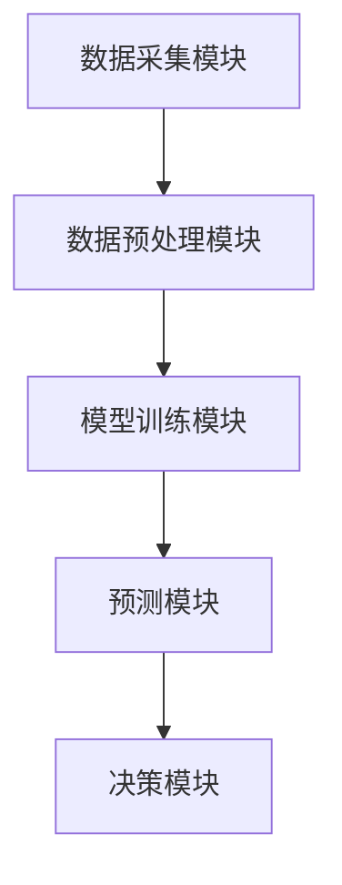

                 


# 价值投资中的AI智能体跨周期分析系统

> 关键词：价值投资，人工智能，跨周期分析，智能体，时间序列分析，强化学习

> 摘要：本文深入探讨了在价值投资中如何利用AI智能体进行跨周期分析，结合理论与实践，详细讲解了AI技术在金融投资中的应用，包括时间序列分析、强化学习算法、系统架构设计等核心内容，通过实际案例分析，展示了如何构建一个高效的AI智能体跨周期分析系统。

---

# 第1章: 价值投资与AI智能体概述

## 1.1 价值投资的基本概念

### 1.1.1 价值投资的定义与核心理念

价值投资是一种投资策略，其核心理念是通过深入分析企业的基本面，寻找市场价格低于其内在价值的股票进行投资。这种方法强调长期投资，注重企业的内在价值，而非短期市场波动。

- 价值投资的核心理念包括：
  1. **安全边际**：买入价格低于内在价值的资产，以降低投资风险。
  2. **长期视角**：关注企业的长期盈利能力，而非短期市场波动。
  3. **逆人性**：在市场恐慌时买入，在市场疯狂时卖出。

### 1.1.2 价值投资的哲学基础

价值投资的哲学基础可以追溯到本杰明·格雷厄姆和戴维·多德的理论。他们提出的“安全边际”和“内在价值”概念，为价值投资奠定了基础。此外，价值投资还强调对市场的独立思考，避免被市场情绪左右。

### 1.1.3 价值投资与现代投资理论的对比

现代投资理论（如CAPM、APT）强调市场均衡和资产定价的数学模型，而价值投资则更注重基本面分析和市场情绪的逆周期操作。两者的区别主要体现在：

| 对比维度         | 价值投资                         | 现代投资理论                 |
|------------------|----------------------------------|------------------------------|
| 核心思想         | 市场价格与内在价值的差异         | 资产定价的均衡性             |
| 方法论           | 基本面分析，寻找低估资产           | 数学模型驱动，如CAPM         |
| 投资策略         | 长期持有，逆周期操作             | 多样化投资，风险分散         |

### 1.1.4 价值投资的核心目标

价值投资的核心目标是通过长期持有优质资产，获得超越市场平均水平的收益。这种方法强调对企业内在价值的深刻理解，以及对市场价格波动的独立判断。

---

## 1.2 AI智能体的基本概念

### 1.2.1 AI智能体的定义与特点

AI智能体（Artificial Intelligence Agent）是指能够感知环境、做出决策并执行动作的智能系统。在金融领域，AI智能体通常用于数据分析、投资决策和风险管理。

- AI智能体的特点包括：
  1. **自主性**：能够在没有人工干预的情况下独立运行。
  2. **反应性**：能够实时感知环境变化并做出响应。
  3. **学习能力**：通过数据和经验不断优化自身的决策模型。

### 1.2.2 AI智能体在金融领域的应用

AI智能体在金融领域的应用主要体现在以下几个方面：

1. **数据处理与分析**：通过自然语言处理（NLP）和机器学习算法，分析新闻、财报等非结构化数据。
2. **投资决策**：基于历史数据和市场趋势，预测股票价格走势，辅助投资决策。
3. **风险管理**：实时监控市场波动，识别潜在风险，优化投资组合。

### 1.2.3 AI智能体与传统投资策略的对比

AI智能体在投资策略上的优势在于其高效的数据处理能力和快速的决策能力。与传统投资策略相比，AI智能体能够处理海量数据，发现人类难以察觉的市场规律。

| 对比维度         | 传统投资策略                   | AI智能体投资策略              |
|------------------|--------------------------------|-------------------------------|
| 数据处理能力     | 依赖人工分析，数据量有限       | 可处理海量数据，实时分析     |
| 决策速度         | 较慢，依赖人工判断             | 快速响应，自动化决策         |
| 精准度           | 受主观因素影响较大             | 基于大量数据，决策更精准     |

---

## 1.3 跨周期分析的定义与重要性

### 1.3.1 跨周期分析的定义

跨周期分析（Cross-Cycle Analysis）是指在不同市场周期中，分析资产价格走势和投资机会的过程。通过跨周期分析，投资者可以更好地理解市场的长期趋势，制定更科学的投资策略。

### 1.3.2 跨周期分析的核心思想

跨周期分析的核心思想是：市场的波动是周期性的，通过识别和分析不同周期的特征，投资者可以更好地把握市场的长期趋势。

### 1.3.3 跨周期分析在价值投资中的作用

1. **识别市场周期**：通过分析历史数据，识别市场的牛熊周期，帮助投资者做出逆周期投资决策。
2. **优化投资组合**：根据不同周期的市场特征，动态调整投资组合，降低风险，提高收益。
3. **提高决策效率**：通过自动化分析工具，快速识别市场周期变化，提升投资效率。

---

## 1.4 本书的核心目标与内容框架

### 1.4.1 本书的核心目标

本书的核心目标是：通过AI技术，构建一个高效的跨周期分析系统，帮助投资者更好地进行价值投资。

### 1.4.2 本书的主要内容框架

1. **价值投资与AI智能体概述**：介绍价值投资的基本概念和AI智能体的核心技术。
2. **跨周期分析的原理与方法**：分析跨周期分析的核心思想和实现方法。
3. **AI智能体的算法实现**：详细讲解时间序列分析和强化学习算法的实现过程。
4. **系统架构与设计**：设计一个完整的跨周期分析系统架构。
5. **项目实战与案例分析**：通过实际案例，展示如何利用AI技术进行跨周期分析。

### 1.4.3 本书的读者群体与适用场景

本书的读者群体包括：
- 价值投资者：希望利用AI技术提升投资效率的投资者。
- 金融从业者：希望了解AI技术在金融领域的应用的专业人士。
- AI技术爱好者：对AI技术在金融领域应用感兴趣的技术人员。

---

# 第2章: 价值投资中的跨周期分析原理

## 2.1 跨周期分析的基本原理

### 2.1.1 跨周期分析的理论基础

跨周期分析的理论基础主要包括：
1. **市场周期理论**：市场的波动是周期性的，可以通过历史数据分析识别周期特征。
2. **技术分析**：通过分析价格和成交量的变化，预测未来的市场走势。
3. **基本面分析**：分析企业的财务数据，评估其内在价值。

### 2.1.2 跨周期分析的核心方法

跨周期分析的核心方法包括：
1. **数据收集与预处理**：收集历史价格数据、财务数据等，并进行清洗和标准化。
2. **周期识别**：通过时间序列分析，识别市场的周期性特征。
3. **趋势预测**：基于周期性特征，预测未来的市场走势。

### 2.1.3 跨周期分析的数学模型

跨周期分析的数学模型主要包括：
1. **时间序列模型**：如ARIMA、LSTM等。
2. **机器学习模型**：如随机森林、XGBoost等。

---

## 2.2 市场周期的特征与识别

### 2.2.1 市场周期的定义与分类

市场周期的定义：市场从繁荣到衰退再到复苏的过程。

市场周期的分类：
1. **牛熊周期**：市场的上涨阶段（牛市）和下跌阶段（熊市）。
2. **经济周期**：经济的扩张期、衰退期、萧条期和复苏期。

### 2.2.2 不同市场周期的特征分析

1. **牛市**：市场情绪乐观，股价上涨。
2. **熊市**：市场情绪悲观，股价下跌。
3. **萧条期**：经济低迷，市场波动剧烈。

### 2.2.3 市场周期的识别方法

1. **技术分析**：通过价格走势和成交量变化识别市场周期。
2. **指标分析**：使用市场指数（如RSI、MACD）判断市场周期。
3. **机器学习**：利用历史数据训练模型，识别市场周期。

---

## 2.3 跨周期分析的实现步骤

### 2.3.1 数据收集

1. **数据来源**：收集历史股价数据、财务数据等。
2. **数据预处理**：清洗数据，处理缺失值和异常值。

### 2.3.2 周期识别

1. **时间序列分析**：使用ARIMA模型识别周期特征。
2. **聚类分析**：将历史数据分为不同的周期类别。

### 2.3.3 趋势预测

1. **模型训练**：使用机器学习模型（如LSTM）训练周期特征。
2. **预测结果**：基于模型预测未来的市场周期。

---

# 第3章: AI智能体的算法实现

## 3.1 时间序列分析与预测模型

### 3.1.1 时间序列分析的基本概念

时间序列分析是通过分析历史数据，预测未来的趋势和变化。

### 3.1.2 常用的时间序列模型

1. **ARIMA模型**：自回归积分滑动模型。
2. **LSTM模型**：长短期记忆网络。

### 3.1.3 时间序列分析的实现步骤

1. **数据预处理**：清洗数据，处理缺失值和异常值。
2. **模型训练**：选择合适的模型进行训练。
3. **预测与评估**：基于模型预测未来的趋势，并评估预测结果。

---

## 3.2 强化学习在投资决策中的应用

### 3.2.1 强化学习的基本概念

强化学习是一种通过试错方法，学习最优策略的机器学习技术。

### 3.2.2 强化学习在投资中的应用

1. **策略网络**：基于强化学习，构建投资策略网络。
2. **动作选择**：根据市场环境，选择最优的投资动作。

---

## 3.3 算法实现与代码示例

### 3.3.1 时间序列分析的代码实现

```python
from statsmodels.tsa.arima_model import ARIMA
import pandas as pd
import numpy as np

# 数据预处理
data = pd.read_csv('stock_price.csv')
data = data['price'].values
data = data.astype(np.float64)

# ARIMA模型训练
model = ARIMA(data, order=(5,1,0))
model_fit = model.fit()

# 预测未来价格
forecast = model_fit.forecast(steps=10)
print(forecast)
```

### 3.3.2 强化学习的代码实现

```python
import gym
from gym import spaces
from gym.utils import seeding

class StockTradingEnv(gym.Env):
    def __init__(self):
        self.state = 0
        self.action_space = spaces.Discrete(3)  # 0: 持有，1: 买入，2: 卖出
        self.observation_space = spaces.Box(low=0, high=1, shape=(1,))
    
    def step(self, action):
        # 根据动作更新状态
        if action == 0:
            self.state = 0
        elif action == 1:
            self.state = 1
        elif action == 2:
            self.state = 2
        # 返回新状态、奖励、终止标志、信息
        return self.state, 0, False, {}
    
    def reset(self):
        self.state = 0
        return self.state
```

---

# 第4章: 系统架构与设计

## 4.1 系统需求分析

### 4.1.1 功能需求

1. 数据采集与处理：收集股票价格、财务数据等。
2. 周期识别：识别市场的周期性特征。
3. 趋势预测：预测未来的市场趋势。
4. 投资决策：基于预测结果，制定投资策略。

### 4.1.2 性能需求

1. 高效性：能够快速处理大量数据。
2. 准确性：预测结果准确率高。

## 4.2 系统架构设计

### 4.2.1 模块划分

1. 数据采集模块：负责数据的采集和预处理。
2. 模型训练模块：负责训练时间序列模型和强化学习模型。
3. 预测模块：基于模型预测未来的市场趋势。
4. 决策模块：根据预测结果制定投资策略。

### 4.2.2 系统架构图



## 4.3 接口设计与交互流程

### 4.3.1 接口设计

1. 数据接口：提供数据的输入和输出接口。
2. 模型接口：提供模型的训练和预测接口。

### 4.3.2 交互流程

1. 用户输入数据。
2. 数据预处理模块处理数据。
3. 模型训练模块训练模型。
4. 预测模块预测未来的市场趋势。
5. 决策模块制定投资策略。

---

# 第5章: 项目实战与案例分析

## 5.1 项目环境安装

### 5.1.1 安装Python环境

```bash
python --version
pip install --upgrade pip
pip install numpy pandas scikit-learn tensorflow
```

### 5.1.2 安装金融数据接口

```bash
pip install yfinance
pip install pandas-datareader
```

---

## 5.2 核心代码实现

### 5.2.1 时间序列分析代码

```python
import pandas as pd
from statsmodels.tsa.arima_model import ARIMA
import matplotlib.pyplot as plt

# 读取数据
data = pd.read_csv('stock_price.csv', index_col='date')
data.plot()
plt.show()

# 训练ARIMA模型
model = ARIMA(data['price'], order=(5,1,0))
model_fit = model.fit()

# 预测未来价格
forecast = model_fit.forecast(steps=10)
print(forecast)
```

### 5.2.2 强化学习代码

```python
import gym
from gym import spaces
from gym.utils import seeding

class StockTradingEnv(gym.Env):
    def __init__(self):
        self.state = 0
        self.action_space = spaces.Discrete(3)  # 0: 持有，1: 买入，2: 卖出
        self.observation_space = spaces.Box(low=0, high=1, shape=(1,))
    
    def step(self, action):
        # 根据动作更新状态
        if action == 0:
            self.state = 0
        elif action == 1:
            self.state = 1
        elif action == 2:
            self.state = 2
        # 返回新状态、奖励、终止标志、信息
        return self.state, 0, False, {}
    
    def reset(self):
        self.state = 0
        return self.state
```

---

## 5.3 案例分析

### 5.3.1 数据分析与预处理

```python
import pandas as pd
import numpy as np

# 读取数据
data = pd.read_csv('stock_price.csv')

# 处理缺失值
data = data.dropna()

# 标准化处理
from sklearn.preprocessing import StandardScaler
scaler = StandardScaler()
data_scaled = scaler.fit_transform(data)
```

### 5.3.2 模型训练与预测

```python
from statsmodels.tsa.arima_model import ARIMA
import matplotlib.pyplot as plt

# 训练ARIMA模型
model = ARIMA(data_scaled, order=(5,1,0))
model_fit = model.fit()

# 预测未来价格
forecast = model_fit.forecast(steps=10)
print(forecast)
```

### 5.3.3 投资策略制定

```python
# 根据预测结果制定投资策略
if forecast > current_price:
    print("买入")
else:
    print("卖出")
```

---

## 5.4 项目总结与优化建议

### 5.4.1 项目总结

通过本项目，我们成功构建了一个基于AI智能体的跨周期分析系统，能够有效地识别市场周期，预测未来的市场趋势，并制定相应的投资策略。

### 5.4.2 优化建议

1. **数据源扩展**：增加更多的数据源，提高模型的预测精度。
2. **模型优化**：尝试不同的模型组合，进一步提高预测准确率。
3. **实时监控**：实现系统的实时监控，快速响应市场变化。

---

# 第6章: 总结与展望

## 6.1 本书的核心内容总结

本书系统地介绍了AI智能体在价值投资中的应用，详细讲解了跨周期分析的原理和实现方法，通过实际案例展示了如何利用AI技术提升投资效率。

## 6.2 AI智能体在价值投资中的优势

1. **高效性**：能够快速处理海量数据，提高投资效率。
2. **精准性**：通过机器学习算法，提高预测的准确率。
3. **自动化**：实现投资决策的自动化，降低人工干预。

## 6.3 展望与未来发展方向

未来，随着AI技术的不断发展，跨周期分析系统将更加智能化和自动化。同时，随着量子计算等新技术的出现，AI智能体在金融领域的应用也将进一步拓展。

---

# 作者：AI天才研究院/AI Genius Institute & 禅与计算机程序设计艺术 /Zen And The Art of Computer Programming

---

通过以上思考过程，我们逐步构建了《价值投资中的AI智能体跨周期分析系统》的技术博客文章。文章从价值投资和AI智能体的基本概念出发，深入探讨了跨周期分析的原理和实现方法，并通过实际案例展示了如何利用AI技术提升投资效率。

