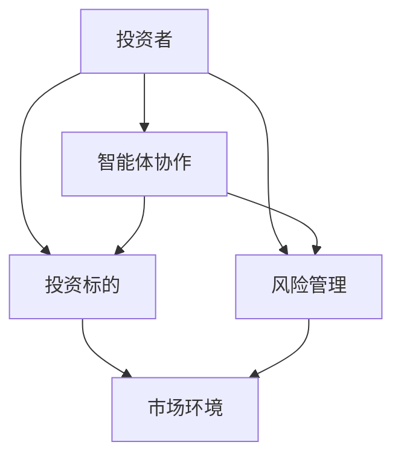
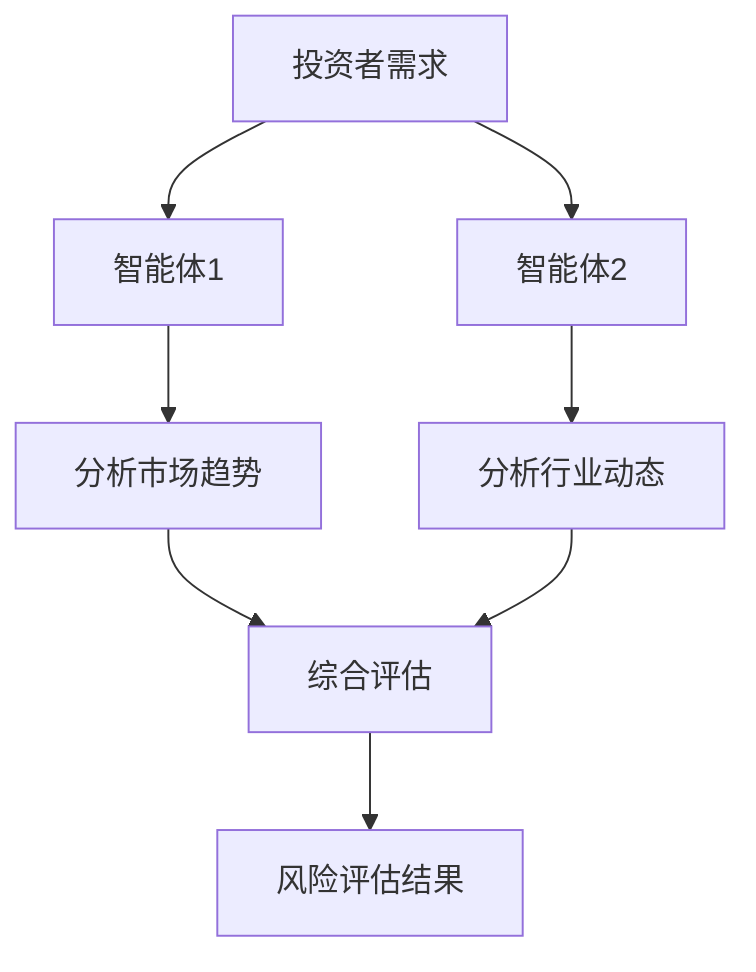
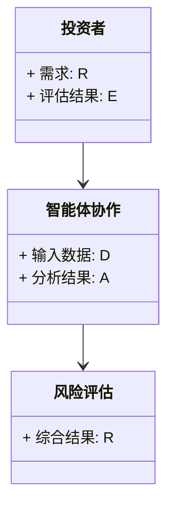
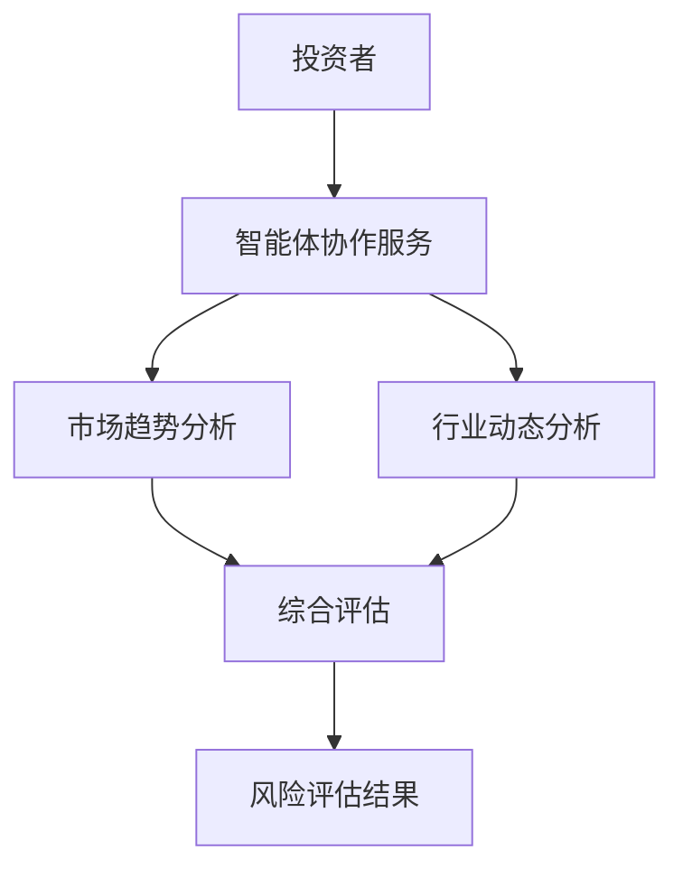

                 


# 价值投资中的AI驱动技术颠覆风险评估：多智能体协作

> 关键词：价值投资，AI技术，多智能体协作，风险评估，金融分析，系统架构

> 摘要：本文探讨了AI技术在价值投资中的应用，特别是多智能体协作如何颠覆传统风险评估方法。文章详细分析了多智能体协作的原理、算法实现、系统架构，并通过实际案例展示了其在金融领域的应用潜力。

---

## 第一部分: 价值投资中的AI驱动技术颠覆风险评估基础

### 第1章: 价值投资与AI驱动技术的结合

#### 1.1 价值投资的基本概念
- **1.1.1 价值投资的定义与核心理念**  
  价值投资是一种投资策略，强调通过分析企业的基本面（如财务状况、行业地位、管理团队等）来判断其内在价值，并在市场低估时买入，高估时卖出。其核心理念是“买便宜的，而不是好的”，即关注市场的非理性定价。

- **1.1.2 传统价值投资的优缺点**  
  优点：  
  - 强调长期投资，避免短期波动的干扰。  
  - 注重基本面分析，减少情绪化决策。  
  缺点：  
  - 依赖人工分析，耗时且成本高。  
  - 受市场环境和人为判断的影响较大。  

- **1.1.3 AI技术对价值投资的潜在影响**  
  AI技术可以通过大数据分析、模式识别和机器学习，快速筛选和评估大量数据，帮助投资者发现潜在的机会和风险。AI还可以模拟市场行为，提供更精准的估值模型。

#### 1.2 AI技术在金融领域的应用现状
- **1.2.1 AI在金融分析中的应用**  
  AI技术广泛应用于市场预测、信用评估、交易策略优化等领域。例如，量化交易中的算法可以利用AI进行高频交易，捕捉短期市场波动。

- **1.2.2 AI在风险评估中的应用**  
  AI可以通过分析历史数据和实时信息，预测市场风险，评估投资组合的稳定性。例如，利用自然语言处理（NLP）技术分析新闻和社交媒体情绪，预测市场波动。

- **1.2.3 多智能体协作在金融领域的优势**  
  多智能体协作通过多个AI模型的协同工作，可以实现更全面的市场分析。例如，一个智能体负责分析财务数据，另一个负责分析行业趋势，第三个负责预测市场情绪。

#### 1.3 多智能体协作的基本概念
- **1.3.1 多智能体协作的定义**  
  多智能体协作是指多个智能体通过交互和合作，共同完成复杂任务的过程。每个智能体都有特定的功能和目标，但通过协作实现整体目标的优化。

- **1.3.2 多智能体协作的核心特征**  
  - 分布式计算：每个智能体独立运行，但通过通信协作。  
  - 协作目标：智能体之间通过共享信息和知识，共同完成复杂任务。  
  - 自适应性：智能体能够根据环境变化动态调整策略。  

- **1.3.3 多智能体协作在风险评估中的作用**  
  多智能体协作可以通过分工合作，分别分析市场、行业、企业等不同维度的信息，提供更全面的风险评估结果。

---

## 第二部分: AI驱动技术颠覆风险评估的核心概念与联系

### 第2章: 多智能体协作的原理

#### 2.1 多智能体协作的原理
- **2.1.1 多智能体协作的基本原理**  
  多智能体协作通过信息共享和协同决策，实现复杂任务的分解与优化。每个智能体专注于特定任务，通过通信接口进行协作。

- **2.1.2 多智能体协作的实现机制**  
  - 信息共享：智能体之间通过共享数据和知识，提高整体分析能力。  
  - 协作决策：多个智能体共同制定最优策略。  
  - 动态调整：根据环境变化，实时调整协作策略。  

- **2.1.3 多智能体协作的优缺点对比**  
  | 对比维度 | 传统方法 | 多智能体协作 |  
  |----------|-----------|--------------|  
  | 分析能力 | 单一维度 | 多维度全面 |  
  | 计算效率 | 较低 | 较高 |  
  | 灵活性 | 有限 | 高 |  

#### 2.2 多智能体协作与传统风险评估的对比
- **2.2.1 传统风险评估方法的分析**  
  传统方法通常依赖于单一模型或少量数据，分析维度有限，难以捕捉复杂市场环境中的潜在风险。

- **2.2.2 多智能体协作在风险评估中的优势**  
  多智能体协作可以同时分析多个维度的信息，如市场趋势、行业动态、企业基本面等，提供更全面的评估结果。

- **2.2.3 多智能体协作与传统方法的对比表格**  
  | 对比维度 | 传统方法 | 多智能体协作 |  
  |----------|-----------|--------------|  
  | 分析维度 | 单一 | 多维 |  
  | 计算效率 | 较低 | 较高 |  
  | 灵活性 | 有限 | 高 |  

#### 2.3 多智能体协作的ER实体关系图


---

## 第三部分: AI驱动技术颠覆风险评估的算法原理

### 第3章: 多智能体协作算法实现

#### 3.1 多智能体协作算法的流程图


#### 3.2 多智能体协作算法的Python实现
```python
class Agent:
    def __init__(self, role):
        self.role = role
        self.data = None

    def analyze(self, input_data):
        # 具体分析逻辑
        pass

    def collaborate(self, other_agents):
        # 协作逻辑
        pass

# 示例实现
agent1 = Agent("市场趋势")
agent2 = Agent("行业动态")
agent1.analyze(data1)
agent2.analyze(data2)
result = agent1.collaborate([agent2])
```

#### 3.3 多智能体协作算法的数学模型
- **输入数据**：$D = \{d_1, d_2, ..., d_n\}$  
- **分析结果**：每个智能体输出分析结果 $A_i = f_i(D)$  
- **协作决策**：$C = g(A_1, A_2, ..., A_m)$  
- **最终结果**：$R = h(C)$  

---

## 第四部分: 多智能体协作系统架构设计

### 第4章: 系统架构与实现

#### 4.1 系统功能设计


#### 4.2 系统架构设计


---

## 第五部分: 项目实战与总结

### 第5章: 项目实战

#### 5.1 环境安装
- Python 3.8+
- NumPy, Pandas, Scikit-learn

#### 5.2 核心代码实现
```python
import numpy as np
import pandas as pd

def analyze_market(data):
    # 示例分析市场趋势
    return np.mean(data)

def analyze_industry(data):
    # 示例分析行业动态
    return np.mean(data)

class MultiAgentCollaboration:
    def __init__(self, agents):
        self.agents = agents

    def collaborate(self, input_data):
        results = []
        for agent in self.agents:
            result = agent.analyze(input_data)
            results.append(result)
        return results

# 示例使用
data = np.random.rand(100, 2)
agent1 = Agent("市场趋势", lambda x: np.mean(x[:, 0]))
agent2 = Agent("行业动态", lambda x: np.mean(x[:, 1]))
collaboration = MultiAgentCollaboration([agent1, agent2])
results = collaboration.collaborate(data)
```

#### 5.3 项目总结
通过多智能体协作，我们可以更全面地分析市场风险，提高投资决策的准确性。未来，随着AI技术的不断发展，多智能体协作将在金融领域发挥更大的作用。

---

## 第六部分: 总结与展望

### 第6章: 总结与展望

#### 6.1 总结
本文详细探讨了AI技术在价值投资中的应用，特别是多智能体协作如何颠覆传统风险评估方法。通过分析多智能体协作的原理、算法实现和系统架构，我们展示了其在金融领域的潜力。

#### 6.2 展望
未来，随着AI技术的进一步发展，多智能体协作将在金融领域发挥更大的作用。投资者可以通过更精准的分析和预测，制定更科学的投资策略。

---

## 参考文献
1. 书籍：《The Intelligent Investor》
2. 工具：Mermaid、Python、Scikit-learn

---

作者：AI天才研究院/AI Genius Institute & 禅与计算机程序设计艺术 /Zen And The Art of Computer Programming

